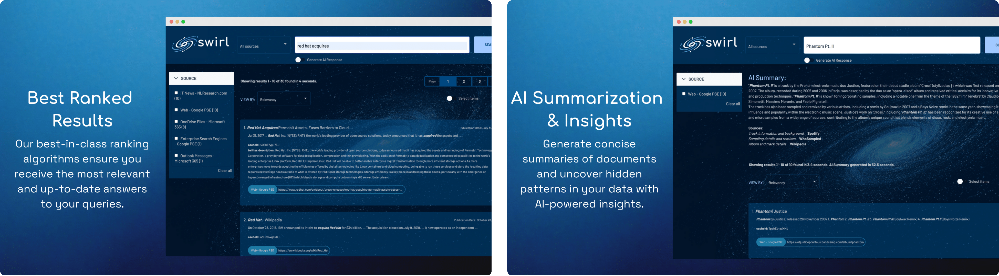
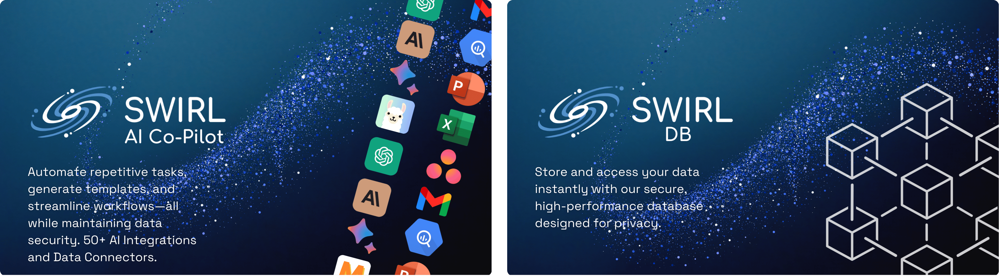

<div align="center">

[](https://swirlaiconnect.com/whitepaper/ai-to-grow-business-2024-06)

[](https://www.swirlaiconnect.com)

<h1>SWIRL AI Connect</h1>

#### Bring AI to the Data, not the Data to the AI

### SWIRL AI Connect is advanced AI infrastructure software. It supports enhanced Retrieval Augmented Generation (RAG) capabilities, powerful analytics, and SWIRL Co-Pilot. SWIRL harnesses AI for business, enabling organizations to make better decisions and take more effective and timely actions.

[Start Searching](#-try-swirl-now-in-docker) · [Slack](https://join.slack.com/t/swirlmetasearch/shared_invite/zt-2sfwvhwwg-mMn9tcKhAbqXbrV~9~Y1eA) · [Key Features](#-key-features) · [Contribute](#-contributing-to-swirl) · [Documentation](#-documentation) · [Connectors](#-list-of-connectors)

<br/>

[](https://opensource.org/license/apache-2-0/)
[](https://github.com/swirlai/swirl-search/releases)

[](https://www.swirlaiconnect.com)
[](https://join.slack.com/t/swirlmetasearch/shared_invite/zt-2sfwvhwwg-mMn9tcKhAbqXbrV~9~Y1eA)

[](https://github.com/swirlai/swirl-search/actions/workflows/test-build-pipeline.yml)

</div>


**Get your AI up and running in minutes, not months.** SWIRL AI Connect is an open-source AI Connect platform that streamlines the integration of advanced AI technologies into business operations. It supports powerful features like Retrieval-Augmented Generation (RAG), Analytics, and Co-Pilot, enabling enhanced decision-making with AI and boosting enterprise AI transformation. 

SWIRL operated without needing to move data into a vector database or undergo ETL processes. This approach not only enhances security but also speeds up the deployment. As a private cloud AI provider, SWIRL operates entirely within your private cloud infrastructure, running locally inside the firewall to ensure maximum data security and compliance.

[](https://www.linkedin.com/newsletters/7201909550860427264/)

[](https://join.slack.com/t/swirlmetasearch/shared_invite/zt-2sfwvhwwg-mMn9tcKhAbqXbrV~9~Y1eA)

### Why SWIRL AI Connect?

- **Instant AI Deployment:** Swiftly deploy AI-driven enterprise software within your private cloud environment. SWIRL AI Connect integrates seamlessly, offering built-in security measures like data compliance and firewall protections, ensuring secure AI connectivity and granular access control.
  
- **Easy and Fast Retrieval Augmented Generation(RAG):** SWIRL AI Connect simplifies the use of Retrieval-Augmented Generation (RAG). Our platform eliminates the need for external vector databases, LangChain, or LlamaIndex, making implementing AI RAG tools directly on your data easier.

- **No Data Movement:** Operate directly on local data without the hassles of ETL processes, re-indexing, or data movement. SWIRL AI Connect enhances data security by allowing the data to remain in place and run securely inside your firewall.

- **Boost Productivity with AI:** Enhance team efficiency and streamline workflows with advanced analytics and Co-Pilot features. SWIRL AI Connect helps you find information faster and make smarter decisions, accelerating enterprise AI transformation and boosting productivity.

### SWIRL AI Connect enables you to perform Unified Search and bring in a secure AI Co-Pilot.

**SWIRL Unified Search**: SWIRL Unified Search offers a secure and powerful integrated search solution that enables users to query across all enterprise data sources seamlessly. This scalable unified search platform is designed for large enterprises, startups, and small teams, allowing for comprehensive searches across cloud services, on-premise systems, and data silos without compromising security. By implementing SWIRL Unified Search, businesses can enhance productivity, improve data accessibility, and make more informed decisions by harnessing the full potential of their data landscape.

**SWIRL Co-Pilot**: SWIRL Co-Pilot acts as an intelligent assistant, leveraging advanced AI to provide context-aware insights and support to business users. Securely integrated within your enterprise systems, SWIRL Co-Pilot helps streamline workflows, automate tasks, and deliver personalized recommendations, significantly boosting operational efficiency. Users benefit from real-time decision support, reduced manual workload, and a more intuitive interaction with their data, enabling them to focus on strategic activities that drive business growth.

## Schedule Your [Free Demo](https://swirlaiconnect.com/contact-us) of SWIRL Co-Pilot

[](https://swirlaiconnect.com/contact-us)


## SWIRL's Ranking in Action

SWIRL leverages the specific context of your enterprise data to deliver highly relevant search results tailored to business needs. While general search engines like Google offer broad capabilities, SWIRL excels in the precise and secure handling of enterprise-specific queries, providing actionable insights that enhance decision-making and business efficiency.


<a href="https://www.youtube.com/watch?v=Ypn4XvSJfcQ" target="_blank">


</a>

## SWIRL AI Connect Features




## Based on SWIRL AI Connect



# 🔎 How Swirl Works

SWIRL AI Connect offers a straightforward no-code setup to easily integrate AI capabilities into your enterprise. It connects directly to various enterprise and data applications—like Teams, Snowflake, Databricks, and Google Drive—enabling you to search, fetch, and build an AI-based knowledge base. Utilize SWIRL’s Co-Pilot and Retrieval-Augmented Generation (RAG) to enhance productivity without the need for extracting or indexing any data.

1. Connect: Easily link SWIRL AI Connect to your data sources—be it databases, document stores, or cloud services. Simply add your authentication details to start.

2. Query: Interact with SWIRL AI Connect using natural language. Ask questions or input commands to immediately harness the power of AI in your workflows.

3. Get Results: Benefit from SWIRL AI Connect’s advanced search capabilities combined with generative AI. It quickly delivers accurate and contextually augmented responses by distributing queries across connected platforms that have a search API—ranging from search engines and databases to noSQL engines and SaaS services.

<br/>

# 🔌 List of Connectors


**Full list of connectors is available [here](https://swirlaiconnect.com/connectors)**.

**For Enterprise Support on Connectors**  Contact the Swirl Team at: [support@swirlaiconnect.com](mailto:support@swirlaiconnect.com)  


<br/>

# 🔥 Try Swirl Now In Docker

## Prerequisites

- To run Swirl in Docker, you must have the latest [Docker app](https://docs.docker.com/get-docker/) for MacOS, Linux, or Windows installed and running locally. You can also watch the [**video tutorial**](https://www.youtube.com/watch?v=OogRYkfSki8) to get started.

- Windows users must also install and configure either the WSL 2 or the Hyper-V backend, as outlined in the  [System Requirements for installing Docker Desktop on Windows](https://docs.docker.com/desktop/install/windows-install/#system-requirements).

## Start Swirl in Docker

> **Warning**
> Make sure the Docker app is running before proceeding!

- Download the YAML file: [https://raw.githubusercontent.com/swirlai/swirl-search/main/docker-compose.yaml](https://raw.githubusercontent.com/swirlai/swirl-search/main/docker-compose.yaml)

```bash
curl https://raw.githubusercontent.com/swirlai/swirl-search/main/docker-compose.yaml -o docker-compose.yaml
```

- *Optional*: To enable Swirl's Real-Time Retrieval Augmented Generation (RAG) in Docker, run the following commands from the Console using a valid OpenAI API key:
  
``` shell
export MSAL_CB_PORT=8000
export MSAL_HOST=localhost
export OPENAI_API_KEY=‘<your-OpenAI-API-key>’
```

:key: Check out [OpenAI's YouTube video](https://youtu.be/nafDyRsVnXU?si=YpvyaRvhX65vtBrb) if you don't have an OpenAI API Key.

- In MacOS or Linux, run the following command from the Console:

```bash
docker-compose pull && docker-compose up
```

- In Windows, run the following command from PowerShell:

```bash
docker compose up
```

After a few minutes the following or similar should appear:


- Open this URL with a browser: <http://localhost:8000> (or <http://localhost:8000/galaxy>)

- If the search page appears, click `Log Out` at the top, right. The Swirl login page will appear.

- Enter the username `admin` and password `password`, then click `Login`.

- Enter a search in the search box and press the `Search` button. Ranked results appear in just a few seconds:


- To view the raw JSON, open <http://localhost:8000/swirl/search/>

The most recent Search object will be displayed at the top. Click on the `result_url` link to view the full JSON Response.

## Notes 📝

> **Warning**
> The Docker version of Swirl *does not* retain any data or configuration when shut down!

:key: Swirl includes five (5) Google Programmable Search Engines (PSEs) to get you up and running right away. The credentials for these are shared with the Swirl Community.

:key: Using Swirl with Microsoft 365 requires installation and approval by an authorized company Administrator. For more information, please review the [M365 Guide](https://docs.swirlaiconnect.com/M365-Guide.html) or [contact us](mailto:hello@swirlaiconnect.com).

## Next Steps 👇

- Check out the details of our [latest release](https://github.com/swirlai/swirl-search/releases)!

- Head over to the [Quick Start Guide](https://docs.swirlaiconnect.com/Quick-Start.html) and install Swirl locally!

## Video Tutorial

Guide to Run SWIRL in Docker in 60 seconds.

<a href="https://www.youtube.com/watch?v=Ypn4XvSJfcQ" target="_blank">


</a>

<br/>

# 🌟 Key Features

| ✦ | Feature |
|:-----:|:--------|
| 📌 | [Microsoft 365 integration and OAUTH2 support](https://docs.swirlaiconnect.com/M365-Guide.html) |
| 🔍 | [SearchProvider configurations](https://github.com/swirlai/swirl-search/tree/main/SearchProviders) for all included Connectors. They can be [organized with the active, default and tags properties](https://docs.swirlaiconnect.com/User-Guide.html#organizing-searchproviders-with-active-default-and-tags). |
| ✏️ | [Adaptation of the query for each provider](https://docs.swirlaiconnect.com/User-Guide.html#search-syntax) such as rewriting `NOT term` to `-term`, removing NOTted terms from providers that don't support NOT, and passing down the AND, + and OR operators. |
| ⏳ | [Synchronous or asynchronous search federation](https://docs.swirlaiconnect.com/Developer-Guide.html#architecture) via [APIs](http://localhost:8000/swirl/swagger-ui/) |
| 🛎️ | [Optional subscribe feature](https://docs.swirlaiconnect.com/Developer-Guide.html#subscribe-to-a-search) to continuously monitor any search for new results |
| 🛠️ | Pipelining of [Processor](https://docs.swirlaiconnect.com/Developer-Guide.html#develop-new-processors) stages for real-time adaptation and transformation of queries, responses and results |
| 🗄️ | [Results stored](https://docs.swirlaiconnect.com/Developer-Reference.html#result-objects) in SQLite3 or PostgreSQL for post-processing, consumption and/or analytics |
| ➡️ | Built-in [Query Transformation](https://docs.swirlaiconnect.com/Developer-Guide.html#using-query-transformations) support, including re-writing and replacement |
| 📖 | [Matching on word stems](https://docs.swirlaiconnect.com/Developer-Reference.html#cosinerelevancypostresultprocessor) and [handling of stopwords](https://docs.swirlaiconnect.com/Developer-Guide.html#configure-stopwords-language) via NLTK |
| 🚫 | [Duplicate detection](https://docs.swirlaiconnect.com/Developer-Guide.html#detect-and-remove-duplicate-results) on field or by configurable Cosine Similarity threshold |
| 🔄 | Re-ranking of unified results [using Cosine Vector Similarity](https://docs.swirlaiconnect.com/Developer-Reference.html#cosinerelevancypostresultprocessor) based on [spaCy](https://spacy.io/)'s large language model and [NLTK](https://www.nltk.org/) |
| 🎚️ | [Result mixers](https://docs.swirlaiconnect.com/Developer-Reference.html#mixers-1) order results by relevancy, date or round-robin (stack) format, with optional filtering of just new items in subscribe mode |
| 📄 | Page through all results requested, re-run, re-score and update searches using URLs provided with each result set |
| 📁 | [Sample data sets](https://github.com/swirlai/swirl-search/tree/main/Data) for use with SQLite3 and PostgreSQL |
| ✒️ | [Optional spell correction](https://docs.swirlaiconnect.com/Developer-Guide.html#add-spelling-correction) using [TextBlob](https://textblob.readthedocs.io/en/dev/quickstart.html#spelling-correction) |
| ⌛ | [Optional search/result expiration service](https://docs.swirlaiconnect.com/Admin-Guide.html#search-expiration-service) to limit storage use |
| 🔌 | Easily extensible [Connector](https://github.com/swirlai/swirl-search/tree/main/swirl/connectors) and [Mixer](https://github.com/swirlai/swirl-search/tree/main/swirl/mixers) objects |

<br/>

# 👩‍💻 Contributing to Swirl

**Do you have a brilliant idea or improvement for SWIRL?** We're all ears, and thrilled you're here to help!

🔗 **Get Started in 3 Easy Steps**:

1. **Connect with Fellow Enthusiasts** - Jump into the [Swirl Slack Community](https://join.slack.com/t/swirlmetasearch/shared_invite/zt-2sfwvhwwg-mMn9tcKhAbqXbrV~9~Y1eA) and share your ideas. You'll find a welcoming group of Swirl enthusiasts and team members eager to assist and collaborate.
2. **Branch It Out** - Always branch off from the `develop` branch with a descriptive name that encapsulates your idea or fix.
3. **Start Your Contribution** - Ready to get your hands dirty? Make sure all contributions come through a GitHub pull request. We roughly follow the [Gitflow branching model](https://nvie.com/posts/a-successful-git-branching-model/), so all changes destined for the next release should be made to the `develop` branch.

📚 **First time contributing on GitHub?** No worries, the [GitHub documentation](https://docs.github.com/en/get-started/quickstart/contributing-to-projects) has you covered with a great guide on contributing to projects.

💡 Every contribution, big or small, makes a difference. Join us in shaping the future of Swirl!

<br/>

# ☁ Use the Swirl Cloud 

For information about Swirl as a managed service, please [contact us](mailto:hello@swirlaiconnect.com)!

<br/>

# 📖 Documentation

🔗 [SWIRL Documentation](https://docs.swirlaiconnect.com/)

<br/>

# 👷‍♂️ Need Help? We're Here for You!

At Swirl, every user matters to us. Whether you're a beginner finding your way or an expert with feedback, we're here to support, listen, and help. Don't hesitate to reach out to us.

- **Join the SWIRL Community Slack:** Dive into our  [SWIRL Community on Slack](https://join.slack.com/t/swirlmetasearch/shared_invite/zt-2sfwvhwwg-mMn9tcKhAbqXbrV~9~Y1eA) - to discuss anything related to SWIRL.

- **Direct Support:** For any questions, suggestions, or even a simple hello, drop us an email at [support@swirlaiconnect.com](mailto:support@swirlaiconnect.com). We cherish every message and promise to get back to you promptly!

- **Request A Connector (Enterprise Support)** Want to see a new connector quickly and fast. Contact the Swirl Team at: [support@swirlaiconnect.com](mailto:support@swirlaiconnect.com)