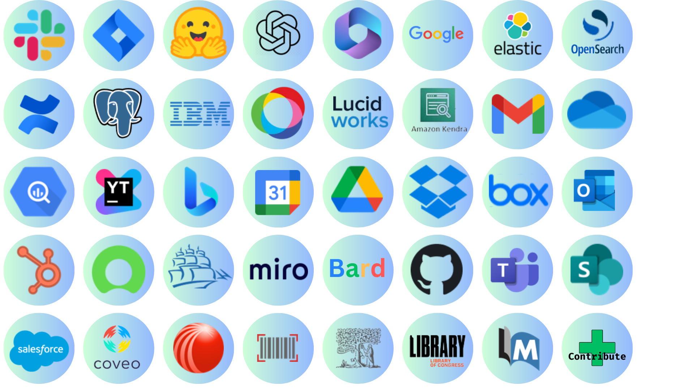

<div align="center">

[](https://www.swirl.today)

</div>

<h1 align="center">Swirl</h1>

<div align="center">

### The Open Source Platform for **Enterprise Search** with LLMs and GPT

<div align="center">


[𝚂𝚝𝚊𝚛𝚝 𝚂𝚎𝚊𝚛𝚌𝚑𝚒𝚗𝚐](#start-swirl-in-docker) ⦁
[𝚂𝚕𝚊𝚌𝚔](https://join.slack.com/t/swirlmetasearch/shared_invite/zt-1qk7q02eo-kpqFAbiZJGOdqgYVvR1sfw) ⦁
[𝙺𝚎𝚢 𝙵𝚎𝚊𝚝𝚞𝚛𝚎𝚜 ](#key-features) ⦁
[𝙲𝚘𝚗𝚝𝚛𝚒𝚋𝚞𝚝𝚎](#contributing-to-swirl) ⦁
[𝙳𝚘𝚌𝚞𝚖𝚎𝚗𝚝𝚊𝚝𝚒𝚘𝚗](#documentation)


</div>

---

<br/>

[](https://opensource.org/license/apache-2-0/)
[](https://github.com/swirlai/swirl-search/releases)
[](https://join.slack.com/t/swirlmetasearch/shared_invite/zt-1qk7q02eo-kpqFAbiZJGOdqgYVvR1sfw)
[](#contributing-to-swirl)
[](https://www.swirl.today)

[](https://github.com/swirlai/swirl-search/actions/workflows/docker-image.yml)
[](https://github.com/swirlai/swirl-search/actions/workflows/smoke-tests.yml)

</div>

Build a transformative search experience for your enterprise. Use Swirl to search and generate insights with AI and LLMs like ChatGPT, Claude, and PaLM. Connect to data bases, cloud providers, and data siloes. And start discovering and generating the answers you need.

Swirl is as simple as ABC: Start in Docker, Connect with API, Search with Swirl. 

## 🚀 Try Swirl with ChatGPT 


_Swirl with ChatGPT as a configured AI Model._

<br/>

# 🔎 How Swirl Works

Swirl adapts and distributes user queries to anything with a search API - search engines, databases, noSQL engines, cloud/SaaS services, data siloes etc. And uses Large Language Models to re-rank the unified results *without* extracting or indexing *anything*. 


<br/>

# 🔌 List of Connectors



[🔍 View More connectors]() 

🚀 **Help Us Expand!** Want to see a new connector? [Contribute by adding a connector]() and join our growing community of contributors. 

<br/>

# 🔥 Try Swirl Now In Docker

## Prerequisites

* To run Swirl in Docker, you must have the latest [Docker app](https://docs.docker.com/get-docker/) for MacOS, Linux, or Windows installed and running locally.

* Windows users must also install and configure either the WSL 2 or the Hyper-V backend, as outlined in the  [System Requirements for installing Docker Desktop on Windows](https://docs.docker.com/desktop/install/windows-install/#system-requirements).

## Start Swirl in Docker

:warning: Make sure the Docker app is running before proceeding!

* Download [https://raw.githubusercontent.com/swirlai/swirl-search/main/docker-compose.yaml](https://raw.githubusercontent.com/swirlai/swirl-search/main/docker-compose.yaml)

```
curl https://raw.githubusercontent.com/swirlai/swirl-search/main/docker-compose.yaml -o docker-compose.yaml
```

* In MacOS or Linux, run the following command from the Console:

```
docker-compose pull && docker-compose up
```

* In Windows, run the following command from PowerShell:

```
docker compose up
```

After a few minutes the following or similar should appear:

```
ssdtest-app-1  | Command successful!
ssdtest-app-1  | __S_W_I_R_L__2_._5_._1________________________________________________________
ssdtest-app-1  |
ssdtest-app-1  | Warning: logs directory does not exist, creating it
ssdtest-app-1  | Start: redis -> redis-server ./redis.conf ... Ok, pid: 28
ssdtest-app-1  | Start: celery-worker -> celery -A swirl_server worker --loglevel INFO ... Ok, pid: 34
ssdtest-app-1  | Start: celery-beats -> celery -A swirl_server beat --scheduler django_celery_beat.schedulers:DatabaseScheduler ... Ok, pid: 45
ssdtest-app-1  | Updating .swirl... Ok
ssdtest-app-1  |
ssdtest-app-1  |   PID TTY          TIME CMD
ssdtest-app-1  |    28 ?        00:00:00 redis-server
ssdtest-app-1  |    34 ?        00:00:02 celery
ssdtest-app-1  |    45 ?        00:00:02 celery
ssdtest-app-1  |
ssdtest-app-1  | Command successful!
ssdtest-app-1  | 2023-08-29 13:16:11,070 INFO     Starting server at tcp:port=8000:interface=0.0.0.0
ssdtest-app-1  | 2023-08-29 13:16:11,074 INFO     HTTP/2 support not enabled (install the http2 and tls Twisted extras)
ssdtest-app-1  | 2023-08-29 13:16:11,075 INFO     Configuring endpoint tcp:port=8000:interface=0.0.0.0
ssdtest-app-1  | 2023-08-29 13:16:11,079 INFO     Listening on TCP address 0.0.0.0:8000
```

* Open this URL with a browser: <http://localhost:8000> (or <http://localhost:8000/galaxy>)

If the search page appears, click `Log Out` at the top, right. The Swirl login page will appear:


* Enter the username `admin` and password `password`, then click `Login`.

* Enter a search in the search box and press the `Search` button. Ranked results appear in just a few seconds:


* To view the raw JSON, open <http://localhost:8000/swirl/search/>

The most recent Search object will be displayed at the top. Click on the `result_url` link to view the full JSON Response.

## Notes 📝

:warning: The Docker version of Swirl *does not* retain any data or configuration when shut down!

:key: Swirl includes four (4) Google Programmable Search Engines (PSEs) to get you up and running right away. The credentials for these are shared with the Swirl Community.

:key: Using Swirl with Microsoft 365 requires installation and approval by an authorized company Administrator. For more information, please review the [M365 Guide](4.-M365-Guide) or [contact us](mailto:hello@swirl.today).

## Next Steps 👇

* Check out the details of our [latest release](https://github.com/swirlai/swirl-search/releases)!

* Head over to the [Quick Start Guide](https://github.com/swirlai/swirl-search/wiki/1.-Quick-Start) and install Swirl locally!

<br/>

# 🌟 Key Features

* [Microsoft 365 integration and OAUTH2 support](https://github.com/swirlai/swirl-search/wiki/4.-M365-Guide)

* [SearchProvider configurations](https://github.com/swirlai/swirl-search/tree/main/SearchProviders) for all included Connectors. They can be [organized with the active, default and tags properties](https://github.com/swirlai/swirl-search/wiki/2.-User-Guide#organizing-searchproviders-with-active-default-and-tags).

* [Adaptation of the query for each provider](https://github.com/swirlai/swirl-search/wiki/2.-User-Guide#search-syntax) such as rewriting `NOT term` to `-term`, removing NOTted terms from providers that don't support NOT, and passing down the AND, + and OR operators.

* [Synchronous or asynchronous search federation](https://github.com/swirlai/swirl-search/wiki/5.-Developer-Guide#architecture) via [APIs](http://localhost:8000/swirl/swagger-ui/)

* [Optional subscribe feature](https://github.com/swirlai/swirl-search/wiki/5.-Developer-Guide#subscribe-to-a-search) to continuously monitor any search for new results

* Pipelining of [Processor](https://github.com/swirlai/swirl-search/wiki/5.-Developer-Guide#develop-new-processors) stages for real-time adaptation and transformation of queries, responses and results

* [Results stored](https://github.com/swirlai/swirl-search/wiki/6.-Developer-Reference#result-objects) in SQLite3 or PostgreSQL for post-processing, consumption and/or analytics

* Built-in [Query Transformation](https://github.com/swirlai/swirl-search/wiki/5.-Developer-Guide#using-query-transformations) support, including re-writing and replacement

* [Matching on word stems](https://github.com/swirlai/swirl-search/wiki/6.-Developer-Reference#cosinerelevancypostresultprocessor) and [handling of stopwords](https://github.com/swirlai/swirl-search/wiki/5.-Developer-Guide#configure-stopwords-language) via NLTK

* [Duplicate detection](https://github.com/swirlai/swirl-search/wiki/5.-Developer-Guide#detect-and-remove-duplicate-results) on field or by configurable Cosine Similarity threshold

* Re-ranking of unified results [using Cosine Vector Similarity](https://github.com/swirlai/swirl-search/wiki/6.-Developer-Reference#cosinerelevancypostresultprocessor) based on [spaCy](https://spacy.io/)'s large language model and [NLTK](https://www.nltk.org/)

* [Result mixers](https://github.com/swirlai/swirl-search/wiki/6.-Developer-Reference#mixers-1) order results by relevancy, date or round-robin (stack) format, with optional filtering of just new items in subscribe mode

* Page through all results requested, re-run, re-score and update searches using URLs provided with each result set

* [Sample data sets](https://github.com/swirlai/swirl-search/tree/main/Data) for use with SQLite3 and PostgreSQL

* [Optional spell correction](https://github.com/swirlai/swirl-search/wiki/5.-Developer-Guide#add-spelling-correction) using [TextBlob](https://textblob.readthedocs.io/en/dev/quickstart.html#spelling-correction)

* [Optional search/result expiration service](https://github.com/swirlai/swirl-search/wiki/3.-Admin-Guide#search-expiration-service) to limit storage use

* Easily extensible [Connector](https://github.com/swirlai/swirl-search/tree/main/swirl/connectors) and [Mixer](https://github.com/swirlai/swirl-search/tree/main/swirl/mixers) objects

<br/>

# Contributing to Swirl 🚀👩‍💻

**Got a brilliant idea or improvement for Swirl?** Whether it's a new feature, connector, bug fix, or enhancement, we're all ears—and we're thrilled you're here to help!

🔗 **Get Started in 3 Easy Steps**:
1. **Connect with Fellow Enthusiasts** - Jump into our [Slack community](https://join.slack.com/t/swirlmetasearch/shared_invite/zt-1qk7q02eo-kpqFAbiZJGOdqgYVvR1sfw) and share your ideas. You'll find a welcoming group of Swirl enthusiasts and team members eager to assist and collaborate.
2. **Branch It Out** - Always branch off from the `develop` branch with a descriptive name that encapsulates your idea or fix. Remember, all PRs should be made to the `develop` branch to ensure `main` remains our stable gold-standard.
3. **Start Your Contribution** - Ready to get your hands dirty? Make sure all contributions come through a GitHub pull request. We roughly follow the [Gitflow branching model](https://nvie.com/posts/a-successful-git-branching-model/), so all changes destined for the next release should be made to the `develop` branch.

📚 **First time contributing on GitHub?** No worries, the [GitHub documentation](https://docs.github.com/en/get-started/quickstart/contributing-to-projects) has you covered with a great guide on contributing to projects.

💡 Every contribution, big or small, makes a difference. Join us in shaping the future of Swirl!


<br/>

# ☁ Use the Swirl Cloud 

For information about Swirl as a managed service, please [contact us](mailto:hello@swirl.today)!

<br/>

# 📖 Documentation

[Home](https://github.com/swirlai/swirl-search/wiki) | [Quick Start](https://github.com/swirlai/swirl-search/wiki/1.-Quick-Start) | [User Guide](https://github.com/swirlai/swirl-search/wiki/2.-User-Guide) | [Admin Guide](https://github.com/swirlai/swirl-search/wiki/3.-Admin-Guide) | [M365 Guide](https://github.com/swirlai/swirl-search/wiki/4.-M365-Guide) | [Developer Guide](https://github.com/swirlai/swirl-search/wiki/5.-Developer-Guide) | [Developer Reference](https://github.com/swirlai/swirl-search/wiki/6.-Developer-Reference)

<br/>

# 👷‍♂️ Support

Do you have any questions or doubts. Reach us on the below links:

* [Join the Swirl Metasearch Community on Slack!](https://join.slack.com/t/swirlmetasearch/shared_invite/zt-1qk7q02eo-kpqFAbiZJGOdqgYVvR1sfw)

* Email: [support@swirl.today](mailto:support@swirl.today) with issues, requests, questions, etc. - we'd love to hear from you!

<br/>
