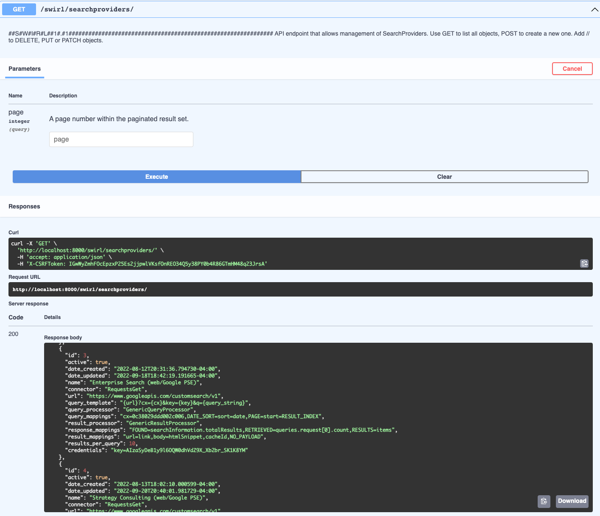
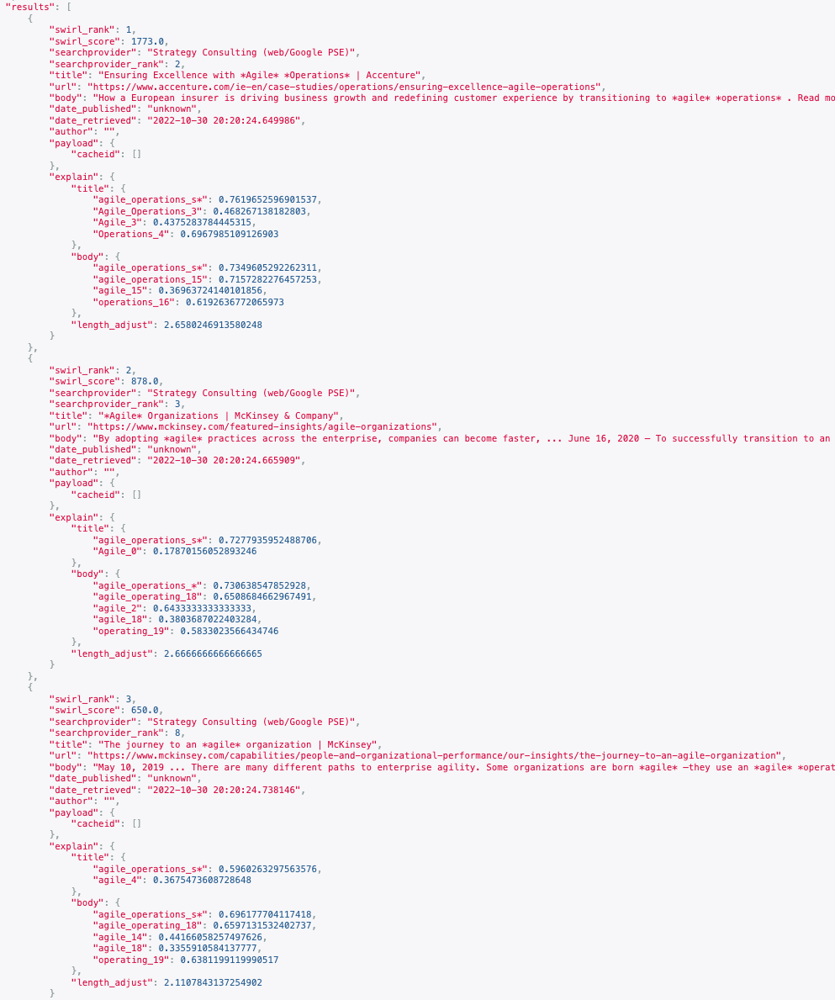

# SWIRL FEDERATED SEARCH ENGINE

SWIRL is the first open source, [Federated Search Engine](https://en.wikipedia.org/wiki/Federated_search)! 

SWIRL makes it easy for search developers, data scientists and power users to search multiple search engine silos at once and quickly receive unified results *without* extracting and indexing *anything*. It includes connectors to elastic, solr, Google PSE, NLResearch.com, generic HTTP/GET/JSON and Sqlite3 that are easy to configure, without writing code. Then use SWIRL's simple REST APIs to run searches and quickly retrieve unified results, re-ranked by SWIRL using built-in cosine-vector similarity plus term, phrase and freshness boosts. 

SWIRL is available under the [Apache 2.0 license](https://github.com/sidprobstein/swirl-search/blob/main/LICENSE), and leans heavily on the popular python/django/celery/rabbit-mq stack - a universe of plug-ins that can extend and integrate SWIRL with a range of existing systems.

 

# Releases

| Version | Date | Branch | Notes | 
| ------- | ---- | ------ | ----- |
| SWIRL SEARCH 1.1 | 06-27-2022 | Main | [Release Notes](./docs/RELEASE_NOTES_1.1.md) - recommended for ALL USERS |

 

# Screen Shots

 

 

# Features

:small_blue_diamond: [Pre-built searchprovider definitions](https://github.com/sidprobstein/swirl-search/tree/main/SearchProviders) for apache solr, elastic, Sqlite3, http/get/auth/json and NLResearch.com

:small_blue_diamond: [Asynchronous search federation](https://github.com/sidprobstein/swirl-search/wiki/3.-Developer-Guide#architecture) via [REST APIs](http://localhost:8000/swirl/swagger-ui/)

:small_blue_diamond: Data landed in Sqlite3 for post-processing, later consumption

:small_blue_diamond: [Cosine similarity relevancy](https://github.com/sidprobstein/swirl-search/wiki/2.-User-Guide#relevancy) using Spacy vectors with term, phrase and freshness boosts with full explanation

:small_blue_diamond: [Result mixers](https://github.com/sidprobstein/swirl-search/wiki/2.-User-Guide#mixers) operate on landed results and order results by relevancy, date, stack or round-robin

:small_blue_diamond: Sort results by provider date or relevancy

:small_blue_diamond: Page through all results requested

:small_blue_diamond: [Optional spell correction](https://github.com/sidprobstein/swirl-search/wiki/2.-User-Guide#spell-correction) using TextBlob

:small_blue_diamond: [Sample data sets](https://github.com/sidprobstein/swirl-search/tree/main/Data) for use with Sqlite3

:small_blue_diamond: [Optional search/result expiration service](https://github.com/sidprobstein/swirl-search/wiki/5.-Admin-Guide#search-expiration-service) to limit storage use

 

# Documentation

:small_blue_diamond: [Home](https://github.com/sidprobstein/swirl-search/wiki)
:small_blue_diamond: [Quick Start](https://github.com/sidprobstein/swirl-search/wiki/1.-Quick-Start)
:small_blue_diamond: [User Guide](https://github.com/sidprobstein/swirl-search/wiki/2.-User-Guide)
:small_blue_diamond: [Developer Guide](https://github.com/sidprobstein/swirl-search/wiki/3.-Developer-Guide)
:small_blue_diamond: [Object Reference](https://github.com/sidprobstein/swirl-search/wiki/4.-Object-Reference)
:small_blue_diamond: [Admin Guide](https://github.com/sidprobstein/swirl-search/wiki/5.-Admin-Guide)

 

# Contributing

:small_blue_diamond: Review the [to-do list](docs/TO_DO.md)

:small_blue_diamond: Submit a [pull request](https://github.com/sidprobstein/swirl-search/pulls) with changes

 

# Support

:small_blue_diamond: [Create an Issue](https://github.com/sidprobstein/swirl-search/issues) if something doesn't work, isn't clear, or should be documented - we'd love to hear from you!

:small_blue_diamond: Paid support and consulting are available... [contact SWIRL](mailto:swirl@probstein.com) for more information.

 

