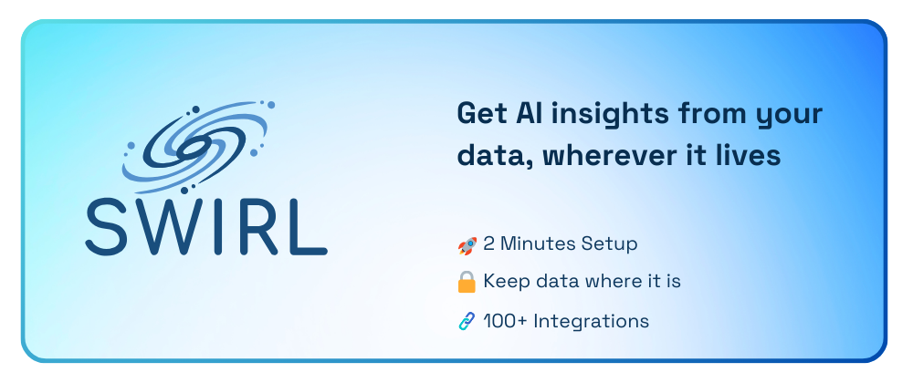
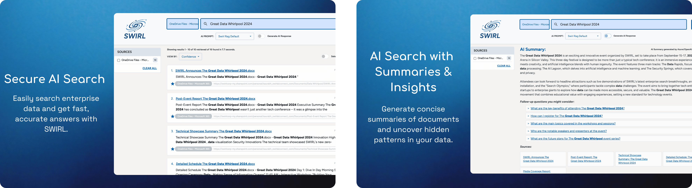
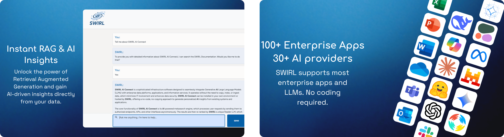
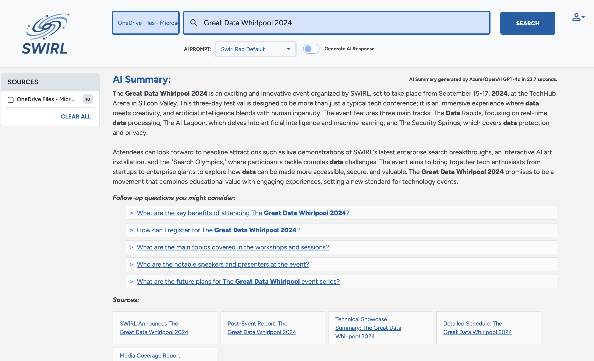

<div align="center">

[](https://www.swirlaiconnect.com)

</div>

<h1>SWIRL</h1>

## Give your team ChatGPT-level search without moving data to the cloud

### RAG with One Drive & Microsoft 365 in 60 seconds

Ask question → Get answer with sources → Click through to source


Watch it on [Youtube](https://youtu.be/6cT25SD4cV4)

**Teams using SWIRL saves an average 7.5 hours of productive time per week.**

<div align="center">

[⚡ Quick Start](#-try-swirl-now-in-docker) ·
[💬 Join Slack](https://join.slack.com/t/swirlmetasearch/shared_invite/zt-2sfwvhwwg-mMn9tcKhAbqXbrV~9~Y1eA) ·
[📚 Docs](docs.swirlaiconnect.com) ·
[🔌 Connectors](swirlaiconnect.com/connectors) ·
[🤝 Contribute](#contributing)

[](https://opensource.org/license/apache-2-0/)
[](https://github.com/swirlai/swirl-search/releases)
[](https://www.swirlaiconnect.com)
[](https://join.slack.com/t/swirlmetasearch/shared_invite/zt-2sfwvhwwg-mMn9tcKhAbqXbrV~9~Y1eA)
[]()
[](https://github.com/swirlai/swirl-search/stargazers)

[](https://github.com/swirlai/swirl-search/actions/workflows/test-build-pipeline.yml)

</div>

[](https://www.linkedin.com/newsletters/7201909550860427264/)

## 🤔 Why SWIRL?

### Skip the Complexity, Keep the Power

<table>
<tr>
<td>
<h3 align="center">❌ Without SWIRL</h3>

- Set up vector databases
- Move data around
- Complex ETL pipelines
- Weeks of infrastructure work
- Security headaches

</td>
<td>
<h3 align="center">✅ With SWIRL</h3>

- One docker command
- Data stays in place
- No vector DB needed
- 2-minute setup
- Enterprise-grade security

</td>
</tr>
</table>

## 🚀 Built Different

### No Vector DB Drama

```bash
# No need for:
$ setup-vector-db
$ migrate-data
$ configure-indexes

# Just this:
$ curl https://raw.githubusercontent.com/swirlai/swirl-search/main/docker-compose.yaml -o docker-compose.yaml
```

## 💡 What Can You Build With SWIRL?

Real examples of what teams build with SWIRL:

### 🔍 Knowledge Base Search

- Connect SharePoint, Confluence, & Drive
- Get instant answers with source links
- Keep sensitive data secure

### 🤖 Customer Support Assistant

- Search across support docs & tickets
- Draft responses using your content
- Maintain consistent answers

### 👩‍💻 Developer Assistant

- Search GitHub, Jira, & documentation
- Find code examples & solutions
- Speed up development workflow

### 🏢 Unified Search

- Unified search across all tools
- Results respect existing permissions
- No data duplication needed

### 👀 See it in action


## Schedule Your [Free Demo](https://swirlaiconnect.com/contact-us) of SWIRL Enterprise

**Try SWIRL Enterprise for free for 30 Days. Click on the banner to contact us.**

[](https://swirlaiconnect.com/contact-us)

### ⚡ Why Teams Choose SWIRL

- 🔒 Your infrastructure, your control
- 🚀 Deploy in minutes, not months
- 🔌 100+ enterprise connectors
- 🤖 AI that respects your security

## SWIRL's Ranking in Action

SWIRL doesn't just search - it understands your company's context. Instead of broad web results, you get precise answers from your private data, right where it lives.

<a href="https://www.youtube.com/watch?v=Ypn4XvSJfcQ" target="_blank">


</a>

## SWIRL Features




<br/>

### **Full list of connectors is available [here](https://swirlaiconnect.com/connectors)**

**For Support on Connectors**  Contact the Swirl Team at: [support@swirlaiconnect.com](mailto:support@swirlaiconnect.com)  

<br/>

# 🔥 Try Swirl Now In Docker

## Prerequisites

- To run Swirl in Docker, you must have the latest [Docker app](https://docs.docker.com/get-docker/) for MacOS, Linux, or Windows installed and running locally. You can also watch the [**video tutorial**](https://www.youtube.com/watch?v=OogRYkfSki8) to get started.

- Windows users must also install and configure either the WSL 2 or the Hyper-V backend, as outlined in the  [System Requirements for installing Docker Desktop on Windows](https://docs.docker.com/desktop/install/windows-install/#system-requirements).

## Start Swirl in Docker

> **Warning**
> Make sure the Docker app is running before proceeding!

- Download the YAML file: [https://raw.githubusercontent.com/swirlai/swirl-search/main/docker-compose.yaml](https://raw.githubusercontent.com/swirlai/swirl-search/main/docker-compose.yaml)

```bash
curl https://raw.githubusercontent.com/swirlai/swirl-search/main/docker-compose.yaml -o docker-compose.yaml
```

- *Optional*: To enable Swirl's Real-Time Retrieval Augmented Generation (RAG) in Docker, run the following commands from the Console using a valid OpenAI API key:
  
``` shell
export MSAL_CB_PORT=8000
export MSAL_HOST=localhost
export OPENAI_API_KEY=‘<your-OpenAI-API-key>’
```

:key: Check out [OpenAI's YouTube video](https://youtu.be/nafDyRsVnXU?si=YpvyaRvhX65vtBrb) if you don't have an OpenAI API Key.

- In MacOS or Linux, run the following command from the Console:

```bash
docker-compose pull && docker-compose up
```

- In Windows, run the following command from PowerShell:

```bash
docker compose up
```

After a few minutes the following or similar should appear:


- Open this URL with a browser: <http://localhost:8000> (or <http://localhost:8000/galaxy>)

- If the search page appears, click `Log Out` at the top, right. The Swirl login page will appear.

- Enter the username `admin` and password `password`, then click `Login`.

- Enter a search in the search box and press the `Search` button. Ranked results appear in just a few seconds:



- To view the raw JSON, open <http://localhost:8000/swirl/search/>

The most recent Search object will be displayed at the top. Click on the `result_url` link to view the full JSON Response.

## Notes 📝

> **Warning**
> The Docker version of Swirl *does not* retain any data or configuration when shut down!

:key: Swirl includes five (5) Google Programmable Search Engines (PSEs) to get you up and running right away. The credentials for these are shared with the Swirl Community.

:key: Using Swirl with Microsoft 365 requires installation and approval by an authorized company Administrator. For more information, please review the [M365 Guide](https://docs.swirlaiconnect.com/M365-Guide.html) or [contact us](mailto:hello@swirlaiconnect.com).

## Next Steps 👇

- Check out the details of our [latest release](https://github.com/swirlai/swirl-search/releases)!

- Head over to the [Quick Start Guide](https://docs.swirlaiconnect.com/Quick-Start.html) and install Swirl locally!

## Video Tutorial

Guide to Run SWIRL in Docker in 60 seconds.

<a href="https://www.youtube.com/watch?v=Ypn4XvSJfcQ" target="_blank">


</a>

<br/>

# 🌟 Key Features

| ✦ | Feature |
|:-----:|:--------|
| 📌 | [Microsoft 365 integration and OAUTH2 support](https://docs.swirlaiconnect.com/M365-Guide.html) |
| 🔍 | [SearchProvider configurations](https://github.com/swirlai/swirl-search/tree/main/SearchProviders) for all included Connectors. They can be [organized with the active, default and tags properties](https://docs.swirlaiconnect.com/User-Guide.html#organizing-searchproviders-with-active-default-and-tags). |
| ✏️ | [Adaptation of the query for each provider](https://docs.swirlaiconnect.com/User-Guide.html#search-syntax) such as rewriting `NOT term` to `-term`, removing NOTted terms from providers that don't support NOT, and passing down the AND, + and OR operators. |
| ⏳ | [Synchronous or asynchronous search federation](https://docs.swirlaiconnect.com/Developer-Guide.html#architecture) via [APIs](http://localhost:8000/swirl/swagger-ui/) |
| 🛎️ | [Optional subscribe feature](https://docs.swirlaiconnect.com/Developer-Guide.html#subscribe-to-a-search) to continuously monitor any search for new results |
| 🛠️ | Pipelining of [Processor](https://docs.swirlaiconnect.com/Developer-Guide.html#develop-new-processors) stages for real-time adaptation and transformation of queries, responses and results |
| 🗄️ | [Results stored](https://docs.swirlaiconnect.com/Developer-Reference.html#result-objects) in SQLite3 or PostgreSQL for post-processing, consumption and/or analytics |
| ➡️ | Built-in [Query Transformation](https://docs.swirlaiconnect.com/Developer-Guide.html#using-query-transformations) support, including re-writing and replacement |
| 📖 | [Matching on word stems](https://docs.swirlaiconnect.com/Developer-Reference.html#cosinerelevancypostresultprocessor) and [handling of stopwords](https://docs.swirlaiconnect.com/Developer-Guide.html#configure-stopwords-language) via NLTK |
| 🚫 | [Duplicate detection](https://docs.swirlaiconnect.com/Developer-Guide.html#detect-and-remove-duplicate-results) on field or by configurable Cosine Similarity threshold |
| 🔄 | Re-ranking of unified results [using Cosine Vector Similarity](https://docs.swirlaiconnect.com/Developer-Reference.html#cosinerelevancypostresultprocessor) based on [spaCy](https://spacy.io/)'s large language model and [NLTK](https://www.nltk.org/) |
| 🎚️ | [Result mixers](https://docs.swirlaiconnect.com/Developer-Reference.html#mixers-1) order results by relevancy, date or round-robin (stack) format, with optional filtering of just new items in subscribe mode |
| 📄 | Page through all results requested, re-run, re-score and update searches using URLs provided with each result set |
| 📁 | [Sample data sets](https://github.com/swirlai/swirl-search/tree/main/Data) for use with SQLite3 and PostgreSQL |
| ✒️ | [Optional spell correction](https://docs.swirlaiconnect.com/Developer-Guide.html#add-spelling-correction) using [TextBlob](https://textblob.readthedocs.io/en/dev/quickstart.html#spelling-correction) |
| ⌛ | [Optional search/result expiration service](https://docs.swirlaiconnect.com/Admin-Guide.html#search-expiration-service) to limit storage use |
| 🔌 | Easily extensible [Connector](https://github.com/swirlai/swirl-search/tree/main/swirl/connectors) and [Mixer](https://github.com/swirlai/swirl-search/tree/main/swirl/mixers) objects |

<br/>

# 👩‍💻 Contributing to Swirl

**Do you have a brilliant idea or improvement for SWIRL?** We're all ears, and thrilled you're here to help!

🔗 **Get Started in 3 Easy Steps**:

1. **Connect with Fellow Enthusiasts** - Jump into the [Swirl Slack Community](https://join.slack.com/t/swirlmetasearch/shared_invite/zt-2sfwvhwwg-mMn9tcKhAbqXbrV~9~Y1eA) and share your ideas. You'll find a welcoming group of Swirl enthusiasts and team members eager to assist and collaborate.
2. **Branch It Out** - Always branch off from the `develop` branch with a descriptive name that encapsulates your idea or fix.
3. **Start Your Contribution** - Ready to get your hands dirty? Make sure all contributions come through a GitHub pull request. We roughly follow the [Gitflow branching model](https://nvie.com/posts/a-successful-git-branching-model/), so all changes destined for the next release should be made to the `develop` branch.

📚 **First time contributing on GitHub?** No worries, the [GitHub documentation](https://docs.github.com/en/get-started/quickstart/contributing-to-projects) has you covered with a great guide on contributing to projects.

💡 Every contribution, big or small, makes a difference. Join us in shaping the future of Swirl!

<br/>

# ☁ Use the Swirl Cloud

For information about Swirl as a managed service, please [contact us](mailto:hello@swirlaiconnect.com)!

<br/>

# 📖 Documentation

🔗 [SWIRL Documentation](https://docs.swirlaiconnect.com/)

<br/>

# 👷‍♂️ Need Help? We're Here for You

At Swirl, every user matters to us. Whether you're a beginner finding your way or an expert with feedback, we're here to support, listen, and help. Don't hesitate to reach out to us.

- **Join the SWIRL Community Slack:** Dive into our  [SWIRL Community on Slack](https://join.slack.com/t/swirlmetasearch/shared_invite/zt-2sfwvhwwg-mMn9tcKhAbqXbrV~9~Y1eA) - to discuss anything related to SWIRL.

- **Direct Support:** For any questions, suggestions, or even a simple hello, drop us an email at [support@swirlaiconnect.com](mailto:support@swirlaiconnect.com). We cherish every message and promise to get back to you promptly!

- **Request A Connector (Enterprise Support)** Want to see a new connector quickly and fast. Contact the Swirl Team at: [support@swirlaiconnect.com](mailto:support@swirlaiconnect.com)
