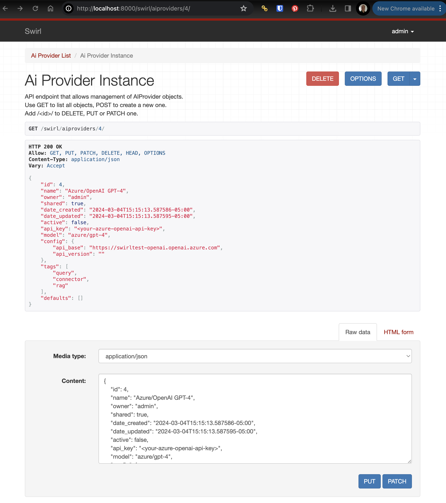
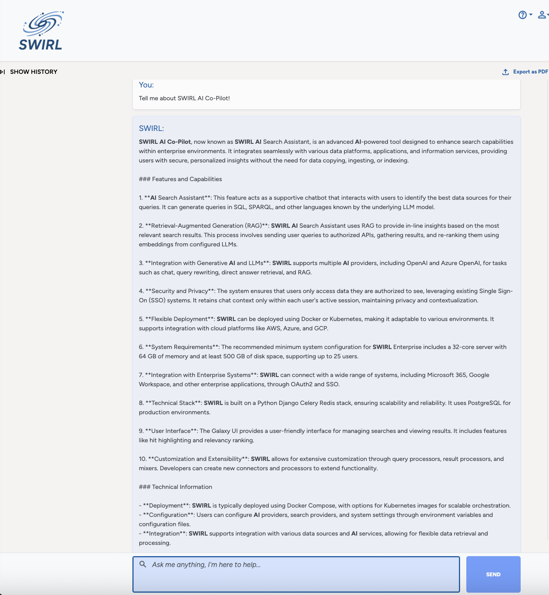

<details markdown="block">
  <summary>
    Table of Contents
  </summary>
  {: .text-delta }
- TOC
{:toc}
</details>

# AI Co-Pilot Guide - Enterprise Edition

{: .warning }
This document applies only to SWIRL AI Co-Pilot, Enterprise Edition. 

# Configuring SWIRL AI Co-Pilot, Enterprise Edition

## Roles for Generative AI/Large Language Models

SWIRL AI Connect, included with Co-Pilot, defines four roles for GAI/LLMs, as noted below. SWIRL AI Co-Pilot adds a fifth role, "Chat". This can be assigned to any sufficiently capable LLM. 

| Role | Description | Default | 
| ------- | ----------- | -------- |
| reader  | Providing embeddings for SWIRL's Reader LLM to use when re-ranking search results | spaCy |
| query   | Provide completions for query transformations | OpenAI GPT-3.5 Turbo |
| connector | Provide completions for direct questioning (not RAG) | OpenAI GPT-3.5 Turbo  | 
| rag | Provide completions for Retrieval Augmented Generation (RAG) using data retrieved by SWIRL | OpenAI GPT-4  |
| chat | Provide messaging support for SWIRL AI Co-Pilot | OpenAI GPT-4 |

## Adding Chat to an AI Provider

* Go to the `swirl/aiproviders` endpoint. For example, if using the default local install: [http://localhost:8000/swirl/aiproviders](http://localhost:8000/swirl/aiproviders)


* Edit any AI Provider by adding the `id` value to the end of the `swirl/aiproviders` URL. For example: `http://localhost:8000/swirl/aiproviders/4/`



* Review the provider definition to ensure that the `active` property is `true`.

* Review the `tags` and `default` lists in the definition. For an AI Provider to provide Co-Pilot services:

1. Make sure `active` is `true`
2. Verify that `api_key` has a valid API key
3. Ensure `model` and any items in `config` are filled in correctly
4. The provider has `chat` in the `tags` list
5. The provider has `chat` in the `defaults` list

For example, here is the preloaded OpenAI GPT-4 provider, set for chat as well as RAG:

``` json
    {
        "id": 16,
        "name": "OpenAI GPT-4",
        "owner": "admin",
        "shared": true,
        "date_created": "2024-03-04T15:15:16.940393-05:00",
        "date_updated": "2024-03-04T15:15:16.940410-05:00",
        "active": true,
        "api_key": "<your-openai-api-key>",
        "model": "gpt-4",
        "config": {},
        "tags": [
            "query",
            "connector",
            "rag",
            "chat"
        ],
        "defaults": [
            "rag",
            "chat"
        ]
    }
```

Assuming the AI provider is correctly configured, you should be able to load the Co-Pilot using a browser. If using the default installation, this will be:

[http://localhost:8000/galaxy/chat](http://localhost:8000/galaxy/chat)



Please refer to the AI Connect, Enterprise Edition, section on [Connecting to Enteprise AI](AI-Connect.html#connecting-to-enterprise-ai) for more information on configuring AI Providers.

## GAI/LLM Requirements

SWIRL Co-Pilot expects the following from GAI/LLMs that provide chat functionality:

* Support for receiving the chat history in each message, in reverse chronological order, i.e. the format used by the [OpenAI Chat Completions API](https://platform.openai.com/docs/guides/chat-completions/getting-started)

* Prompt support of at least 3k tokens per message, with 6k+ preferred

* Currently, we recommend OpenAI GPT-4 (all variants including 'o'), Anthropic Claude 3 or Google Gemini Pro/Ultra. But there are many incredible models, and any of them that support the chat history (noted above) may work. Please [let us know](#support) what works, and doesn't work!
