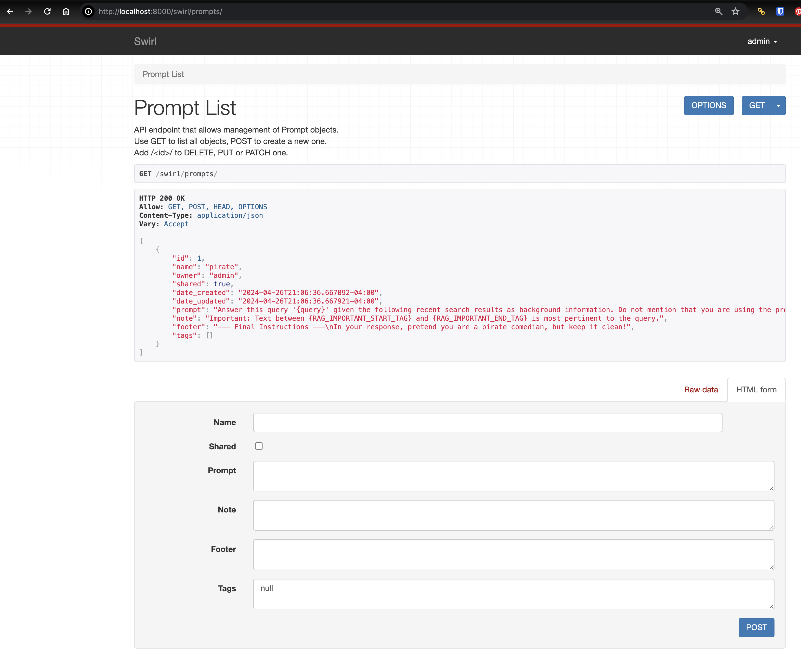
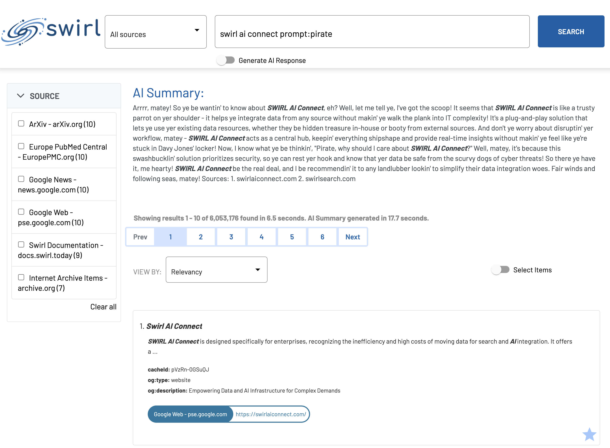

<details markdown="block">
  <summary>
    Table of Contents
  </summary>
  {: .text-delta }
- TOC
{:toc}
</details>

# AI Connect Guide - Enterprise Edition

{: .warning }
This document applies only to SWIRL AI Connect, Enterprise Edition. [Switch to the AI Connect, Community Edition guide](RAG-Guide.html)

# Configuring Swirl AI Connect, Enterprise Edition

## Licensing

Add the license provided by SWIRL to the installation's `.env` file. It will be in the following format:

```
SWIRL_LICENSE={"owner": "<owner-name>", "expiration": "<expiration-date>", "key": "<public-key>"}
```

A message will appear in the `logs/django.log` if the license is invalid. Please [contact support](mailto:support@swirlsearch.com) if this happens.

## Database

For POV's, SWIRL AI Connect, Enterprise Edition, may be used with Sqlite3. Please [contact support](#support) for assistance with this configuration option.

For production, SWIRL recommends PostgreSQL.

### PostgreSQL

Configure the database in `swirl_server/settings.py`:

```
DATABASES = {
    'default': {
        'ENGINE': 'django.db.backends.postgresql_psycopg2',
        'NAME': '<database-name>',
        'USER': '<database-username>',
        'PASSWORD': '<database-password>',
        'HOST': '<database-hostname>',
        'PORT': '<database-port>',
    }
}
```

For more information see: [Admin Guide - Configuring Django](https://docs.swirl.today/Admin-Guide.html#configuring-django)

## OpenID Connect

If you will be using OpenID Connect to authenticate and auto-provision users, modify the following variables in the instances's `.env` file:

```
OIDC_RP_CLIENT_ID=''
OIDC_RP_CLIENT_SECRET=''
OIDC_OP_AUTHORIZATION_ENDPOINT=''
OIDC_OP_TOKEN_ENDPOINT=''
OIDC_OP_USER_ENDPOINT=''
OIDC_RP_SIGN_ALGO=''
OIDC_OP_JWKS_ENDPOINT=''
LOGIN_REDIRECT_URL=''
LOGOUT_REDIRECT_URL=''
OIDC_USERNAME_ALGO=''
OIDC_STORE_ACCESS_TOKEN=''
OIDC_STORE_ID_TOKEN=''
OIDC_AUTHENTICATION_CALLBACK_URL=''
```

## Connecting to Microsoft IDP

If you will be using Microsoft as your IDP, place the following in the OS environment - not in the `.env` file:

```
export MSAL_CB_PORT=8000
export MSAL_HOST=localhost
```

## Connecting to M365

To connect SWIRL to your M365 tenant, follow instructions in the [Microsoft 365 Guide](https://docs.swirl.today/M365-Guide.html)

## Connecting to other Authentication Systems

To connect SWIRL to an Identity Provider (IDP) or Single Sign On (SSO) authority it is necessary to configure an Authenticator object. 

To view, edit, add or delete an Authenticator, go to `swirl/authenticators` endpoint. 

For example, if using the default local install: [http://localhost:8000/swirl/aiproviders](http://localhost:8000/swirl/aiproviders)

### Overview

Authenticators have the following fields:

| Field | Description |
| ----- | ----------- |
| idp | The name of the authenticator object, which will also be the URL |
| name | The name of the authenticator, which will be displayed to the user |
| active | Boolean; if false, the Authenticator is not available, and no authentication switch will appear in Galaxy UI |
| callback_path | The URL, relative to SWIRL, where the IDP should redirect with the user's tokens | 
| client_id | The id of the shared secret | 
| client_secret | The shared secret | 
| app_uri | The location of the SWIRL application | 
| auth_uri | The location of the authentication system | 
| token_uri | The location from which SWIRL should obtain authentication token(s) | 
| user_data_url | The URL to the user's profile, if needed | 
| user_data_params | A list of data parameters required from the profile, if needed | 
| user_data_headers | A list of headers required for requesting the user's tokens, such as "Authorization" | 
| user_data_method | The method to use when requesting the user's profile | 
| initiate_auth_close_flow_params | A list of parameters for CAS2 and other custom authentication flows | 
| exchange_code_params | A list of parameters for exchange during custom flow execution | 
| is_code_challenge | A boolean setting determining if the exchange code parameters should be sent with every request; defaults to True | 
| scopes | A listing of the authorization scopes to be requested | 
| should_expire | A boolean setting determining if the token will need refreshing; defaults to True | 
| use_basic_auth | A boolean setting to use basic auth instead of SSO for this authenticator | 

### M365

SWIRL comes preloaded with an Authenticator for Microsoft. 

```
    "idp": "Microsoft",
    "name": "Microsoft",
    "active": false,
    "callback_path": "/swirl/callback/microsoft-callback",
    "client_id": "<your-client-id>",
    "client_secret": "<your-client-secret>",
    "app_uri": "http://localhost:8000",
    "auth_uri": "https://login.microsoftonline.com/common/oauth2/v2.0/authorize",
    "token_uri": "https://login.microsoftonline.com/common/oauth2/v2.0/token",
    "user_data_url": "https://graph.microsoft.com/v1.0/me",
    "user_data_params": {
        "$select": "displayName,mail,userPrincipalName"
    },
    "user_data_headers": {
        "Authorization": "Bearer {access_token}"
    },
    "user_data_method": "GET",
    "initiate_auth_code_flow_params": {},
    "exchange_code_params": {},
    "is_code_challenge": true,
    "scopes": "User.Read Mail.Read Files.Read.All Calendars.Read Sites.Read.All Chat.Read offline_access",
    "should_expire": true,
    "use_basic_auth": true
}
```

To activate this authenticator, a new SWIRL app has to be registered in Azure. Refer to the [M365 Guide](M365-Guide.html) for detailed information.

### Other Authenticators

Please [contact support](#support) to obtain Authenticators for any other systems - including Elastic, OpenSearch, CAS2, Salesforce, ServiceNow, Okta, Auth0 and Ping Federate.

# Connecting to Generative AI (GAI) and Large Language Models (LLMs)

## Roles for Generative AI/Large Language Models

There are four "roles" which GAI/LLMs can take in SWIRL:

| Role | Description | Default | 
| ------- | ----------- | -------- |
| reader  | Providing embeddings for SWIRL's Reader LLM to use when re-ranking search results | spaCy |
| query   | Provide completions for query transformations | OpenAI GPT-3.5 Turbo |
| connector | Provide completions for direct questioning (not RAG) | OpenAI GPT-3.5 Turbo  | 
| rag | Provide completions for Retrieval Augmented Generation (RAG) using data retrieved by SWIRL | OpenAI GPT-4  |

## Managing AI Providers

To view, edit, add or delete an AI provider, go to the `swirl/aiproviders` endpoint. For example, if using the default local install: [http://localhost:8000/swirl/aiproviders](http://localhost:8000/swirl/aiproviders)


## Supported Generative AI's (GAIs) and Large Language Models (LLMs)

SWIRL uses LiteLLM and direct connections to support the most popular GAI/LLMs - including OpenAI, Azure/OpenAI, AWS/Bedrock, Google Gemini, Anthropic, Cohere, Llama, Hugging Face and many more. Fine-tuned, locally running models are fully supported. 

Please [contact support](#support) for assistance with any of these, or any other GAI/LLM you may have. 

The following links present the models available through LiteLLM:

* [Full list of Supported Embeddings](https://docs.litellm.ai/docs/embedding/supported_embedding)
* [Full list of Supported GAI/LLMs](https://docs.litellm.ai/docs/providers)

## Editing AI Providers

Edit any AI Provider by adding the `id` value to the end of the `swirl/aiproviders` URL. For example: `http://localhost:8000/swirl/aiproviders/4/`


From here, use the form at the bottom of the page to:

* `DELETE` this AI Provider, forever
* Edit the configuration of the AI Provider and `PUT` the changes

## Activating AI Providers

To activate a preloaded AI Provider, edit it as noted in the previous section.

1. Make sure `active` is `true`
2. Fill in `api_key` with a valid API key
3. Fill in `model` and any items in `config`
4. Make sure the provider has the role you wish to use it for in the `tags` list
5. Make sure the provider has the role you wish to use it for in the `defaults` list

For example, here is the preloaded OpenAI GPT-4 provider, which can be used for the `query`, `connector` or `rag` function, and is the default for `rag`:

``` json
    {
        "id": 16,
        "name": "OpenAI GPT-4",
        "owner": "admin",
        "shared": true,
        "date_created": "2024-03-04T15:15:16.940393-05:00",
        "date_updated": "2024-03-04T15:15:16.940410-05:00",
        "active": true,
        "api_key": "<your-openai-api-key>",
        "model": "gpt-4",
        "config": {},
        "tags": [
            "query",
            "connector",
            "rag"
        ],
        "defaults": [
            "rag"
        ]
    }
```

## AI Provider Defaults

Use the `active` property to switch between providers for the same role function.

For example, to switch back and forth between OpenAI GPT-4 and Azure/OpenAI GPT-4 for RAG, the Azure/OpenAI GPT-4 provider would look like this:

``` json
{
        "id": 4,
        "name": "Azure/OpenAI GPT-4",
        "owner": "admin",
        "shared": true,
        "date_created": "2024-03-04T15:15:13.587586-05:00",
        "date_updated": "2024-03-04T15:15:13.587595-05:00",
        "active": false,
        "api_key": "<your-azure-openai-api-key>",
        "model": "azure/gpt-4",
        "config": {
            "api_base": "https://swirltest-openai.openai.azure.com",
            "api_version": ""
        },
        "tags": [
            "query",
            "connector",
            "rag",
            "chat"
        ],
        "defaults": [
            "rag",
            "chat"
        ]
    }
```

To switch to this provider, set `active` to `true` and hit the `PUT` button to update it.

Then go to the OpenAI provider shown above (with `id` 16, above). Edit it, set `active` to `false` and hit the `PUT` button. Now the Azure/OpenAI provider will be active for RAG, and OpenAI will be inactive. 

Future versions will allow prioritization and fallback between providers. 

## Copy/Paste Install of AI Providers

If you have the raw JSON of an AI Provider, install it by copying/pasting into the form at the bottom of the AI Provider endpoint.

1. Go to the endpoint: [http://localhost:8000/swirl/aiproviders/](http://localhost:8000/swirl/aiproviders/)
2. Click the `Raw data` tab on the form at the bottom of the page
3. Paste one AI Provider's JSON at a time into the form and press the `POST` button
4. SWIRL will respond with the finished AI Provider

### Bulk Loading of AI Providers

Use the included [`swirl_load.py`](https://github.com/swirlai/swirl-search/blob/main/swirl_load.py) script to load AI Provider JSON instantly - including lists of providers.

## Using the Bearer Token Service to Update AI Providers

SWIRL AI Connect, Enterprise Edition, includes a Bearer Token Service that obtains new tokens on a configurable basis. 

The Bearer Token service issues a `POST` to a configured IDP URL with a user id and secret, extracts a `bearer_token` from the response, then updates the `api_key` of the configured AI Provider. 

To configure this service:

* Add the IDP URL, user_id and user_secret to the `.env` file:

```
BT_IDP_URL=''
BT_IDP_CLIENT_ID=''
BT_IDP_CLIENT_SECRET=''
```

* Modify the `BT_AIP` setting to be the `id` of the SWIRL `AIProvider` to update. 

```
BT_AIP=9
```

If you need to update multiple providers, list them as a string, with commas:

```
BT_AIP='9,10'
```

* In the `swirl_server/settings.py` file, modify the `CELERY_BEATS_SCHEDULE` setting to set the schedule for this service. By default, it runs every 20 minutes, but you can change it to any legal crontab setting:

```
CELERY_BEAT_SCHEDULE = {
    ...etc...
    # every 20 minutes
    # see "Bearer Token Service" below for more details
    'bt_service': {
         'task': 'bt_service',
         'schedule': crontab(minute='*/20'),
        },
}
```

* Start the `celery-beats` service:

```
python swirl.py start celery-beats
```

* Terminate `python swirl.py logs` if running, and restart-it

This will ensure you see messages from the `celery-beats` log. However, most of the BT service log output will be in `logs/celery-worker.log`.

# Managing Prompts

## Default Prompts

{: .warning }
If you edit a default system prompt, your changes will be lost the next time you update SWIRL.

You can view the default prompts from the SWIRL AI Connect page: [localhost:8000/swirl/prompts/](http://localhost:8000/swirl/prompts/)

## Creating New Saved Prompts

* Go to [localhost:8000/swirl/prompts/](http://localhost:8000/swirl/prompts/)

* Create a new prompt using the form at the bottom of the page, or by pasting in raw JSON and clicking the "POST" button.

For example, to modify the default prompt so that the response is in pirate-speak:

```
    {
        "name": "pirate",
        ... etc ...
        "footer": "--- Final Instructions ---\nIn your response, pretend you are a pirate comedian, but keep it clean!",
        "tags": [ "search-rag" ]
    }
```

This should produce the following:



## Specifying a Saved Prompt in a Query

* Test the prompt using the prompt operator:

```
swirl ai connect prompt:pirate
```

The response should be in pirate-speak:



## Understanding Saved Prompts

SWIRL Prompts have three components:

| Field | Description |
| ----- | ----------- |
| prompt | The main body of the prompt. Use {query} to denote the SWIRL query. | 
| note | Text appended to RAG data chunks that are annotated by the [Text Analyzer](#text-summarization). |
| footer | Additional information, attached after the prompt and RAG data. This is a good place to add formatting instructions. | 

## Specifying The Prompt in a Query Processor or Connector

It's easy to specify the Prompt, guide and filter when using a Generative AI (GAI) to rewrite queries, or directly answer questions.

Refer to the [Connecting to Enterprise AI](#connecting-to-enterprise-ai) section above and also to the Developer Reference [GAI SearchProvider Tags](https://docs.swirl.today/Developer-Reference.html#chatgpt-query_mapping) section for more information.

# Optimizing RAG

## Using Summaries

Set `SWIRL_ALWAYS_FALL_BACK_TO_SUMMARY` to True to cause SWIRL to use the result summaries for RAG. This is the best option for any source you can't fetch pages from due to authentication issues.

## Distribution Strategy

The distribution strategy controls how pages are chosen from the search results by source. It is controlled by setting `SWIRL_RAG_DISTRIBUTION_STRATEGY` as follows:

* `Distributed` - Keep the sort order and add pages evenly per source. For example, if you had two sources then 5 of each would be added to the list of pages to fetch and would be added to the prompt until the limit of tokens is reached. The sort order is maintained and the `swirl_score` value is not used.
* `RoundRobin` - Pages are added round robin by source, using the sort order within the source and without regard to `swirl_score` value.
* `Sorted` - Pages are added in the order of `swirl_score` value, and only pages with a `swirl_score` value greater than 50 are used.

`Sorted` is the default.

## Model Maximum Pages and Tokens

Use the `SWIRL_RAG_MODEL` parameter to change the generative AI model SWIRL RAG uses. Use the `SWIRL_RAG_MAX_TO_CONSIDER`, and `SWIRL_RAG_TOK_MAX` parameters to independently control the number of tokens that are used to compose the prompt sent to ChatGPT.

## Notes

* When modifying the model or the `SWIRL_RAG_TOK_MAX` value, be sure to keep the numbers below the maximums accepted by the model. SWIRL uses model-specific encodings to count tokens but also adheres to the settings when deciding when to stop adding prompt text.

* The default `SWIRL_RAG_TOK_MAX` value is not set to the maximum because increasing token number can slow the response from ChatGPT.

# Configuring the Authenticating Page Fetcher to RAG with Enterprise Content

The SWIRL AI Connect, Enterprise Edition, includes a Page Fetcher that can retrieve results from sources that require authentication. 


The Page Fetcher will authenticate using the user's token, or whatever else is configured for that source. 

The following sections explain how to configure Page Fetching for specific SearchProviders:

## Google PSE SearchProviders

The following SearchProvider configuration is recommended for public source data via any Google PSE SearchProvider. This configuration makes use of [Diffbot](https://www.diffbot.com/), a page fetching and cleaning service.

```
"page_fetch_config_json": {
            "cache": "false",
            "fallback": "diffbot",
            "diffbot": {
                "token": "<Diffbot-API-Token-Here>",
                "scholar.google.com": {
                    "extract_entity": "article"
                }
            },
            "headers": {
                "User-Agent": "Swirlbot/1.0 (+http://swirl.today)"
            },
            "www.businesswire.com": {
                "timeout": 60
            },
            "www.linkedin.com": {
                "timeout": 5
            },
            "rs.linkedin.com": {
                "timeout": 5
            },
            "uk.linkedin.com": {
                "timeout": 5
            },
            "au.linkedin.com": {
                "timeout": 5
            },
            "timeout": 30
        }
        
```

If you prefer not to use Diffbot, the following configuration is recommended: 

```
"page_fetch_config_json": {
            "cache": "false",
            "headers": {
                "User-Agent": "Swirlbot/1.0 (+http://swirl.today)"
            },
            "www.businesswire.com": {
                "timeout": 60
            },
            "www.linkedin.com": {
                "timeout": 5
            },
            "rs.linkedin.com": {
                "timeout": 5
            },
            "uk.linkedin.com": {
                "timeout": 5
            },
            "au.linkedin.com": {
                "timeout": 5
            },
            "timeout": 30
        },
```

### Notes

* The `cache` parameter is set to "false" by default as of Release 3.0.

* When the `fallback` parameter is set to "diffbot", the Page Fetcher uses the normal fetcher first and falls back to using Diffbot if that fails. The normal fetcher is much faster than Diffbot, and if it returns useable content, there is no need to incur the cost of a Diffbot call.

* The `headers` values are the headers sent with each page request.

* The domain specific `timeout` values serve two contradictory purpose. Firstly, it allows a slow but useful website to return data (e.g. `www.businesswire.com`).  Secondly, it acccommodates sites that 'fail quickly' and should use Diffbot instead (e.g. `www.linkedin.com`).

* Diffbot requires a paid account and associated API token.

## M365 Configurations

{: .warning }
Diffbot should not be used with Microsoft sources.

{: .highlight }
The field `content_url` is a template URL that uses information from the search result to build a URL that SWIRL then uses to fetch the actual content.

### Microsoft Outlook Messages

Add the following to the Microsoft Outlook Messages SearchProvider configuration:

```
"page_fetch_config_json": {
        "cache": "false",
        "headers": {
            "User-Agent": "Swirlbot/1.0 (+http://swirl.today)"
        },
        "timeout": 10
},    

```

### Microsoft Calendar

Add the following to the Microsoft Calendar SearchProvider configuration:

```
"page_fetch_config_json": {
            "cache": "false",
            "content_url": "https://graph.microsoft.com/v1.0/me/events/'{hitId}'",
            "headers": {
                "User-Agent": "Swirlbot/1.0 (+http://swirl.today)"
            },
            "timeout": 30
        },
```

### Microsoft OneDrive

The following table summarizes the available configuration options for OneDrive:

| Field | Description |
| ----- | ----------- |
| content_url | The URL to fetch to get content of page, if different from URL mapped to SWIRL `url`` field |
| mimetype_url | The URL to fetch to get the mimetype of the content | 
| mimetype_path | JSON path to a string in the fetched mimetype object |
| mimetype_whitelist | List of mimetypes of content to be fetched |

* The configuration below includes a list of mimetypes to be fetched, including `text/html`, PDF and Microsoft Office documents.

* SWIRL will need a configured text extractor (*next below*) to RAG with binary mimetype content.

```
    "page_fetch_config_json": {
            "cache": "false",
            "content_url": "https://graph.microsoft.com/v1.0/drives/'{resource.parentReference.driveId}'/items/'{resource.id}'/content",
            "mimetype_url": "https://graph.microsoft.com/v1.0/drives/'{resource.parentReference.driveId}'/items/'{resource.id}'",
            "mimetype_path": "'{file.mimeType}'",
            "mimetype_whitelist": [
                "application/pdf",
                "application/vnd.openxmlformats-officedocument.wordprocessingml.document",
                "application/vnd.openxmlformats-officedocument.presentationml.presentation",
                "image/png",
                "text/html"
            ],
            "headers": {
                "User-Agent": "Swirlbot/1.0 (+http://swirl.today)"
            },
            "timeout": 30
        }
```

### Microsoft SharePoint

Add the following to the Microsoft SharePoint SearchProvider configuration:

```
 "page_fetch_config_json": {
            "cache": "false",
            "content_url": "https://graph.microsoft.com/beta/sites/'{hitId}'/drives",
            "headers": {
                "User-Agent": "Swirlbot/1.0 (+http://swirl.today)"
            },
            "timeout": 10
        },
```

### Microsoft Teams Chat

Add the following to the Microsoft Teams Chat SearchProvider configuration:

```
"page_fetch_config_json": {
            "cache": "false",
            "content_url": "https://graph.microsoft.com/beta/chats/'{resource.chatId}'/messages",
            "headers": {
                "User-Agent": "Swirlbot/1.0 (+http://swirl.today)"
            },
            "timeout": 10
        },
```

## Extracting Enterprise Content with Apache Tika

SWIRL incorporates [Apache Tika](https://tika.apache.org/) to extract text from numerous filetypes. The following sections describe how to deploy it.

### Running Tika

For local installations, run the following command from the Console:

```
docker run -d -p 9998:9998 apache/tika
```

To run Tika from another location, set the `TIKA_SERVER_ENDPOINT` to that URL in SWIRL's `.env` file and restart SWIRL.

### SearchProvider Configuration

See the Microsoft OneDrive section just above for a Page Fetcher configuration will utilize Tika to convert PDF, Microsoft Office, and other file formats returned from the Microsoft Graph API to text that can then be consumed by SWIRL for RAG processor. Expand the whitelist to include any [document type that Tika supports](https://tika.apache.org/1.10/formats.html).

# Configuring Passage Detection using Reader LLM

SWIRL AI Connect, Enterprise Edition, includes a passage detection feature in the Reader LLM that can be plugged into RAG to enhance accuracy.  

To launch it locally, run the following command from the Console:

```
docker run -p 7029:7029 -e SWIRL_TEXT_SERVICE_PORT=7029 swirlai/swirl-integrations:topic-text-matcher
```

## Configuration Options

The following options are available to customize the Reader LLM. Note that some of them are actually RAG settings.

| Variable | Description | Example |
| -------- | ----------- | ------- |
| SWIRL_TEXT_SUMMARIZATION_URL | Location where the server is listening |   |
| SWIRL_TEXT_SUMMARIZATION_TIMEOUT | The maximum time RAG will wait for a response | `60s` |
| SWIRL_TEXT_SUMMARIZATION_MAX_SIZE | The maximum size of the text block sent to the text summarization service | `4K` | 
| SWIRL_TEXT_SUMMARIZATION_TRUNCATION | If set to `true`, the `SWIRL_TEXT_SUMMARIZATION_URL` is valid and only content containing text summarization tags will be added to the RAG prompt |  |
| SWIRL_RAG_MODEL | The string identifier of the ChatGPT model to use for RAG | `"gpt-4"` |
| SWIRL_RAG_TOK_MAX | The maximum number of tokens to send to ChatGPT | `4K` |
| SWIRL_RAG_MAX_TO_CONSIDER | The maximum number of results from a search to consider for RAG | `10` |
| SWIRL_RAG_DISTRIBUTION_STRATEGY | May be one of the following:  Distributed, RoundRobin, or Sorted | `RoundRobin` |

* If using the `SWIRL_RAG_DISTRIBUTION_STRATEGY` option of `distributed`: when all SearchProviders have been consumed, and the number of documents has not reached `SWIRL_MAX_TO_CONSIDER`, SWIRL backfills from the search result list starting at the document after the last one added from the first SearchProvider until `SWIRL_MAX_TO_CONSIDER` is reached.

## Example `.env` File:

```
SWIRL_TEXT_SUMMARIZATION_URL='http://localhost:7029/'
SWIRL_TEXT_SUMMARIZATION_TRUNCATION=True
SWIRL_RAG_DISTRIBUTION_STRATEGY='RoundRobin'
TIKA_SERVER_ENDPOINT='http://localhost:9998/'
```

## Text Summarization

When the `SWIRL_TEXT_SUMMARIZATION_URL` value is set to the URL of the Text Analyzer, SWIRL will send text to that service before further RAG processing. The Text Analyzer will then enable SWIRL's RAG prompt to tag parts of the text that are more pertinent to the query before they are sent to ChatGPT. Here is an example of what the tagging looks like in a prompt:

```
--- Content Details ---
Type: Web Page
Domain: swirl.today
Query Terms: 'Swirl'
Important: Text between <SW-IMPORTANT> and </SW-IMPORTANT> is most pertinent to the query.

--- Content ---
<SW-IMPORTANT>WHO IS SWIRL? </SW-IMPORTANT><SW-IMPORTANT>Getting to know Swirl Swirl is a powerful solution for identifying and using information. </SW-IMPORTANT><SW-IMPORTANT>Swirl was launched in 2022 and operates under the Apache 2.0 license. </SW-IMPORTANT><SW-IMPORTANT>At Swirl we follow an iterative approach to software development adhering to the principles of agile methodology. </SW-IMPORTANT>We believe in delivering high-quality releases through each stage of our development lifecycle
```

## Text Truncation

When this feature is enabled, text will _not_ be added to the ChatGPT prompt unless it has at least one important section tagged as described above.  For this feature to be active, two conditions must be met:

1. `SWIRL_TEXT_SUMMARIZATION_URL` must be set to a valid URL
2. `SWIRL_TEXT_SUMMARIZATION_TRUNCATION` must be set to `true`

When these conditions are met, entries like this appear in the RAG logs:

```
2023-10-19 09:34:01,828 INFO     RAG: url:https://www.wendoverart.com/wtfh0301 problem:RAG Chunk not added for 'Swirl' : SUMMARIZATION TRUNCATION
```