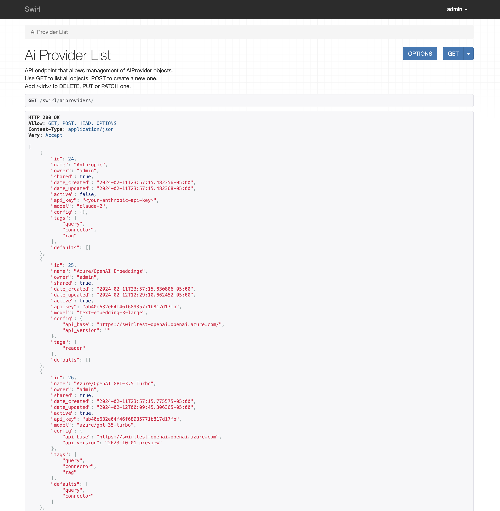
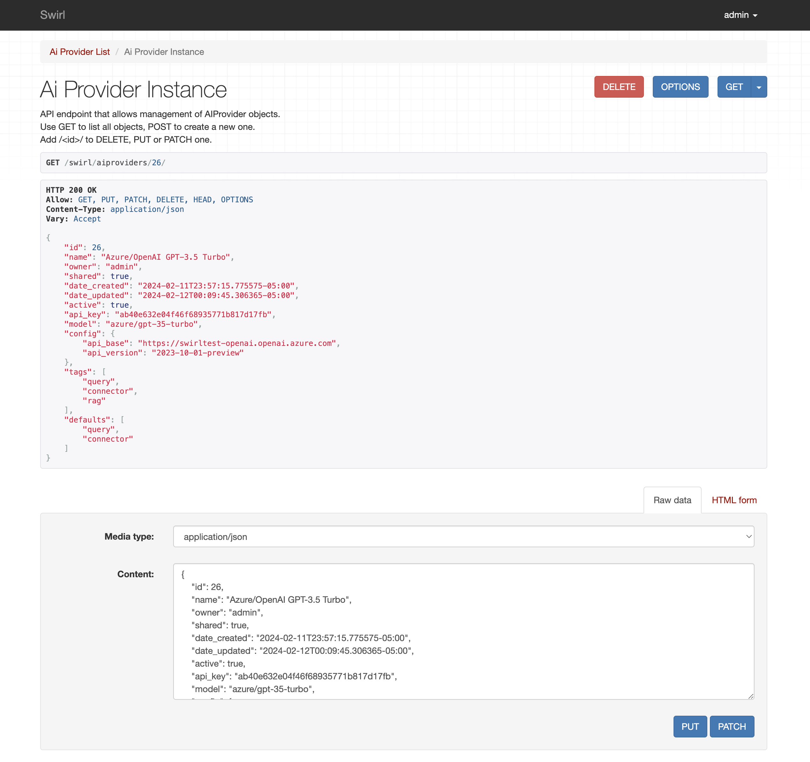

<details markdown="block">
  <summary>
    Table of Contents
  </summary>
  {: .text-delta }
- TOC
{:toc}
</details>

# AI Retrieval Augmented Generation (RAG)

Swirl supports Real Time [Retrieval Augmented Generation (RAG)](index.md#what-is-retrieval-augmented-generation-rag-does-swirl-support-it) out of the box, using existing search engines, databases and enterprise services. 

## Intended Audience

This guide details how to configure and tune Swirl (v. 3.0 or newer) to query Generative AI, swap the vector models used for relevancy ranking and perform RAG. It is intended for use by developers and/or system administrators with the ability to configure the system to connect to these types of services.

# Setting up RAG

* Install Swirl as noted in the [Quick Start Guide](Quick-Start.md#local-installation), including the latest version of the Galaxy UI.

* Add either your OpenAI API key or your Azure OpenAI API credentials to the `.env` file:

```
OPENAI_API_KEY='your-key-here'
```
*Check out [OpenAI's YouTube video](https://youtu.be/nafDyRsVnXU?si=YpvyaRvhX65vtBrb) if you don't have an OpenAI API Key.*

```
AZURE_OPENAI_KEY=<your-key>
AZURE_OPENAI_ENDPOINT=<your-azure-openai-endpoint-url>
AZURE_MODEL=<your-azure-openai-model>
```

* When installing for PRODUCTION use, change the following line in `static/api/config/default` from:

```
"webSocketConfig": {
    "url": "ws://<yourhost>:<your-port>/chatgpt-data"
  }
``` 

...to...

```
"webSocketConfig": {
    "url": "wss://<yourhost>:<your-port>/chatgpt-data"
  }
```

*The default `ws:` prefix can be used locally but should NEVER be used in production as it is not secure!*

* Add the following configuration to the `page_fetch_config_json` parameter of each SearchProvider you wish to have participate in RAG:

```
"page_fetch_config_json": {
        "cache": "false",
        "headers": {
            "User-Agent": "Swirlbot/1.0 (+http://swirl.today)"
        },
        "timeout": 10
}, 
```

Adjust the `timeout` value if necessary. Change the `User-Agent` string as needed, and/or authorize it to fetch pages from internal applications.

As of Swirl 3.2.0, the default AI Summary timeout value can now be overridden with a URL parameter in the Galaxy UI. For example: `http://localhost:8000/galaxy/?q=gig%20economics&rag=true&rag_timeout=90000`

{: .highlight }
The source must allow content to be fetched and not simply displayed on the source's website for RAG processing to utilize that content.

* Restart Swirl:

```
python swirl.py restart
```

* Go to the Galaxy UI ([http://localhost:8000/galaxy/](http://localhost:8000/galaxy/)). The "Generate AI Response" switch should be "off" as shown:


* Run a search. Results appear quickly after you press the "Search" button ([http://localhost:8000/galaxy/?q=epmc:future+of+ai+care](http://localhost:8000/galaxy/?q=epmc:future+of+ai+care)):


* If you wish to manually select the results to RAG with, click the "Select Items" switch to make the shopping cart appear. Results that Swirl thinks should be used in RAG will be pre-checked. Check or uncheck results, and optionally sort and/or filter them.


* Click the "Generate AI Response" switch. A spinner will appear. The RAG response will appear several seconds later depending on a variety of factors. :slightly_smiling_face:


* Verify the RAG insight you received by reviewing the citations at the end RAG response. 

{: .highlight }
To cancel a RAG process, click the "Generate AI Summary" toggle off.

{: .warning }
Swirl's RAG processing utilizes only the *first 10 results* that are selected either automatically or manually using the "Select Items" option.

## Notes

* As of Swirl 3.1.0, page fetch configurations are present for the [European PMC](https://github.com/swirlai/swirl-search/blob/main/SearchProviders/europe_pmc.json) SearchProvider and four of the [Google PSE](https://github.com/swirlai/swirl-search/blob/main/SearchProviders/google_pse.json) SearchProviders.

* As of Swirl 3.1.0, RAG processing is now available through a single API call, e.g. `?qs=metasearch&rag=true`.  See the [Developer Guide](https://docs.swirl.today/Developer-Guide.html#get-synchronous-results-with-the-qs-url-parameter) for more details about the `?qs=` parameter.

* As of Swirl 3.1.0, configurations for a default timeout value (60 seconds) and the text to display when the timeout is exceeded were added to RAG processing.  These options are available in the `static/api/config/default` file.

```
"webSocketConfig": {
    "url": "ws://localhost:8000/chatgpt-data",
    "timeout": 60000,
    "timeoutText": "Timeout: No response from Generative AI."
  }
```

* RAG processing with public web data can be problematic due to difficulties extracting article content; for those seeking a solution for public data please [contact Swirl](mailto:hello@swirl.today).

* The community edition of Swirl is intended to RAG with sources you can fetch without authenticating. If you need to perform RAG with content from enterprise services like Microsoft 365, ServiceNow, Salesforce, Atlassian with OAUTH2 and SSO, please [contact us for information about Swirl Enterprise](mailto:hello@swirl.today) - which supports all of that, and more, out of the box.

# Configuring AI Providers

Swirl 3.3 adds the ability to configure the following:

* Choice of Generative AI for query processing, direct question answering as a Connector, and RAG as noted above
* Choice of Embeddings for the reader LLM
* Selection of the model to use for each

## Managing AI Providers

To access the AI Provider management endpoint go here: 

### [localhost:8000/swirl/aiproviders/](localhost:8000/swirl/aiproviders/)

Login with the admin account. You will see a list of preloaded providers. 



Each AI Provider has the following metadata:

* name
* active: must be `true` for the AI Provider to be used
* api_key
* model: the name of the model to use from the AI Provider
* config: a dictionary of additional configuration items; see the `Azure/OpenAI GPT-3.5 Turbo` provider for examples
* tags: a list of AI operations the provider supports - see next section for options
* defaults: a list of AI operations for which the provider is the default

There are four main operations an AI Provider can execute for Swirl. The table below lists each one and the default when Swirl is initially installed:

| Operation | Default Provider | Notes | 
| --------- | ---------------- | ----- | 
| Reader    | spaCy EN | |
| Connector | Azure/OpenAI 3.5 Turbo | |
| Query     | Azure/OpenAI 3.5 Turbo | |
| RAG       | Open AI GPT-4 | |

## Adding API Keys

To add your API keys to any provider, add the `id` to the URL. For example:

### [localhost:8000/swirl/aiproviders/1/](localhost:8000/swirl/aiproviders/1/)



Edit the provider using the `Raw data` form at the bottom of the page. Press the `PUT` button when finished. (Do not click `Patch`.)

Note that some providers like Azure/OpenAI require additional configuration parameters. 

## Setting the Default AI Provider

To make an AI Provider default for one or more AI operations:

* Add the AI operation to the `default` field
* Remove the AI operation from any other AI Provider `default` field

For example, to change from Azure/OpenAI GPT-3.5 to OpenAI GPT-4 for the Connector operation, change the Azure/OpenAI provider to:

```
    {
        "name": "Azure/OpenAI GPT-3.5 Turbo",
        "owner": "admin",
        "shared": true,
        "date_created": "2024-02-11T23:57:15.775575-05:00",
        "date_updated": "2024-02-12T00:09:45.306365-05:00",
        "active": true,
        "api_key": "<your-azure-openai-api-key>,
        "model": "azure/gpt-35-turbo",
        "config": {
            "api_base": "https://swirltest-openai.openai.azure.com",
            "api_version": "2023-10-01-preview"
        },
        "tags": [
            "query",
            "connector",
            "rag"
        ],
        "defaults": [
            "query"
        ]
    }
```

Then, change the OpenAI GPT-4 provider to:

```
{
        "name": "OpenAI GPT-4",
        "owner": "admin",
        "shared": true,
        "date_created": "2024-02-11T23:57:17.718852-05:00",
        "date_updated": "2024-02-12T00:11:03.846594-05:00",
        "active": true,
        "api_key": "<your-openai-api-key>",
        "model": "gpt-4",
        "config": {
            "max_tokens": 3000
        },
        "tags": [
            "query",
            "connector",
            "rag"
        ],
        "defaults": [
            "connector", 
            "rag"
        ]
    }
```

### Provider Selection Criteria

When Swirl executes one of the four AI operations, it selects the AI Provider to use as follows:

* The first AI Provider that is active, has the operation in it's tag list, and has the operation in the default list

* The first AI Provider that is active, has the operation in it's tag list

Swirl will warn if multiple AI Providers are configured for the same role. It always takes the first provider. 

## Token Management

The `max_tokens` config parameter can be used to set the maximum number of tokens to be sent to this AI Provider. Swirl's RAG workflow will account for this automatically.

## Provider-Specific Support

Swirl uses the `LiteLLM` package to manage connectivity to AI Providers. The following links provide more information on each of the provider specific configurations: [https://docs.litellm.ai/docs/providers](https://docs.litellm.ai/docs/providers) 
