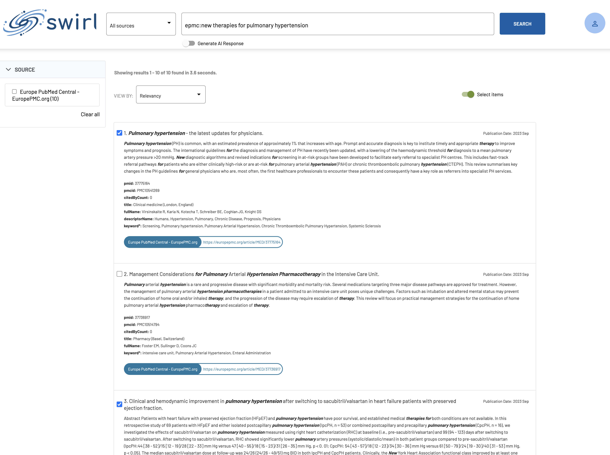

<details markdown="block">
  <summary>
    Table of Contents
  </summary>
  {: .text-delta }
- TOC
{:toc}
</details>

# AI Retrieval Augmented Generation (RAG) Guide

SWIRL supports Real Time [Retrieval Augmented Generation (RAG)](index.md#what-is-retrieval-augmented-generation-rag-does-swirl-support-it) out of the box, using existing search engines, databases and enterprise services.

## Intended Audience

This guide details how to configure and tune SWIRL (v. 3.0 or newer) to perform RAG. It is intended for use by developers and/or system administrators with the ability to configure the system to connect to services like OpenAI's ChatGPT and Azure's OpenAI.

# Setting up RAG

* Install SWIRL as noted in the [Quick Start Guide](Quick-Start.md#local-installation), including the latest version of the Galaxy UI.

* Add either your OpenAI API key or your Azure OpenAI API credentials to the `.env` file:

```
OPENAI_API_KEY='your-key-here'
```
*Check out [OpenAI's YouTube video](https://youtu.be/nafDyRsVnXU?si=YpvyaRvhX65vtBrb) if you don't have an OpenAI API Key.*

```
AZURE_OPENAI_KEY=<your-key>
AZURE_OPENAI_ENDPOINT=<your-azure-openai-endpoint-url>
AZURE_MODEL=<your-azure-openai-model>
```

* When installing for PRODUCTION use, change the following line in `static/api/config/default` from:

```
"webSocketConfig": {
    "url": "ws://<yourhost>:<your-port>/chatgpt-data"
  }
``` 

...to...

```
"webSocketConfig": {
    "url": "wss://<yourhost>:<your-port>/chatgpt-data"
  }
```

*The default `ws:` prefix can be used locally but should NEVER be used in production as it is not secure!*

* Add the following configuration to the `page_fetch_config_json` parameter of each SearchProvider you wish to have participate in RAG:

```
"page_fetch_config_json": {
        "cache": "false",
        "headers": {
            "User-Agent": "Swirlbot/1.0 (+http://swirl.today)"
        },
        "timeout": 10
}, 
```

Adjust the `timeout` value if necessary. Change the `User-Agent` string as needed, and/or authorize it to fetch pages from internal applications.

As of SWIRL 3.2.0, the default AI Summary timeout value can now be overridden with a URL parameter in the Galaxy UI. For example: `http://localhost:8000/galaxy/?q=gig%20economics&rag=true&rag_timeout=90000`

{: .highlight }
The source must allow content to be fetched and not simply displayed on the source's website for RAG processing to utilize that content.

* Restart SWIRL:

```
python swirl.py restart
```

* Go to the Galaxy UI ([http://localhost:8000/galaxy/](http://localhost:8000/galaxy/)). The "Generate AI Response" switch should be "off" as shown:


* Run a search. Results appear quickly after you press the "Search" button ([http://localhost:8000/galaxy/?q=epmc:future+of+ai+care](http://localhost:8000/galaxy/?q=epmc:future+of+ai+care)):


* If you wish to manually select the results to RAG with, click the "Select Items" switch to make the shopping cart appear. Results that SWIRL thinks should be used in RAG will be pre-checked. Check or uncheck results, and optionally sort and/or filter them.


* Click the "Generate AI Response" switch. A spinner will appear. The RAG response will appear several seconds later depending on a variety of factors. :slightly_smiling_face:


* Verify the RAG insight you received by reviewing the citations at the end RAG response. 

{: .highlight }
To cancel a RAG process, click the "Generate AI Summary" toggle off.

{: .warning }
SWIRL's RAG processing utilizes only the *first 10 results* that are selected either automatically or manually using the "Select Items" option.

## Notes

* As of SWIRL 3.2.0, both the OpenAI API and the Azure OpenAI API are now supported.

* As of SWIRL 3.1.0, page fetch configurations are present for the [European PMC](https://github.com/swirlai/swirl-search/blob/main/SearchProviders/europe_pmc.json) SearchProvider and four of the [Google PSE](https://github.com/swirlai/swirl-search/blob/main/SearchProviders/google_pse.json) SearchProviders.

* As of SWIRL 3.1.0, RAG processing is now available through a single API call, e.g. `?qs=metasearch&rag=true`.  See the [Developer Guide](https://docs.swirl.today/Developer-Guide.html#get-synchronous-results-with-the-qs-url-parameter) for more details about the `?qs=` parameter.

* As of SWIRL 3.1.0, configurations for a default timeout value (60 seconds) and the text to display when the timeout is exceeded were added to RAG processing.  These options are available in the `static/api/config/default` file.

```
"webSocketConfig": {
    "url": "ws://localhost:8000/chatgpt-data",
    "timeout": 60000,
    "timeoutText": "Timeout: No response from Generative AI."
  }
```

* RAG processing with public web data can be problematic due to difficulties extracting article content; for those seeking a solution for public data please [contact SWIRL](mailto:hello@swirl.today).

* The community edition of SWIRL is intended to RAG with sources you can fetch without authenticating. If you need to perform RAG with content from enterprise services like Microsoft 365, ServiceNow, Salesforce, Atlassian with OAUTH2 and SSO, please [contact us for information about SWIRL Enterprise](mailto:hello@swirl.today) - which supports all of that, and more, out of the box.
