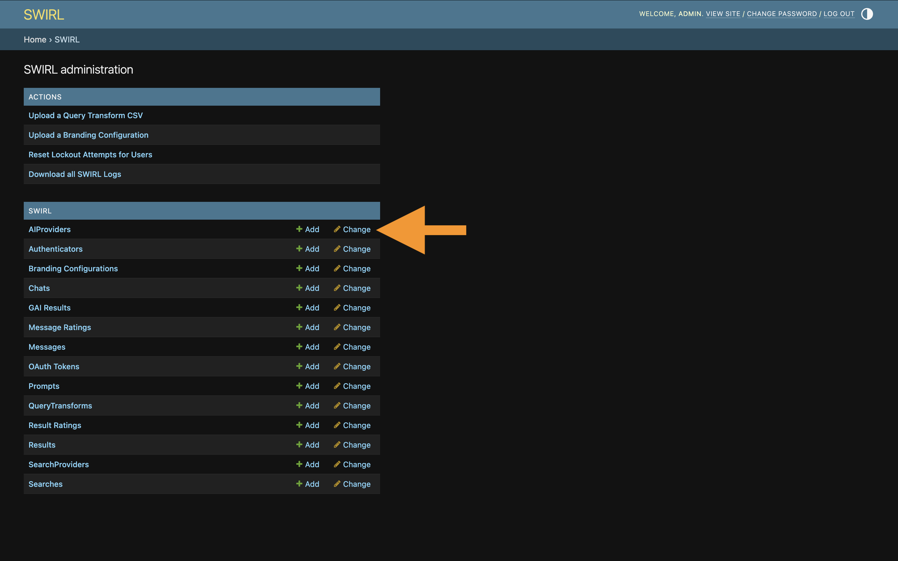
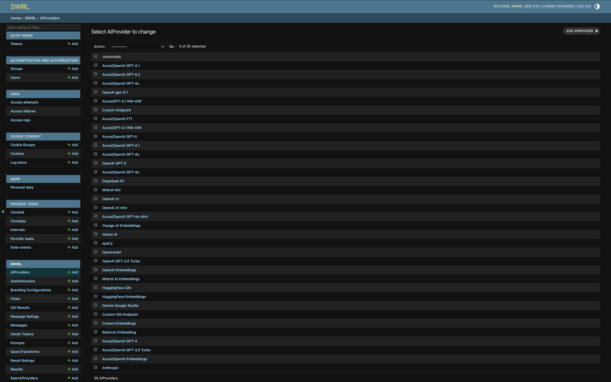
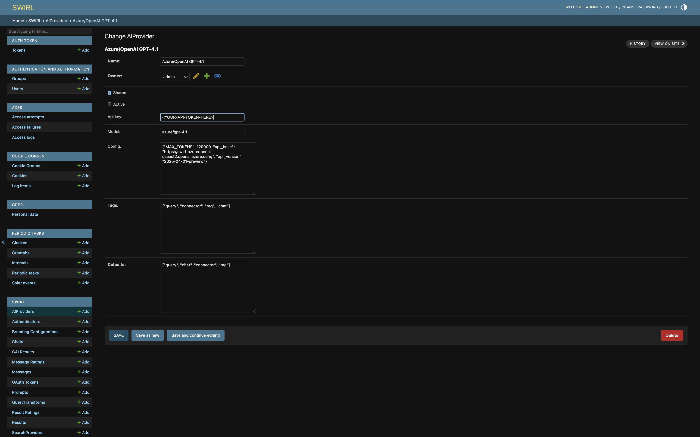
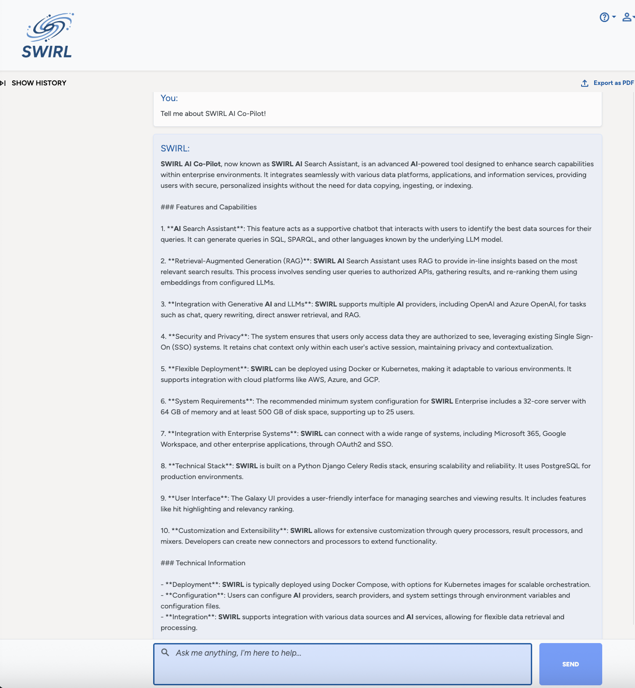
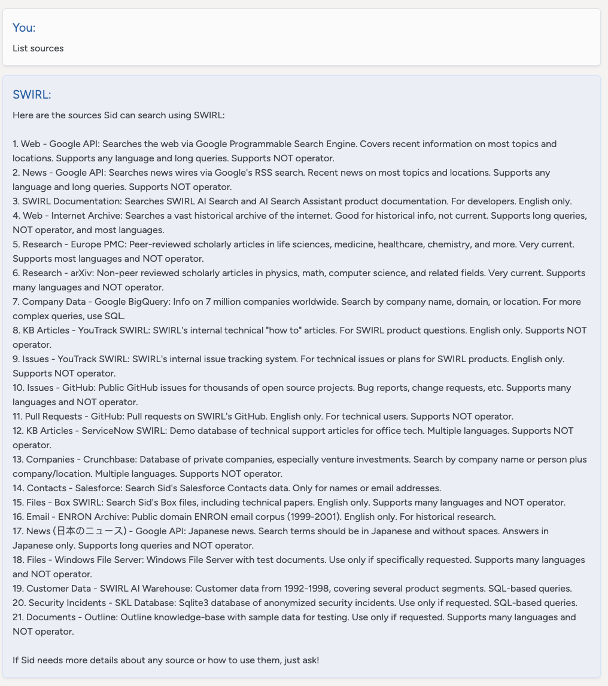
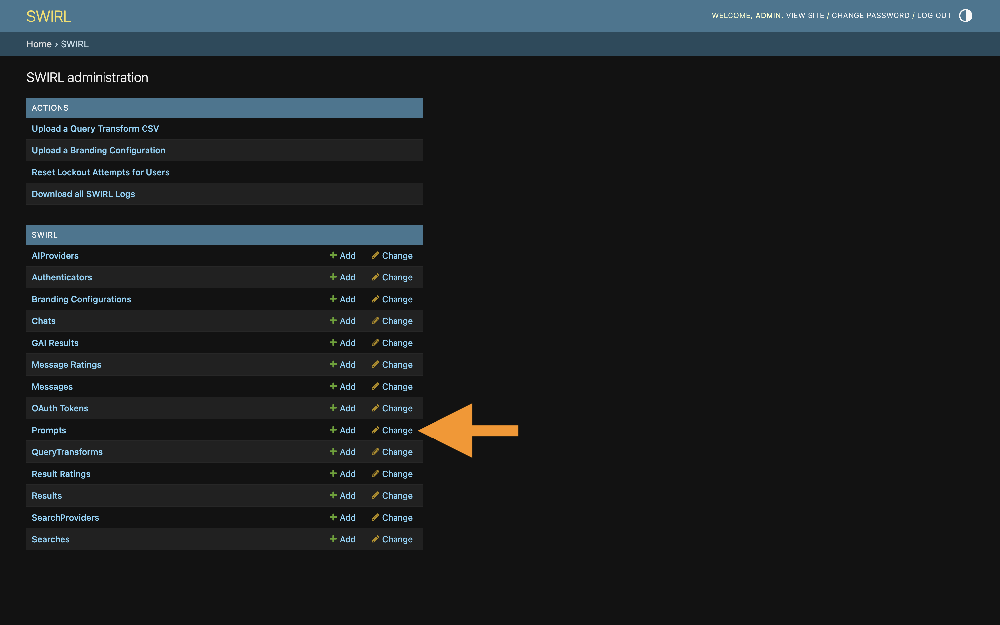
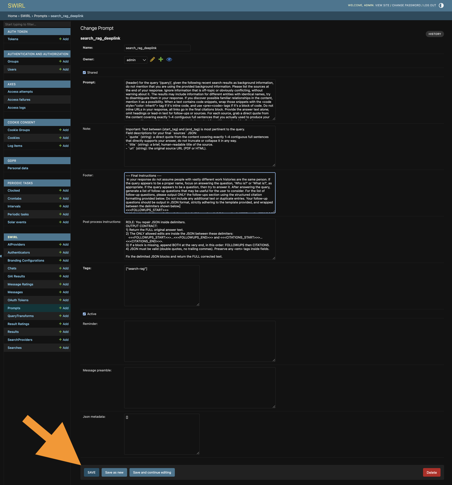
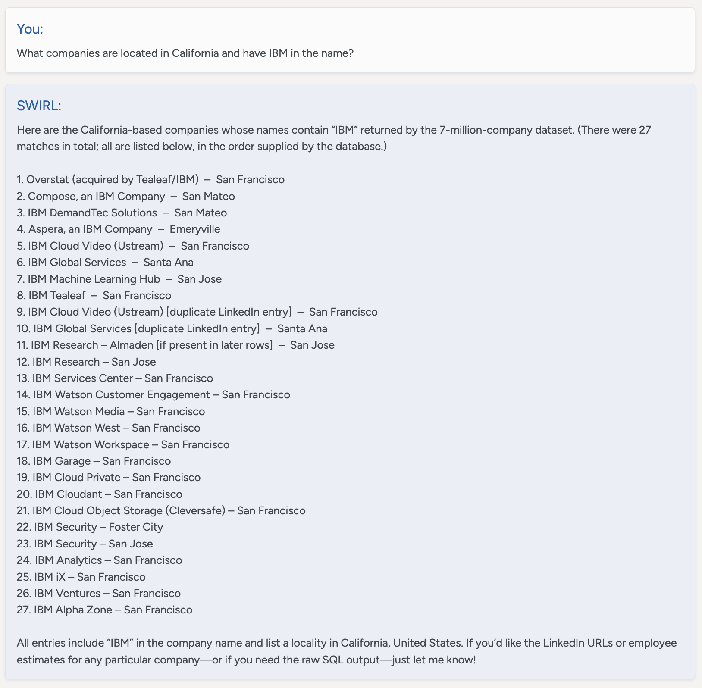

<details markdown="block">
  <summary>
    Table of Contents
  </summary>
  {: .text-delta }
- TOC
{:toc}
</details>

<span class="big-text">AI Search Assistant Guide</span><br/><span class="med-text">Enterprise Edition</span>

{: .warning }
Please [contact SWIRL](mailto:hello@swirlaiconnect.com) for access to SWIRL Enterprise.

{: .highlight }
Please note: we've renamed our products! **SWIRL AI Connect** is now **SWIRL AI Search** 🔎 and **SWIRL AI Co-Pilot** is now **SWIRL AI Search Assistant** 🤖

---

# Configuring SWIRL AI Search Assistant, Enterprise Edition

## Roles for Generative AI / Large Language Models

SWIRL AI Search defines four core roles for GAI/LLMs. SWIRL AI Search Assistant adds a **fifth role, "chat,"** which can be assigned to any sufficiently capable LLM.

| Role | Description | 
| ------- | ----------- |
| `reader`  | Generates embeddings for SWIRL’s Reader LLM to re-rank search results |
| `query`   | Provides query completions for transformations |
| `connector` | Answers direct questions (not RAG) |
| `rag` | Generates responses using Retrieval-Augmented Generation (RAG) with retrieved data |
| `chat` | Powers SWIRL AI Search Assistant messaging |

## Adding Chat to an AI Provider

1. Go to the Admin Console: <http://localhost:8000/admin/swirl>

2. Click on the AIProviders link at the bottom of the page:


3. The list of AIProviders will appear. 


4. Click one to edit it. This will bring up the edit form:


4. Add `chat` to the `tags` list, if not already present.

5. Add `chat` to the `defaults` list, if not already present. 

6. Click the "SAVE" button at the bottom of the page. This AIProvider is now active for the chat role, and is the default AIProvider for that role.

7. Try the new AIProvider by [chatting with the Search Assistant](#launching-assistant)!

For more information on `tags` and `default` options, see: [Organizing SearchProviders with Active, Default and Tags](SP-Guide.md#organizing-searchproviders-with-active-default-and-tags)

## Launching Assistant

Once the AI provider is configured correctly, **Assistant should be accessible via a browser**.  

For a default installation, go here: <http://localhost:8000/galaxy/chat>



## Listing Sources

Instruct the Assistant to: `List sources`



It will respond with a list of active, authenticated SearchProviders. It can discuss not-authenticated sources with the user, but can't search them until the user logs in using the profile icon.

## Describing Sources

The description for each SearchProvider is stored in the `description` field. This is used to provide background information to the assistant about the source - including what type of information can be found there, what language(s) are supported, if NOT is supported, and more. The Assistant will share this information with the user on demand.

The `SearchProvider`.`config` item should be populated with a detailed instruction set which helps the LLM use the source. This information is not directly shared with the user.

For example, a cloud storage service like M365 OneDrive:

```
Searches the user's OneDrive files which will contain internal company information related to almost any area including finance, HR, contracts, insurance, product development, devops, legal, etc. English only. Supports many languages. Supports NOT operator.
```

Or, for a database of company information, stored in Google BigQuery:

```
Queries information on 7 million companies worldwide, including number of employees and LinkedIn URL. The source of this data is 'https://www.kaggle.com/datasets/peopledatalabssf/free-7-million-company-dataset' provide it to the user if asked.
```

The `description` field can be up to 2k in length.

## Using Prompts

SWIRL Enterprise includes a set of pre-loaded, standard prompts. Each consiss of three key components:

| Field | Description |
| ----- | ----------- |
| `prompt` | The main body of the prompt. Use `{query}` to represent the SWIRL query. |
| `note` | Text appended to search result data sent to the LLM for insight generation. |
| `footer` | Additional instructions appended after the prompt and RAG data. This is ideal for formatting guidance. |

The name of the `prompt` has no importance. SWIRL uses the `tags` field to determine which prompt is used for a given function. 

The following table presents the `tags` options:

| Tag | LLM Role | 
| --- | -------- | 
| chat | Used by AI Search Assistant for chat conversations, including company background; not technical | 
| chat-rag | Used by AI Search Assistant to answer questions and summarize data via RAG; somewhat technical | 
| search-rag | Used by AI Search, `Generate AI Insight` (RAG) switch, somewhat technical | 

Note that there must be at least one `active` prompt for each of these tags for the relevant SWIRL features to work.

### Modifying the Standard Prompts

{: .warning }
**Warning: never modify the standard prompts!** All changes will be discarded when SWIRL updates. 

Use the [Customizing Prompts](#customizing-the-ai-search-rag-prompt) procedure, below, instead.

### Customizing the AI Search Assistant Prompts

{.warning}
**Warning: never modify the standard prompts!** All changes will be discarded when SWIRL updates. 

The following procedure below below to copy the standard prompts, modify them, then make them active. 
New prompts won't be disturbed when SWIRL upgrades.

1. Open the Admin Console: <http://localhost:8000/admin/swirl>

2. Click `Prompts` near the bottom of the page:


3. Click the `chat_rag_instructions_standard`, `chat_rag_standard` or `chat_rag_deeplink` prompts to bring up the edit form.

4. Using the form, uncheck `active`. Then, click the "SAVE" button at the bottom of the page. 

5. Change the `name` of the prompt to something appropriate like `my_custom_prompt`. Click the "Save as new" button at the bottom of the page. 

6. Check the `active` field. Then, click the "SAVE" button at the bottom of the page to save the new prompt.

7. If you don't wish to share this prompt with other users, set `shared` to `false`. 

8. Modify the `prompt` field. Change `SWIRL Corporation` to the name of your organization. Add additional text dsecribing the organization, the role of users, and additional information, after the organization name. Do not disturb any other instructions. For example:
```json
{
    "prompt": "You are an expert online assistant and reference librarian working for **<your-company-name>. <Your-company-name> is located in <description> and operates in <industry> etc**... Your job is...
}
```

9. Click "SAVE" at the bottom of the page to save changes. 

10. Try the new prompt by asking the Search Assistant!

## Restoring Standard Prompts

To go back to a standard prompt after creating a new one:

* Open the Admin Console and select Prompts
* Edit the new prompt, uncheck the `active` property, and click the "SAVE" button.
* Edit the system prompt, check the `active` property, and click the "SAVE" button.

### Restoring All Prompts to Default

To restore all prompts to the default, refer to the [Admin Guide on Resetting Prompts](https://docs.swirlaiconnect.com/Admin-Guide#resetting-prompts).

## Advanced Querying

To enable the Assistant to query in advanced query languages like SQL, the elastic API or Mongo MQL, add an LLM generated instruction set to the SearchProvider `config` block, including:

* A description of the schema
* Details of important fields
* Sample queries and the natural language, business questions they answer

For example, here's a configuration enabling the Search Assistant to query the company database using Google BigQuery SQL:

```
    "config": {
        "swirl": {
            "llm_use": {
                "mcp": {
                    "prompt": {
                        "query_instructions": "GPT-4o-tuned Guide for Writing BigQuery SQL Against the 7M Companies Dataset. Purpose: Query ~7M companies with employee counts and LinkedIn URLs. Source: https://www.kaggle.com/datasets/peopledatalabssf/free-7-million-company-dataset. Table: `company_dataset.company` (use exactly this dataset.table; do not invent or prepend a project ID). Schema (only these fields): name, domain, year_founded, industry, size_range, locality, country, linkedin_url, total_employee_estimate, current_employee_estimate. Guardrails for legacy models: 1) Primary key: use exactly one of {company name, domain, location} unless the user provides more than one; if multiple are provided, prefer domain (highest precision), then name, and use location as a filter on locality. 2) Never add inferred or extraneous filters (e.g., industry, sector, size_range) and never append the word 'company' to names. 3) Use BigQuery SEARCH(column, 'query') for name and locality; do not use LIKE; keep the literal user text inside single quotes. 4) For domain, use exact case-insensitive equality: LOWER(domain) = LOWER('{domain}'); if the user gives a URL, extract the host first: REGEXP_EXTRACT('{input}', r'^(?:https?://)?(?:www\\.)?([^/]+)'). 5) Quoting: use single quotes for string literals; backtick only the table reference; do not backtick column names. 6) Results: select only needed columns; include linkedin_url when requested; add ORDER BY current_employee_estimate DESC NULLS LAST when ranking by employees; default LIMIT 50 unless the user asks for more. 7) Employees: filter on current_employee_estimate; only use total_employee_estimate if explicitly requested. 8) Fallback (only if SEARCH() is unavailable in the execution environment): replace SEARCH(name, '{company_name}') with REGEXP_CONTAINS(LOWER(name), LOWER('{company_name}')) and SEARCH(locality, '{location_name}') with REGEXP_CONTAINS(LOWER(locality), LOWER('{location_name}')). 9) Do not invent JOINs, project IDs, policies, or additional conditions. Query assembly flow: normalize inputs (trim; for domain, lowercase and strip protocol/leading 'www.'), choose the primary key, build WHERE (SEARCH on name/locality; exact match on domain), optionally add an employee threshold, select columns, add ORDER BY and LIMIT. Templates: A) Search by company name: SELECT name, domain, locality, country, linkedin_url, current_employee_estimate, total_employee_estimate FROM `company_dataset.company` WHERE SEARCH(name, '{company_name}') ORDER BY current_employee_estimate DESC NULLS LAST LIMIT 50; B) Search by domain: SELECT name, domain, locality, country, linkedin_url, current_employee_estimate, total_employee_estimate FROM `company_dataset.company` WHERE LOWER(domain) = LOWER('{domain}') LIMIT 50; C) Search by location (locality filter): SELECT name, domain, locality, country, linkedin_url, current_employee_estimate, total_employee_estimate FROM `company_dataset.company` WHERE SEARCH(locality, '{location_name}') ORDER BY current_employee_estimate DESC NULLS LAST LIMIT 50; D) Name + location: SELECT name, domain, locality, country, linkedin_url, current_employee_estimate, total_employee_estimate FROM `company_dataset.company` WHERE SEARCH(name, '{company_name}') AND SEARCH(locality, '{location_name}') LIMIT 50; E) Name + employee threshold: SELECT name, domain, locality, country, linkedin_url, current_employee_estimate FROM `company_dataset.company` WHERE SEARCH(name, '{company_name}') AND current_employee_estimate > {min_employees} ORDER BY current_employee_estimate DESC NULLS LAST LIMIT 50. Do: keep queries minimal and literal; use SEARCH for name/locality; match domain exactly; include linkedin_url if asked. Don’t: add industry/size_range filters unless asked; don’t add the word 'company' to names; don’t invent joins, project IDs, or extra conditions."
                    }
                }
            }
        }
    }

```

Note that `query_instructions` must be valid JSON, a single string with no special formatting.

Once configured, this description enables rich querying by the Assistant without requiring the user to write SQL or understand the table structure. 



```
You:
What companies are located in California and have IBM in the name?

SWIRL:
Here are the California-based companies whose names contain “IBM” returned by the 7-million-company dataset. (There were 27 matches in total; all are listed below, in the order supplied by the database.)

1. Overstat (acquired by Tealeaf/IBM) – San Francisco
2. Compose, an IBM Company – San Mateo
3. IBM DemandTec Solutions – San Mateo
4. Aspera, an IBM Company – Emeryville
5. IBM Cloud Video (Ustream) – San Francisco
6. IBM Global Services – Santa Ana
7. IBM Machine Learning Hub – San Jose
8. IBM Tealeaf – San Francisco
9. IBM Cloud Video (Ustream) [duplicate LinkedIn entry] – San Francisco
10. IBM Global Services [duplicate LinkedIn entry] – Santa Ana
11. IBM Research – Almaden [if present in later rows] – San Jose
12. IBM Research – San Jose
13. IBM Services Center – San Francisco
14. IBM Watson Customer Engagement – San Francisco
15. IBM Watson Media – San Francisco
16. IBM Watson West – San Francisco
17. IBM Watson Workspace – San Francisco
18. IBM Garage – San Francisco
19. IBM Cloud Private – San Francisco
20. IBM Cloudant – San Francisco
21. IBM Cloud Object Storage (Cleversafe) – San Francisco
22. IBM Security – Foster City
23. IBM Security – San Jose
24. IBM Analytics – San Francisco
25. IBM iX – San Francisco
26. IBM Ventures – San Francisco
27. IBM Alpha Zone – San Francisco

All entries include “IBM” in the company name and list a locality in California, United States. If you’d like the LinkedIn URLs or employee estimates for any particular company—or if you need the raw SQL output—just let me know!
```

## GAI/LLM Requirements

SWIRL AI Search Assistant expects AI providers for `RAG` and `Chat` roles to support:

- **Chat history in reverse chronological order**, following the format used by the [OpenAI Chat Completions API](https://platform.openai.com/docs/guides/chat-completions/getting-started).
- **Prompt size of at least 3K tokens per message**, with 6K+ preferred.
- **Mini models may not work correctly**

