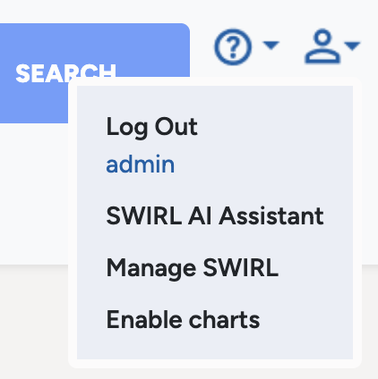
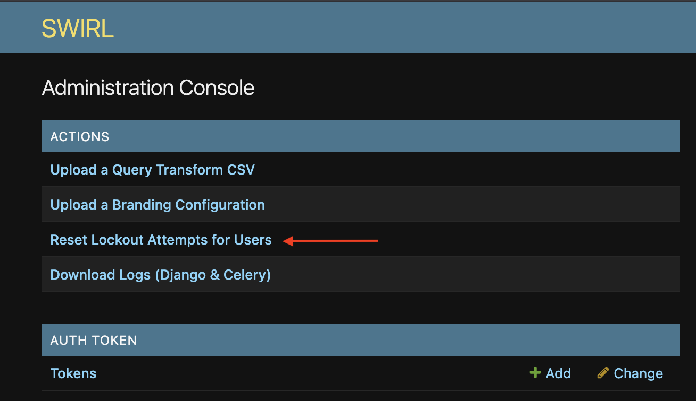
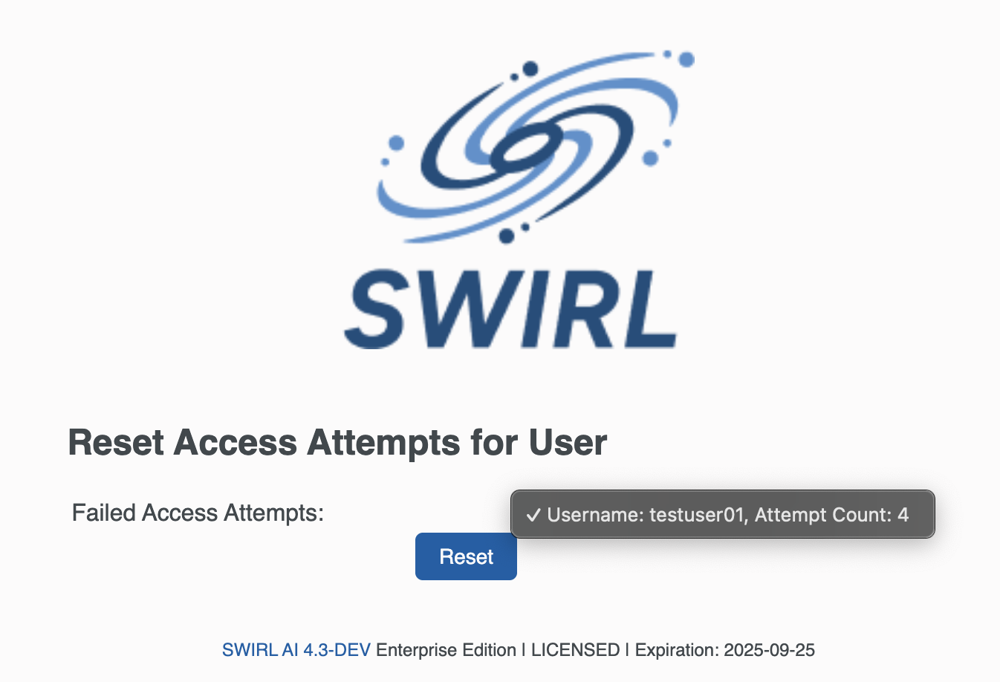

<details markdown="block">
  <summary>
    Table of Contents
  </summary>
  {: .text-delta }
- TOC
{:toc}
</details>

<span class="big-text">Admin Guide</span><br/><span class="med-text">Community Edition | Enterprise Edition</span>

---

# Configuring SWIRL AI Search

## Configuring the Environment

SWIRL uses **`django-environ`** to load critical settings from a file named **`.env`**.

- The **`.env.dist`** file contains **default settings**.
- If **no `.env` file exists**, the `install.sh` script **copies `.env.dist` to `.env`**.

**Example `.env` File:**

```shell
SECRET_KEY=your-secret-key
ALLOWED_HOSTS=localhost
PROTOCOL=http
SWIRL_EXPLAIN=True
SQL_ENGINE=django.db.backends.sqlite3
SQL_DATABASE=db.sqlite3
SQL_USER=user
SQL_PASSWORD=password
SQL_HOST=localhost
SQL_PORT=5432
MICROSOFT_CLIENT_ID=''
MICROSOFT_CLIENT_SECRET=''
MICROSOFT_REDIRECT_URI=''
OPENAI_API_KEY=
```

**Making Changes to `.env`**

To configure **hostname, protocol, or port**:

1. **Edit** the `.env` file.  
2. **Restart SWIRL** for changes to take effect.  

{: .warning }
There should **never be a `.env` file** in the SWIRL repo. When upgrading SWIRL, these settings **persist automatically**.

**Environment Variable Descriptions**

- **`SWIRL_EXPLAIN`** → Enables the [explain structure](./Developer-Guide#understand-the-explain-structure).  
- **`SECRET_KEY`** → A **cryptographic salt** used by Django. **Generate a new one for production**:  
  - [Django Signing Key Documentation](https://docs.djangoproject.com/en/4.1/topics/signing/)

## Creating a SWIRL Super User

To **reset the database**:

1. **Delete or rename** the `db.sqlite3` file.  
2. Run:

```shell
python swirl.py setup
```

This creates a **new blank database**.

To **create a Super User**, run:

```shell
python manage.py createsuperuser --email admin@example.com --username admin
```

## Changing the Super User Password

To **change the password** of an existing admin user:

```shell
python manage.py changepassword admin
```

{: .warning }
If the new password is **too simple**, Django will reject it.

For more details, see: [Django Admin and manage.py](https://docs.djangoproject.com/en/4.0/ref/django-admin/)

**Using the Django Admin**

To **change the Super User password via Django Admin**:

1. Go to: [http://localhost:8000/swirl](http://localhost:8000/swirl)  
2. Click **"CHANGE PASSWORD"**:

   

3. Enter a new password:

   

4. Click **"CHANGE MY PASSWORD"**.

## Adding Normal Users

Users can be managed via **Django Admin**:

```
http://localhost:8000/admin/
```

  

{: .highlight }
If using **OpenID Connect**, manual user creation is **not required**. See the [AI Search Guide](AI-Search#openid-connect) for details.

## Permissioning Normal Users

Each **SWIRL core object** (`SearchProviders`, `Search`, `Result`, `Query Transform`) has **four permissions**:

- **`add`** → Allows creation
- **`change`** → Allows modification
- **`delete`** → Allows removal
- **`view`** → Allows read-only access

  

**Recommended Permission Configurations**

| Scenario | SearchProvider | Search | Results | Query Transform |
|----------|--------------|--------|---------|----------------|
| **Admin** | ALL | ALL | ALL | ALL |
| **Search ONLY** | NONE | Add | | |
| **Result ONLY** | NONE | NONE | View | |
| **Search & View Results** | NONE | Add, View | Add, View | Add, View |
| **Manage Search (including re-run)** | NONE | ALL | ALL | ALL |
| **SearchProvider Admin** | ALL | Add | View | View |

## Object Ownership

**SearchProvider, Search, Result, and Query Transform objects** are **owned by the Django user** who creates them and are **private** by default.

## Shared SearchProviders and Query Transformations

- **By default, sharing is disabled (`false`)** for all users.
- **Django Super Users (`admin`)** have **sharing enabled (`true`)** by default.

This prevents users from needing to duplicate **SearchProviders** or **Query Transformations**.

**Managing Large User Groups**

For installations with **many users**, consider:

1. **Creating user groups** with predefined **permissions**.
2. **Assigning users** to the appropriate groups.

This simplifies **access control** and **reduces administrative overhead**.

# Deploying SWIRL for Production Use

The SWIRL application is designed to be deployed **behind a reverse-proxy** for optimal **scalability, security, performance, and availability**.

**Why Use a Reverse-Proxy?**

- **Scalability:**  
  - Enables **horizontal scaling** by distributing requests across multiple SWIRL servers.
  - **Dynamically provisions** additional VMs when demand increases.
  - **Deactivates** idle VMs to reduce hosting costs.

- **Security:**  
  - **SSL/TLS termination** at the reverse-proxy reduces CPU load on the application server.

- **Performance:**  
  - Separates **static content delivery** from the application server.  
  - Supports **Content Delivery Networks (CDN)** for faster response times.

- **Availability:**  
  - **Load balances** traffic across multiple backend SWIRL servers.  
  - **Monitors and removes** failed servers to maintain uptime.

**Recommended Reverse-Proxy Solutions**

- [HA Proxy](https://www.haproxy.org/)  
- [Nginx](https://nginx.org/en/)  
- [Azure Application Gateway](https://azure.microsoft.com/en-us/products/application-gateway)  
- [AWS Application Load Balancer](https://aws.amazon.com/elasticloadbalancing/application-load-balancer/)  

For deployment assistance, please [contact support](#support).  

# Upgrading SWIRL

## Local Installations

{: .warning }
For **Docker upgrades**, please [contact support](#support) for instructions!

1. **Update the `swirl-search` repository**:  
   ```shell
   git pull
   ```

2. **Run the install script**:  
   ```shell
   ./install.sh
   ```

3. **Set up SWIRL**:  
   ```shell
   python swirl.py setup
   ```

4. **If upgrading the Galaxy UI**, run:  
   ```shell
   ./install-ui.sh
   ```

5. **Update AI prompts**:
   ```shell
   python swirl.py reload_ai_prompts

6. **Update Authenticators**: 

   Check the release notes (see below) and update Authenticators that have changed.

   ```shell
   python manage.py load_authenticators swirl/fixtures/DefaultAuthenticators.json

7. **Update SearchProviders**:

   Check the release notes (see below) and only update SPs that have changed.

   ```shell
   python manage.py load_fixture SearchProviders/<searchprovider-name>
   ```

8. **Restart SWIRL**:  
   ```shell
   python swirl.py restart
   ```

{: .highlight }
Refer to the [release notes](https://github.com/swirlai/swirl-search/releases) for details on each update.

## Docker

Refer to the appropriate guide for your edition:
* [Quick Start Guide - Community](./Quick-Start.md) 
* [Quick Start Guide - Enterprise](./Quick-Start-Enterprise.md) 

## Resetting Prompts

To reset AI prompts to the **default settings**, run:

```shell
python swirl.py reload_ai_prompts
```
This restores **system prompts** to **factory settings** while keeping **custom prompts unchanged**.

## Resetting Authenticators 

To update all Authenticators:

```shell
python manage.py load_authenticators swirl/fixtures/DefaultAuthenticators.json
```

## Resetting SearchProviders 

To reset a specific SearchProvider:

```shell
python manage.py load_fixture SearchProviders/<searchprovider-name>
```

# Configuring SWIRL

SWIRL configuration is managed in: [`swirl_server/settings.py`](https://github.com/swirlai/swirl-search/blob/main/swirl_server/settings.py)

## Key Configuration Items

| Configuration Item | Explanation | Example |
|-------------------|-------------|---------|
| **CELERY_BEATS_SCHEDULE** | Defines the schedule for the [Search Expiration Service](#search-expiration-service) and [Search Subscriber Service](#search-subscriber-service) | See linked sections |
| **SWIRL_DEFAULT_QUERY_LANGUAGE** | Determines the stopword dictionary | `SWIRL_DEFAULT_QUERY_LANGUAGE = 'english'` |
| **SWIRL_TIMEOUT** | Time (in seconds) before terminating slow connectors | `SWIRL_TIMEOUT = 10` |
| **SWIRL_SUBSCRIBE_WAIT** | Timeout for updating a search | `SWIRL_SUBSCRIBE_WAIT = 20` |
| **SWIRL_DEDUPE_FIELD** | Field used for [duplicate detection](./Developer-Guide#detect-and-remove-duplicate-results) | `SWIRL_DEDUPE_FIELD = 'url'` |
| **SWIRL_DEDUPE_SIMILARITY_MINIMUM** | Minimum similarity score to classify as duplicate | `SWIRL_DEDUPE_SIMILARITY_MINIMUM = 0.95` |
| **SWIRL_DEDUPE_SIMILARITY_FIELDS** | Fields used for duplicate detection | `SWIRL_DEDUPE_SIMILARITY_FIELDS = ['title', 'body']` |
| **SWIRL_RELEVANCY_CONFIG** | Defines relevancy score weights for key fields | See below |
| **SWIRL_MAX_MATCHES** | Maximum matches per result (limits long articles) | `SWIRL_MAX_MATCHES = 5` |
| **SWIRL_MIN_SIMILARITY** | Minimum score required for query hits to be scored | `SWIRL_MIN_SIMILARITY = 0.54` |
| **SWIRL_EXPLAIN** | Enables relevancy explain structures in responses | `SWIRL_EXPLAIN = false` |

**Example `SWIRL_RELEVANCY_CONFIG`**

```shell
SWIRL_RELEVANCY_CONFIG = {
    'title': {
        'weight': 1.5
    },
    'body': {
        'weight': 1.0
    },
    'author': {
        'weight': 1.0
    }
}
```

{: .warning }
**All configuration items must be uppercase**, following the [Django settings convention](https://docs.djangoproject.com/en/4.1/topics/settings/).

# Search Expiration Service

The [Expirer](https://github.com/swirlai/swirl-search/blob/main/swirl/expirer.py) service **automatically deletes** expired **Search** objects and their associated **Result** objects. This prevents SWIRL from **retaining all past searches indefinitely**.

## Service Frequency

SWIRL allows **custom expiration settings** for Search and Result objects, but the expiration service runs on a **fixed schedule**.

- **By default, it runs every hour.**
- The schedule is defined in the [Django settings](https://github.com/swirlai/swirl-search/blob/main/swirl_server/settings.py):

```shell
CELERY_BEAT_SCHEDULE = {
    # Executes every hour
    'expire': { 
         'task': 'expirer', 
         'schedule': crontab(minute=0, hour='*'),
    },          
}
```

- Temporary changes can be made via the **Django Admin Console**:

  ```
  http://localhost:8000/admin/django_celery_beat/crontabschedule/
  ```

  

{: .warning }
**Enterprise Edition** supports a **5-minute expiration schedule**. Please [contact support](#support) for details.

{: .warning }
If you modify `crontab` in the **database** without updating **`CELERY_BEAT_SCHEDULE`**, the **original schedule will be restored** when SWIRL restarts.

# Search Subscriber Service

When a **Search object has `subscribe=True`**, SWIRL will **periodically update that Search**. See the [Developer Guide](./Developer-Guide#update-a-search) for more details.

- **By default, the service runs every 4 hours.**
- The schedule is defined in [Django settings](https://github.com/swirlai/swirl-search/blob/main/swirl_server/settings.py):

```shell
CELERY_BEAT_SCHEDULE = {
    # Executes every four hours
    'subscribe': { 
         'task': 'subscriber', 
         'schedule': crontab(minute=0, hour='*/4'),   
    },          
}
```

- Temporary changes can be made via the **Django Admin Console**:

  ```
  http://localhost:8000/admin/django_celery_beat/crontabschedule/
  ```

  

{: .warning }
If you modify `crontab` in the **database** without updating **`CELERY_BEAT_SCHEDULE`**, the **original schedule will be restored** when SWIRL restarts.

# Service Startup & Daemonization

## Using `swirl.py`

For normal operations, use **`swirl.py`** to **start, stop, or restart** services. This script is located in the **SWIRL installation directory** (next to `manage.py`).

**Starting Services**

```shell
python swirl.py start
```

To start **specific services**, specify them by name:
```shell
python swirl.py start celery-beats
```

**Checking Service Status**

```shell
python swirl.py status
```

Example output:
```shell
INFO 2025-03-01 19:59:55 settings Swirl Enterprise 4.1-DEV licensed to: SWIRL_Corporation

         .   o
        .        .   .  o  
        .      .                                    
  o        .  @ @   .            SWIRL AI ENTERPRISE 4.1-DEV
    .        @ @  .    .         Licensed to: SWIRL_Corporation
      .  . .   .     .    .
            .       .     o
     o  .       o .


Service: django...RUNNING, pid:34738
Service: celery-worker...RUNNING, pid:34767

  PID TTY           TIME CMD
34738 ttys005    0:56.97 /Library/Frameworks/Python.framework/Versions/3.12/Resources/Python.app/Contents/MacOS/Python /Library/Frameworks/Python.framework/Versions/3.12/bin/daphne -b 0.0.0.0 -p 8000 swirl_server.asgi:application
34767 ttys005    2:10.94 /Library/Frameworks/Python.framework/Versions/3.12/Resources/Python.app/Contents/MacOS/Python /Library/Frameworks/Python.framework/Versions/3.12/bin/celery -A swirl_server worker -Q default --without-heartbeat --without-gossip --without-mingle --loglevel=info --concurrency=15

Command successful!
```

**Stopping Services**

```shell
python swirl.py stop
```

**Restarting Services**

```shell
python swirl.py restart
```

To restart **specific services**, specify them by name:
```shell
python swirl.py restart celery-worker consumer
```

**Getting Help**

```shell
python swirl.py help
```

## Customizing

The services invoked by **`swirl.py`** are defined in: [swirl/services.py](https://github.com/swirlai/swirl-search/blob/main/swirl/services.py)

Modify this list to **automatically start `celery-beats`**.

# Disabling the Cookie Consent Notice in Galaxy

By default, the Cookie Consent Notice will appear for users in Galaxy until they accept it. 


To prevent the notice from appearing, add the following to the `.env` file:

```
COOKIE_CONSENT_DISPLAY=False
```

# Changing the Galaxy Logos and Branding

To **customize the logo, search button, and labels** in **SWIRL Galaxy**:

1. **Go to the SWIRL Admin Page**: [http://localhost:8000/admin/](http://localhost:8000/admin/)

   

2. **Click the "admin" link** to open the **Admin UI**:

   

3. **Click "Upload a Branding Configuration"** to go to the **Branding Configuration** page:

   

4. **Fill out the form**:
   - **"Name"** is required.
   - At least **one additional field** must be customized.
   - To change the **logo**, upload a **light mode image**.

**Branding Configuration Options**

| Item | Galaxy Location | Default |
|------|----------------|---------|
| **Name** | Not shown | N/A |
| **Search button label** | Search button text | `SEARCH` |
| **Search bar placeholder** | Placeholder text in search box | `"What are you searching for today?"` |
| **AI Response label** | Below search box | `"Generate AI Response"` |
| **Select items label** | Below paging control | `"Select Items"` |

5. **Click "Submit"** to save your branding changes.  
6. **Refresh your browser** to apply changes in **Galaxy UI**.

{: .warning }
Refreshing may start a **new RAG or chat session**.

## Logo File Suggestions

- **Format:** PNG  
- **Dimensions:** **818 × 214 px**  
- **Whitespace:** At least **30 px margin** around the logo

{: .warning }
Only **one branding configuration** can be **active at a time**.

## Restoring a Previous Branding Configuration

SWIRL displays the last updated branding configuration. To make a previous configuration active:

1. **Go to the SWIRL Admin Page**: [http://localhost:8000/admin/](http://localhost:8000/admin/)

2. **Scroll down to Branding Configurations** under the **SWIRL** section. **Click it**.

3. **Click on a previous configuration**. Then **click SAVE** at the bottom of the form. No actual changes need to be made.

Reload Galaxy in the browser. The saved branding configuration will appear, replacing the previous one.

# Managing Django Users

## Django Admin

Most users can be managed through **Django Admin**, accessible at:

```
http://localhost:8000/admin/
```

For more details, watch this **[YouTube video on Django Administration](https://youtu.be/jCihWwrwS-w?si=QVtZXR7j9PRszQW1&t=174)**.

## Changing a User's Password

To change a user's password via the command line:

```shell
python manage.py changepassword <user_name>
```

## Unlocking a Locked Account

1. Login to the SWIRL UI with a different [superuser account](#creating-a-swirl-super-user). 

2. Open the user profile icon in the top right corner, and click the `Manage SWIRL` link: 

3. From the new tab that opens, click the `Admin` link to enter the Django Admin area. 

3. In the top left corner, click on the “Reset Lockout Attempts for User” option: 

4. In the new tab that opens, select the “admin” user from the list of locked out accounts. (In the example above, we are unlocking the user `testuser01`.) With the user selected, click the `Reset` button on this page: 

5. Return to main SWIRL UI tab, and select the User Profile icon again. Click `Logout` for the superuser account. 

6. This returns you to the SWIRL login page where you should be able to login again with the `admin` user, now unlocked!

# Management Tools

## Django Console

Django provides a **web-based UI** for managing **users, groups, crontabs, and more**.

  

Access it here: [http://localhost:8000/admin/](http://localhost:8000/admin/)

For an in-depth tutorial, watch this **[YouTube playlist on Django Admin](https://www.youtube.com/watch?v=c_S0ZQs81XQ&list=PLOLrQ9Pn6cazhaxNDhcOIPYXt2zZhAXKO)**.

## Django dbshell

Django has a built-in shell for **direct database management**. Run it inside the **`swirl-search` directory**:

```shell
./manage.py dbshell
```

## Wiping the Database

To **delete all SWIRL objects** and reset the database:

```shell
python manage.py flush
```

**This will remove all data permanently.**

{: .warning }
You must **[create a new SWIRL Super User](#creating-a-swirl-super-user)** after doing this.

## `sqlite-web`

[`sqlite-web`](https://github.com/coleifer/sqlite-web) provides an **open-source web-based GUI** for SQLite.

**Installation & Usage**

```shell
pip install sqlite-web
sqlite_web my_database.db                   # Runs locally at http://localhost:8080/
sqlite_web --host 0.0.0.0 my_database.db    # Run it on the LAN
```

Use the **full path** to `db.sqlite3` in `swirl-search` when running `sqlite-web`.

# Database Migration

If you modify **`swirl/models.py`**, you must run a **database migration**.

**Basic Migration Command**
```shell
python swirl.py migrate
```

For more details, see:  [https://docs.djangoproject.com/en/4.0/topics/migrations/](https://docs.djangoproject.com/en/4.0/topics/migrations/)

**General Migration Guidelines**
- **Adding fields or changing defaults** is **usually simple**.
- If renaming an `id` or modifying relationships, **consider wiping existing data first** (`sqlite-web` can help).

**If Migration Fails**

1. Delete `db.sqlite3`
2. Delete all files in `swirl/migrations/`
3. Run:
   ```shell
   python manage.py flush
   ```
4. Repeat the migration process.

{: .warning }
After **flushing the database**, don't forget to **[create a SWIRL Super User](#creating-a-swirl-super-user)**.

# Configuring Django

SWIRL's **Django configuration** is managed in:  
[`swirl_server/settings.py`](https://github.com/swirlai/swirl-search/blob/main/swirl_server/settings.py)

## Key Configuration Items

**Hostname & Protocol**

```shell
# Set the Fully Qualified Domain Name (FQDN) first
ALLOWED_HOSTS = ['localhost']
HOSTNAME = ALLOWED_HOSTS[0]
PROTOCOL = 'http'
```

{: .highlight }
**The FQDN SWIRL should listen on must be the first entry in `ALLOWED_HOSTS`.**

**Time Zone**

```shell
TIME_ZONE = 'US/Eastern'
CELERY_TIMEZONE = "US/Eastern"
CELERY_TIME_ZONE = "US/Eastern"
```

**Celery Beats**

Celery-Beats is used for scheduled services like the **[Search Expiration Service](#search-expiration-service)** and the **[Search Subscription Service](#search-subscriber-service)**.

```shell
CELERY_BEAT_SCHEDULE = {
    # Executes every hour
    'expire': { 
         'task': 'expirer', 
         'schedule': crontab(minute=0, hour='*'),
    },          
}
```

**Database Provider**

```shell
DATABASES = {
    "default": {
        "ENGINE": os.environ.get("SQL_ENGINE", "django.db.backends.sqlite3"),
        "NAME": os.environ.get("SQL_DATABASE", BASE_DIR / "db.sqlite3"),
        "USER": os.environ.get("SQL_USER", "user"),
        "PASSWORD": os.environ.get("SQL_PASSWORD", "password"),
        "HOST": os.environ.get("SQL_HOST", "localhost"),
        "PORT": os.environ.get("SQL_PORT", "5432"),
    }
}
```

{: .warning }
The following sections apply **only** to SWIRL Community Edition. For Enterprise Edition instructions view the [AI Connect Guide](AI-Search#postgresql-configuration).

## Configuring PostgreSQL as the Database Backend

1. **Install PostgreSQL** (if not already installed).  
2. Ensure `pg_config` is in your **`PATH`** and runs from the command line.  
3. Install the PostgreSQL driver:

```shell
pip install psycopg2
```

4. **If you are using the PostgreSQL connector** in these files:

**`swirl/connectors/__init__.py`**
```shell
# Uncomment this line to enable PostgreSQL
# from swirl.connectors.postgresql import PostgreSQL
```

**`swirl/models.py`**
```shell
CONNECTOR_CHOICES = [
    ...
    # Uncomment the line below to enable PostgreSQL
    # ('PostgreSQL', 'PostgreSQL'),
    ...
]
```

For further setup, follow the **[Django Database Configuration Guide](https://docs.djangoproject.com/en/4.1/ref/databases/)**.

# Configuring Celery & Redis

SWIRL uses **Celery** for executing metasearch requests asynchronously, with **Redis** as the backend.

{: .warning }
Celery is **configured in at least three locations**. They **must be consistent**!

**1. `swirl_server/celery.py`**
```shell
app = Celery('swirl_server', 
             broker='redis://localhost:6379/0', 
             backend='redis://localhost:6379/0')
```

To verify the setup, run Celery from the command line:

```shell
> transport:   amqp://guest:**@localhost:6379//
- ** ---------- .> results:     rpc://
```

**2. `swirl_server/settings.py` (Django Settings)**

```shell
# Celery Configuration Options
CELERY_TIMEZONE = 'US/Eastern'
CELERY_TASK_TRACK_STARTED = True
CELERY_TASK_TIME_LIMIT = 30 * 60
CELERY_BEAT_SCHEDULE = {
    'expire': {
         'task': 'expirer',
         'schedule': crontab(minute=0, hour='*'),
    },
    'subscribe': {
         'task': 'subscriber',
         'schedule': crontab(minute=0, hour='*/4'),
    },
}
CELERY_BROKER_URL = 'redis://localhost:6379/0'
CELERY_RESULT_BACKEND = 'redis://localhost:6379/0'
```

# Security

## The Django Secret Key

Django's `SECRET_KEY` is a **cryptographic salt** used for security. If changed, active users will need to log in again.

To generate a new secret key:

```shell
python -c "import secrets; print(secrets.token_urlsafe())"
```

For more details: **[Django Secret Key Guide](https://stackoverflow.com/questions/7382149/whats-the-purpose-of-django-setting-secret-key)**.

# SWIRL User & Group Support

Django provides **built-in authentication** with **User and Group objects**. These can be managed via the **Django Console** or API.

**User Management API**

| URL | Explanation |
|-----|------------|
| `/swirl/users/` | List User objects & create new users |
| `/swirl/users/id/` | Retrieve, delete, or edit a User object |

**Group Management API**

| URL | Explanation |
|-----|------------|
| `/swirl/groups/` | List Group objects & create new groups |
| `/swirl/groups/id/` | Retrieve, delete, or edit a Group object |

Alternatively, use the **[Django Console](#django-console)**:
  

For additional details, see **[User Authentication in Django](https://docs.djangoproject.com/en/4.0/topics/auth/)**.
