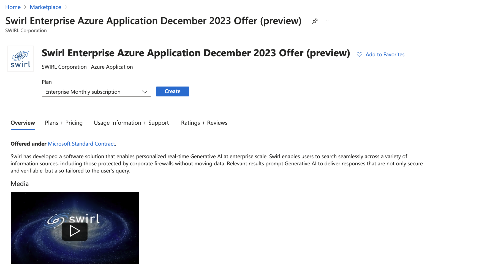
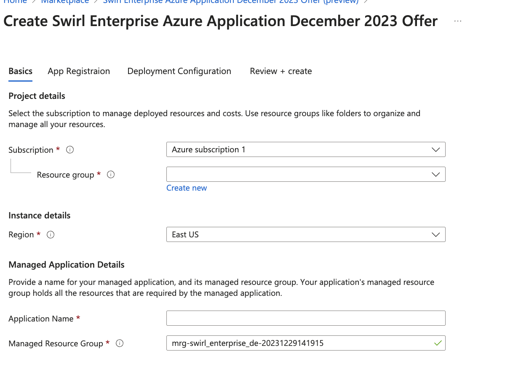
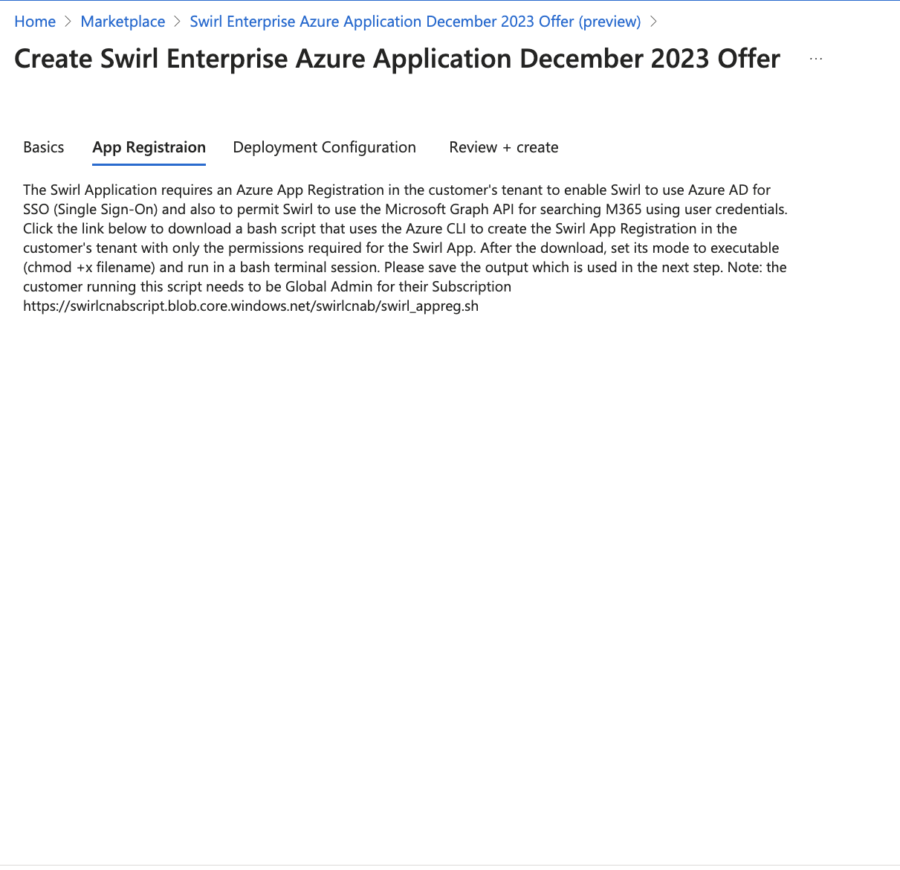
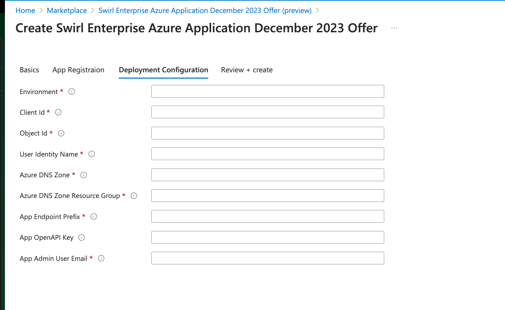
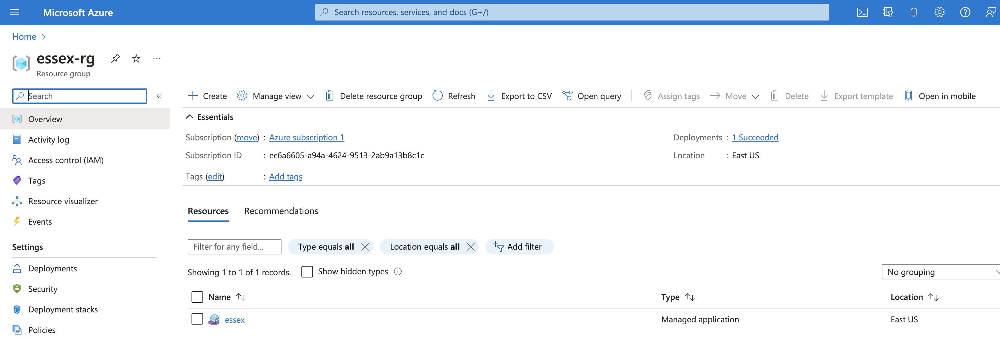

  

    Table of Contents
  

  {: .text-delta }
- TOC
{:toc}

# Azure Marketplace Guide

{: .warning }
The user performing this installation must be an authorized M365 tenant Administrator. 

* [Visit the offer page](https://go.swirl.today/azure)

* Click the "Get It Now" button, and on the following screen, select a "Plan" option and click the blue "Create" button.

* Click into the "Basics" tab. Select an Azure "Subscription", specify a "Resource Group" (optional), select a Region, provide an Application Name of your choosing, and the Manged Resource Group name. 

* Click into the "App Registration" tab and read the instructions provided there.

* Download the script using the link at the bottom of the "App Registration" tab and run it in the target installation tenant.

{: .highlight }
Save the script output, as it will be required for the next step!

* Click into the "Deployment Configuration" tab. Fill out the form, including all required values, using the values reported by the script from the previous step.

| Field | Explanation | 
| ----- | ----------- | 
| Environment | Descriptive name to identify the intended deployment release such as `dev`, `testing`, `qa`, or `production` |
| Client ID | Value provided by the `swirl_appreg.sh` script |
| Object ID | Value provided by running the `az` command found in the tooltips: `az ad signed-in-user show --query id -o tsv` |
| User Identity Name | Value provided by the `swirl_appreg.sh` script |
| Azure DNS Zone | The existing DNS Zone the application will be deployed in (e.g.: `example.com`) |
| DNS Zone Resource Group | Value required for Swirl to automatically update the DNS Zone swirl will be registered in. Search your Azure DNS Zones for the appropriate Zone name to identify the the Resource Group this `zonefile` is associated with. |
| App Endpoint Prefix | The DNS A Record name of the host where Swirl will be deployed (e.g.: `swirl.example.com`) |
| OpenAI API Key | Allows Swirl to connect and use an OpenAI account via the API | 
| App Admin User Email | The email of the user registering/deploying this application |

* When all of the above steps are completed, click the "Review + create" tab. 

# Questions

If you encounter errors or warnings, please contact support for assistance (see below).
