<details markdown="block">
  <summary>
    Table of Contents
  </summary>
  {: .text-delta }
- TOC
{:toc}
</details>

<span class="big-text">Google Workspace Guide</span><br/><span class="med-text">Enterprise Edition</span>

{: .warning }
Please [contact SWIRL](mailto:hello@swirlaiconnect.com) for access to SWIRL Enterprise.

---

This guide explains how to integrate SWIRL with an existing **Google Workspace (GW) tenant**. It is intended for **GW administrators** who have permission to **register new applications** in the **GW Portal**.  

Administrators may also need to **grant API permissions** so users can **query their personal GW content** through SWIRL.

# Register a New App in GW Portal

To connect **SWIRL** to an **GW tenant**, first, **register and configure a new App** in the **GW Portal**.

Once registered, the App allows:

- **User authentication via OIDC**
- **Personal GW content searches using OAuth2 permission consent**

## Before You Begin

Ensure you have the following details about your **SWIRL deployment**:

- **`swirl-host`** – The **fully qualified domain name** of your SWIRL instance.  
- **`swirl-port`** – The **port SWIRL runs on** (**only needed** if different from the default).  

Example:  
If your deployment is **`search.swirl.today`**, the `swirl-host` is **`search.swirl.today`**.

## HTTPS Requirement

To use **OIDC** and **OAuth2** with Google, your deployment **must use** `https` (except when using `localhost`, where `http://` is allowed).

Single-Page Applications and Web Protocols in GW Applications require `https://` for fully qualified domains.

## Registration Procedure

1. Log in to the Google API Console as an Admin user: [https://console.developers.google.com/](https://console.developers.google.com/)

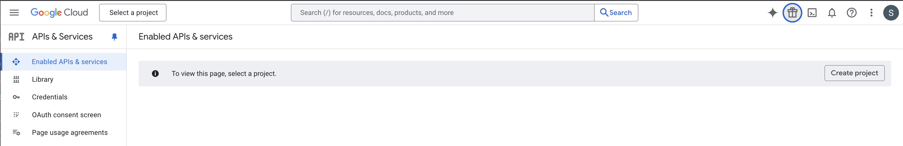

2. Create a new project in the API console

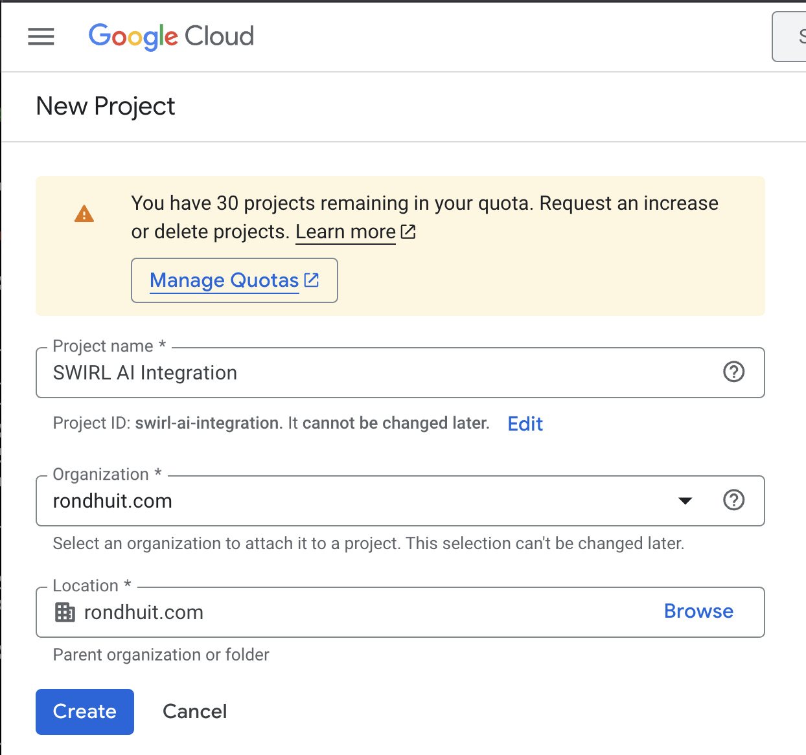

3. Once the project has been created, select it.

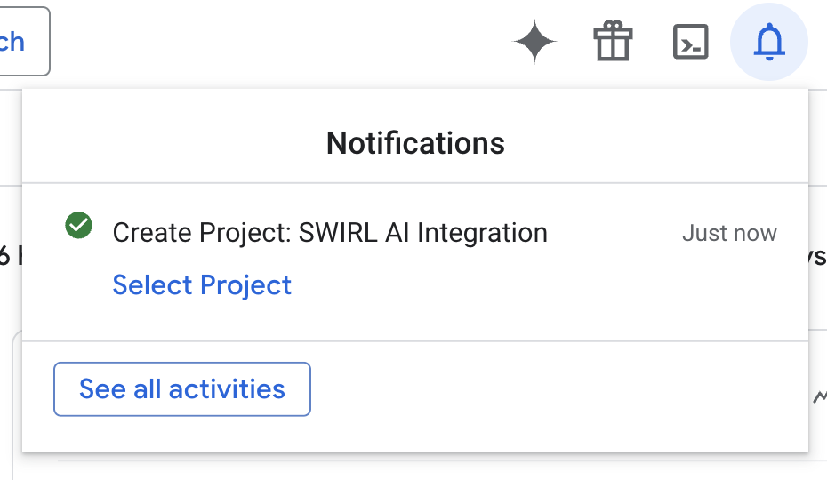

4. The next step is to enable the necessary APIs in the project. Click the `Enable APIs and services` near the top of the page:

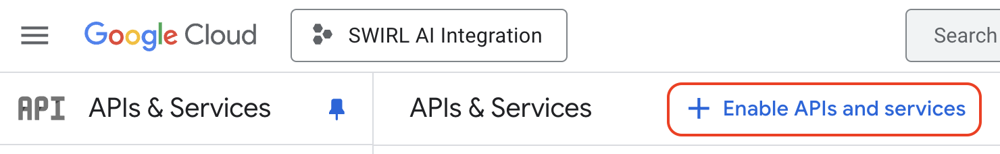

5. Search for the `gmail app`:

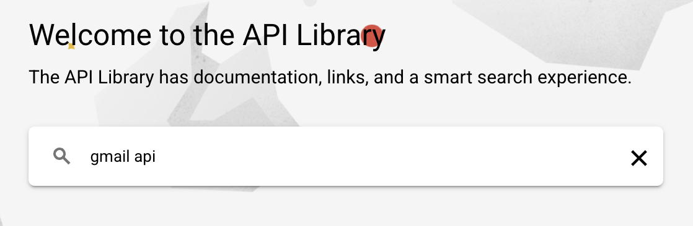

6. Select the "GMail API" option from the results list:

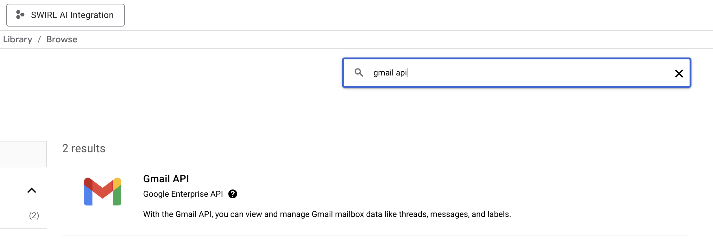

7. Click the "Enable" button on the "Gmail API" details page:


8. A confirmation page should appear:

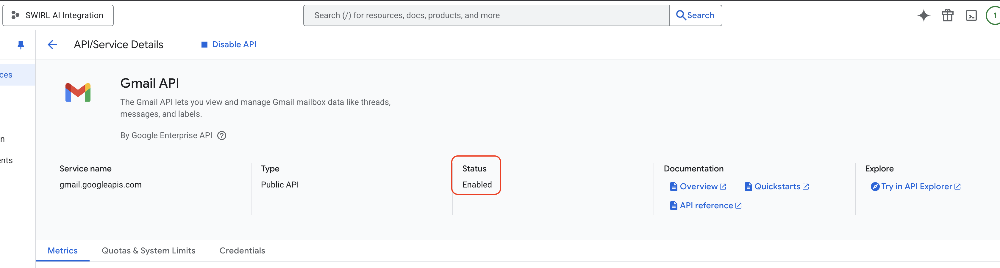

9. Repeat steps 5 - 8 for each of the following APIs:

Complete this process for the following APIs:

* Google Drive API
* Google Calendar API
* Google People API

10. The next step is to create credentials for the selected APIs.

Google will likely suggest this as soon as you save changes.

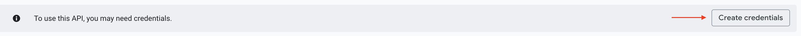

Click the "Create credentials" button. Alternately, if it does not suggest this, click the `Credentials` link in the left-side menu of the page. 

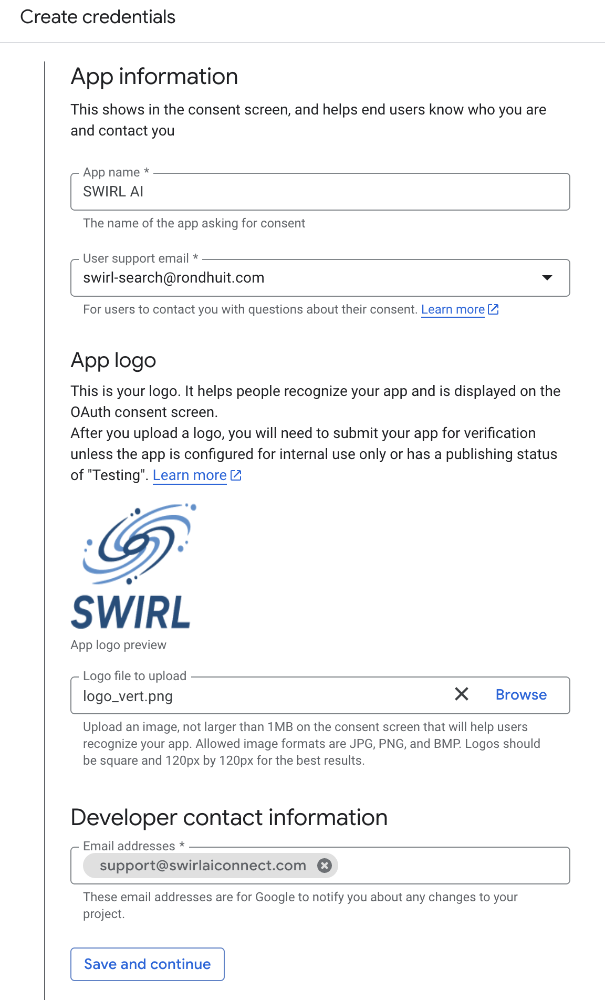

In the "Credential Type" dialog, make sure all of the APIs appear in the "Which API are you using?" dropdown list. Then, select the "User Data" option under the "What data will you be accessing?" frame below that.

Then, click the "Next" button.

Finally, on the "OAuth Consent Screen" that follows, fill in the "App information", "App logo", and "Developer contact information" as appropriate.

Click the "Save and continue" button to save changes.

11. On the "Scopes (optional)" screen that follows, click the "Add or remove scopes" button:

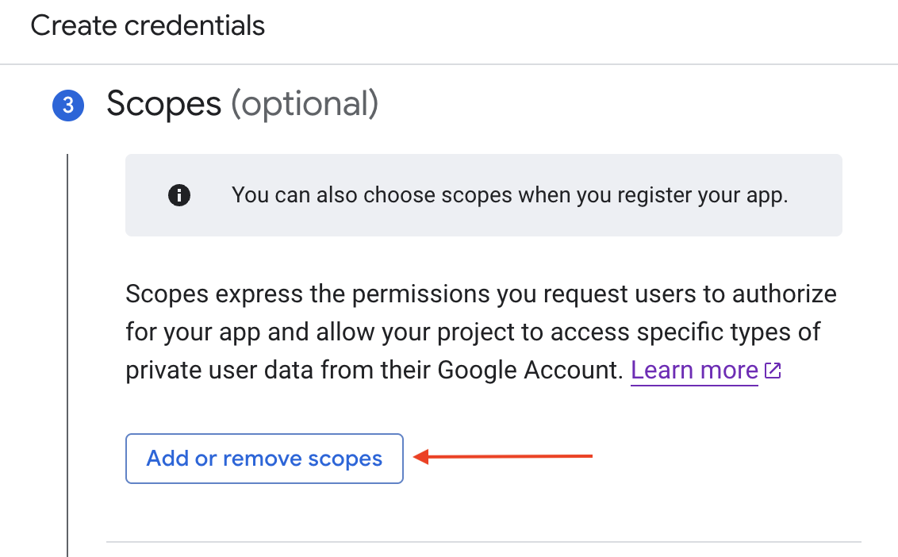

On the "Update selected scopes" screen that opens, scroll through the list and select the following scopes:

* Gmail API - https://www.googleapis.com/auth/gmail.readonly
* Google Drive API - https://www.googleapis.com/auth/drive.readonly
* Google Calendar API - https://www.googleapis.com/auth/calendar.readonly
* Google People API:
* For "My Contacts" - https://www.googleapis.com/auth/contacts.readonly
* For "Other Contacts" - https://www.googleapis.com/auth/contacts.other.readonly

If any of these scopes don't appear in the table listing -- the Gmail API scope, for example -- add it under the "Manually add scopes" section at the bottom and click the "Add to table" button.

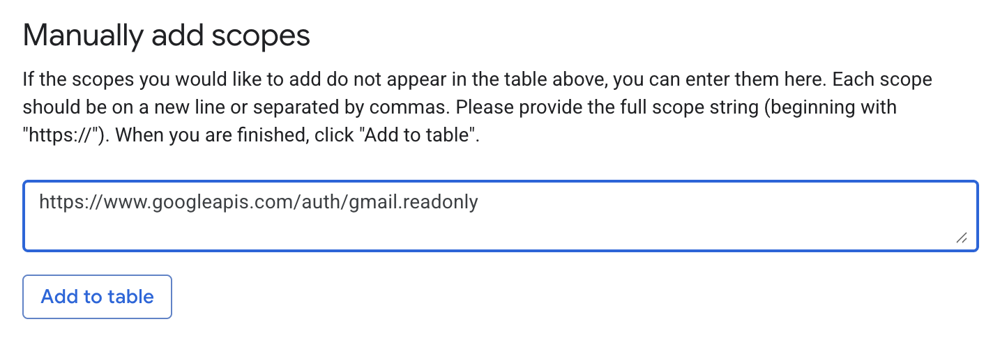

Once all of the necessary scopes have been added, click the "Update" button at the bottom of the table.

Each of the scopes will now appear in their appropriate "Data Access" sections of the "Create Credentials" workflow. 

Click the "Save and continue" button at the bottom of the workflow to continue.

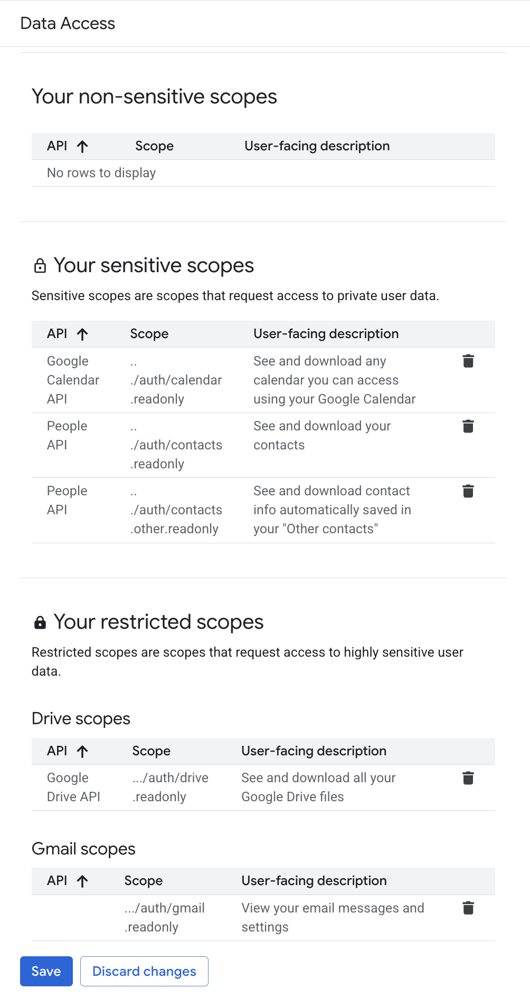

12. On the "OAuth Client ID" screen that appears next:

* Under the "Application type" menu, select: Web Application

* In the "Name" input box, enter a name for your OAuth2 client

* Under the "Authorized redirect URIs" section, add at least one Redirect URI. 

This entry will map directly to an Authenticator configuration in your SWIRL AI instance. Enter a valid domain, including `localhost:8000` for testing if desired, and append this path after each entry: `/swirl/callback/google-callback`

For example "Authorized redirect URI" entry: http://localhost:8000/swirl/callback/google-callback

Click the Create button when ready.

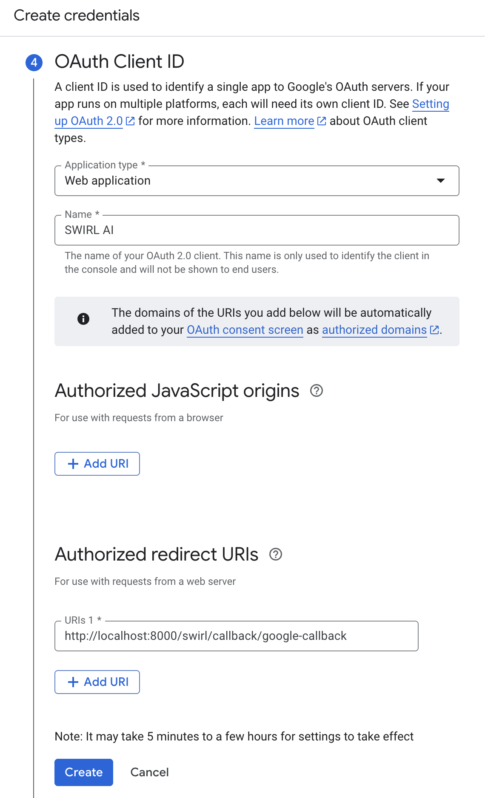

In the "Your Credentials" that appears after the redirect URIs are created, find the "Client ID", download it and store it safely. This value will be needed for Authenticator configuration in SWIRL AI. 

Click the "Done" button when the Client ID value has been saved locally.

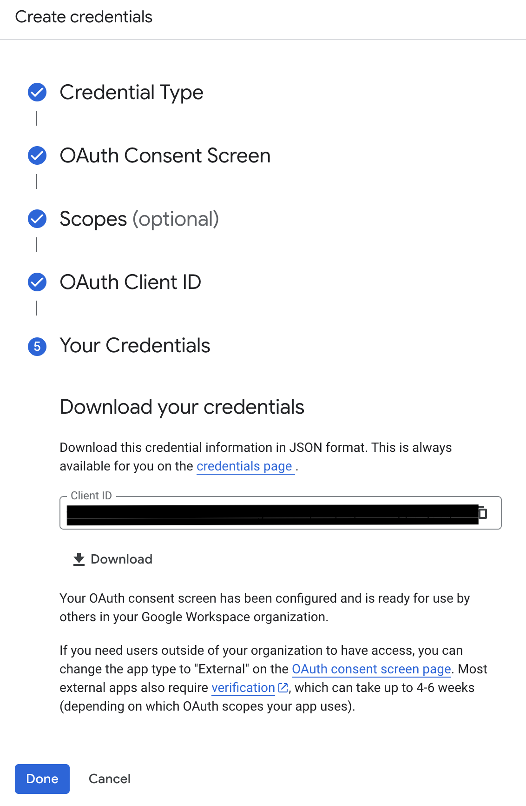

13. Download and securely store the Client Secret

To find the Client Secret for the new app, click the "Clients" link on the left side of the page, and then click on the app's name under the "OAuth 2.0 Client IDs" section:

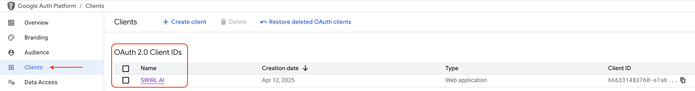

On the "Client ID for Web application" page that follows, locate the "Client Secret" entry in the right-side column, download or copy that value, and store it safely alongside the Client ID value from the prior step.

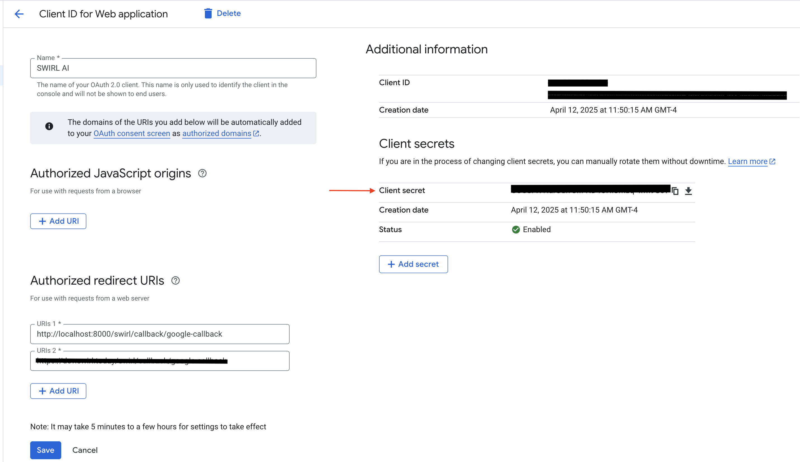

Click the "Save" button - or "Cancel", if you changed values on this screen - after storing the Client Secret value locally.

# Configure the Google Authenticator

SWIRL includes a preconfigured **Google Workspace Authenticator**, here: <http://localhost:8000/swirl/authenticators/Google/>

* Update the Authenticator `client_id`
* Update the Authenticator `client_secret`
* Update the Authenticator `app_uri` value with the host and port of the SWIRL installation
* Update the Authenticator `callback_path` with the rest of the callback location
* Update the Authenticator `active` value to `true`.

{: .highlight }
Note: the `app_uri` plus `callback_path` must match one of the Redirect URIs configured above.

{: .highlight }
Do not include a trailing slash in the `app_uri` value!

```json
{
    "idp": "Google",
    "name": "Google",
    "active": true,
    "callback_path": "/swirl/callback/google-callback",
    "client_id": "<Your-Client-ID>",
    "client_secret": "<Your-Client-ID>",
    "app_uri": "http://localhost:8000",
    "auth_uri": "https://accounts.google.com/o/oauth2/v2/auth",
    "token_uri": "https://oauth2.googleapis.com/token",
    "user_data_url": null,
    "user_data_params": {},
    "user_data_headers": {
        "Authorization": "Bearer {access_token}"
    },
    "user_data_method": "GET",
    "initiate_auth_code_flow_params": {},
    "exchange_code_params": {
        "client_id": "{client_id}",
        "grant_type": "authorization_code",
        "client_secret": "{client_secret}"
    },
    "is_code_challenge": true,
    "scopes": "https://www.googleapis.com/auth/gmail.readonly https://www.googleapis.com/auth/drive.readonly https://www.googleapis.com/auth/calendar.readonly https://www.googleapis.com/auth/contacts.readonly https://www.googleapis.com/auth/contacts.other.readonly",
    "should_expire": true,
    "use_basic_auth": true,
    "expires_in": 0
}
```

Click the `PUT` button to save the modified Authenticator.

# Configuring OIDC for Google

To enable OIDC ("Login with Google"), locate and copy the following values from the just completed application registration:
- **`<application-id>`**
- **`<tenant-id>`**
- **`<oidc-callback-url>`**

From the SWIRL home directory, open the `static/api/config/default` file within in an editor and locate the `oidcConfig` section:

```
"oidcConfig": {
   "Google": {
      "active": false,
      "clientId":  "<google-client-id>.apps.googleusercontent.com",
      "redirectUri": "http://<swirl-host>:<swirl-port>/galaxy/oidc-callback",
      "scope": "openid email profile"
   }
},
```

Add the values from your GW App Registration to the `Google` section. Also, set the `active` value to `true`.

# Activate the Google Workspace SearchProviders

The **SWIRL distribution** includes pre-configured **SearchProviders** for:

- **Google Mail (GMail)**  
- **Google Calendar**  
- **Google Drive**  
- **Google Chat**  

{: .highlight }
> - **Google Mail** – Only the **latest** messages are shown.  
> - **Google Calendar** – Only **recent** events are shown.  
> - **Google Drive** – **Folders are omitted**; only documents appear.  
> - **Google Chat** – **Only chat messages** are indexed. Files shared in chats appear in **Google Drive results**.

To **Enable Google Workplaces** do the following:

1. **Open the Admin Console**:  
   [http://localhost:8000/swirl/](http://localhost:8000/swirl/)

2. **Access SearchProviders**:  
   Click **`SearchProviders`** to view all configured providers.

3. **Find and Edit a Google Workspace SearchProvider:**  
   Each GW app has its own **SearchProvider** entry.  
   - To edit a provider, add its `id` to the URL.  
   - Example: If the **id** is `16`, navigate to:  
     [http://localhost:8000/swirl/searchproviders/16/](http://localhost:8000/swirl/searchproviders/16/)

4. **Activate the Provider:**  
   - Scroll to the **Raw data** tab at the bottom.
   - Change `"active": false` → `"active": true`

   **Before:**  
   ```json
   {
     "id": 16,
     "name": "Google Mail",
     ...
     "active": false,
     ...
   }
   ```

   **After:**  
   ```json
   {
     "id": 16,
     "name": "Google Mail",
     ...
     "active": true,
     ...
   }
   ```

## Restart SWIRL

```shell
python swirl.py restart
```

# Login to SWIRL using Google Workspace

The SWIRL login page should now contain a `Login with Google` button.

   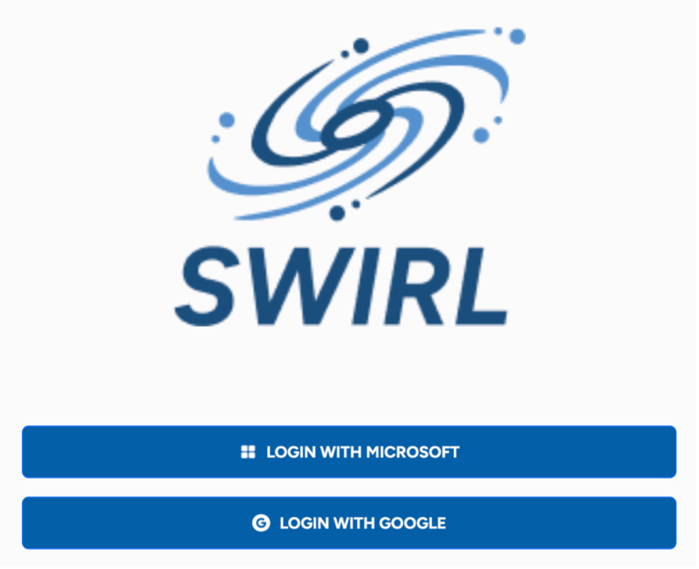

Clicking this button should log the user into SWIRL using the configured Google Workspace tenant. Both the AI Search and AI Search Assistant profile pages should show a Google switch:

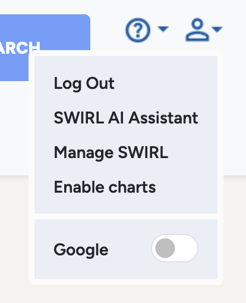

Google may ask for consent the first time, depending on tenant configuration. 


Click "Allow" to be redirected back to SWIRL. The Google switch should now be "on".

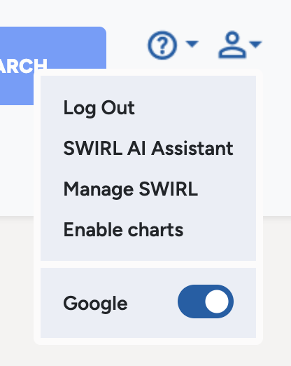

The user should now be able to search the configured Google properties using the source selector in the search form:


The Search Assistant will also be able to search those sources on the user's behalf.

# Related Documentation

- [Google Workplace - Using OAuth 2.0 for Web Server Applications](https://developers.google.com/identity/protocols/oauth2/web-server) 