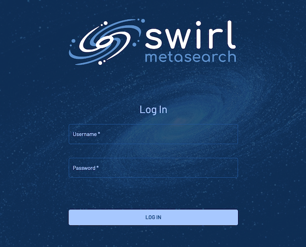
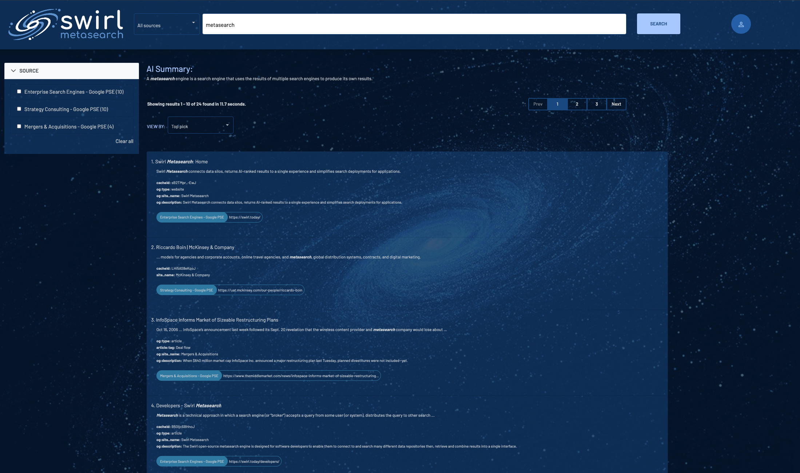
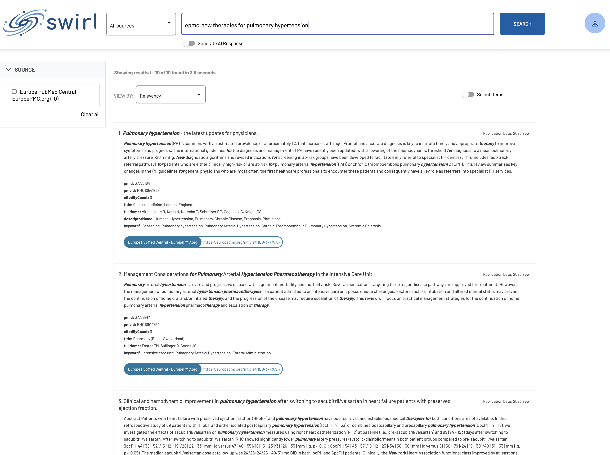
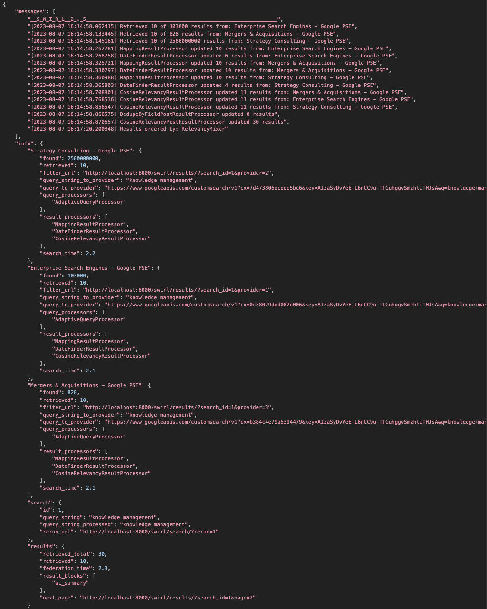

<details markdown="block">
  <summary>
    Table of Contents
  </summary>
  {: .text-delta }
- TOC
{:toc}
</details>

# Installation Guide - Enterprise Edition

{: .warning }
This document applies only to SWIRL AI Connect and AI Co-Pilot, Enterprise Editions.

{: .warning }
SWIRL's start-up process no longer starts `redis`.  You must now have `redis` installed *and running* before starting SWIRL.

# System Requirements

* Platform - Ubuntu, RHEL, or OS/X; Note: Windows is not supported for local installation
* 8+ VCPU, 16+ GB of memory
* At least 500 GB of free disk space
* Python 3.11 or newer

## MacOS

* Python 3.12.x (or latest stable) with `pip`
    * If necessary, modify the system PATH so that Python runs when you type `python` at the Terminal (not `python3`)
    * [venv](https://docs.python.org/3/library/venv.html) (*optional*)
    * [pyenv](https://github.com/pyenv/pyenv) (*optional*)
* [Homebrew](https://brew.sh/) installed and updated
* Redis installed:
 ``` shell
 brew install redis
 ```
* jq installed:
``` shell
brew install jq
```
* Redis must be running

## Linux

* Python 3.12.x (or latest stable) with `pip`
* Redis and jq installed:
``` shell
sudo apt install jq redis-server -y
```
* Redis must be running

## Windows

{: .warning }
SWIRL is *not* supported for local installation or production use on Windows!

## PostgreSQL (optional)

If you wish to use PostgreSQL as a data source or as the SWIRL back-end database:

1. Install [PostgreSQL](https://www.postgresql.org/)

2. Modify the system PATH so that `pg_config` from the PostgreSQL distribution is accessible from the command line

3. Install `psycopg2` using `pip`:
``` shell
pip install psycopg2
```

## Installing SWIRL AI Connect

To install SWIRL AI Connect locally, SWIRL will provide a unique GitHub URL. 

* Clone the repo:

``` shell
git clone <unique-github-url> swirl-enterprise
cd swirl-enterprise
```

* To install SWIRL on MacOS, execute this command from the Console:

``` shell
./install.sh
```

* To install SWIRL on Linux, execute this command from the Console:

``` shell
apt-get update --allow-insecure-repositories -y && apt-get install apt-file -y && apt-file update && apt-get install -y python3-dev build-essential
./install.sh
```

{: .warning }
Issues with certifications on OS/X? See: [urllib and "SSL: CERTIFICATE_VERIFY_FAILED" Error](https://stackoverflow.com/questions/27835619/urllib-and-ssl-certificate-verify-failed-error/42334357#42334357)

## Setup SWIRL

* Execute the following command from the Console to setup SWIRL:

``` shell
python swirl.py setup
```

## Install the Galaxy UI

{: .warning }
To install the Galaxy UI, you must have the latest [Docker app](https://docs.docker.com/get-docker/) for MacOS or Linux installed and running locally.

* To install Galaxy, execute the following command the Console (with the Docker app running):

``` shell
./install-ui.sh
```

{: .highlight }
The Galaxy UI components should be installed only *after* running the `./install.sh` and `python swirl.py setup` commands.

## Start SWIRL

* Execute the following command from the Console to start SWIRL:

``` shell
python swirl.py start
```

## Open the SWIRL Homepage

* Enter this URL into a browser: <http://localhost:8000/swirl/>

The following page should appear:


## Enable AI Features

* To enable SWIRL's Real-Time Retrieval Augmented Generation (RAG) in AI Connect and AI Co-Pilot, please refer to the [AI Connect Guide](AI-Connect.html) for more information. 

## Open the Galaxy UI

* Open this URL with a browser: <http://localhost:8000> (or <http://localhost:8000/galaxy/>)

If the search page appears, click `Log Out` at the top, right. The SWIRL login page will appear:



* Enter the username `admin` and password `password`, then click `Login`.

* Enter a search in the search box and press the `Search` button. Ranked results appear in just a few seconds:



* Click the `Generate AI Insight` button to RAG using the most relevant results, if you have specified an OpenAI key as noted earlier.



* Click the profile avatar in the upper right corner of the Galaxy UI. Then click [Manage SWIRL](http://localhost:8000/swirl/) to explore the rest of SWIRL's features.

* To view the raw result JSON, click `Search` under the API section of the `Manage SWIRL` page linked above, or open <http://localhost:8000/swirl/search/>

The most recent Search object will be displayed at the top. Click on the `result_url` link to view the full JSON Response. For example:



* Read the [SWIRL Enterprise User Guide](User-Guide-Enterprise.html) for additional information.
