<details markdown="block">
  <summary>
    Table of Contents
  </summary>
  {: .text-delta }
- TOC
{:toc}
</details>

# Microsoft 365 Guide

This guide details how to integrate SWIRL with an existing Microsoft 365 (M365) tenant. It is intended for use by M365 Administrators with authority to add a new App Registration in their Azure Portal and optionally grant permissions for various APIs as noted below on behalf of users who wish to use SWIRL to query their personal M365 content.

# Register a New App in Azure Portal

To connect a SWIRL installation to an M365 tenant, a new App must be registered and configured in the Azure Portal.

After the new App is configured, you can use it to authenticate users with OIDC and allow them to search their personal M365 content using OAUTH2 permissions consent.

## Before You Begin
You will need the following information about your SWIRL deployment:

* `swirl-host`
* `swirl-port` (if it is something other than the default)

In the examples below, the `swirl-host` is the fully qualified domain of `search.swirl.today` in which 'search' is the actual host.

In order to use OIDC and OAUTH2, your deployment must be using `https`, the only exception being where localhost is used as the host (one can use `http://` in this case). It is important to keep in mind that the URLs for Single Page Applications and Web Protocols do not permit Fully Qualified Domains without `https://`.

## Getting Started

* Login to the Azure Portal with an administrator account.  <https://portal.azure.com/>

* In the search box at the top of the Azure Portal homepage, search for: `app registrations` and click the `App registrations` result under "Services":

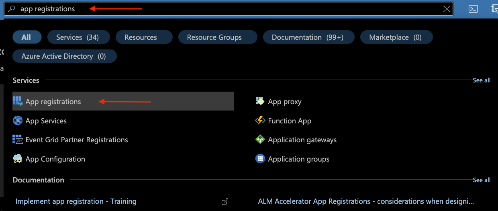

## Create the New App

* To create a new App, select the `New registration` option at the top of the "App registrations" page:

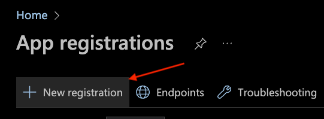

* On the "Register an application" page:
  * In the `Name` section, enter a name for the App (e.g.,`SWIRL App`)
  * Under "Supported account types", select the following option: `Accounts in this organizational directory only (MSFT only - Single tenant)`
  * Add "Redirect URI" for a Web application:
    * Platform: `Web`
    * Value:  `https://<swirl-host>[:<swirl-port>]/swirl/microsoft-callback`
  * Click on `Register` to create the application: 
* The "Overview" page for the newly created App should look similar to this: 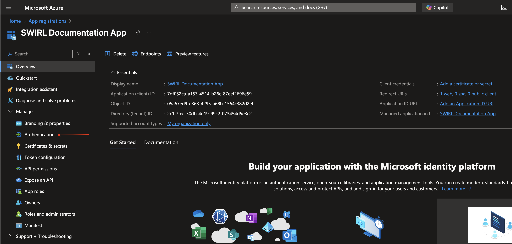
* Add "Redirect URIs" for a Single Page application:
  * First navigate to the Authentication page of the app registration configuration 
  * Add a "Single Page Application Protocol" 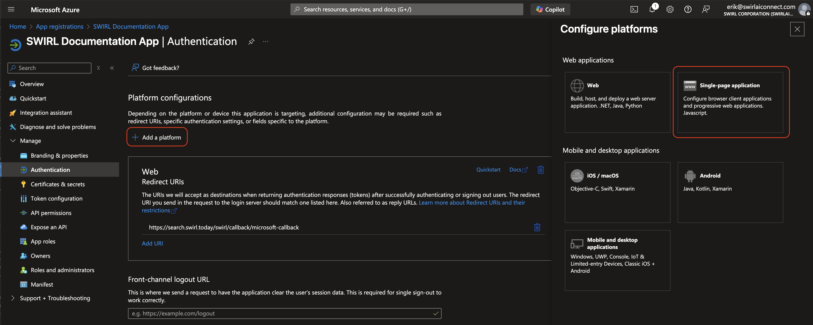
  * Add the OIDC Call back URL 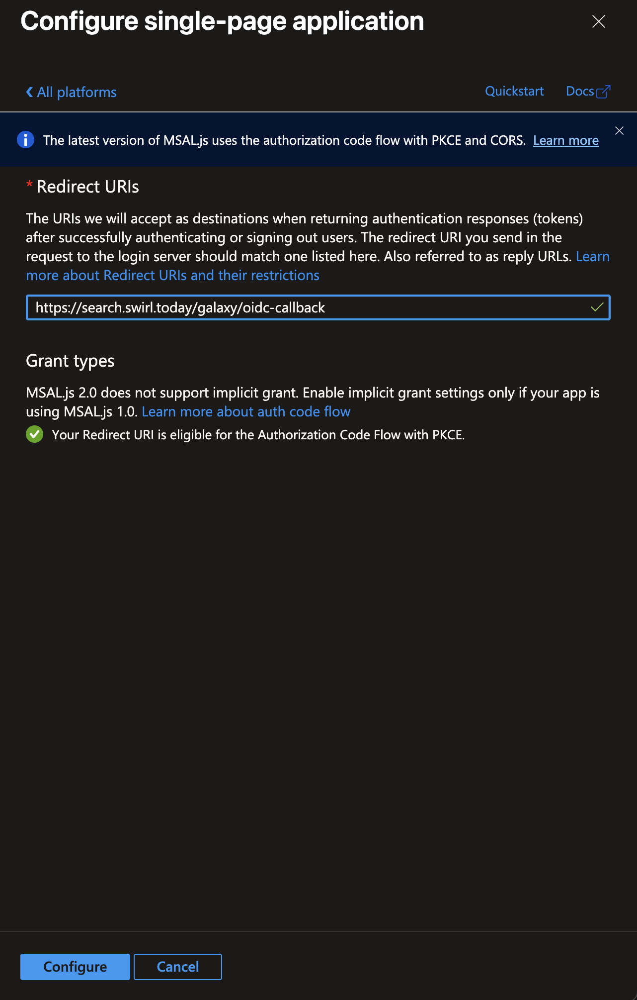
  * Add the Microsoft OAUTH2 Call back URL 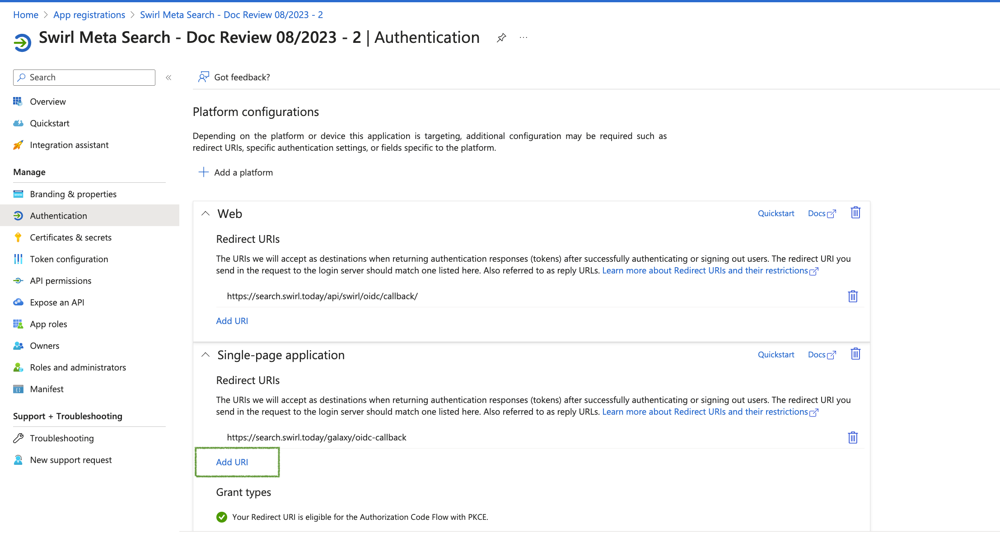
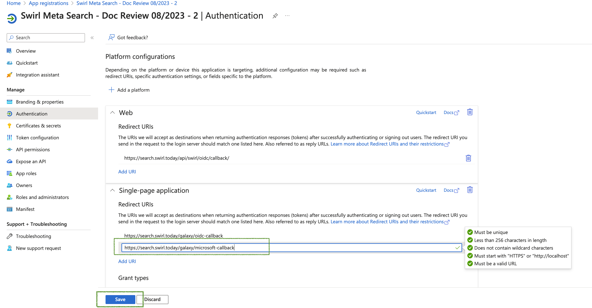
  * Return to the Overview page 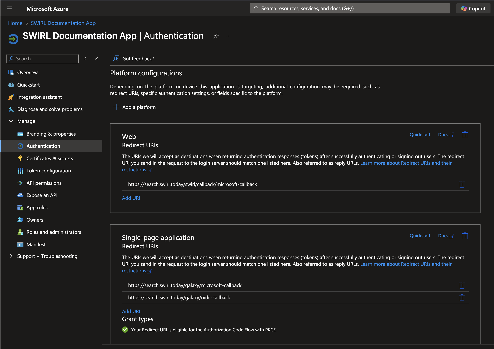

# Add App API Permissions

## Assign the Necessary Permissions

* In the left column, select the "API permissions" option, then click on `Add a permission`:
  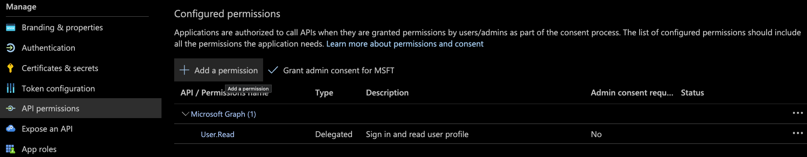

* In the "Request API permissions" section that opens (on the right):
  * Select the "Microsoft APIs" tab (at the top)
  * Click the `Microsoft Graph` button (at the top)
  * Click the `Delegated permissions` button (on the left)

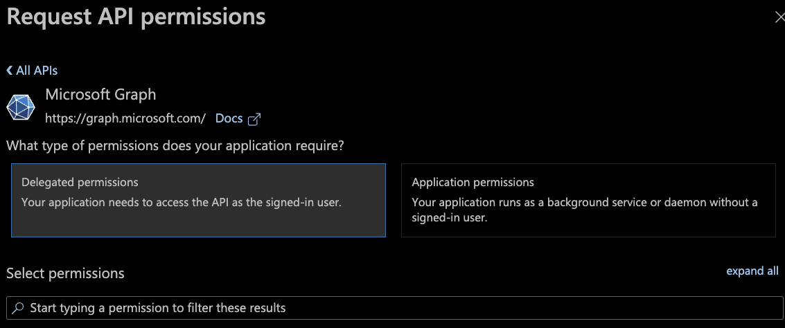

* In the resulting search box, enter and select each of the following permissions, then click the `Add permissions` button at the bottom of the page:
  


* Repeat this process for each of these individual permissions:
  * `Calendars.read`
  * `ChannelMessage.Read.All`
  * `Directory.Read.All`
  * `email`
  * `Chat.Read`
  * `Files.Read.All`
  * `profile`
  * `Mail.Read`
  * `offline_access`
  * `Sites.Read.All`
  * `User.read`

## Admin Consent for Permissions

* After adding all the above permissions to the App, click the `Grant admin consent for MSFT` button under "Configured permissions":
  
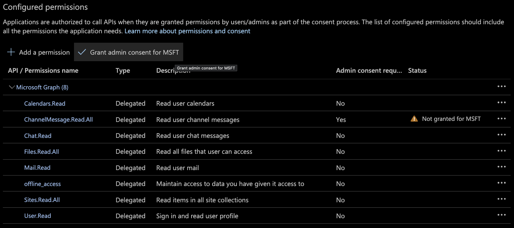

Select `Yes` when prompted to approve this action:

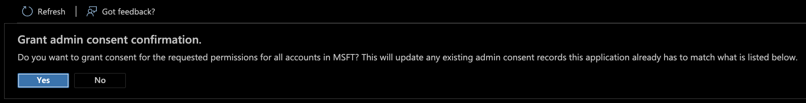

* The "Configured permissions" section for the App should now look like this:

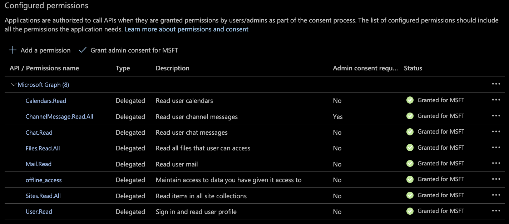

# Generate a Client Secret

* In the left column, select the "Certificates & secrets" option, then click on `New client secret`:
  
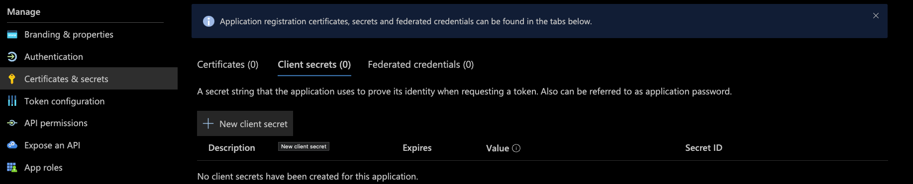

* In the "Add a client secret" section that opens (on the right):
  * Enter a `Description` for the new secret
  * Select an `Expires` time range for the secret
    
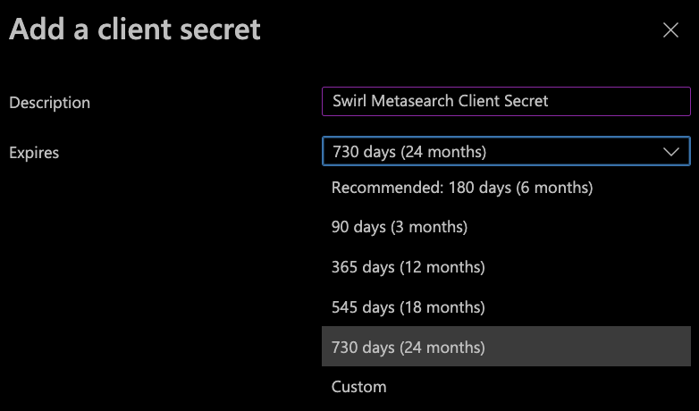

* Click the `Add` button (at the bottom) and the "Certificates & secrets" page will now show a new `Client secret` entry for the App:

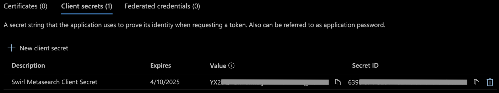

{: .warning }
Once the secret is created, copy the value shown on the screen right away!  It will be obscured from this point forward when returning to this menu.

# Configure OIDC and OAUTH2 in the SWIRL Client and Server

In the configuration examples in the following sections you can find the `<application-id>`, `<tenant-id>`, `<secrete-value>`, `<server-authentication-callback-url>`, `<client-authentication-callback-url>`, `<client-authorization-callback-url>` in the App registration that created in the previous section, below are screenshots indicating the location of each:

* Application and Tenant IDs
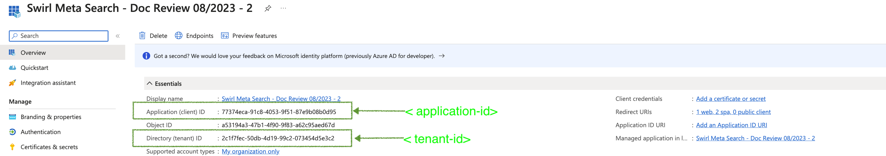

* Client secret value
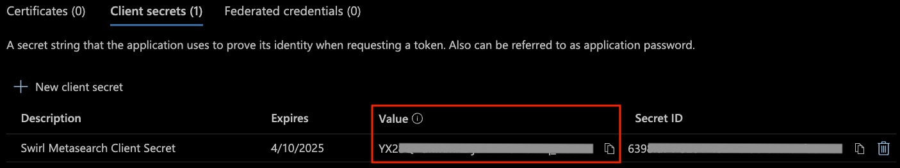

* Callback Urls
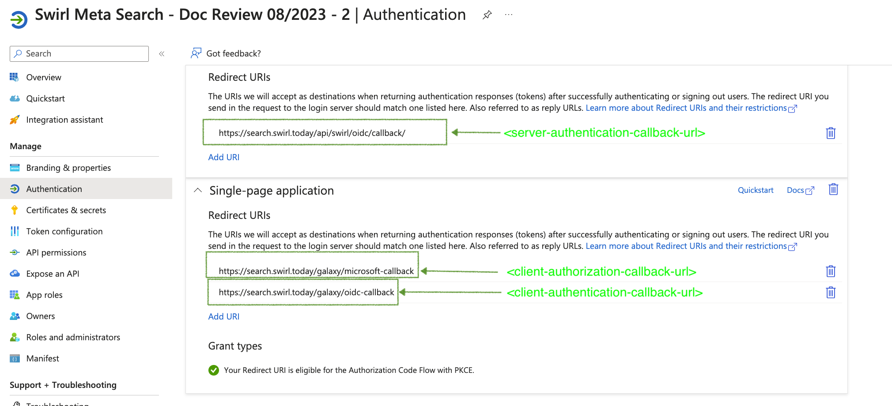

Edit the SWIRL `.env` file (or `.env.docker` if running in Docker) as shown in the example below.

{: .highlight }
The `.env` file is created after running `install.sh` for local installations, and it is always present in Docker.


``` shell
MICROSOFT_CLIENT_ID='' # deprecated
MICROSOFT_CLIENT_SECRET='' # deprecated
MICROSOFT_REDIRECT_URI='' # deprecated
OIDC_RP_CLIENT_ID='<application-id>'
OIDC_RP_CLIENT_SECRET='<secrete-value>'
OIDC_OP_AUTHORIZATION_ENDPOINT='https://login.microsoftonline.com/<tenant-id>'
OIDC_OP_TOKEN_ENDPOINT='https://login.microsoftonline.com/<tenant-id>/oauth2/v2.0/token'
OIDC_OP_USER_ENDPOINT='https://graph.microsoft.com/oidc/userinfo'
OIDC_RP_SIGN_ALGO='RS256'
OIDC_OP_JWKS_ENDPOINT='https://login.microsoftonline.com/<tenant-id>/discovery/v2.0/keys'
LOGIN_REDIRECT_URL='/swirl'
LOGOUT_REDIRECT_URL='/swirl'
OIDC_USERNAME_ALGO='swirl.backends.generate_username'
OIDC_STORE_ACCESS_TOKEN='True'
OIDC_STORE_ID_TOKEN='True'
OIDC_AUTHENTICATION_CALLBACK_URL='<server-authentication-callback-url>'
```

Edit the client configuration file named `static/api/config/default` created when you ran the `install-ui.sh` script. Navigate to the sections shown below and edit them as indicated:

``` json
  "msalConfig": {
    "auth": {
      "clientId": "<application-id>",
      "authority": "https://login.microsoftonline.com/<tenant-id>",
      "redirectUri": "<client-authorization-callback-url>"
    }
  },
  "oauthConfig": {
    "issuer": "https://login.microsoftonline.com/<tenant-id>/v2.0",
    "redirectUri": "<client-authentication-callback-url>",
    "clientId": "<application-id>",
    "scope": "openid email",
    "responseType": "code",
    "requireHttps": false,
    "oidc": true,
    "strictDiscoveryDocumentValidation": false,
    "tokenEndpoint": "https://login.microsoftonline.com/<tenant-id>/oauth2/v2.0/token",
    "userinfoEndpoint": "https://graph.microsoft.com/v1.0/me",
    "skipIssuerCheck": true
  }
```

After adding these variables to `.env` or `.env.docker`, restart SWIRL:

``` shell
python swirl.py restart
```

# Activate the Microsoft 365 SearchProviders

The SWIRL distribution includes pre-configured SearchProviders for Outlook Email, Calendar Events, OneDrive Files, SharePoint Sites, and Teams Chat.

{: .warning }
The local Teams app must already be open when clicking a Teams Chat result link in order for Teams to take you to the correct chat.

{: .highlight }
> For results containing recurring Microsoft 365 Calendar events or nested Outlook Message threads, only the most recent events and messages are shown.
>
> OneDrive results return only documents, folders are omitted from results.
>
> Teams results ONLY return chat matches; documents shared in chats are found in OneDrive or SharePoint results.

{: .highlight }
To search all Microsoft sources at once, use the `microsoft:` prefix.

* Open the admin console: <http://localhost:8000/swirl/>

* Click `SearchProviders` to access the JSON endpoint listing all SearchProviders. 

* Find each Microsoft 365 SearchProvider that you wish to activate. There are separate providers for each of the M365 Office apps. Edit the SearchProvider by adding the `id` of the provider you wish to edit to the URL. For example, to edit the provider with an id of `16`, go to: `http://localhost:8000/swirl/searchproviders/16/`

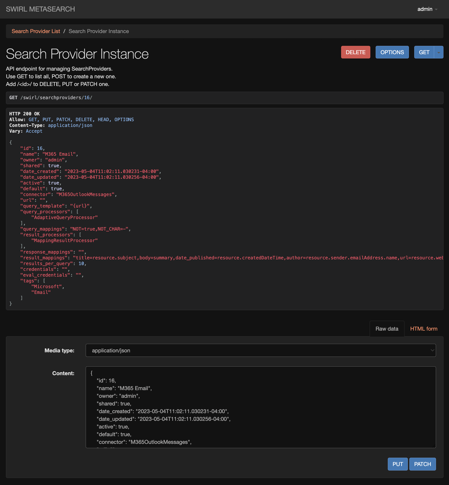

* Select the `Raw data` tab on the form at the bottom of the page. Then edit the form, changing the `active` property from `false` to `true`:

``` json
{
  "id": 16,
  "name": "Outlook Messages - Microsoft 365",
  ...
  "active": false,
  ...
}
```

To:

``` json
{
  "id": 16,
  "name": "Outlook Messages - Microsoft 365",
  ...
  "active": true,
  ...
}
```

# Authenticating with Microsoft

To verify that the SWIRL-M365 integration is working, open the Galaxy UI: <http://localhost:8000> (or <http://localhost:8000/galaxy/>)

Click on the profile icon at the top right and then click the Microsoft toggle to activate it. Depending on how the above configuration was done, M365 may require authentication and/or granting of access. 

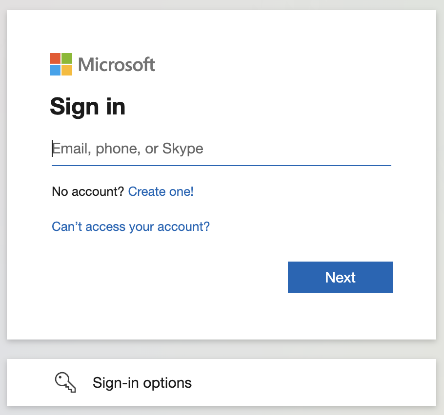

After that, the toggle next to the Microsoft logo will light up, indicating a successful connection. You can then query any of the Microsoft sources:

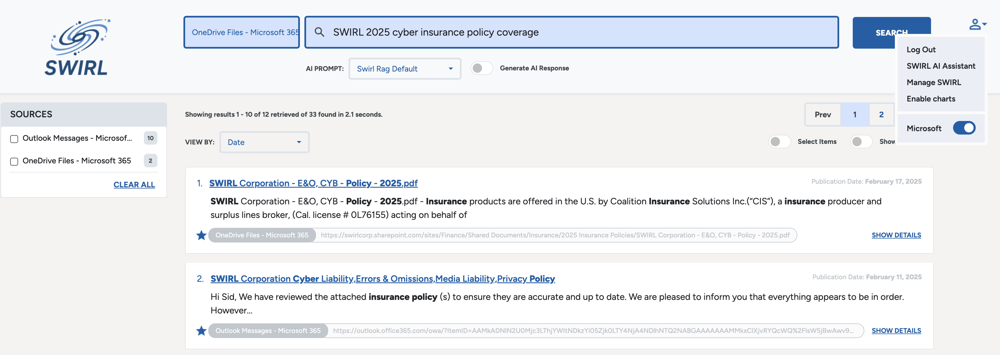

{: .warning }
If the toggle does not light up after authenticating with Microsoft, please [contact support](#support). The [related documentation](#related-documentation) below may also be useful.

# Related Documentation

* [Tutorial: Register an app with Azure Active Directory](https://learn.microsoft.com/en-us/power-apps/developer/data-platform/walkthrough-register-app-azure-active-directory) (*Note that some steps do not apply to the SWIRL App*)

* [Configure how users consent to applications](https://learn.microsoft.com/en-us/azure/active-directory/manage-apps/configure-user-consent?pivots=portal#risk-based-step-up-consent)
