<details markdown="block">
  <summary>
    Table of Contents
  </summary>
  {: .text-delta }
- TOC
{:toc}
</details>

<span class="big-text">Microsoft 365 Guide</span><br/><span class="med-text">Community Edition | Enterprise Edition</span>

---

This guide explains how to integrate SWIRL with an existing **Microsoft 365 (M365) tenant**. It is intended for **M365 administrators** who have permission to **register new applications** in the **Azure Portal**.  

Administrators may also need to **grant API permissions** so users can **query their personal M365 content** through SWIRL.

# Register a New App in Azure Portal

To connect **SWIRL** to an **M365 tenant**, first **register and configure a new App** in the **Azure Portal**.

Once registered, the App allows:

- **User authentication via OIDC**
- **Personal M365 content searches using OAuth2 permission consent**

## Before You Begin

Ensure you have the following details about your **SWIRL deployment**:

- **`swirl-host`** – The **fully qualified domain name** of your SWIRL instance.  
- **`swirl-port`** – The **port SWIRL runs on** (**only needed** if different from the default).  

Example:  
If your deployment is **`search.swirl.today`**, the `swirl-host` is **`search.swirl.today`**.

## HTTPS Requirement

To use **OIDC** and **OAuth2** with Microsoft, your deployment **must use** `https` (except when using `localhost`, where `http://` is allowed).

Single-Page Applications and Web Protocols in Azure Applications require `https://` for fully qualified domains.

## Getting Started

1. **Log in to the Azure Portal**: [https://portal.azure.com](https://portal.azure.com/)

2. In the **search bar**, type: **`app registrations`**, then select **"App registrations"** under **Services**.

   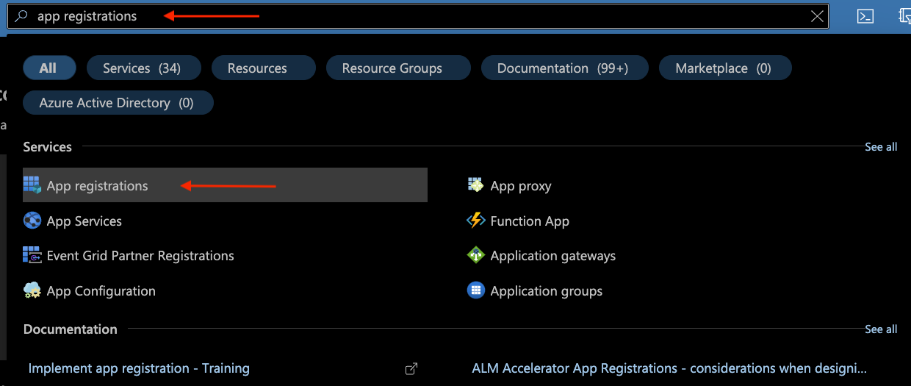

## Create the New Application

1. On the **"App registrations"** page, click **`New registration`**:

   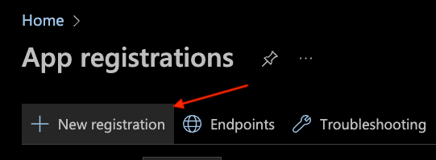

2. On the **"Register an application"** page:

   - **Name** → Enter a name for the App (e.g., **`SWIRL Documentation App`**).
   - **Supported account types** → Select:  
     `Accounts in this organizational directory only (MSFT only - Single tenant)`.

3. **For the SWIRL Enterprise Edition:**
   - Add a **Redirect URI (optional)** value for a "Web" application:
     - **Platform**: `Web`
     - **Value**: `https://<swirl-host>[:<swirl-port>]/swirl/callback/microsoft-callback`

   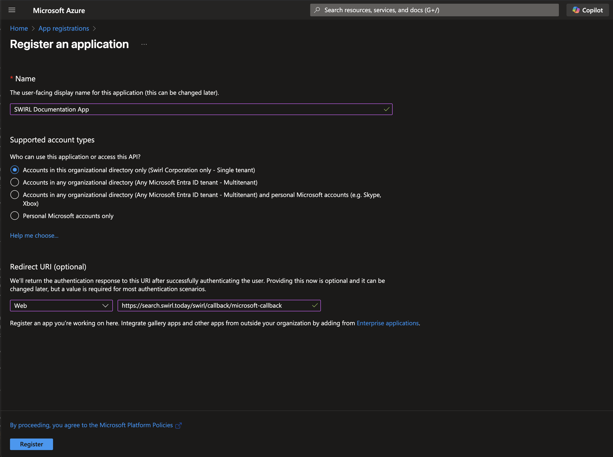

4. Click **`Register`** to create the application.

## Configure Redirect URI(s) for a Single-Page Application

1. Navigate to the **"Authentication"** page and click **`Add a platform`** and select **"Single Page Application"**:

   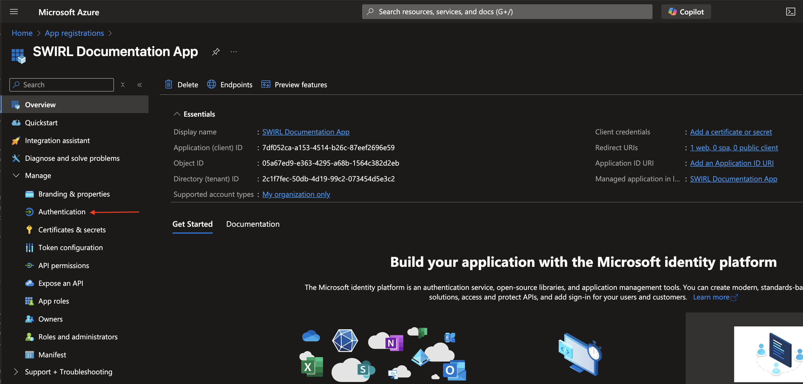
   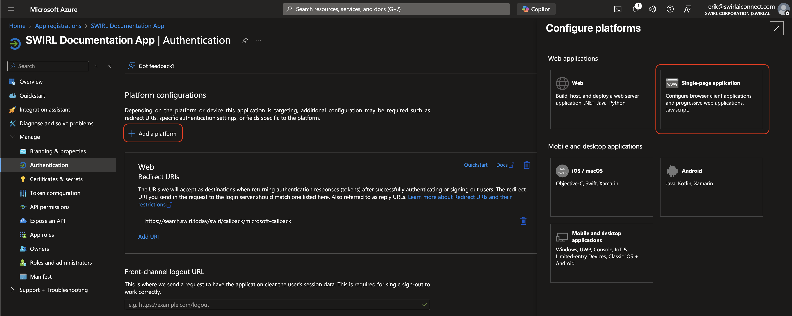

2. **For SWIRL Community edition:**
   - Add the OAuth2 callback URL:
      - Click `Add URI`
      - **Value**: `https://<swirl-host>[:<swirl-port>]/galaxy/microsoft-callback`
   - Click `Configure` to add the URI.

   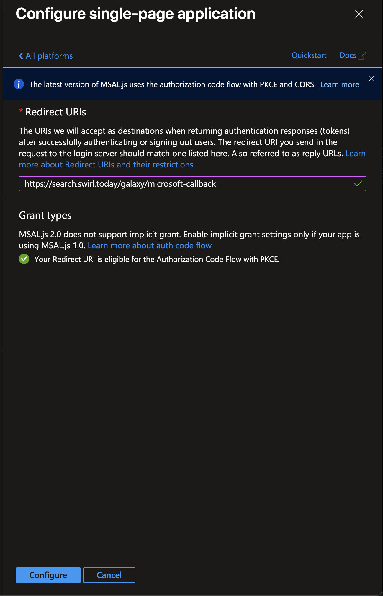

3. **Optional, for both Community and Enterprise Editions:**
   - If you plan to configure "Login with Microsoft", add the OIDC Callback URL:
      - Click `Add URI`
      - **Value**: `https://<swirl-host>[:<swirl-port>]/galaxy/oidc-callback`
   - Click `Save` to add the URI.

   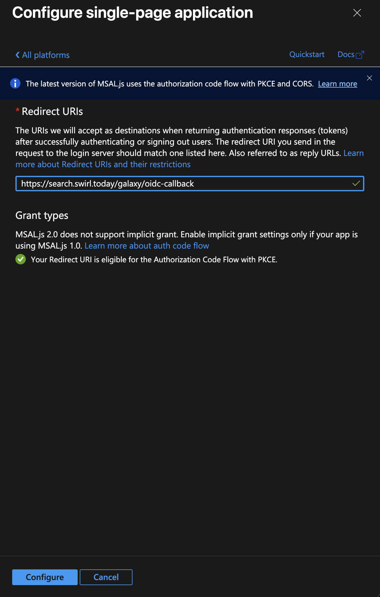

4. Return to the **Authentication** screen:

   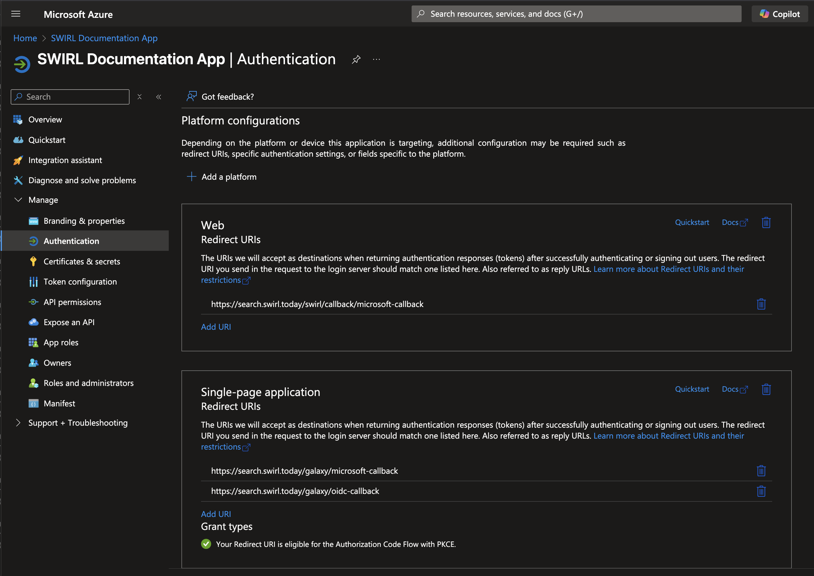

# Add App API Permissions

## Assign the Necessary Permissions

1. In the left column, select **"API permissions"**, then click **`Add a permission`**:

   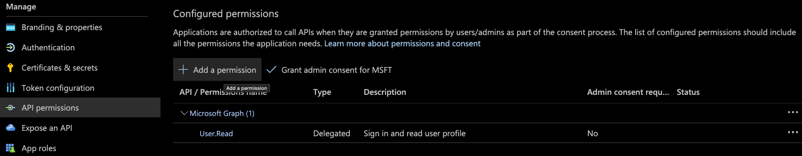

2. In the **"Request API permissions"** panel that opens:
   - Select the **"Microsoft APIs"** tab (at the top).
   - Click the **"Microsoft Graph"** button.
   - Click the **"Delegated permissions"** button.

   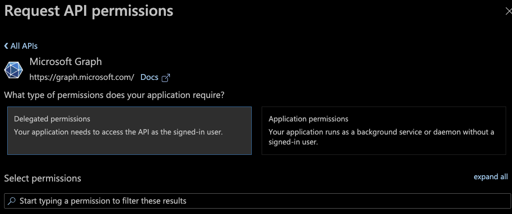

3. In the **search box**, enter and select each of the following permissions, then click **`Add permissions`**:

   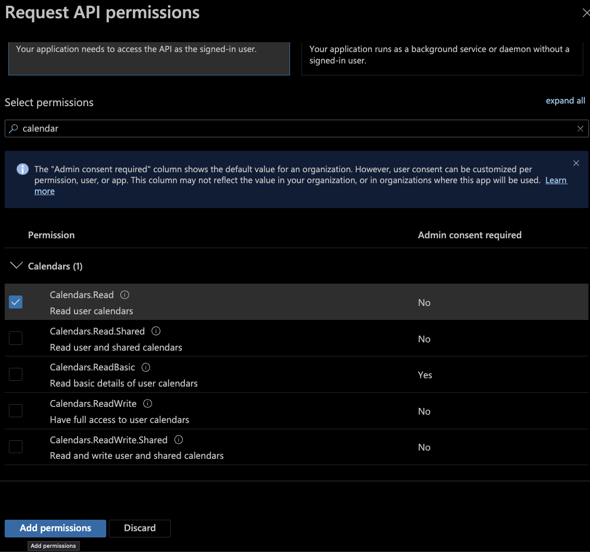

4. **Required Permissions:**

   - `Calendars.Read`
   - `ChannelMessage.Read.All`
   - `Directory.Read.All`
   - `email`
   - `Chat.Read`
   - `Files.Read.All`
   - `profile`
   - `Mail.Read`
   - `offline_access`
   - `Sites.Read.All`
   - `User.Read`

## Admin Consent for Permissions

1. After adding the permissions, click **`Grant admin consent for <your-tenant>`** under **"Configured permissions"**:

   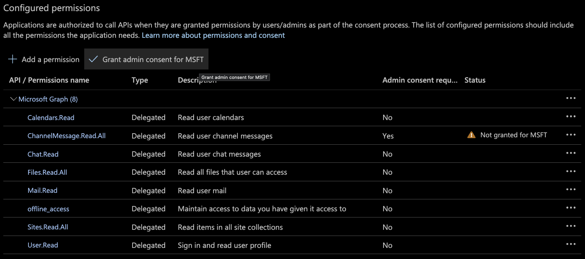

2. Confirm by selecting **"Yes"**:

   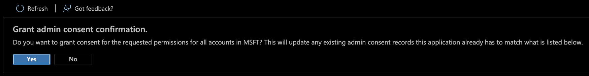

3. The **Configured permissions** section should now display all granted permissions:

   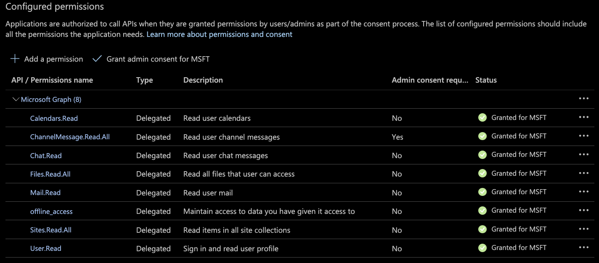

# Generate a Client Secret

1. In the left sidebar, select **"Certificates & secrets"**, then click **`New client secret`**:

   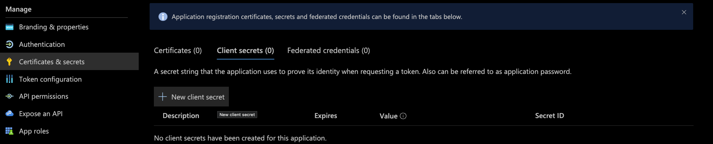

2. In the **"Add a client secret"** panel:
   - Enter a **`Description`** for the new secret.
   - Select an **`Expires`** time range for the secret.

   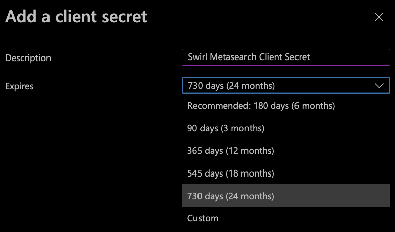

3. Click **`Add`**. The **"Certificates & secrets"** page will now display a new **Client secret** entry.

   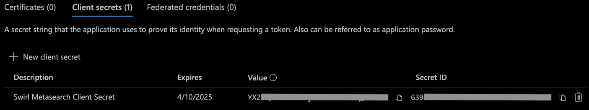

{: .warning }
**Once the secret is created, copy the Value immediately!**  It will be **hidden permanently** once you leave this page.

# Configure OAuth2 for M365

## Community Edition

### Add the OAuth2 Configurations

To enable OAuth2 content search for M365 in the SWIRL Community Edition, locate and copy the following values from your new Azure App Registration:
- **`<application-id>`**  
- **`<tenant-id>`** 

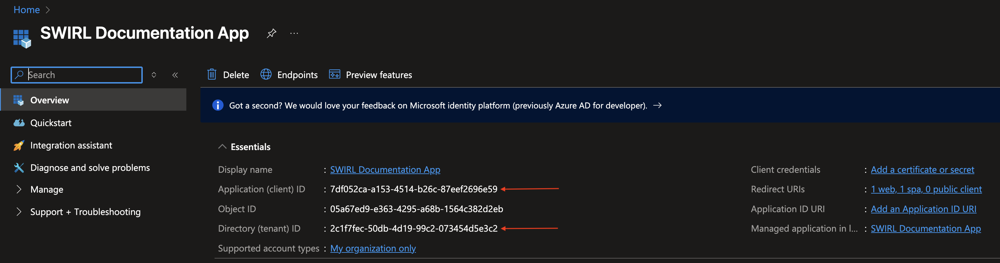

From the SWIRL home directory, open the `static/api/config/default` file within in an editor and locate the `msalConfig` section:

```
  "msalConfig": {
    "auth": {
      "clientId": "",
      "authority": "https://login.microsoftonline.com/",
      "redirectUri": "http://:/galaxy/microsoft-callback"
    }
  },
```

Update this section with the values from your Azure App Registration and the host and (optional) port of the SWIRL application.  Those values should be added as follows:

```
  "msalConfig": {
    "auth": {
      "clientId": "<application-id>",
      "authority": "https://login.microsoftonline.com/<tenant-id>",
      "redirectUri": "http(s)://<swirl-host>(:<swirl-port>)/galaxy/microsoft-callback"
    }
  },
```

Example configuration for SWIRL running locally:

```
  "msalConfig": {
    "auth": {
      "clientId": "7df052ca-a153-4514-b26c-87eef2696e59",
      "authority": "https://login.microsoftonline.com/2c1f7fec-50db-4d19-99c2-073454d5e3c2",
      "redirectUri": "http://localhost:8000/galaxy/microsoft-callback"
    }
  },
```

Example configuration for SWIRL running behind a gateway:

```
  "msalConfig": {
    "auth": {
      "clientId": "7df052ca-a153-4514-b26c-87eef2696e59",
      "authority": "https://login.microsoftonline.com/2c1f7fec-50db-4d19-99c2-073454d5e3c2",
      "redirectUri": "https://search.swirl.today/galaxy/microsoft-callback"
    }
  },
```

### Restart SWIRL

```shell
python swirl.py restart
```

Proceed to [Activate the M365 SearchProviders](#activate-the-microsoft-365-searchproviders) for Community Edition.


## Enterprise Edition

To enable OAuth2 content search for M365 in the SWIRL Enterprise edition, locate and copy the following values from your new Azure App Registration:
- **`<application-id>`**
- **`<tenant-id>`**
- **`<client-secret-value>`**


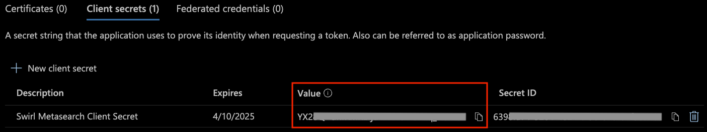

### Configure the Microsoft Authenticator

SWIRL includes a preconfigured **Microsoft Authenticator**. 

Use the Admin Console to configure it: <http://localhost:8000/admin/swirl>

Click on the "Authenticators" link: 
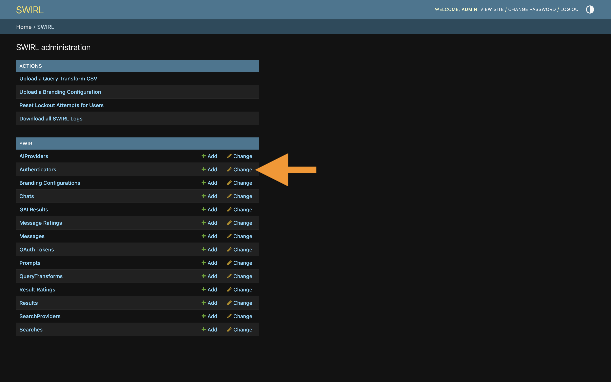

Click the "Microsoft" Authenticator to bring up the edit form:
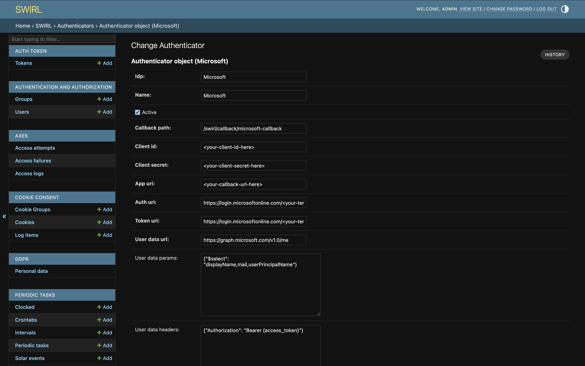

Make the following changes:
* Update the Authenticator `client_id` value with Azure App `<application-id>`
* Update the Authenticator `client_secret` value with Azure App `<client-secret-value>`
* Update the Authenticator `app_uri` value with the host and optional port of the SWIRL application.
* Update the Authenticator `auth_uri` and `token_uri` values to include the Azure App `<tenant-id>` where indicated.
* Make the Authenticator `active` by checking it. 

{: .highlight }
Do not include a trailing slash in the `app_uri` value!

Click the "SAVE" button at the bottom of the page to commit changes. 

{: .highlight }
You must [activate the M365 SearchProviders](#activate-the-microsoft-365-searchproviders) before attempting to login using the new Authenticator.

#### Example Configurations

This configuration is for a server running in production, with a fully qualified domain name (like `swirl.yourdomain.com`).

```json
{
    "idp": "Microsoft",
    "name": "Microsoft",
    "active": false,
    "callback_path": "/swirl/callback/microsoft-callback",
    "client_id": "<application(client)-id>",
    "client_secret": "<client-secret>",
    "app_uri": "https://<fully-qualified-domain-of-swirl-app>",
    "auth_uri": "https://login.microsoftonline.com/<tenant-id>/oauth2/v2.0/authorize",
    "token_uri": "https://login.microsoftonline.com/<tenant-id>/oauth2/v2.0/token",
    "user_data_url": "https://graph.microsoft.com/v1.0/me",
    "user_data_params": {
        "$select": "displayName,mail,userPrincipalName"
    },
    "user_data_headers": {
        "Authorization": "Bearer {access_token}"
    },
    "user_data_method": "GET",
    "initiate_auth_code_flow_params": {},
    "exchange_code_params": {},
    "is_code_challenge": true,
    "scopes": "User.Read Mail.Read Files.Read.All Calendars.Read Sites.Read.All Chat.Read offline_access",
    "should_expire": true,
    "use_basic_auth": true,
    "expires_in": 0
}
```

This configuration can be used when running SWIRL locally:

```json
{
    "idp": "Microsoft",
    "name": "Microsoft",
    "active": true,
    "callback_path": "/swirl/callback/microsoft-callback",
    "client_id": "7df052ca-a153-4514-b26c-87eef2696e59",
    "client_secret": "<secret-redacted>",
    "app_uri": "http://localhost:8000",
    "auth_uri": "https://login.microsoftonline.com/<tenant-id-redacted>/oauth2/v2.0/authorize",
    "token_uri": "https://login.microsoftonline.com/<tenant-id-redacted>/oauth2/v2.0/token",
    "user_data_url": "https://graph.microsoft.com/v1.0/me",
    "user_data_params": {
        "$select": "displayName,mail,userPrincipalName"
    },
    "user_data_headers": {
        "Authorization": "Bearer {access_token}"
    },
    "user_data_method": "GET",
    "initiate_auth_code_flow_params": {},
    "exchange_code_params": {},
    "is_code_challenge": true,
    "scopes": "User.Read Mail.Read Files.Read.All Calendars.Read Sites.Read.All Chat.Read offline_access",
    "should_expire": true,
    "use_basic_auth": true,
    "expires_in": 0
}
```

# Configuring OIDC for Microsoft

To enable OIDC ("Login with Microsoft) in both SWIRL Enterprise and Community edition, locate and copy the following values from your new Azure App Registration:
- **`<application-id>`**
- **`<tenant-id>`**
- **`<oidc-callback-url>`**

{: .highlight }
Complete Step 3 of the [Configure Redirect URI(s) for a Single-Page Application](#configure-redirect-uris-for-a-single-page-application) section above before proceeding!

## Update the Default Configuration Values

From the SWIRL home directory, open the `static/api/config/default` file within in an editor and locate the `oidcConfig` section:

```
"oidcConfig": {
   "Microsoft": {
      "active": false,
      "issuer": "https://login.microsoftonline.com/<tenant-id>/v2.0",
      "clientId": "<microsoft-client-id>",
      "redirectUri": "http://<msal-host>:<msal-port>/galaxy/oidc-callback",
      "scope": "openid email",
      "responseType": "code",
      "requireHttps": false,
      "strictDiscoveryDocumentValidation": false,
      "skipIssuerCheck": true
   }
},
```

Add the values from your Azure App Registration to the `Microsoft` section as follows:
* Update the `clientId` value with the Azure App `<application-id>`
* Update the `redirectUri` value with the `<oidc-callback-url>` from your Single-Page Application
* Update the `issuer` field with the Azure App `<tenant-id>`
* Update the `active` value to `true`

Example OIDC configuration for Microsoft:

```
"oidcConfig": {
   "Microsoft": {
      "active": true,
      "issuer": "https://login.microsoftonline.com/<tenant-id-redacted>/v2.0",
      "clientId": "7df052ca-a153-4514-b26c-87eef2696e59",
      "redirectUri": "https://search.swirl.today/galaxy/oidc-callback",
      "scope": "openid email",
      "responseType": "code",
      "requireHttps": false,
      "strictDiscoveryDocumentValidation": false,
      "skipIssuerCheck": true
   },
   "Google": {
      "active": false,
      "clientId":  "<google-client-id>.apps.googleusercontent.com",
      "redirectUri": "http://<swirl-host>:<swirl-port>/galaxy/oidc-callback",
      "scope": "openid email profile"
   }
},
```

{: .highlight }
For the Enterprise Edition, the Microsoft Authenticator must be correctly configured [as noted above](#configure-the-microsoft-authenticator).

### Restart SWIRL

Restart SWIRL. The login page should now present a `Login with Microsoft` button:
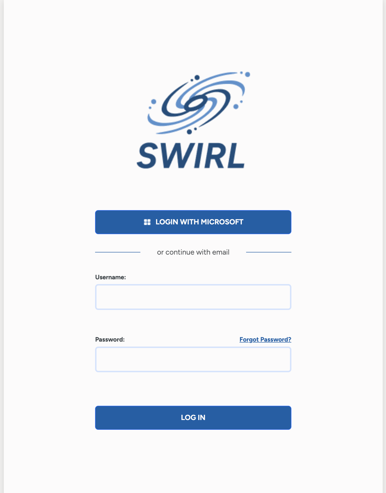

## Configure OIDC for the SWIRL Public Docker Compose

{: .highlight }
Use of OIDC is optional.

Main instructions: <https://github.com/swirlai/docker-compose/blob/main/doc/setup-instructions.md#configure-oidc-with-microsoft-as-the-idp-optional>

## Configure OIDC for the SWIRL Azure Marketplace Offer

{: .highlight }
Use of OIDC is optional.

Configure the following environment variables in the `.env` file found in the deployment's `/app` directory:

- `MS_AUTH_CLIENT_ID` - Microsoft application registration client ID value.
- `MS_TENANT_ID` - Tenant ID value from Microsoft Azure IdP.
- `PROTOCOL` - The protocol used by the SWIRL instance (e.g. `http` or `https`).
- `SHOULD_USE_TOKEN_FROM_OAUTH`- Set this value to "True" (default) to use the tokens from OIDC. Otherwise, set it to False.
- `SWIRL_FQDN`	The Fully Qualified Domain Name of the SWIRL instance.
- `SWIRL_PORT`	The port used by SWIRL (defaults to `unset` allowing `PROTOCOL` to set to 443 for HTTPS, and 80 for HTTP).

### Restart SWIRL

```shell
sudo systemctl stop swirl
sudo systemctl start swirl
```

During the SWIRL start-up process, the following command is run, which populates the `/app/static/api/config/default` file:

```
python swirl.py config_default_api_settings
```

The SWIRL login page should then present a `Login with Microsoft` button.

# Activate the Microsoft 365 SearchProviders

The **SWIRL distribution** includes pre-configured **SearchProviders** for:

- **Outlook Email**  
- **Calendar Events**  
- **OneDrive Files**  
- **SharePoint Sites**  
- **TeamsChat**  

{: .warning }
The **Microsoft Teams desktop app must be open** before clicking a Teams Chat result link.  

{: .highlight }
> - **Calendar Events** – Only **recent** events are shown.  
> - **Outlook Threads** – Only the **latest** messages are shown.  
> - **OneDrive** – **Folders are omitted**; only documents appear.  
> - **Teams** – **Only chat messages** are indexed. Files shared in chats appear in **OneDrive or SharePoint results**.

**Enable Microsoft SearchProviders**

1. **Open the Admin Console**:  
   [http://localhost:8000/admin/swirl/](http://localhost:8000/admin/swirl/)

2. **Click SearchProviders**:  
   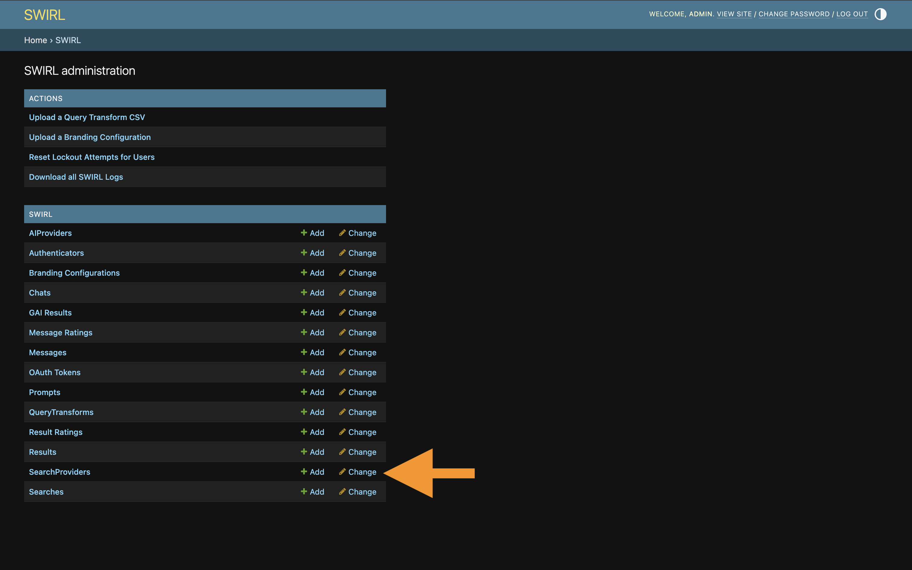

3. This will bring up the list of SearchProviders:
   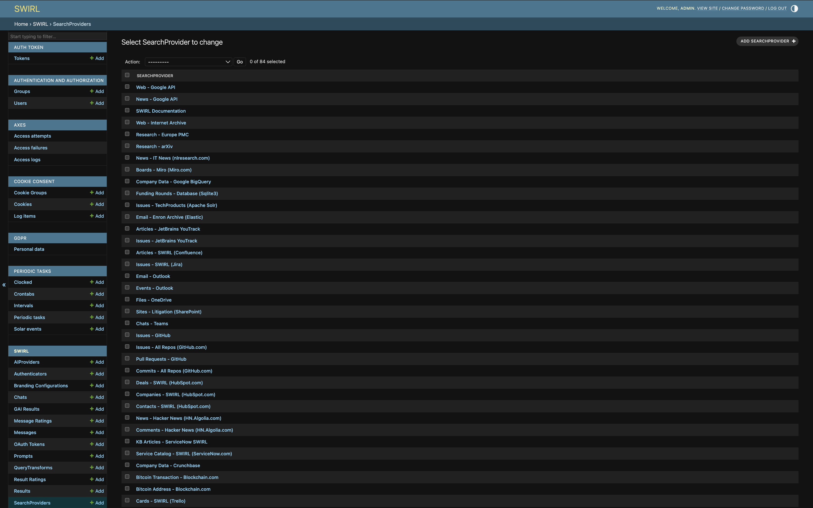
   
4. Click each M365 SearchProvider like Outlook Email, OneDrive or Teams, to edit it. 
   This will bring up the edit form: 
   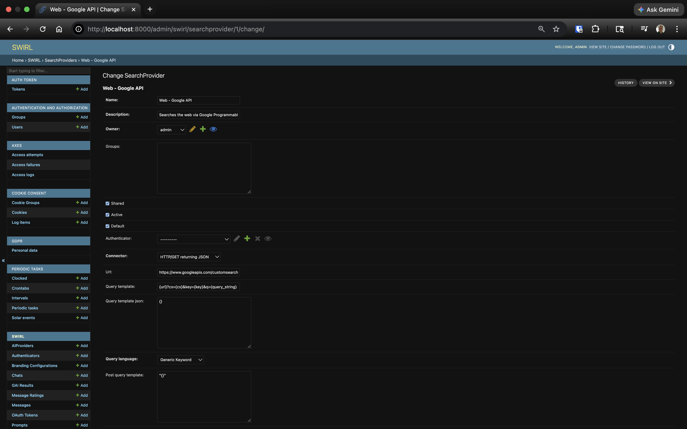

5. Activate the provider by checking the "active" box. 

6. Hit "SAVE" at the bottom of the page.

# Authenticating with Microsoft

To verify that **SWIRL-M365 integration** is working:

1. **Open the Galaxy UI:**  
   - [http://localhost:8000](http://localhost:8000)  
   - or [http://localhost:8000/galaxy/](http://localhost:8000/galaxy/)

2. **Enable Microsoft Authentication:**  
   - Click the **profile icon** (top right).  
   - Toggle **Microsoft** to activate authentication.  
   - If required, grant permissions during authentication.

   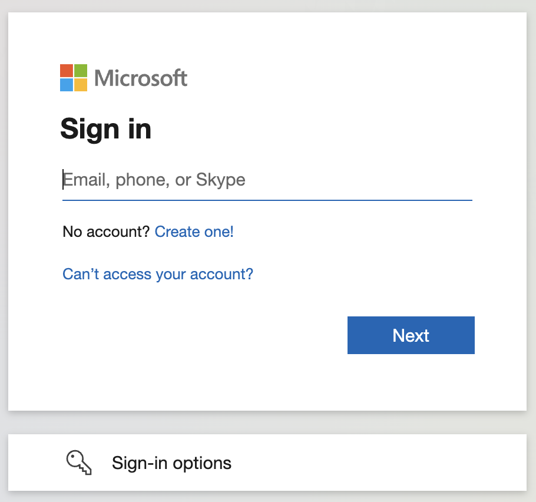

3. **Successful Connection:**  
   - The **Microsoft toggle lights up** after authentication.  
   - You can now search Microsoft 365 sources.

   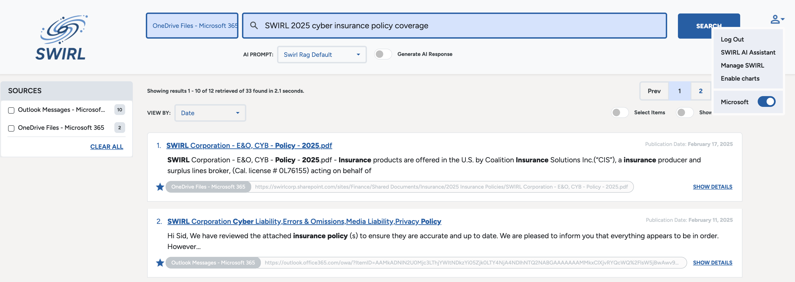

{: .warning }
If the **Microsoft toggle does not activate** after authentication, please [contact support](#support). The [Related Documentation](#related-documentation) below may also be helpful.

# Related Documentation

- [Register an app with Azure Active Directory](https://learn.microsoft.com/en-us/power-apps/developer/data-platform/walkthrough-register-app-azure-active-directory) *(Some steps do not apply to the SWIRL App)*

- [Configure user consent for applications](https://learn.microsoft.com/en-us/azure/active-directory/manage-apps/configure-user-consent?pivots=portal#risk-based-step-up-consent)
