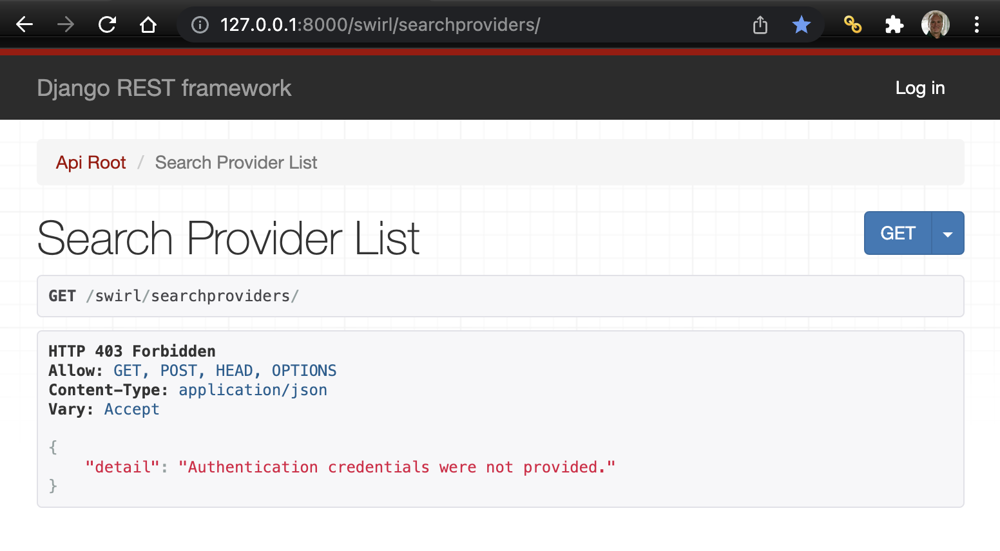
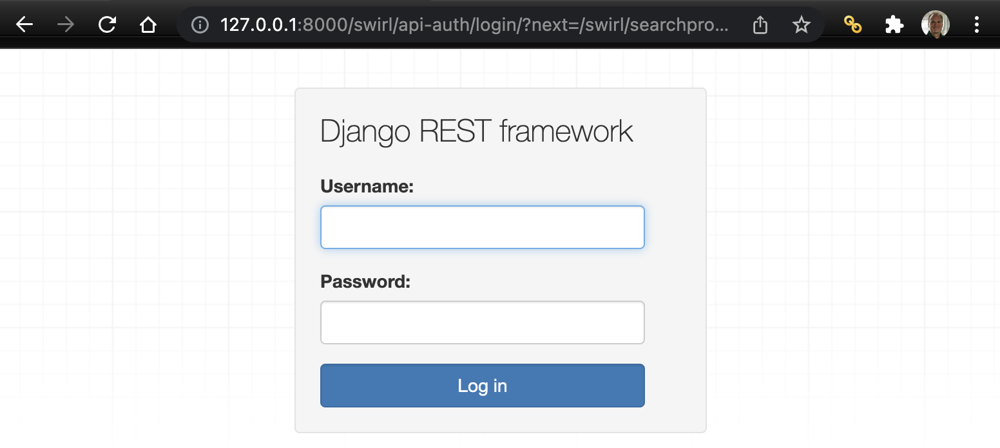
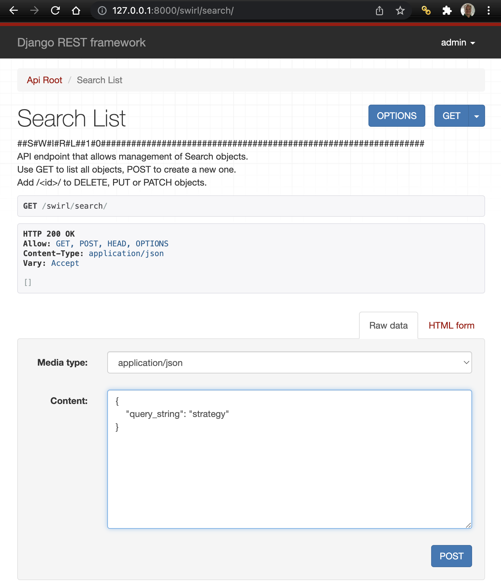
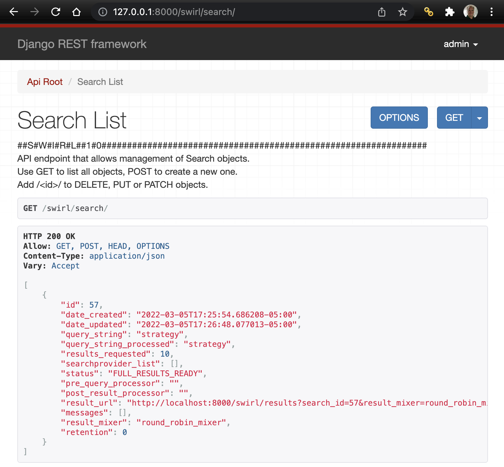
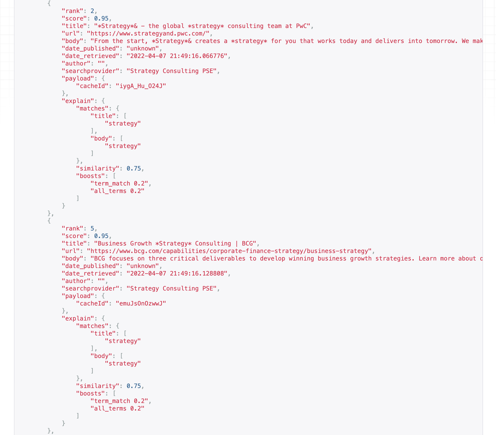
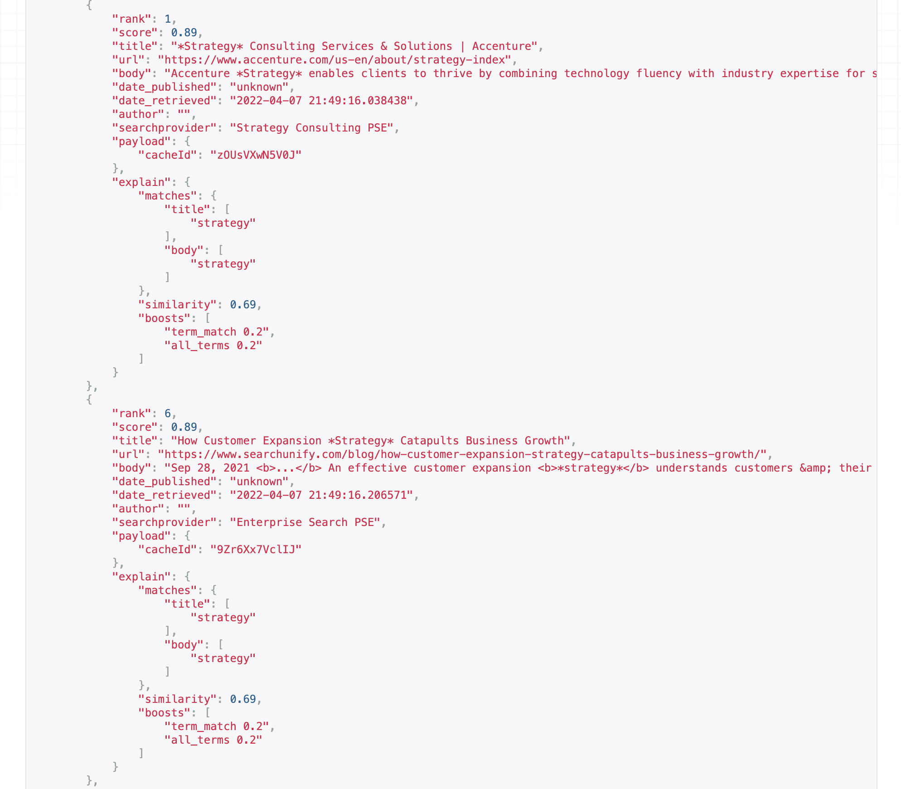
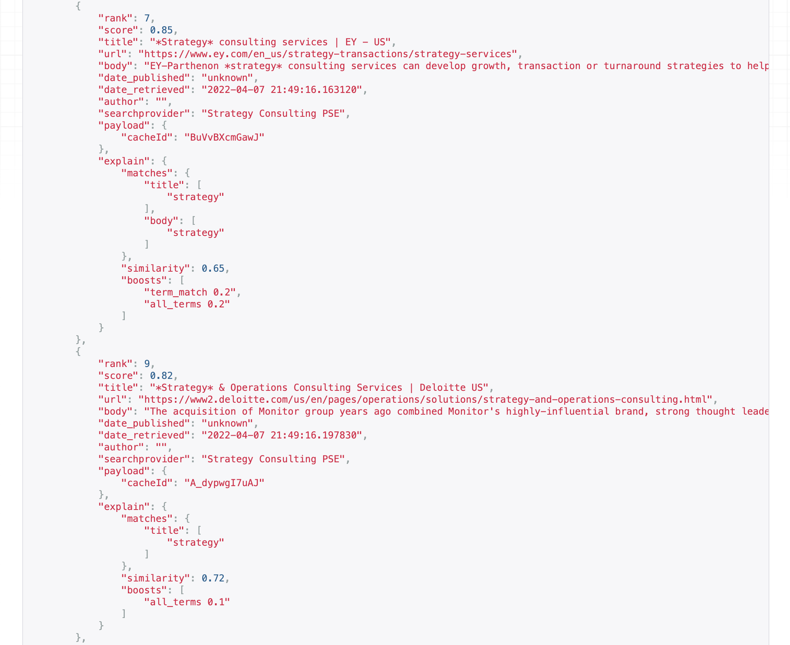

<br/>

# SWIRL QUICK START

:small_blue_diamond: [Create SearchProviders](#create-searchproviders)<br/>
:small_blue_diamond: [Run a Search](#run-a-search)<br/>
:small_blue_diamond: [Get Results](#get-results)<br/>

### Advanced Options

:small_blue_diamond: [Use the python CLI](DEVELOPER_GUIDE.md#python-command-line-interface-cli)<br/>
:small_blue_diamond: [Use PostMan](./SWIRL.postman_collection.json)<br/>

<br/>

# Create SearchProviders

## 1. :star: Browse to: http://127.0.0.1:8000/swirl/searchproviders/

<br/>



<br/>

The SearchProvider form will appear, with a warning.

<br/>

## 2. Click the "Log in" link at the top, right of the page. 

The Log in form will appear. 

<br/>



<br/>

## Enter the credentials you created during Installation Step #4 and hit the Log in button.

<br/>

## 3. The SearchProvider form will re-appear:

<br/>


<br/>

## 4. Copy or Create a SearchProvider Configuration

## :star: [SearchProvider Examples](DEVELOPER_GUIDE.md#example-configs)

If you were given a definition, open it using a text editor. Edit the definition if necessary, for example to replace credentials or other important query mappings.

<br/>

:key: There is a python utility you can use to load a list of SearchProvider definitions. For example, from the SWIRL root directory, this command:

```
python scripts/swirl_load.py SearchProviders/google_pse.json -u admin -p your-admin-password
```

Will load all of the Google PSE examples. 

<br/>

## 5. Go to the form at the bottom of the page, and click the "RAW" tab. 

Paste the JSON into the form and press the POST button.

<br/>

## 6. :star: Reload http://127.0.0.1:8000/swirl/searchproviders/ to see the completed providers:

<br/>


## 7. Repeat this copy/paste/edit/POST for each additional providers you want to search with SWIRL!

<br/>

## :1st_place_medal: Congratulations, you have created a SearchProvider!

<br/>

<br/>

----------

<br/>

<br/>

# Run a Search!

## :star: Browse to: http://127.0.0.1:8000/swirl/search/ 

<br/>


<br/>

1. Go the form at the bottom of the page, scrolling down if necessary
2. Click the "Raw data" tab on the form
3. Copy the JSON below to the clipboard

<br/>

```
  {
        "query_string": "strategy"
  }
```

## :warning: If you created your own provider, you may need to change the search to something else.

<br/>

## 4. Copy/paste it into the form at the bottom of the page, clicking the "Raw data" tab first, if necessary.

<br/>



<br/>

## 5. Press the POST button.

SWIRL will respond with the newly created Search Object, including the id for it:

<br/>


<br/>

### Important: note the id down. We'll use it in the next step to get results.

## 6. Hit the GET button at the top of the page anytime to see the list of Search Objects:

<br/>



<br/>

Hit it as often as you like and watch your newly created Search status change from NEW_SEARCH to FEDERATING to RESULTS_READY or similar, very quickly. If it changes to 'ERR' of any sort, look for console output from the Swirl Services started in command line/terminal windows in the previous section, and consult the [Troubleshooting](DEVELOPER_GUIDE.md#troubleshooting) section.

<br/>

## :1st_place_medal: Congratulations, you ran a SWIRL Search!

<br/>

<br/>

----------

<br/>

<br/>

# Get Results!

## 1. :star: Browse to: http://127.0.0.1:8000/swirl/results/?search_id=1

(If SWIRL responded to your search object with a different search_id, use that instead.)

<br/>

## 2. SWIRL will respond with a mixed result set from all responding sources!!

<br/>







<br/>

<br/>

## :1st_place_medal: Congratulations, you got SWIRL results!

<br/>

<br/>

# Use APIs

If you want to call SWIRL's APIs from something other than a browser:

:star: [SWIRL Swagger](http://localhost:8000/swirl/swagger-ui/)

:star: [SWIRL PostMan Collection](SWIRL.postman_collection.json)

Additional information can be found in the [Object Reference](DEVELOPER_GUIDE.md#object-reference) for each SWIRL object. 

<br/>

<br/>

# Next Steps

:small_blue_diamond: [Select a different Result Mixer](DEVELOPER_GUIDE.md#viewing-unified-results)<br/>
:small_blue_diamond: Quickly run another Search [using the OpenSearch Interface](DEVELOPER_GUIDE.md#using-the-opensearch-interface)<br/>
:small_blue_diamond: [Re-run a failed Search](DEVELOPER_GUIDE.md#re-starting-re-running--re-trying-a-search)<br/>

<br/>

<br/>

# Further Reading

:small_blue_diamond: [Developer's Guide](DEVELOPER_GUIDE.md)

<br/>

<br/>

# Get Support

Please email [swirl-support@probstein.com](mailto:swirl-support@probstein.com) for support.
