<details markdown="block">
  <summary>
    Table of Contents
  </summary>
  {: .text-delta }
- TOC
{:toc}
</details>

# Quick Start Guide - Enterprise Edition

{: .warning }
This version applies to the Enterprise Edition of SWIRL! A valid license key is required.

* The recommended minimum system configuration is a 16 core server, with 32 GB of memory and at least 500 GB of available disk space. This should support up to 25 users. 

* To run SWIRL in Docker, you must have the latest [Docker app](https://docs.docker.com/get-docker/) for MacOS, Linux, or Windows installed and running locally. Docker should be configured to use all available CPU, memory and storage.  

* You must be logged in to a valid Docker Hub by opening the command-line interface (CLI) and executing the following command, replacing <docker-username> and <docker-password> with your Docker Hub credentials.

``` shell
docker login --username <docker-username> --password <docker-password>
```

* Windows users must first install and configure either the WSL 2 or the Hyper-V backend, as outlined in the  [System Requirements for installing Docker Desktop on Windows](https://docs.docker.com/desktop/install/windows-install/#system-requirements).

{: .warning }
Make sure the Docker app is running before proceeding!

* Locate and open the email message from hello@swirl.today with subject "Try SWIRL Enterprise".
There should be three attachments: 

  * Try SWIRL Enterprise with Docker PDF
  * docker-compose.yaml
  * env.license 

* Save the docker-compose.yml attached to the email message to a folder on the target server. 

* Locate the file named env.license attached to the email message to the same folder, renaming it to .env.license as you do so. 

{: .warning }
The leading dot (.) character is required!

* Open a command line interface and navigate to the folder where you saved the docker-compose.yml file. Launch the containers by running the following command:

```
docker-compose pull && docker-compose up
```

This command will start all the services used by Swirl. It will take a few minutes for the services to initialize.
  
{: .warning }
Do not hit ^C or stop Docker in this window, otherwise SWIRL will be shut down.

After a few minutes, the output will look like this, or similar:
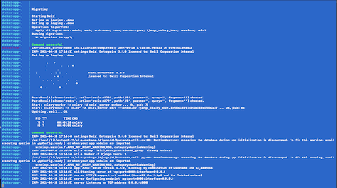

* Launch another command line interface, and run the following command to check the status of the running containers:

```
docker ps
```

The output should look like this, or similar:
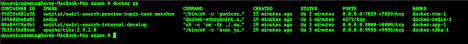

* Open this URL with a browser: <http://localhost:8000> (or <http://localhost:8000/galaxy>)

If the search page appears, click `Log Out` at the top, right. The SWIRL login page will appear:


* Enter the username `admin` and password `password`, then click `Login`.

* Enter a search in the search box and press the `Search` button. Ranked results appear in just a few seconds:


If they don’t appear, or an error occurs, please [contact support](#support).

{: .warning }
To use the Generate AI insights button (to RAG on the most relevant results) or use the AI Co-Pilot (http://localhost:8000/galaxy/chat) feature, at least one AI Provider must be activated. 
These functions will not work “out of the box” without activation.

* Go to the [http://localhost:8000/swirl/aiproviders/](http://localhost:8000/swirl/aiproviders/)

Review the pre-loaded providers. Then edit a pre-loaded provider by adding the id of the provider to the URL. For example: http://localhost:8000/swirl/aiproviders/16/: 

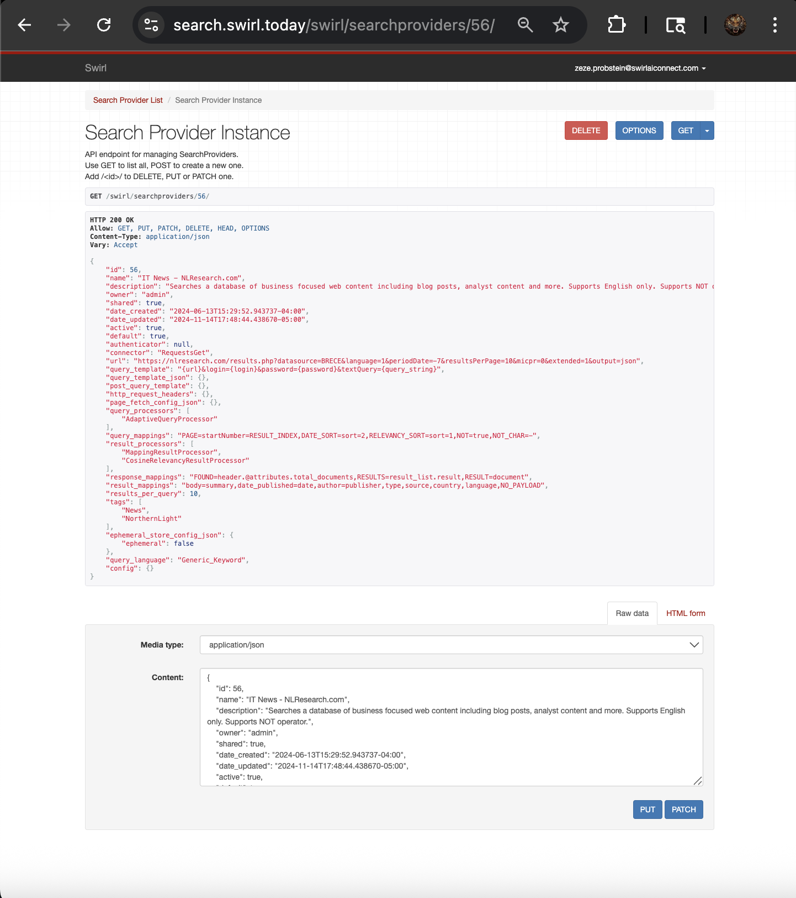

For an AI provider to perform either RAG or chat functions, as shown above, it must:
•	Have the “active” property set to “true”
•	Have the “rag” and/or “chat” in the “tags” list
•	Have the “rag” and/or “chat” in the “default” list 
•	Have a valid API key if required

Use the “Raw Data” form at the bottom to make changes. Don’t forget to click the “PUT” button to save them.

To create a new AI provider, copy an existing one and paste it in as a new one, at the bottom of the page. 

To use different AI providers for RAG and AI Co-Pilot, set the “defaults” lists different for each. For example, set one provider (e.g. OpenAI GPT-4) up with “rag” in the defaults list, and another (e.g. Azure/OpenAI GPT-4o) with “chat” in the defaults list. (Each provider also needs the appropriate tag, “chat” or “rag”, in the “tags” list.)

* When there is at least one active, default provider for RAG, you may click the “Generate AI Insights” button at the top of the AI Connect form. 

For example:


* To try the SWIRL AI Co-Pilot, navigate to: [http://localhost:8000/galaxy/chat](http://localhost:8000/galaxy/chat)

Be sure to verify that RAG is working before attempting to use Co-Pilot.

* Put in a question such as “What sources do I have access to?” and you should get a result within a few seconds. 

* Direct the co-pilot to search for something of interest, and you should get a RAG result as part of the conversation, including citations:


 
* SWIRL ships with admin/password pre-configured as noted. This may cause a warning to appear if using Galaxy with the Google Chrome browser.  

To change the password, follow instructions here: https://docs.swirl.today/Admin-Guide.html#changing-a-super-user-password 

* When finished working with SWIRL, stop the containers using one of these methods:

1.	Via Docker Desktop: 
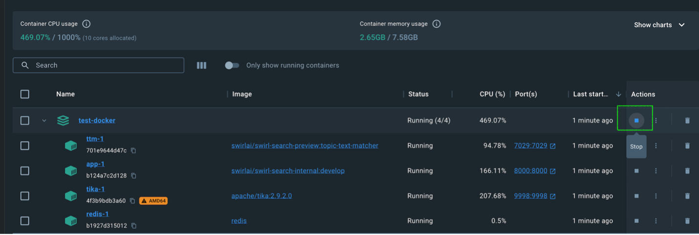

2.	Press CTRL-C in the terminal window where Docker Compose is running:
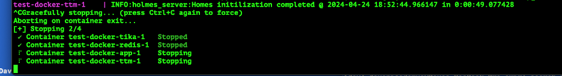

3. Execute docker-compose stop from a different terminal:
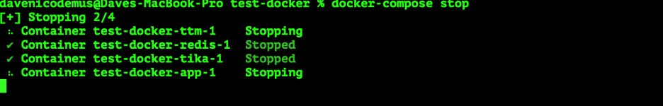

 These will all preserve the SWIRL database. If you don't care about preserving the database, you can hit CTRL-C twice to stop SWIRL instantly, losing all configuration and data in the process.

# Optional Steps

* Click the “Select Items” button to change the documents used in the RAG, and click the switch again to generate updated insight.

* To view the raw result JSON, click `Search` under the API section of the `Manage SWIRL` page linked above, or open <http://localhost:8000/swirl/search/>

The most recent Search object will be displayed at the top. Click on the `result_url` link to view the full JSON Response. 

For example:


* Click the profile avatar in the upper right corner of the Galaxy UI. Then click [Manage SWIRL](http://localhost:8000/swirl/) to explore the rest of SWIRL's features.

* Integrate with Microsoft 365

To connect the SWIRL installation Microsoft 365, be aware of the pre-requisites:
•	Administrative access to the Azure/M365 tenant 
•	Successful creation of a new app registration in Azure
•	Addition of the new app ID and secrets to the SWIRL configuration.

This process takes approximately one hour, assuming sufficient privileges are available. Please follow the guide here: https://docs.swirl.today/M365-Guide.html 

For additional support on M365 integration, please [contact SWIRL](#support).
 
*  To persist configuration changes outside docker: 

1.	Identify the name of your swirl docker container, it will contain the term ‘app’ - for example:
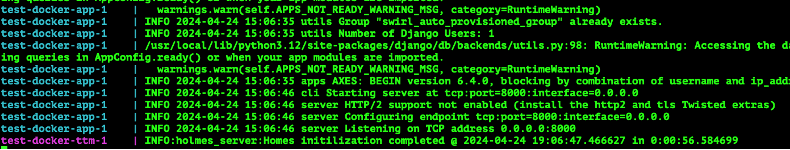

2.	Copy the env file outside of your docker and into the directory in which the docker compose is running:
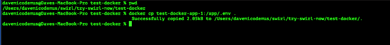
 
3.	Stop the containers:
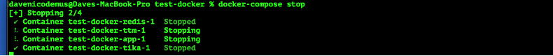
 
4.	Edit the docker-compose as follows:
Before:
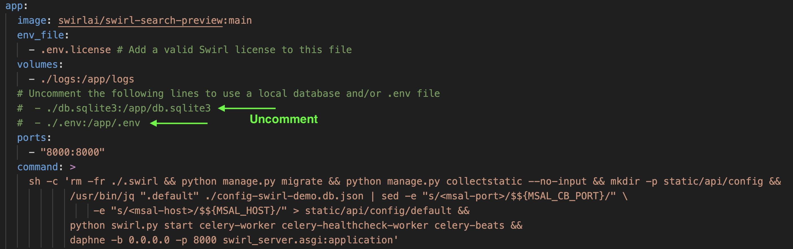
 
After: 
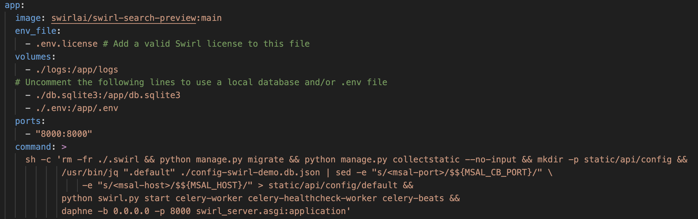

5. Restart Swirl 

```
docker-compose pull && docker-compose up
```