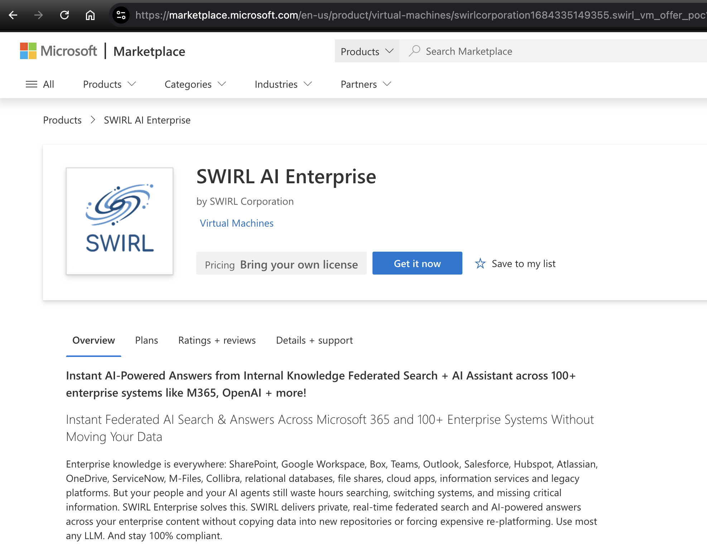
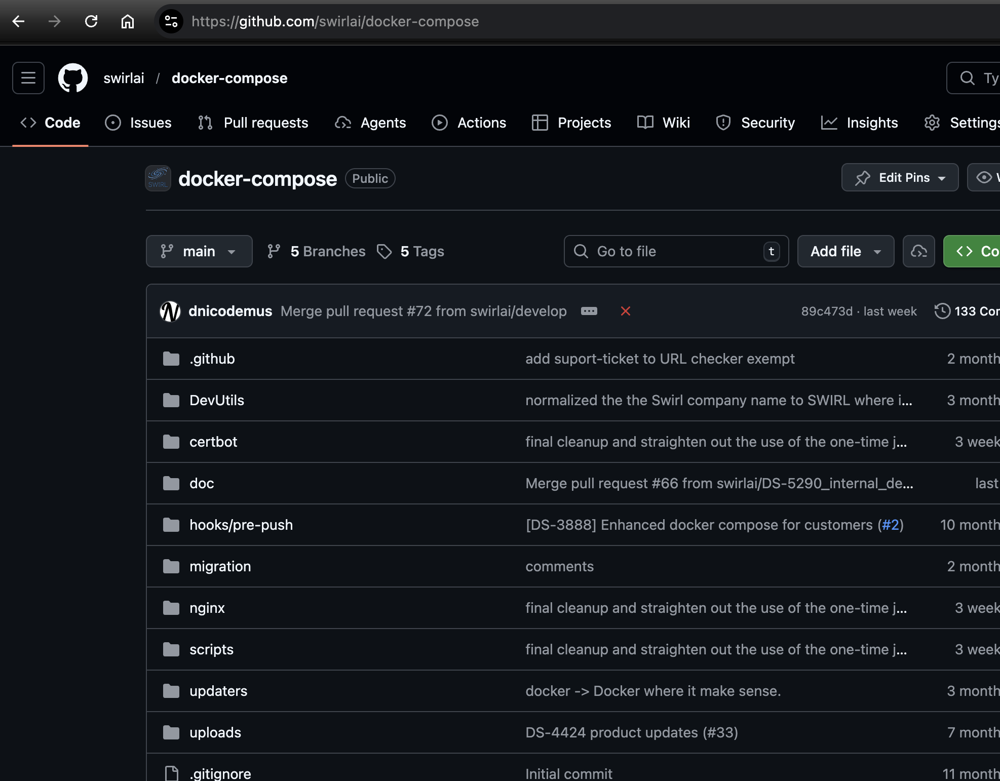

<details markdown="block">
  <summary>
    Table of Contents
  </summary>
  {: .text-delta }
- TOC
{:toc}
</details>

<span class="big-text">Quick Start Guide</span><br/><span class="med-text">Enterprise Edition</span>

{: .warning }
Please [contact SWIRL](mailto:hello@swirlaiconnect.com) for access to SWIRL Enterprise.

---

## System Requirements

* The recommended minimum system configuration is a **32-core server**, with **64 GB of memory** and at least **500 GB of available disk space**. This configuration supports up to **25 users**. [View recommended cloud instances for AWS, Azure and GCP](#recommended-cloud-instances).

## Installing SWIRL via Azure Marketplace

Deploy SWIRL quickly and privately on a VM in your Azure tenant.



### >> Click "Get it now" to install: [https://marketplace.microsoft.com/en-us/product/virtual-machines/swirlcorporation1684335149355.swirl_vm_offer_poc?tab=Overview](https://marketplace.microsoft.com/en-us/product/virtual-machines/swirlcorporation1684335149355.swirl_vm_offer_poc?tab=Overview)

## Installing SWIRL via Docker

Deploy SWIRL quickly and privately, anywhere Docker runs!



### >> Follow instructions here: [https://github.com/swirlai/docker-compose](https://github.com/swirlai/docker-compose)

## Verifying SWIRL Startup

1. Open a new command line and check the running containers:

    ```shell
    docker ps
    ```

    The output should look like this:  
    

2. Open a browser and navigate to <http://localhost:8000> or <http://localhost:8000/galaxy>  

3. If the search page loads, click `Log Out` in the top-right corner. You’ll see the login page:  
    

4. Log in with:

   - **Username:** `admin`  
   - **Password:** `password`  

   {: .warning }
   If you receive a warning about the password being compromised, follow these steps:  
   [Change the super user password](Admin-Guide#changing-the-super-user-password)

5. Enter a search term and press `Search`. The ranked results should appear:  
    

    If no results appear or an error occurs, please [contact support](Quick-Start-Enterprise-1.md#support).

## Enabling AI Features

{: .warning }
To use **Generate AI Insights** (RAG) or **AI Search Assistant**, at least one AI provider must be activated.

1. Go to [http://localhost:8000/swirl/aiproviders/](http://localhost:8000/swirl/aiproviders/).
2. Review the **pre-loaded AI providers**.
3. To edit a provider, add its ID to the URL. Example:  
   <http://localhost:8000/swirl/aiproviders/16/>

    

4. Use the **"Raw Data"** form at the bottom to make changes, then click **PUT** to save.

    To function correctly, an AI provider must:

    - Have `"active": true` set.
    - Include `"rag"` and/or `"chat"` in the `"tags"` list.
    - Include `"rag"` and/or `"chat"` in the `"defaults"` list.
    - Have a valid API key (if required).

5. To create a new provider, **copy an existing one** and paste it as a new entry.

    To use **different AI providers** for **RAG and AI Search Assistant**, adjust the `"defaults"` list:

    - Example:  
      - **OpenAI GPT-4** → `"defaults": ["rag"]`
      - **Azure/OpenAI GPT-4o** → `"defaults": ["chat"]`

6. Once an active provider for **RAG** exists, click **Generate AI Insights**.  
    

7. To access **SWIRL AI Search Assistant**, visit:  
   [http://localhost:8000/galaxy/chat](http://localhost:8000/galaxy/chat)

8. Ask a question, such as:  
   *“Tell me about SWIRL AI Connect?”*

    

## Stopping SWIRL

To stop SWIRL, use one of the following methods:

1. **Via Docker Desktop:**  
   

2. **Using CTRL+C in the terminal:**  
   

3. **Via a separate terminal:**

```shell
docker compose stop
```

   

These methods **preserve** the SWIRL database. If you don't need to save data, press **CTRL+C** **twice** to stop SWIRL instantly.

## Optional Steps

- Customize SWIRL for any organization
  - [Upload a branding configuration](Admin-Guide.html#changing-the-galaxy-logos-and-branding) including logos and Galaxy control labels
  - [Customize the AI Search RAG prompt](AI-Search.html#customizing-the-ai-search-rag-prompt) and the [AI Search Assistant prompt](AI-Search-Assistant.html#customizing-the-ai-search-assistant-prompts)

- Manage SWIRL via **Galaxy UI**:
  - Click the profile avatar (top-right corner).
  - Click **Manage SWIRL** ([http://localhost:8000/swirl/](http://localhost:8000/swirl/)).

## Microsoft 365 Integration

To connect SWIRL with **Microsoft 365**, you need:

- **Admin access** to the Azure/M365 tenant.
- **App registration** in Azure.
- **App ID and secrets** added to SWIRL.

Setup takes ~1 hour. Follow the guide: [Microsoft 365 Integration Guide](M365-Guide)

For additional support, please [contact SWIRL](Quick-Start-Enterprise-1.md#support).

## Google Workspace Integration

To connect SWIRL with **Google Workspace**, you need:

- **Admin access** to the Google Workspace tenant.
- **App registration** in Google Workspace.
- **App ID and secrets** added to SWIRL.

Setup takes ~1 hour. Follow the guide: [Google Workspace Integration Guide](GoogleWorkspace-Guide.html)

For additional support, please [contact SWIRL](Quick-Start-Enterprise-1.md#support).

## Persisting Configuration Changes

1. Identify your SWIRL Docker container (with `app` in the name):  
   

2. Copy the `.env` file outside Docker:  
   

3. Stop the containers:  
   

4. Modify `docker-compose.yaml`:

   **Before:**  
   

   **After:**  
   

5. Restart SWIRL:

```shell
docker compose pull && docker compose up
```

## Running SWIRL Commands

Use the following sequence to run Django or SWIRL commands:

```shell
APP_CID=$(docker ps -q -f name=app)
docker exec -it $APP_CID /bin/bash
```

Then run:

```shell
python manage.py <django-command>
```

_or_

```shell
python swirl.py <swirl-command>
```

Example: `python manage.py makemigrations`

## Migrating from SWIRL Community

### Migrating SearchProviders

Before migrating, consider [deleting the preloaded SearchProviders](SP-Guide.html#editing-a-searchprovider) in the SWIRL Enterprise installation. 

1. Locate the `migrate_sp.py` script. As of SWIRL 4.4, this is located in the `DevUtils` folder. If you are running an earlier version please [request it from support](#support)

2. Go to the `swirl/SearchProviders` endpoint on the SWIRL server. Copy the entire JSON list to the clipboard, then paste this into a text file. Save the text file - for example, to `mySPs.json`

3. Run the script:
`python migrate_sp.py myCommunitySPs.json myEnterpriseSPs.json`

4. Open the output file. Copy and paste the contents into the input box at the bottom of the same endpoint `/swirl/SearchProviders` of your SWIRL Enterprise installation. Click the `PUT` button.

5. The page should refresh and show you the new SearchProviders. (If there were already SearchProviders loaded, the new ones will be later in the list.)

Note any errors, and feel free to [contact support](#support) for assistance.

### Migrating OpenAI/Azure OpenAI settings

1. Go to the `/swirl/aiproviders/` endpoint in the SWIRL Enterprise installation.


2. Locate the OpenAI or AzureOpenAI preloaded configuration.

3. Copy the API key from the Community `.env` file, or the appropriate environment 
variable, to the `credentials` field in the Enterprise AI Provider. For example:

For OpenAI:
```
% echo $OPENAI_API_KEY
<your-key-here>
```

For Azure/OpenAI: 
```
% echo $AZURE_OPENAI_KEY
<your-api-key>
% echo $AZURE_OPENAI_ENDPOINT
<your-azure-openai-endpoint-url>
% echo $AZURE_MODEL
<your-azure-openai-model>
```

Set the Enterprise AI Provider configuration `active` to `true`. Set the `tags` and `default` lists to include `rag` and `chat`.

4. Refresh the Galaxy UI. The `Generate AI Insights` switch in the [Galaxy Search UI](https://docs.swirlaiconnect.com/User-Guide-Enterprise.html#the-ai-search-form-explained) should now be available, and the `SWIRL AI Assistant` (at `/galaxy/chat`), or use the link under the profile icon (top/right).

### Migrating M365 Authentication

1. Go to the `swirl/authenticators/Microsoft` endpoint in the SWIRL Enterprise installation. 

2. Copy the `Client Id` and `Client Secret` from the [M365 Azure App Registration](https://portal.azure.com/#view/Microsoft_AAD_RegisteredApps/ApplicationsListBlade) or your Community `.env` file as noted here in the [Microsoft 365 Integration Guide](https://docs.swirlaiconnect.com/M365-Guide.html#configure-the-microsoft-authenticator). 

Note that you may have to modify the existing app registration if URL of the SWIRL server is changing.

## Updating SWIRL 

{: .warning }
Be sure to complete all steps under [Persisting Configuration Changes](Quick-Start-Enterprise-1.md#persisting-configuration-changes) before upgrading.

Use the following commands to update SWIRL:

```shell
docker compose pull
docker compose stop
docker compose up -d
```

Then monitor the logs:

```shell
docker compose logs -f app
```

Once SWIRL has restarted, run:

```shell
python swirl.py reload_ai_prompts
python manage.py load_authenticators swirl/fixtures/DefaultAuthenticators.json
```

If this release includes updates to any SearchProvider used in your setup, update it:

```shell
python manage.py load_fixture SearchProviders/<searchprovider-name>
```

Refer to [Running SWIRL Commands](Quick-Start-Enterprise-1.md#running-swirl-commands) above for details.

To confirm the upgrade, repeat the [Verifying SWIRL Startup](Quick-Start-Enterprise-1.md#verifying-swirl-startup) steps.

# Recommended Cloud Instances

| Cloud Platform         | Instance / Machine Type | vCPUs | RAM    | Default / Local Storage |
| ---------------------- | ----------------------- | ----- | ------ | ----------------------- |
| **AWS EC2**            | `c6i.8xlarge`           | 32    | 64 GiB | EBS-only                |
|                        | `c7g.8xlarge`           | 32    | 64 GiB | EBS-only                |
| **GCP Compute Engine** | `n2-custom-32-65536`    | 32    | 64 GB  | None (customizable)     |
|                        | `c2d-standard-32`       | 32    | 128 GB | None (customizable)     |
| **Azure VMs**          | `Standard_F32s_v2`      | 32    | 64 GiB | OS disk only            |

