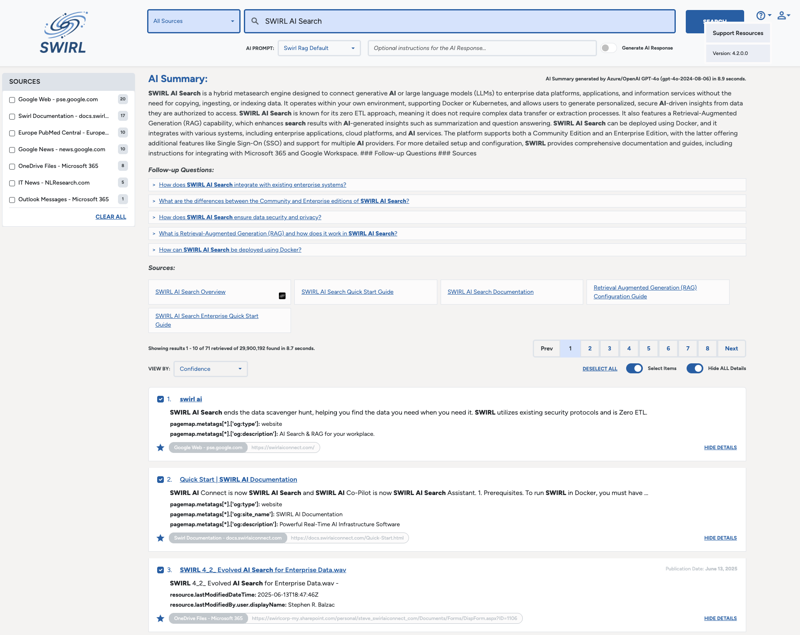
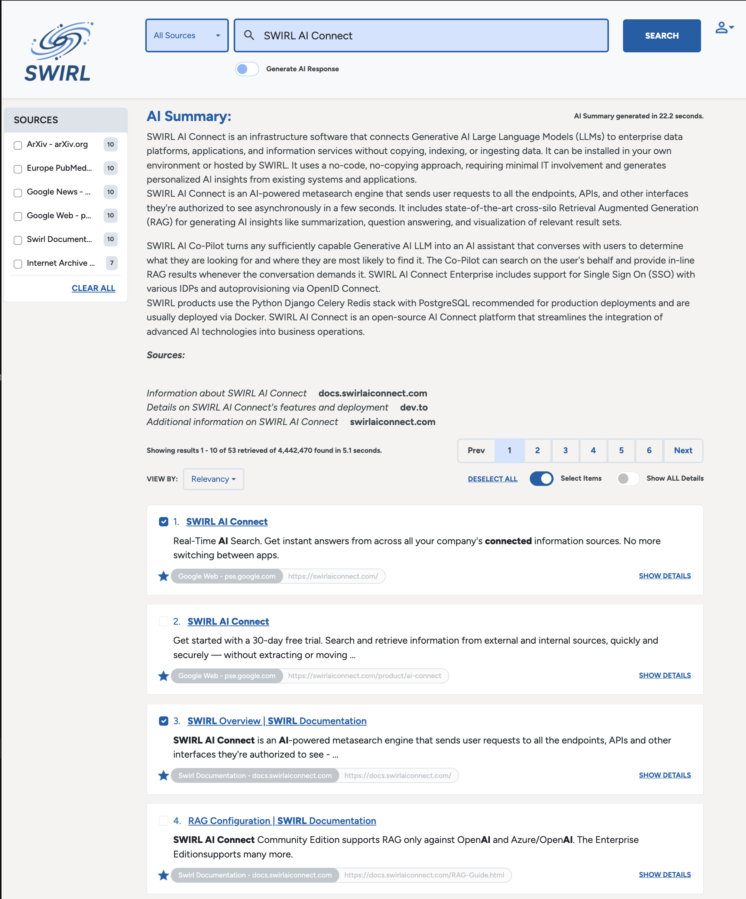
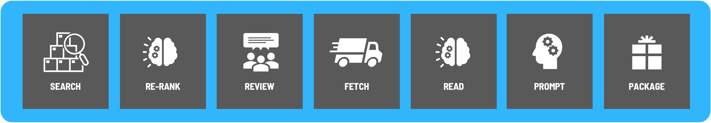

<details markdown="block">
  <summary>
    Table of Contents
  </summary>
  {: .text-delta }
- TOC
{:toc}
</details>

# Retrieval Augmented Generation (RAG) Configuration - Community Edition

{: .warning }
This document applies only to the SWIRL AI Connect, Community Edition. [Switch to the AI Connect, Enterprise Edition guide](AI-Connect.html)

SWIRL supports Real Time [Retrieval Augmented Generation (RAG)](index.html#what-is-retrieval-augmented-generation-rag-does-swirl-support-it) out of the box, using result snippets and/or the full text of fetched result pages. 

# Setting up RAG

* Install SWIRL as noted in the [Quick Start Guide](Quick-Start.html#local-installation), including the latest version of the Galaxy UI.

* Add either your OpenAI API key or your Azure OpenAI API credentials to the `.env` file:

```
OPENAI_API_KEY='your-key-here'
```
*Check out [OpenAI's YouTube video](https://youtu.be/nafDyRsVnXU?si=YpvyaRvhX65vtBrb) if you don't have an OpenAI API Key.*

```
AZURE_OPENAI_KEY=<your-key>
AZURE_OPENAI_ENDPOINT=<your-azure-openai-endpoint-url>
AZURE_MODEL=<your-azure-openai-model>
```

{: .warning }
SWIRL AI Connect Community Edition supports RAG only against OpenAI and Azure/OpenAI. The [Enterprise Edition](AI-Connect.html#connecting-to-generative-ai-gai-and-large-language-models-llms)supports many more. 

* When installing for PRODUCTION use, change the following line in `static/api/config/default` from:

```
"webSocketConfig": {
    "url": "ws://<yourhost>:<your-port>/chatgpt-data"
  }
``` 

...to...

```
"webSocketConfig": {
    "url": "wss://<yourhost>:<your-port>/chatgpt-data"
  }
```

*The default `ws:` prefix can be used locally but should NEVER be used in production as it is not secure!*

* Add the following configuration to the `page_fetch_config_json` parameter of each SearchProvider you wish to have participate in RAG:

```
"page_fetch_config_json": {
        "cache": "false",
        "headers": {
            "User-Agent": "Swirlbot/1.0 (+http://swirl.today)"
        },
        "timeout": 10
}, 
```

Adjust the `timeout` value if necessary. Change the `User-Agent` string as needed, and/or authorize it to fetch pages from internal applications.

You can also override the default timeout value with a URL parameter in the Galaxy UI. For example, to set a timeout of 90 seconds: `http://localhost:8000/galaxy/?q=gig%20economics&rag=true&rag_timeout=90`

* Restart SWIRL:

```
python swirl.py restart
```

* Go to the Galaxy UI ([http://localhost:8000/galaxy/](http://localhost:8000/galaxy/)). The "Generate AI Response" switch should be "off".

* Run a search. Results appear quickly after you press the "Search" button ([http://localhost:8000/galaxy/?q=epmc:future+of+ai+care](http://localhost:8000/galaxy/?q=SWIRL+AI+Connect)):


* If you wish to manually select the results to RAG with, click the "Select Items" switch to make the shopping cart appear. Results that SWIRL thinks should be used in RAG will be pre-checked. Check or uncheck results, and optionally sort and/or filter them. When ready, click the "Generate AI Response" switch. A spinner will appear. The RAG response will appear several seconds later depending on a variety of factors. :slightly_smiling_face:


* Verify the RAG insight you received by reviewing the citations below the RAG response.

{: .highlight }
To cancel a RAG process, click the "Generate AI Summary" toggle off.

{: .warning }
By default, SWIRL's RAG processing utilizes the *first 10 results* that are selected either automatically or manually using the "Select Items" option. To change the number, specify `SWIRL_RAG_MAX_TO_CONSIDER` in the .env file as noted in the [AI Connect Guide](./AI-Connect.md#configuration-options).

## Notes

* The RAG process is as follows:



* The community edition of SWIRL is intended to RAG with sources you can fetch without authenticating. If you need to perform RAG with content from enterprise services like Microsoft 365, ServiceNow, Salesforce, Atlassian with OAUTH2 and SSO, please [contact us for information about SWIRL Enterprise](mailto:hello@swirl.today) - which supports all of that, and more, out of the box.

* RAG Page fetch configurations are preloaded for the following SearchProviders:

* [European PMC](https://github.com/swirlai/swirl-search/blob/main/SearchProviders/europe_pmc.json) 
* [Google Web](https://github.com/swirlai/swirl-search/blob/main/SearchProviders/google.json)
* [Google News](https://github.com/swirlai/swirl-search/blob/main/SearchProviders/google.json)
* [LinkedIn](https://github.com/swirlai/swirl-search/blob/main/SearchProviders/google.json)
* [SWIRL Documentation](https://github.com/swirlai/swirl-search/blob/main/SearchProviders/google.json)

* RAG processing is available through a single API call, e.g. `?qs=metasearch&rag=true`.  See the [Developer Guide](https://docs.swirl.today/Developer-Guide.html#get-synchronous-results-with-the-qs-url-parameter) for more details about the `?qs=` parameter.

* The default timeout value (60 seconds) and the text to display when the timeout is exceeded cab be configured in the `static/api/config/default` file.

```
"webSocketConfig": {
    "url": "ws://localhost:8000/chatgpt-data",
    "timeout": 60000,
    "timeoutText": "Timeout: No response from Generative AI."
  }
```
