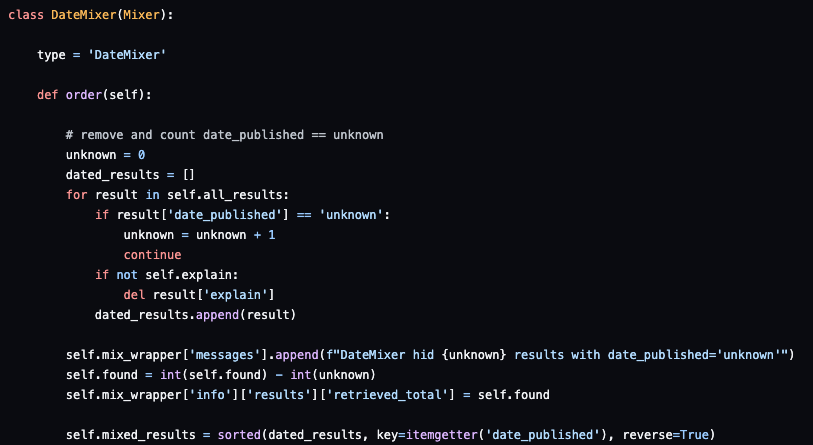

<br/>

# SWIRL SEARCH 1.2

This version incorporates tons of feedback around developer usability!
​
## Changes

:small_blue_diamond: New Object Oriented Connectors & Mixers

The Connectors: RequestsGet (SOLR etc), Elastic, Sqlite3
The Mixers: RelevancyMixer, DateMixer, Stack1Mixer, Stack2Mixer, Stack3Mixer, StackNMixer

Here's the new DateMixer - everything but the imports - a 92% reduction in code from 1.1:



The only change required to use these connectors is to change the "Connector" setting in the [SearchProvider](../SearchProviders/current.json). All of the included providers have been updated.

For more information consult the Developers Guide [Connectors](https://github.com/sidprobstein/swirl-search/wiki/4.-Object-Reference#connectors) and [Mixers](https://github.com/sidprobstein/swirl-search/wiki/4.-Object-Reference#mixers) sections

<br/>

:small_blue_diamond: The new Mixers sort the Received messages for easy display:

```
"messages": [
        "##S#W#I#R#L##1#.#2##############################################################",
        "Retrieved 10 of 4740000000 results from: Strategy Consulting (web/Google PSE)",
        "Retrieved 10 of 249000 results from: Enterprise Search (web/Google PSE)",
        "Retrieved 10 of 1332 results from: IT News (web/NLResearch.com)",
        "Retrieved 10 of 382 results from: Mergers & Acquisitions (web/Google PSE)",
        "Retrieved 8 of 8 results from: Company Funding Records (local/sqlite3)",
        "Retrieved 6 of 6 results from: ENRON Email (local/elastic)",
        "Retrieved 1 of 1 results from: techproducts (local/solr)",
        "Post processing of results by cosine_relevancy_processor updated 55 results",
        "DateMixer hid 31 results with date_published='unknown'",
        "Results ordered by: DateMixer"
    ]
```

Thanks to [natsort](https://pypi.org/project/natsort/), which is now required by SWIRL for this amazing capability! To install natsort:

```
pip install natsort
```

<br/>

:small_blue_diamond: No longer boosting single term queries

 

<br/>

## Known Issues

:small_blue_diamond: [Creating searches from a browser with q=](https://github.com/sidprobstein/swirl-search/wiki/2.-User-Guide#creating-a-search-object-with-the-q-url-parameter) can sometimes create two Search objects. 

This is because of browser prefetch. [Turn off Chrome prefetch](https://www.technipages.com/google-chrome-prefetch). [Turn off Safari prefetch](https://stackoverflow.com/questions/29214246/how-to-turn-off-safaris-prefetch-feature)

Please [report any issues](https://github.com/sidprobstein/swirl-search/issues/) with this or the [rerun function](USER_GUIDE.md#re-starting-re-running--re-trying-a-search).

<br/>

:small_blue_diamond: The q= search federation timer has been set more aggressively; if you are redirected to a results page and see the message "Results Not Ready Yet", wait a second or two and reload the page or hit the GET button and it should appear.

<br/>

:small_blue_diamond: The [Django admin form for managing Result objects](http://localhost:8000/admin/swirl/result/) throws a 500 error. P2.

<br/>

:small_blue_diamond: Watch out for log files in logs/*.log. They'll need periodic purging. Rollover is planned for a future release.

<br/>

# Documentation

* [Quick Start](https://github.com/sidprobstein/swirl-search/wiki/1.-Quick-Start)
* [User Guide](https://github.com/sidprobstein/swirl-search/wiki/2.-User-Guide)

<br/>

# Support

:small_blue_diamond: [Create an Issue](https://github.com/sidprobstein/swirl-search/issues) if something doesn't work, isn't clear, or should be documented - we'd love to hear from you!

:small_blue_diamond: Paid support and consulting are available... [contact SWIRL](mailto:support@swirl.today) for more information.
