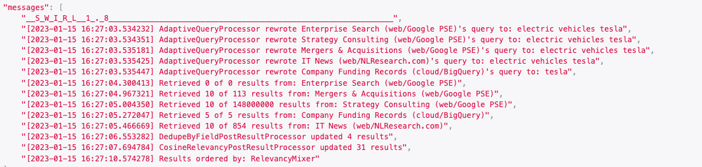
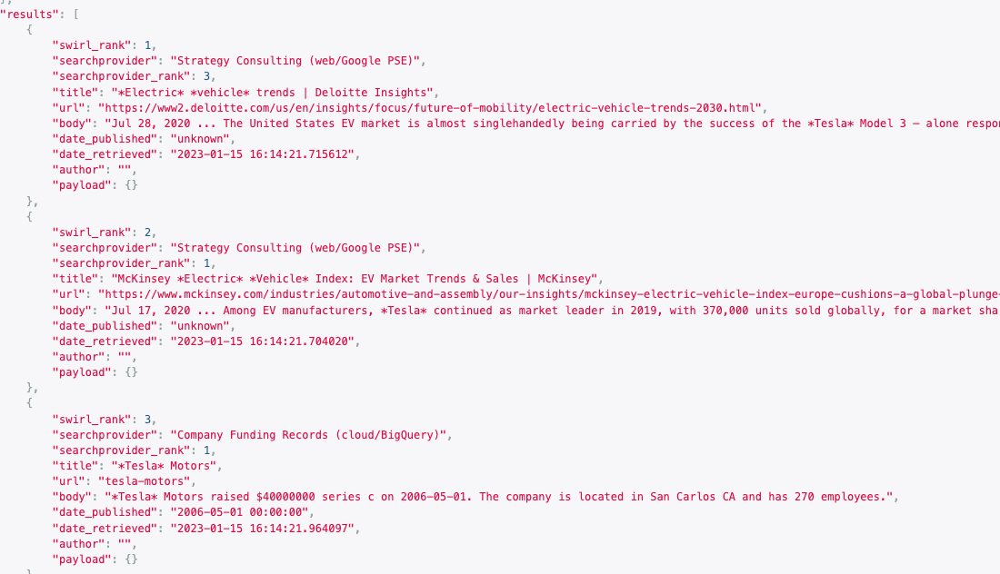
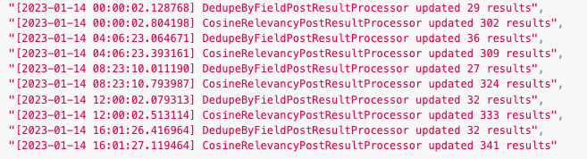

<br/>

# SWIRL SEARCH 1.8

This version adds the ability to target specific providers with tag searches (e.g. company:tesla), and the new subscribe feature that causes SWIRL to continuously monitor for new, relevant results - plus a new BigQuery connector!

## PLEASE STAR OUR REPO: [http://swirl.today/](http://swirl.today)

<br/>



## New Features

:small_blue_diamond: SWIRL now supports targeting of tagged SourceProviders using the tag: prefix. 

For example:

```
electric vehicle company:tesla
```

The ```AdaptiveQueryProcessor``` rewrites this query to ```electric vehicle tesla``` for most providers. But providers with the tag ```company``` will have it rewritten to just ```tesla``. So this search retrieves typical news results PLUS funding records from BigQuery:



The latter would not have matched the full query. Tag enables expressive querying where specific types of repositories are targeted with appropriate search terms, and SWIRL unifies the results.

<br/>

:small_blue_diamond: Subscribe to any Search. SWIRL will check for new results every few hours, and automatically detects & discards duplicates by URL or document similarity.



More details: [Subscribing to a Search](https://github.com/sidprobstein/swirl-search/wiki/2.-User-Guide#subscribing-to-a-search)

<br/>

:small_blue_diamond: New [Google BigQuery](https://github.com/sidprobstein/swirl-search/wiki/3.-Developer-Guide#bigquery) Connector plus SearchProvider for the [Funding Dataset](https://github.com/sidprobstein/swirl-search/wiki/3.-Developer-Guide#funding-data-set):

```
{
    "name": "Company Funding Records (cloud/BigQuery)",
    "connector": "BigQuery",
    "query_template": "select {fields} from `{table}` where search({field1}, '{query_string}') or search({field2}, '{query_string}');",
    "query_processor": "",
    "query_processors": [
        "AdaptiveQueryProcessor"
    ],
    "query_mappings": "fields=*,sort_by_date=fundedDate,table=funding.funding,field1=company,field2=city",
    "result_processor": "",
    "result_processors": [
        "MappingResultProcessor"
    ],
    "result_mappings": "title='{company}',body='{company} raised ${raisedamt} series {round} on {fundeddate}. The company is located in {city} {state} and has {numemps} employees.',url=permalink,date_published=fundeddate,NO_PAYLOAD",
    "credentials": "/path/to/bigquery/token.json",
    "tags": [
        "Company",
        "BigQuery"
    ]
}
```

More details: [Google BigQuery Connector](https://github.com/sidprobstein/swirl-search/wiki/3.-Developer-Guide#bigquery)

<br/>

:small_blue_diamond: SWIRL 1.8 supports pipelining of Processors for pre-query, query, result and post-result transformation of queries, responses and results.

For example, the new Search post-result pipeline:

```
"post_result_processors": [
        "DedupeByFieldPostResultProcessor",
        "CosineRelevancyPostResultProcessor"
]
```

More details: [Processing Pipelines](https://github.com/sidprobstein/swirl-search/wiki/3.-Developer-Guide#processing-pipelines)

<br/>

:small_blue_diamond: The new DedupeByFieldPostResultProcessor detects and removes duplicates on any field - 'url' by default.

<br/>

:small_blue_diamond: The new DedupeBySimilarityPostResultProcessor detects and removes duplicates by similarity between - 'title' and 'body' field (by default), with a cut-off threshold of .95.

More details: [Detecting and Removing Duplicate Results](https://github.com/sidprobstein/swirl-search/wiki/2.-User-Guide#detecting-and-removing-duplicate-results)

<br/>

## Changes

:small_blue_diamond: swirl.py can now be invoked with --debug

```
swirl-search% python swirl.py --debug restart core
```

This configuration starts django using the built-in runserver, instead of daphne, and sets the logging level to DEBUG.

<br/>

## Known Issues

:small_blue_diamond: The PostgreSQL Connector no longer causes errors in the celery-worker log if PostgreSQL isn't installed

Please follow the updated [installation instructions](https://github.com/sidprobstein/swirl-search/wiki/3.-Developer-Guide#installing-the-postgresql-driver) before attempting to install a SearchProvider that uses the PostgreSQL Connector. We hope to make this easier in a future release.

<br/>

:small_blue_diamond: [Creating searches from a browser with q=](https://github.com/sidprobstein/swirl-search/wiki/2.-User-Guide#creating-a-search-object-with-the-q-url-parameter) can sometimes create two Search objects. 

This is because of browser prefetch AKA predictive service. [Turn off Chrome prediction service](https://www.ghacks.net/2019/04/23/missing-chromes-use-a-prediction-service-setting/). [Turn off Safari prefetch](https://stackoverflow.com/questions/29214246/how-to-turn-off-safaris-prefetch-feature)

Please [report any issues](https://github.com/sidprobstein/swirl-search/issues/) with this to [support](#support).

<br/>

# Upgrading

:warning: Version 1.8 requires database migration. Details: [Upgrading SWIRL](https://github.com/sidprobstein/swirl-search/wiki/4.-Admin-Guide#upgrading-swirl)

<br/>

# Documentation Wiki

* [Quick Start](https://github.com/sidprobstein/swirl-search/wiki/1.-Quick-Start)
* [User Guide](https://github.com/sidprobstein/swirl-search/wiki/2.-User-Guide)
* [Developer Guide](https://github.com/sidprobstein/swirl-search/wiki/3.-Developer-Guide)
* [Admin Guide](https://github.com/sidprobstein/swirl-search/wiki/4.-Admin-Guide)

<br/>

# Support

:small_blue_diamond: [Create an Issue](https://github.com/sidprobstein/swirl-search/issues) if something doesn't work, isn't clear, or should be documented

:small_blue_diamond: Email: [support@swirl.today](mailto:support@swirl.today) with issues, requests, questions, etc - we'd love to hear from you!
