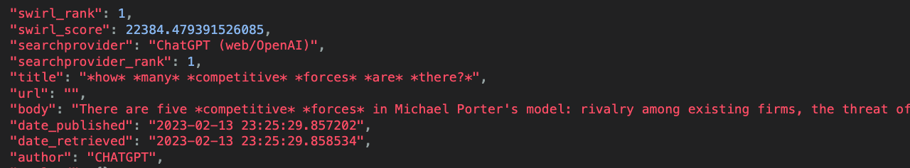
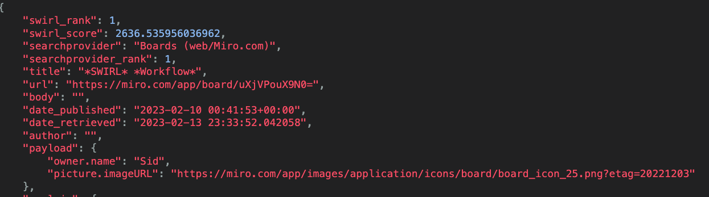

<br/>

# SWIRL SEARCH 1.9

This version adds a ChatGPT connector, SearchProvider for Miro.com and more!

## PLEASE STAR OUR REPO: [http://swirl.today/](http://swirl.today)

<br/>

## New Features

:small_blue_diamond: OpenAI ChatGPT Connector & SearchProvider:



The Connector rewrites keyword queries into question form, and answers them. It doesn't alter queries that are already questions, as shown above. ChatGPT responses are usually relevant, regardless of accuracy.

:small_blue_diamond: A set of experiemental ChatGPT Processors can be used to rewrite queries as questions, booleans and more.

* ChatGPTQueryImproverProcessor - writes a better query
* ChatGPTQueryExpanderProcessor - writes a broader query using top 5 concepts
* ChatGPTQueryBooleanProcessor - writes a boolean + phrases; 3+ terms works best

<br/>

:small_blue_diamond: New Miro SearchProvider allows searching drawings.

```
{
    "name": "Boards (web/Miro.com)",
    "connector": "RequestsGet",
    "url": "https://api.miro.com/v2/boards",
    "query_template": "{url}?query={query_string}",
    "query_processors": [
        "AdaptiveQueryProcessor"
    ],
    "query_mappings": "",
    "result_processors": [
        "MappingResultProcessor"
    ],
    "response_mappings": "FOUND=total,RESULTS=data",
    "result_mappings": "title=name,body=description,url=viewLink,date_published=modifiedAt,owner.name,picture.imageURL,NO_PAYLOAD",
    "credentials": "bearer=your-miro-api-token",
    "tags": [
        "Drawings"
    ]
}
```



<br/>

## Changes

:small_blue_diamond: Starting queries with a SearchProvider tag now limits the search to just providers with that tag.

For example:

```
company:tesla
```

With the [funding dataset](https://github.com/sidprobstein/swirl-search/wiki/3.-Developer-Guide#funding-data-set) installed, this query will return records like:

```
{
        "swirl_rank": 1,
        "swirl_score": 438.9910228828939,
        "searchprovider": "Company Funding Records (cloud/BigQuery)",
        "searchprovider_rank": 1,
        "title": "*Tesla* Motors",
        "url": "tesla-motors",
        "body": "*Tesla* Motors raised $40000000 series c on 2006-05-01. The company is located in San Carlos CA and has 270 employees.",
        "date_published": "2006-05-01 00:00:00",
        "date_retrieved": "2023-02-13 23:34:52.306501",
        "author": "",
        "payload": {},
        "explain": {
            "stems": "tesla",
            "title": {
                "tesla_*": 0.8357298742623626,
                "Tesla_0": 0.8357298742623626,
                "result_length_adjust": 1.0,
                "query_length_adjust": 1.0
            },
            "body": {
                "Tesla_0": 0.7187157993182859,
                "result_length_adjust": 1.0,
                "query_length_adjust": 1.0
            }
        }
    }
```

:small_blue_diamond: [RequestsGet now supports Bearer Tokens](https://github.com/sidprobstein/swirl-search/issues/80)

This is used by the [Miro SearchProvider](../SearchProviders/miro.json):

```
    "credentials": "bearer=your-api-token-here",
```

<br/>

## Resolved Issues

:small_blue_diamond: [BigQuery connector/SP returns "Error: list index out of range" on zero results #96](https://github.com/sidprobstein/swirl-search/issues/96)

## Known Issues

:small_blue_diamond: [Creating searches from a browser with q=](https://github.com/sidprobstein/swirl-search/wiki/2.-User-Guide#creating-a-search-object-with-the-q-url-parameter) can sometimes create two Search objects. 

This is because of browser prefetch AKA predictive service. [Turn off Chrome prediction service](https://www.ghacks.net/2019/04/23/missing-chromes-use-a-prediction-service-setting/). [Turn off Safari prefetch](https://stackoverflow.com/questions/29214246/how-to-turn-off-safaris-prefetch-feature)

Please [report any issues](https://github.com/sidprobstein/swirl-search/issues/) with this to [support](#support).

<br/>

# Upgrading

:warning: Version 1.9 requires database migration. 

<br/>

# Documentation Wiki

:small_blue_diamond: [Quick Start](https://github.com/sidprobstein/swirl-search/wiki/1.-Quick-Start)
:small_blue_diamond: [User Guide](https://github.com/sidprobstein/swirl-search/wiki/2.-User-Guide)
:small_blue_diamond: [Developer Guide](https://github.com/sidprobstein/swirl-search/wiki/3.-Developer-Guide):small_blue_diamond: [Admin Guide](https://github.com/sidprobstein/swirl-search/wiki/4.-Admin-Guide)

<br/>

# Support

:small_blue_diamond: [Create an Issue](https://github.com/sidprobstein/swirl-search/issues) if something doesn't work, isn't clear, or should be documented

:small_blue_diamond: Email: [support@swirl.today](mailto:support@swirl.today) with issues, requests, questions, etc - we'd love to hear from you!
