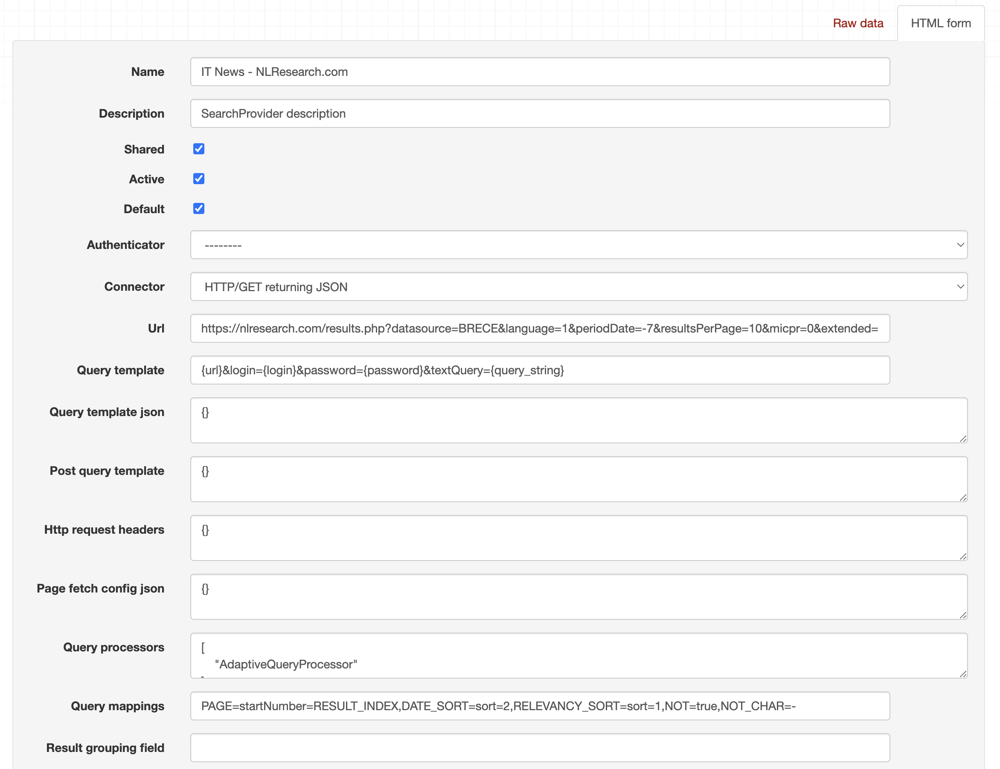
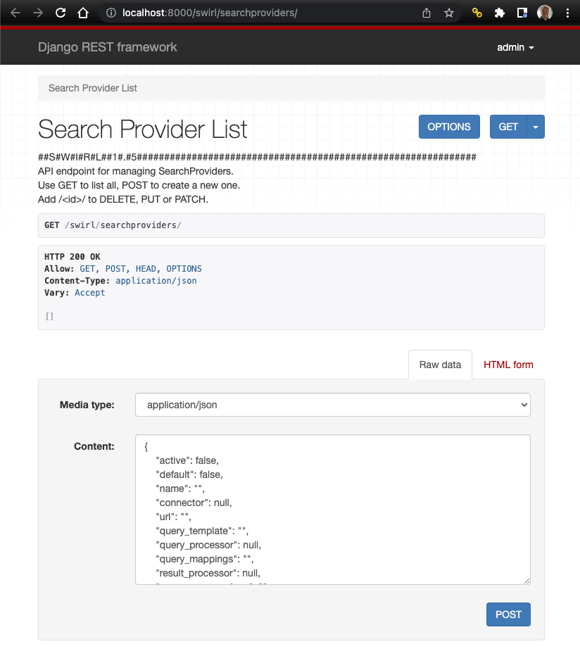
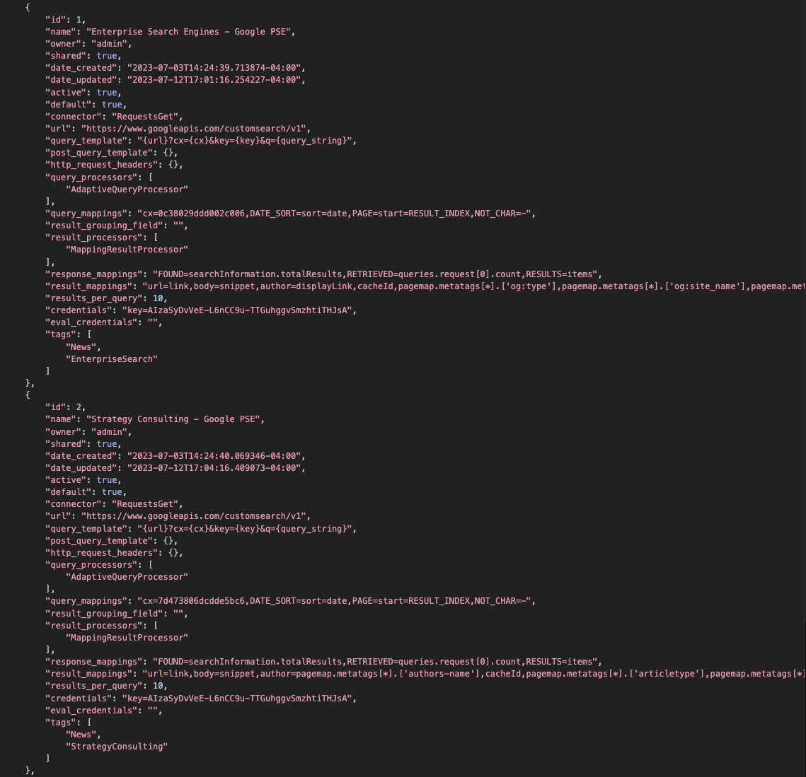
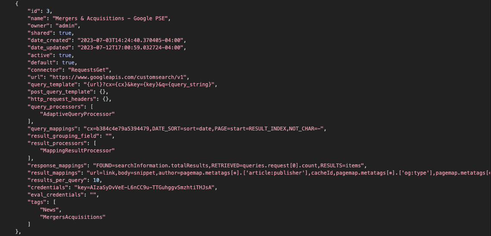
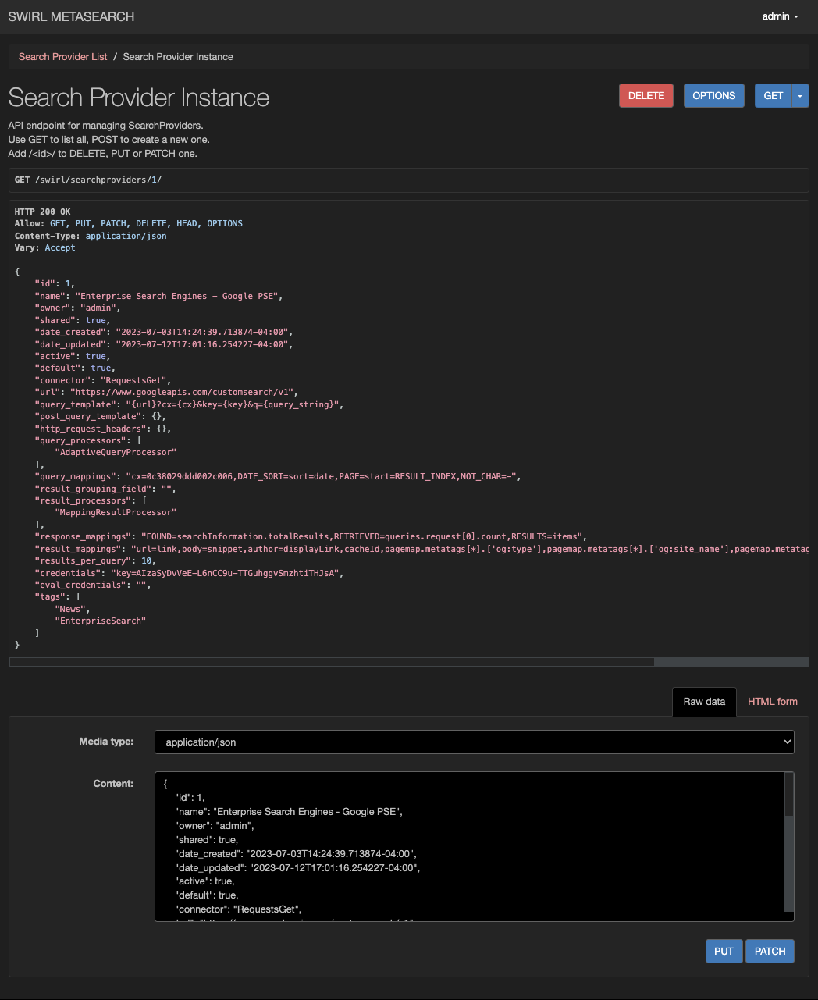

<details markdown="block">
  <summary>
    Table of Contents
  </summary>
  {: .text-delta }
- TOC
{:toc}
</details>

# SearchProviders Guide - Community Edition

{: .warning }
This version applies to the Community Edition of SWIRL!

{: .highlight }
SWIRL queries are subject to any rate limits or throttling imposed by the sources being queried.

SearchProviders are the essential element of SWIRL. They make it quick and easy to connect SWIRL to sources without writing any code.

SearchProviders are JSON objects. SWIRL's distribution comes preloaded with a variety of configurations for sources like Elastic, Solr, PostgreSQL, BigQuery, NLResearch.com, Miro.com, Atlassian, and more.

{: .highlight }
SWIRL includes a Google's Programmable Search Engines SearchProvider with live credentials so you can use SWIRL on web data right away. The credentials for these are shared with the SWIRL Community.  The EuropePMC SearchProvider, Arxiv.org and the SWIRL documentation are also enabled for search by default; no credentials are required for any of those sources.

[SearchProvider Example JSON](https://github.com/swirlai/swirl-search/tree/main/SearchProviders)

| SearchProvider | Description | Notes |
| ---------- | ---------- | ---------- | 
| arxiv.json | Searches the [arXiv.org](https://arxiv.org/) repository of scientific papers | No authorization required |
| asana.json | Searches Tasks in [Asana](https://asana.com/) | Requires an Asana personal access token |
| atlassian.json | Searches Atlassian [Confluence Cloud](https://www.atlassian.com/software/confluence), [Jira Cloud](https://www.atlassian.com/software/jira), and [Trello](https://trello.com/) Cards. | Requires a bearer token and/or Trello API key; Confluence searches the [CQL `text~` content](https://developer.atlassian.com/server/confluence/performing-text-searches-using-cql/) and Jira searches the [JQL `text~` content](https://support.atlassian.com/jira-software-cloud/docs/what-is-advanced-searching-in-jira-cloud/#Advancedsearching-textPerformingtextsearches) |
| blockchain-bitcoin.json | Searches [Blockchain.com](https://www.blockchain.com/) for specific Bitcoin Addresses (wallets) and Transactions IDs (hashes) | Requires a Blockchain.com API key |
| chatgpt.json | ChatGPT AI chatbot | Requires an OpenAI API key |
| company_snowflake.json | Searches the [Snowflake](https://www.snowflake.com/en/) `FreeCompanyResearch` dataset | Requires a Snowflake username and password |
| crunchbase.json | Searches organizations via the [Crunchbase](https://www.crunchbase.com/) basic API | Requires a Crunchbase.com API key |
| document_db.json | SQLite3 document database | [documents_db.csv](https://github.com/swirlai/swirl-search/tree/main/Data/documents_db.csv) |
| elastic_cloud.json | elasticsearch, cloud version | [Enron Email Dataset](Developer-Reference.html#enron-email-data-set) Requires cloud_id, credentials |
| elasticsearch.json | elasticsearch, local install | [Enron Email Dataset](Developer-Reference.html#enron-email-data-set) Requires host, port, credentials | 
| europe_pmc.json | Searches the [EuropePMC.org](https://europepmc.org/) repository of life-sciences literature | No authorization required |
| funding_db_bigquery.json | BigQuery funding database  | [Funding Dataset](Developer-Reference.html#funding-data-set) |
| funding_db_postgres.json  | PostgreSQL funding database | [Funding Dataset](Developer-Reference.html#funding-data-set) |
| funding_db_sqlite3.json  | SQLite3 funding database  | [Funding Dataset](Developer-Reference.html#funding-data-set) |
| github.json | Searches public repositories for Code, Commits, Issues, and Pull Requests | Requires a bearer token |
| google_news.json | Searches the [Google News](https://news.google.com/) feed | No authorization required |
| google_pse.json | Five Google Programmable Search Engines (PSE) | Includes shared SWIRL credentials; may return a 429 error if overused |
| hacker_news.json | Queries a [searchable version](https://hn.algolia.com/) of the Hacker News feeds | No authorization required |
| http_get_with_auth.json | Generic HTTP GET query with basic authentication | Requires url, credentials | 
| http_post_with_auth.json | Generic HTTP POST query with basic authentication | Requires url, credentials |
| hubspot.json | Searches the HubSpot CRM for Companies, Contacts, and Deals | Requires creation of a "Private Apps" API token by the Super Admin with [these scopes](images/HubSpot-scopes.png), and referencing the HubSpot Org ID in `result_mappings` field `url` value.  | 
| internet_archive.json | Searches the [Internet Archive Library](https://archive.org/) of items | No authorization required |
| littlesis.json | Searches the free [LittleSis.org](https://littlesis.org/) database of "who-knows-who at the heights of business and government" | No authorization required | 
| microsoft.json | Searches M365 Outlook Messages, Calendar Events, OneDrive Files, SharePoint Sites, and Teams Chat | See the [M365 Guide](M365-Guide.html) for details |
| miro.json | [Miro.com](https://miro.com) drawing service  | Requires a bearer token |
| movies_mongodb.json | Searches the [Mongodb Atlas](https://www.mongodb.com/) `sample_mflix` collection, `movies` sample table | Requires database username and password, plus Atlas cluster URL |
| newsdata_io.json | Newsdata.io internet news source | Requires username and password<br/>archive provider also included | 
| nlresearch.json | NLResearch.com is a premium and internet content search engine from [Northern Light](https://northernlight.com/) | Requires username and password |
| open_sanctions.json | Searches the [OpenSanctions.org](https://www.opensanctions.org/) database of sanctions targets and persons of interest | Requires and OpenSanctions API key | 
| opensearch.json  | OpenSearch 2.x | [Developer Guide](Developer-Reference.html#elastic--opensearch) |
| oracle.json | Tested against [Oracle](https://www.oracle.com/) 23c Free (and presumably supporting earlier versions) | Requires Oracle username and password |
| preloaded.json | All preloaded SearchProviders | Defaults in the SWIRL distribution |
| servicenow.json | Searches the Knowledge and Service Catalog centers of ServiceNow | Requires username and password |
| solr.json | the original, open source search engine, local install | Requires host, port, collection |
| solr_with_auth.json | The original, open source search engine, local install, secured | Requires host, port, collection, credentials |
| youtrack.json  | Searches JetBrains [YouTrack](https://www.jetbrains.com/youtrack/) Articles and Issues | Requires a bearer token |

## Activating a SearchProvider

To activate a preloaded SearchProvider, [edit it](#editing) and change:

``` json
    "active": false
```

to

``` json
    "active": true
```

Click the `PUT` button to save the change. You can use the `HTML Form` at the bottom of the page for convenience.



## Copy/Paste Install

If you have the JSON of SearchProvider, you can copy/paste into the form at the bottom of the SearchProvider endpoint.



1. Go to [http://localhost:8000/swirl/searchproviders/](http://localhost:8000/swirl/searchproviders/)
2. Click the `Raw data` tab on the form at the bottom of the page
3. Paste SearchProvider JSON (single record, or list of records) into the form and press the `POST` button
4. SWIRL will respond with the finished SearchProvider(s)

## Bulk Loading

Use the included [`swirl_load.py`](https://github.com/swirlai/swirl-search/blob/main/swirl_load.py) script to load any SearchProvider instantly, including lists of providers.

1. Open a terminal, `cd` into your `<swirl-home>` directory, and execute the following command:
``` shell
python swirl_load.py SearchProviders/provider-name.json -u admin -p your-admin-password
```

2. The script will load all SearchProvider configurations in the specified file at once and confirm.
3. Go to [http://localhost:8000/swirl/searchproviders/](http://localhost:8000/swirl/searchproviders/) to see them!




## Editing

Edit any SearchProvider by adding the `id` to the end of the `/swirl/searchproviders` URL. 

For example: `http://localhost:8000/swirl/searchproviders/1/`



From here, you can use the form at the bottom of the page to:

* DELETE this SearchProvider, forever
* Edit the configuration of the SearchProvider; don't forget to click `PUT` to save changes! 

## Query Templating

Most SearchProviders require a `query_template`. This is usually bound to `query_mappings` during the federation process. For example, here is the original `query_template` for the MongoDB movie SearchProvider:

```
    "query_template": "{'$text': {'$search': '{query_string}'}}",
```

This format is not actually JSON, but rather a string. The single quotes are required, so that the JSON can use double quotes. 

As of SWIRL 3.2.0, MongoDB all use the new `query_template_json` field, which stores the template as JSON. For example, here is the new MongoDB `query_template_json`:

```
"query_template_json": {
        "$text": {
            "$search": "{query_string}"
        }
    },
```

## Organizing SearchProviders with Active, Default and Tags

Three properties of SearchProviders are intended to allow expressive querying by targeting all or part of a query to groups of sources.

| Property | Description |
| ---------- | ---------- |
| Active | True/False setting that specifies if the SearchProvider is to receive Search queries or not. If `false`, the SearchProvider will not be queried, even if specified in a `searchprovider_list` |
| Default | True/False setting that specifies if the SearchProvider is to be queried for searches that don't specify a `searchprovider_list`. If `false`, the SearchProvider must be specified in the `searchprovider_list` |
| Tags | List of strings that organize providers into groups. Tags can be specified in combination with SearchProvider names and/or ids in `Search.searchprovider_list`, in the `providers=` [URL parameter](Developer-Guide.html#create-a-search-object-with-the-q-url-parameter), or in a query in the form `tag:term` |

The suggestion is that SearchProviders who are good for most any search be left with `Default` set to `True`. Providers specific to a topic should have `Default` set to `False` and then `"Tags": [ "topic1", "topic2" ]` etc. When creating a search this ensures that the best providers for general querying are used when no `searchprovider_list` is specified. When the user desires to target a specific SearchProvider set, any combination of Tags or SearchProvider `name` and `id` values may be used freely.

## Query Mappings

SearchProvider `query_mappings` are key/value pairs that define how to query a given SearchProvider. 

They include field mappings and configurations that SWIRL's processors (like the `AdaptiveQueryProcessor`) use to align the query with each SearchProvider's capabilities.

The following table summarizes the current `query_mappings` options:

| Mapping Format | Meaning | Example | 
| ---------- | ---------- | ---------- |
| key = value | Replace `key` with `value` if the `key` is enclosed in braces in the `provider.query_template`. |  ```"query_template": "{url}?cx={cx}&key={key}&q={query_string}","query_mappings": "cx=google-pse-key"``` |
| DATE_SORT=url-snippet | This identifies the string to insert into the URL for this SearchProvider if date sorting is specified in the search object. | `"query_mappings": "DATE_SORT=sort=date"` | 
| RELEVANCY_SORT=url-snippet | This identifies the string to insert into the URL for this SearchProvider if relevancy sorting is specified in the search object. | `"query_mappings": "RELEANCY_SORT=sort=relevancy"` | 
| PAGE=url-snippet | This identifies the string to insert into the URL for this SearchProvider for paging support. The specification should include either SWIRL variable `RESULT_INDEX` or `RESULT_PAGE` which will be the result number (e.g. 11) or page number (e.g. 2) | `"query_mappings": "PAGE=start=RESULT_INDEX"` |
| NOT=True | If present, this SearchProvider supports simple, single NOT operators | elon musk NOT twitter |
| NOT_CHAR=- | If present, this SearchProvider supports `-term` NOT operators | elon musk -twitter |

### Query Field Mappings

For `query_mappings`, keys that appear in the `query_template` wrapped in braces are replaced with the value.

``` json
    "url": "https://www.googleapis.com/customsearch/v1",
    "query_template": "{url}?cx={cx}&key={key}&q={query_string}",
    "query_processors": [
            "AdaptiveQueryProcessor"
        ],
    "query_mappings": "cx=0c38029ddd002c006,DATE_SORT=sort=date,PAGE=start=RESULT_INDEX",
```

At federation time, this becomes the following URL: 

``` shell
    https://www.googleapis.com/customsearch/v1?cx=0c38029ddd002c006&q=some_query_string
```

The `url` field is configured per SearchProvider. Any key/value pairs that never change for that SearchProvider should be put there.

The `query_string` is provided by SWIRL as described in the [Developer Guide](Developer-Guide.html#workflow)

### HTTP Request Headers

The optional `http_request_headers` field is available to all SearchProviders for passing custom HTTP Request Header values to the source alongside the user's query. For example, the GitHub SearchProviders included in SWIRL's distribution use this feature to return a more accurate result snippet from GitHub that is then mapped to SWIRL's `body` field:

``` json
"http_request_headers": {
            "Accept": "application/vnd.github.text-match+json"
        },

"result_mappings": "title=name,body=text_matches[*].fragment, ...
```

## Result Processors

Each SearchProvider can define any desired ResultProcessing pipeline. A typical configuration looks like this:

``` json
"result_processors": [
            "MappingResultProcessor",
            "CosineRelevancyResultProcessor"
        ],
```

If Relevancy Ranking is desired, the `CosineRelevancyResultProcessor` must be last in the SearchProvider `result_processors` list AND the `CosineRelevancyPostResultProcessor` must be in the `Search.post_result_processors` default method, which is located in `swirl/models.py`. Refer to the TBD Guide for more information.

SWIRL comes with a number of other ResultProcessors that may be useful. TBD Refer to the Developer Guide for more information. 

## Authentication & Credentials

The `credentials` property stores any required authentication information for the SearchProvider.  The supported types are as follows:

### key=value format

This credential is bound to the URL that is used to execute searches. 

For example, from a Google PSE:

``` json
    "credentials": "key=your-google-api-key-here",
    "query_template": "{url}?cx={cx}&key={key}&q={query_string}",
```

### bearer=token format

Bearer tokens are supported by the `RequestsGet` and `RequestsPost` connectors. They are sent with the request header.

For example, from the [Miro SearchProvider](https://github.com/swirlai/swirl-search/blob/main/SearchProviders/miro.json):

``` json
    "credentials": "bearer=your-miro-api-token",
```

### X-Api-Key=key format

X-Api-Keys are supported by the `RequestsGet` and `RequestsPost` connectors. They are sent with the request header.

``` json
    "credentials": "X-Api-Key=<your-api-key>",
```

### HTTPBasicAuth, HTTPDigestAuth, HTTPProxyAuth

These methods are supported by the `RequestsGet`, `ElasticSearch` and `OpenSearch` connectors. 

For example, from the [Solr with Auth SearchProvider](https://github.com/swirlai/swirl-search/blob/main/SearchProviders/solr_with_auth.json):

``` json
    "credentials": "HTTPBasicAuth('solr-username','solr-password')",
```

### Other Credentials

Consult the Developer Guide for details on how to [Develop New Connector](Developer-Guide.html#develop-new-connectors).

## Response Mappings

SearchProvider `response_mappings` determine how each source's response is normalized into JSON. They are used by the Connector `normalize_response` method. Each mapping is a JSONPath.

Here is the `response_mappings` from a Google PSE:

``` json
    "response_mappings": "FOUND=searchInformation.totalResults,RETRIEVED=queries.request[0].count,RESULTS=items",
```

The following table summarizes the `response_mappings` options:

| Mapping | Source_JSONPath | Required? | Example | 
| ---------- | ---------- | ---------- | ---------- |
| FOUND | Number of results for a given query, for this SearchProvider, e.g. 1,413<br/>Same as `RETRIEVED` if not specified | No | `searchInformation.totalResults=FOUND` |
| RETRIEVED | Number of results returned for a given query, for this SearchProvider, e.g. 10<br/>Length of the `RESULTS` list (see below) if not specified | No | `queries.request[0].count=RETRIEVED` |
| RESULTS | Path to the list of Result items | Yes | `items=RESULTS` |
| RESULT | Path to the document, if Result items are a dictionary/wrapper | No | `document=RESULT` |

## Result Mappings

SearchProvider `result_mappings` determine how each source result set, in JSON format, is mapped to the SWIRL result schema. Each mapping is a JSONPath.

### Default SWIRL Fields

The following table details the default SWIRL fields:

| Field Name | Description | 
| ---------- | ----------- | 
| author | The name of the author of the item; this is not reliable from the Web | 
| body       | The body of content from the item found | 
| date_published | The date the item was published; this is not reliable from the Web | 
| date_retrieved | The date at which SWIRL retrieved the result item |
| title      | The title of the item found | 
| url        | The URL of the item found | 

### Example

Here is a `result_mapping` from a Google PSE:

``` json
    "result_mappings": "url=link,body=snippet,author=displayLink,cacheId,pagemap.metatags[*].['og:type'],pagemap.metatags[*].['og:site_name'],pagemap.metatags[*].['og:description'],NO_PAYLOAD",
```

The mappings `url=link` and `body=snippet` map the SWIRL result fields to the corresponding Google PSE result fields.

{: .highlight }
The [`requests.py`](https://github.com/swirlai/swirl-search/blob/main/swirl/connectors/requests.py) connector automatically translates XML responses to JSON for mapping in SearchProvider configurations.

{: .highlight }
The [`requests.py`](https://github.com/swirlai/swirl-search/blob/main/swirl/connectors/requests.py) connector will automatically handle list-of-list responses from source APIs, where the first list element is the field names. For example:

```
[
    [
        "urlkey",
        "timestamp",
        "original",
        "mimetype",
        "statuscode",
        "digest",
        "length"
    ],
    [
        "today,swirl)/",
        "20221012214440",
        "http://swirl.today/",
        "text/html",
        "301",
        "EU3373LKG36VJYZN2MKR4WENHBGK4DCL",
        "361"
    ],
    ...etc...
```

SWIRL will automatically convert this format to a JSON array of dicts, with the fieldnames specified in the first element.

### Multiple Mappings

SWIRL can map multiple SearchProvider fields to a single SWIRL field, aggregating multiple responses in the PAYLOAD field as necessary.

For example:

``` json
"result_mappings": "body=content|description,..."
```

If only one field, `content` or `description`, are populated for a response, then that will be mapped to the SWIRL's `body` field. Should both fields be populated, the second field is moved to the PAYLOAD and named `<swirl-field>_<source_field>`. For example:

``` json
        {
            "swirl_rank": 1,
            "swirl_score": 24391.4814426326,
            "searchprovider": "Latest News (web/newsdata.io)",
            "searchprovider_rank": 2,
            "title": "What The *Mid-Term* *Elections* Mean For U.S. Energy",
            "url": "https://www.forbes.com/sites/davidblackmon/2022/11/13/what-the-mid-term-elections-mean-for-us-energy/",
            "body": "Leaders in U.S. domestic energy sectors should expect President Joe Biden to feel emboldened in the wake of *mid-term* *elections* that saw voters issue a status quo verdict on his policies.",
            "date_published": "2022-11-13 13:38:30",
            "date_retrieved": "2022-11-13 18:03:33.676767",
            "author": "David Blackmon",
            "payload": {
                "body_description": "Leaders in U.S. domestic energy sectors should expect President Joe Biden to feel emboldened in the wake of mid-term elections that saw voters issue a status quo verdict on his policies.",
                "source_id": "forbes",
                "category": [
                    "business"
                ]
```

### Result Mapping Options

The following table explains the `result_mappings` options:

| Mapping Format | Meaning | Example | 
| ---------- | ---------- | ---------- | 
| swirl_key = source_key | This maps a key from the source provider's result list to SWIRL's result list. The `source_key` may be a JSON path. | `body=_source.email` |
| swirl_key = source_key1\|source_key2\|source_keyN | This maps multiple keys from the source provider's result list to SWIRL's result list; as [noted above](#multiple-mappings) the first populated field is mapped and the rest are copied to the PAYLOAD | `body=content\|description,...` |
| swirl_key='template {variable} etc' | This allows any number of source provider result fields to be turned into a string that is then copied to a SWIRL field (like `body`) or the PAYLOAD. Commas (,) are not supported in the string at this time. | `'{x}: {y}'=title` |
| source_key | This maps a key from the source provider's raw format to SWIRL's result PAYLOAD. | `cacheId, _source.products` |
| sw_urlencode | An optional directive which will cause the specified value to be URL encoded; it can be used anyplace in the template such as `url` field mappings. | `url=sw_urlencode(<hitId>)` |
| sw_btcconvert | An optional directive which will convert the provided Satoshi value to Bitcoin; it can be used anyplace in the template such as `result_mappings` | `sw_btcconvert(<fee>)` |
| NO_PAYLOAD | By default, SWIRL copies all result keys from the SearchProvider to the PAYLOAD. If `NO_PAYLOAD` is specified, SWIRL copies only the explicitly mapped fields.| `NO_PAYLOAD` |
| FILE_SYSTEM | If specified, SWIRL will assume that this SearchProvider is a file system and weight matches against the `body` higher. | `FILE_SYSTEM` |
| LC_URL | If specified, SWIRL will convert the `url` field to lower case. | `LC_URL` | 
| BLOCK | Used exclusively by SWIRL's RAG processing; that output appears in this `info` block of the Result object. | `BLOCK=ai_summary` |
| DATASET | When specified as the only result_mapping parameter, SWIRL organizes a columnar response into a single result, with the columns in the PAYLOAD field | `DATASET` |

#### Date Published Display

As of version 2.1, a `date_published_display` option is available, allowing the mapping of different values for `date_published` and `date_published_display` in SearchProvider configurations:

``` shell
"result_mappings":  ... date_published=foo.bar.date1,date_published_display=foo.bar.date2 ...
```

Results objects will reflect both date values:

``` json
"date_published": "2010-01-01 00:00:00",
"date_published_display": "c2010",
```

## Result Schema

The `json_result` schema for each result in the Result list is defined by the `create_result_dictionary()` function in [`swirl/processors/utils.py`](https://github.com/swirlai/swirl-search/tree/main/swirl/processors/utils.py).

[Result mixers](Developer-Reference.html#mixers-1) further manipulate and re-organize the data from multiple results.

The Result schema can be seen in [`swirl/models.py`](https://github.com/swirlai/swirl-search/tree/main/swirl/models.py) 

## PAYLOAD Field

The PAYLOAD is a JSON list structure that can hold arbitrary data structures. This is only meaningful if you also specify `NO_PAYLOAD`. If you don't specify this keyword, you will get all of the SearchProvider's raw data mapped into this field.

After mapping the fields you want the way you want them, then add this directive to the `result_mappings` so that you only get back what you want.

{: .highlight }
To use `NO_PAYLOAD` most effectively, send your first query to a SearchProvider *without it* to see what you get back in the PAYLOAD.
