

  

    Table of Contents
  

  {: .text-delta }
- TOC
{:toc}

# User Guide - Enterprise Edition

{: .warning }
This version applies to the Enterprise Edition of SWIRL!

# Glossary

The following new terms are used when referring to SWIRL Enterprise products.

| Term | Explanation | 
| ---------- | ---------- |
| AIProvider | A configuration of a Generative AI or LLM. It includes metadata identifying the type of model used, API key, and more. (Enterprise Edition only) |
| Chat | A SWIRL object that stores message objects, for the AI Co-Pilot | 
| Confidence | A prediction as to the relevancy of a given SWIRL result, from 0 to 1 | 
| Message | A SWIRL object that contains some message either to or from a GAI/LLM | 
| Prompt | A SWIRL object that configures a GAI or LLM for use in various AI roles such as RAG or chat. (Enterprise Edition only) |

# Accessing AI Co-Pilot

* Open this URL with a browser: <http://localhost:8000/galaxy/chat/> 

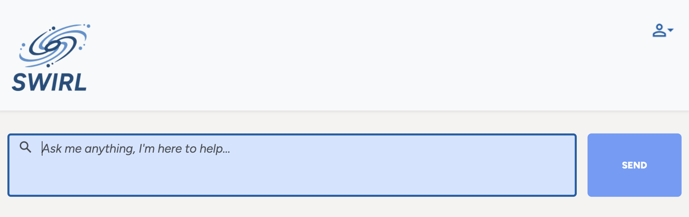

* Click the user profile (upper/right) icon on the [SWIRL Search page](http://localhost:8000/galaxy/search/), and then click "SWIRL AI Co-Pilot".

## SWIRL Login

*If the SWIRL login page appears*:

Enter username `admin` and password `password`, then click `Login`.

{: .warning }
If you receive a warning about the password being compromised or in a recent data breach, you [Change the super user password](Admin-Guide.html#changing-a-super-user-password)!

## SSO Login

*If your organizations uses SSO*:

The SWIRL login page will appear, with a button to login with SSO. 

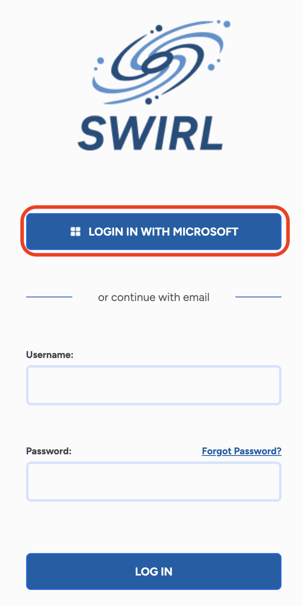

Click the SSO login button. You may have to authenticate:

Login to be redirected to the AI Co-Pilot:

If you encounter an error message, [contact support](mailto:support@swirl.today) or your local system administrator.

# Verifying Login

Click the profile icon at top/right to verify login. Use the switch to connect or disconnect as needed.

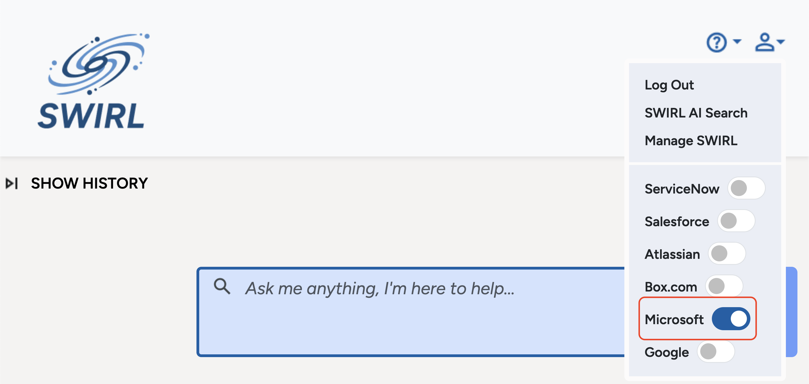

# Starting a Conversation

Use the input box to send a message to the Co-Pilot. It will converse you with the goal of helping you find the information you need. 
When you and the co-pilot agree, it will run a search against one or more sources, and summarize the results or answer your question!

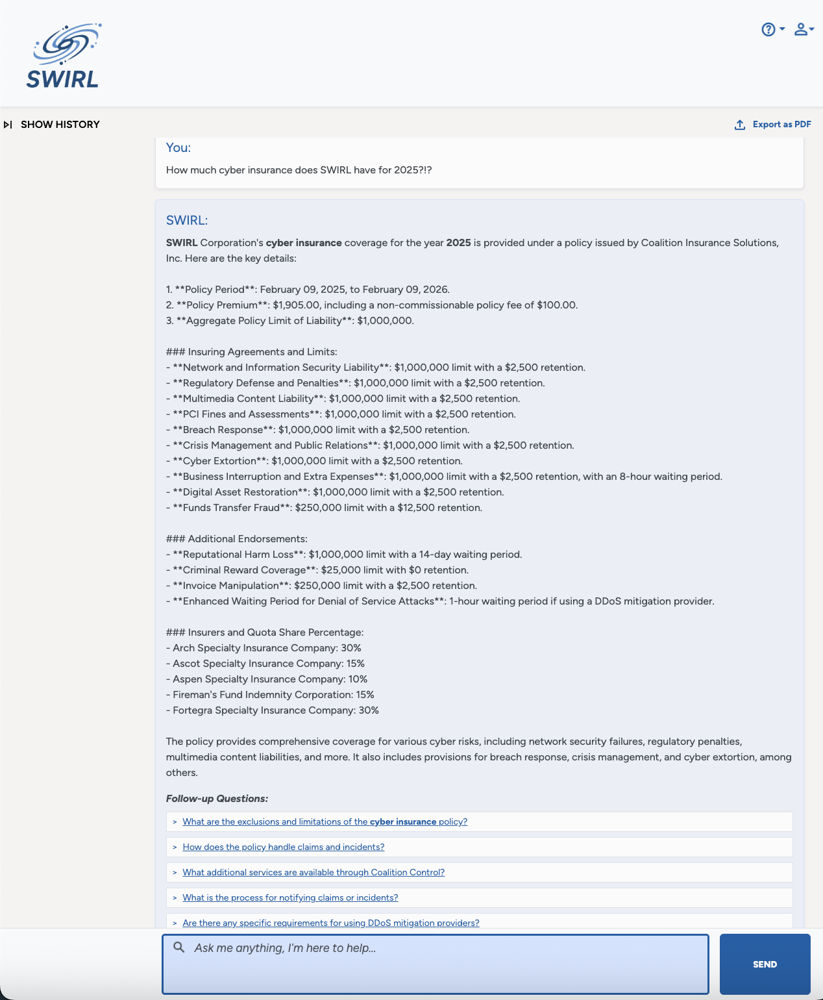

# Follow-up Questions

The Co-Pilot will frequently (but not always) suggest follow-up questions. Click one to view the answer!

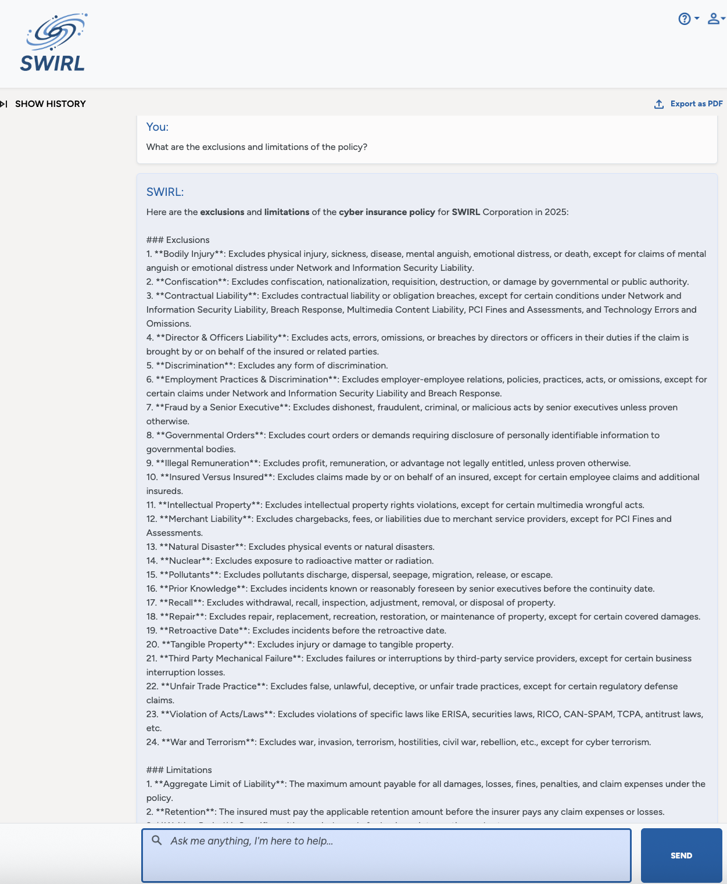

# Generating Complex Queries

Co-Pilot can generate queries in any query language supported by the underlying model. For example, OpenAI's latest models can generate queries using most dialects of SQL:

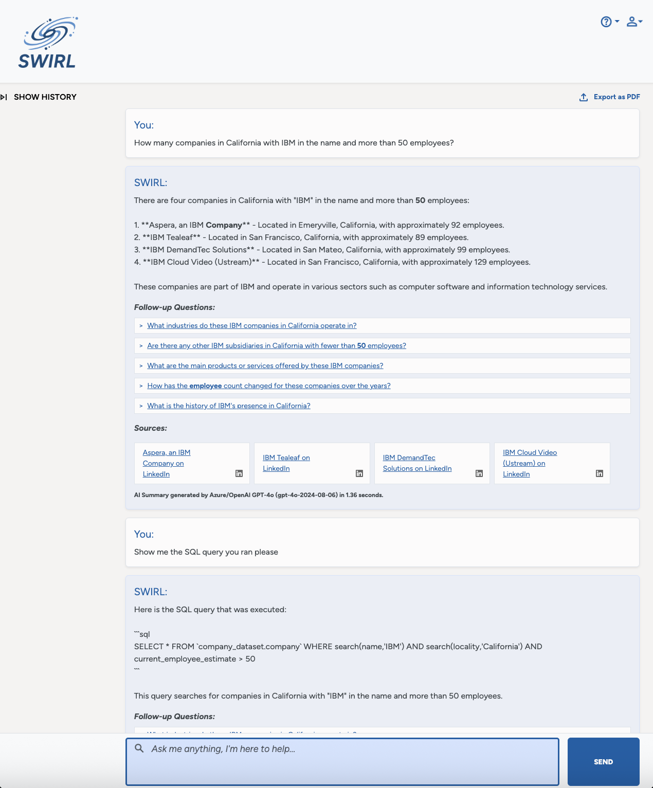

Many other query languages, including MongoDB MQL, Elastic ES|QL,  OpenSearch Query DSL, Solr syntax, etc. 

Contact SWIRL for assistance with any of these!

# Human Language Support

Co-Pilot can converse and query in any language supported by the underlying model. For example, OpenAI's latest models can converse in 100+ languages:

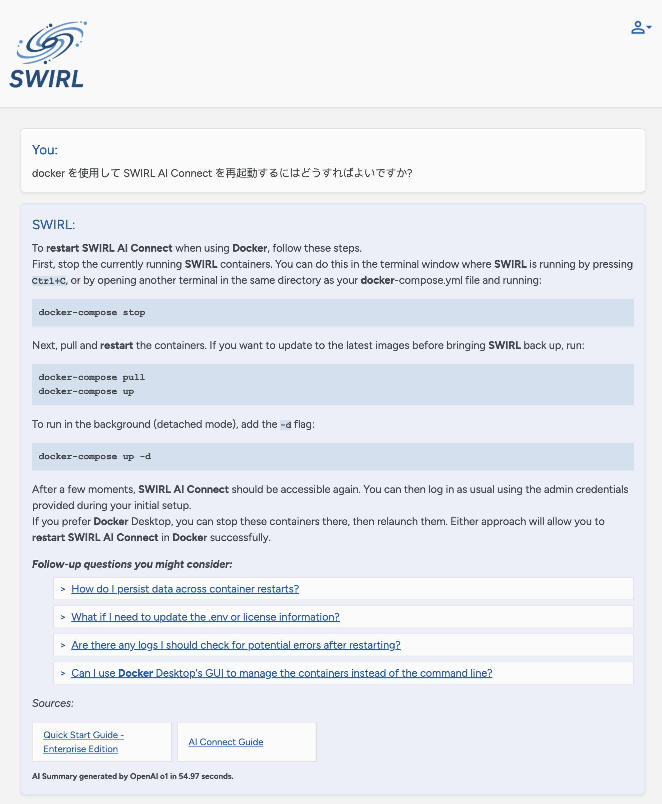

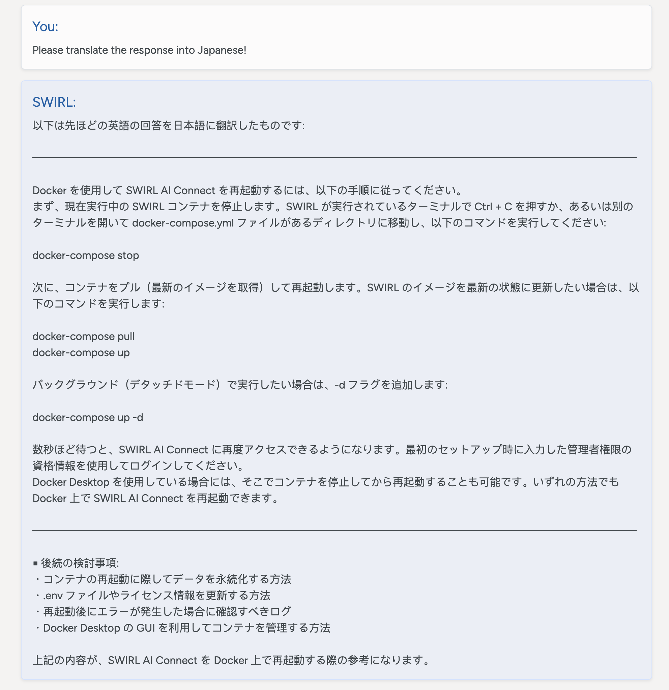

# Other Model Capabilities

SWIRL Co-Pilot won't prevent you from using any LLM capabilities, including:

* Summarizing the contents of a Co-Pilot chat in various formats (bullet points, narrative iambic pentameter), so long as you ask in the same chat window/session (and not a new one)

* Translating Co-Pilot responses into other languages

* Reformatting, revising and otherwise re-trying responses

* Using memory to retain information across chat sessions

# Handling Errors

Sometimes, Co-Pilot won't find anything. Don't be alarmed! Tell Co-Pilot what to do, such as:

* Correct the query
* Remove term(s) from the query
* Try a simpler search
* Try a different source
* Try again

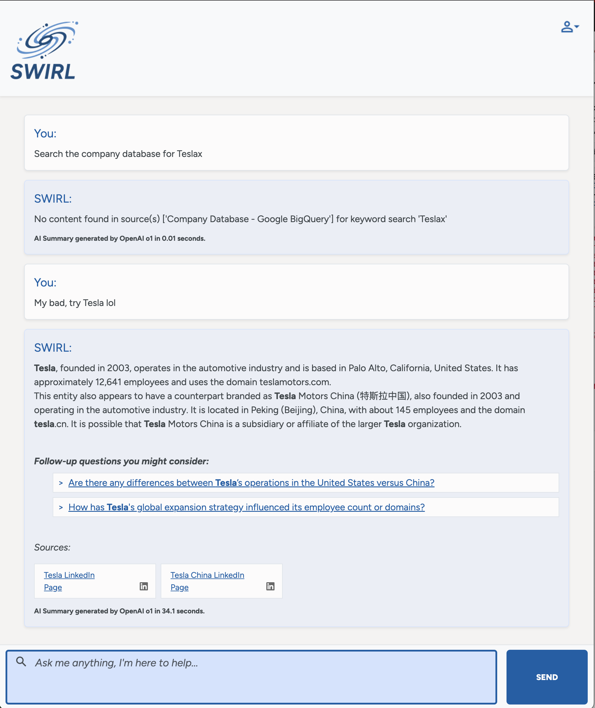

* If you get this error while querying in SQL or other complex queries, you may need to correct the query: 

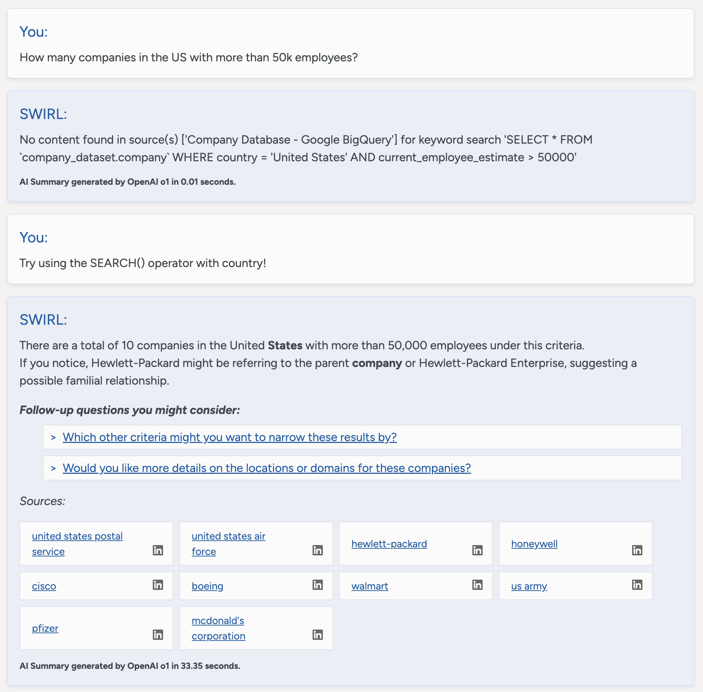

# Ending a Conversation

To end a conversation, hit the SWIRL logo at the top of the page. This will start a new conversation. 

Co-Pilot will not remember or be able to access previous chat sessions *UNLESS* it has built-in memory of it's own.

# Resuming an Old Conversation

To resume a conversation, construct the URL to the chat session by adding the chat_id:
[http://localhost:8000/galaxy/chat/?chat_id=1](http://localhost:8000/galaxy/chat/?chat_id=1)

Future versions of Galaxy will offer the ability to access previous chats directly from the UI.

# Using AI Search

To access the Search interface, open the following URL: <http://localhost:8000/galaxy/chat/> 

Or, from the Co-Pilot page, click on the profile button and click the `SWIRL AI Search` link:

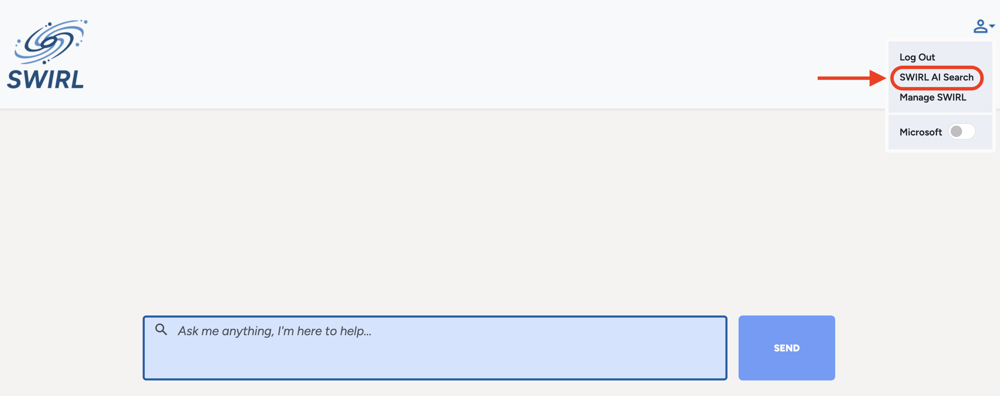

The login and authentication mechanisms are the same. If you are already logged to Co-Pilot, you should remain logged in when using search.

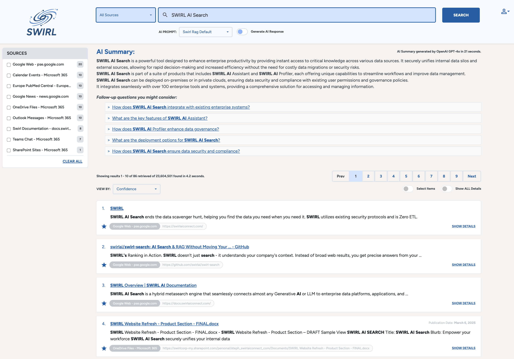

## Confidence Scores

SWIRL Enterprise version 4.0 (and later) features a new, confidence based relevancy ranking model. This confidence score ranges from 0 (not relevant) to 1.0 (extremely relevant) and is comparable across queries. When generating AI Insights, SWIRL Enterprise will take only results with a confidence score above a configurable minimium.

The confidence score includes an evaluation of the number of query terms matched, and their importance, along with their contextual relevancy and many other factors. 

Relevancy is still available as an option from the `VIEW BY:` pull-down option.

For more information consult the [Developer Guide](./Developer-Guide.md#adjusting-the-swirl_score-that-causes-galaxy-ui-to-star-results)

## Customizing Prompts

SWIRL AI Connect, Enterprise Edition, allows authorized users to select a specific prompt when generating an AI insight. 

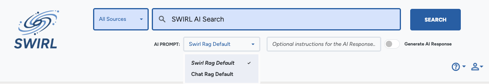

To select a specific prompt, the select it using the drop-down list below the search box prior to clicking the `Generate AI Insight` button. 

To view or edit a prompt, go to the <http://localhost:8000/swirl/prompts/> endpoint, or the [Admin UI prompts management UI](http://localhost:8000/admin/swirl/prompt/). Use the HTML form, or raw data modes, at the bottom of the page to make changes or create new ones.

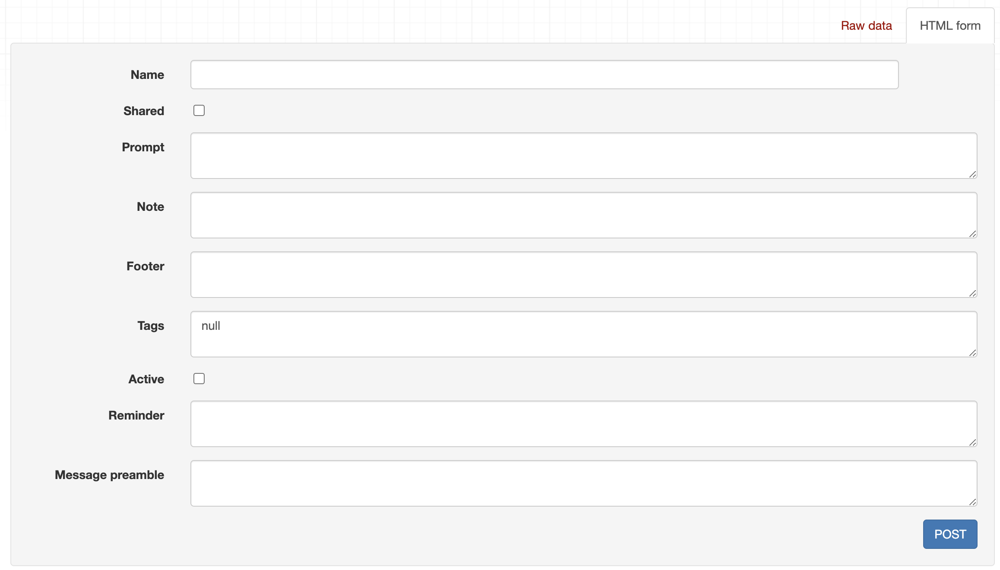

SWIRL recommends not modifying the system prompts that are included with SWIRL. Should you need to reset them, consult the [Admin Guide section on resetting prompts](Admin-Guide.md#resetting-prompts).

