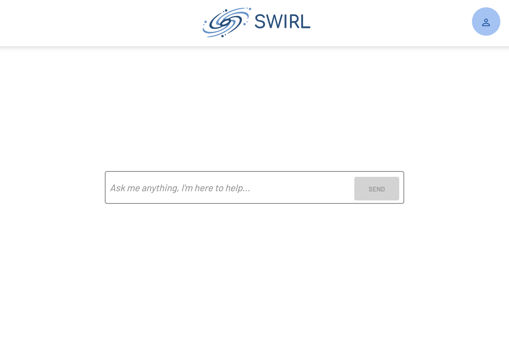
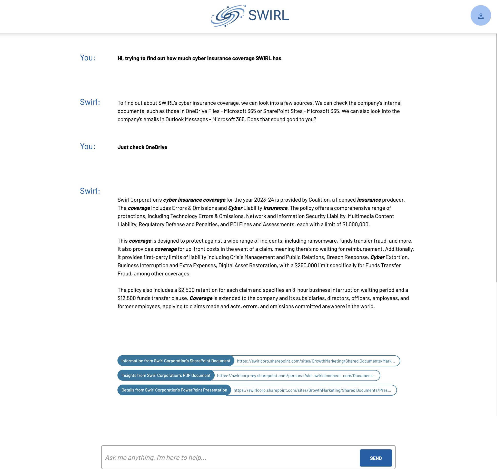

  

    Table of Contents
  

  {: .text-delta }
- TOC
{:toc}

# User Guide - Enterprise Edition

{: .warning }
This version applies to the Enterprise Edition of SWIRL!

# Glossary

The following new terms are used when referring to SWIRL Enterprise products.

| Word | Explanation | 
| ---------- | ---------- |
| AIProvider | A configuration of a Generative AI or LLM. It includes metadata identifying the type of model used, API key, and more. (Enterprise Edition only) |
| Chat | A SWIRL object that stores message objects, for AI Co-Pilot | 
| Message | A SWIRL object that contains some message either to or from a GAI/LLM | 
| Prompt | A SWIRL object that configures a GAI or LLM for use in various AI roles such as RAG or chat. (Enterprise Edition only) |

TBD: link to the Overview about Co-Pilot

# Accessing your AI Co-Pilot

* Open this URL with a browser: <http://localhost:8000/galaxy/chat/> 

## SWIRL Login

*If the SWIRL login page appears*:

Enter username `admin` and password `password`, then click `Login`.

{: .warning }
If you receive a warning about the password being compromised or in a recent data breach, you [Change the super user password](Admin-Guide.html#changing-a-super-user-password).

## SSO Login

*If your organizations SSO page appears*:

Login as you normally would. Regardless of the method you use, if you are successful at logging in, you should be redirected to the AI Co-Pilot:

If you encounter an error message, [contact support](mailto:support@swirl.today) or your local system administrator.

# Starting a Conversation

* Use the input box to send a message to the Co-Pilot.

A good first question is `What sources do I have access to?`

The Co-Pilot should reply within 5 seconds:

If it doesn't, consult the [NEW TBD Troubleshooting Guide](). 

If the sources it lists don't look correct, check with your system administrator. TBD: link to the solution (how to change description in SP etc)

* From there, converse with the Co-Pilot with the goal of finding some information. It will assist you as much as it can with the knowledge it has; most importantly, it will ask clarifying questions to help you identify the right source(s) to search, and what to search for. 

For example:

# Ending a Conversation

To end a conversation, hit the SWIRL logo at the top of the page. This will start a new conversation. Co-Pilot will not remember or be able to access previous chat sessions UNLESS it has built-in memory of it's own.

# Resuming an Old Conversation

To resume a conversation, construct the URL to the chat session by adding the chat_id:
[http://localhost:8000/galaxy/chat/?chat_id=1](http://localhost:8000/galaxy/chat/?chat_id=1)

As of 3.6, neither Co-Pilot or Galaxy will offer a summary of the conversation so far. It is on the calling application to review the history. Direct access to all previous chats is planned for a future release.

# Restrictions on GAI/LLM

SWIRL AI Co-Pilot imposes no significant restrictions on the capability of the LLM used. While chatting with Co-Pilot you can do anything the LLM supports. 

For example:

* Chatting in one language and querying sources in others - any languages supported by the model

* Translating RAG responses into other languages

