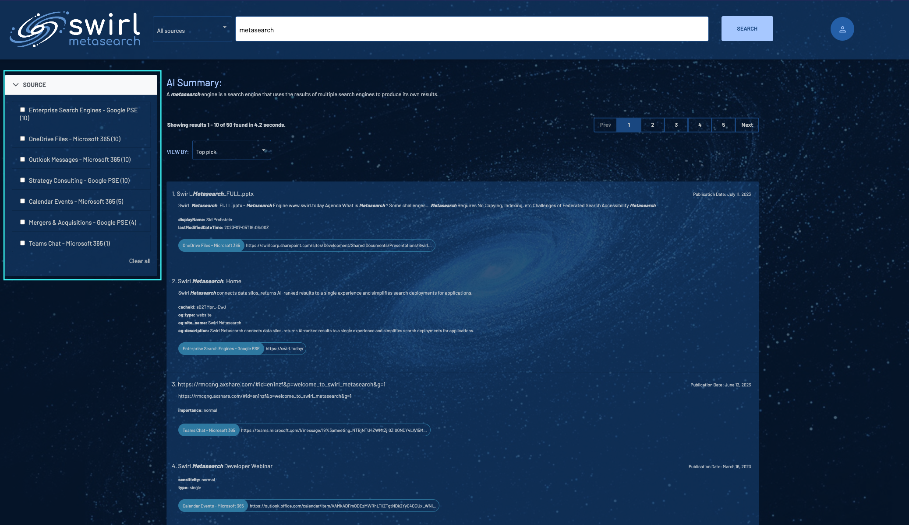
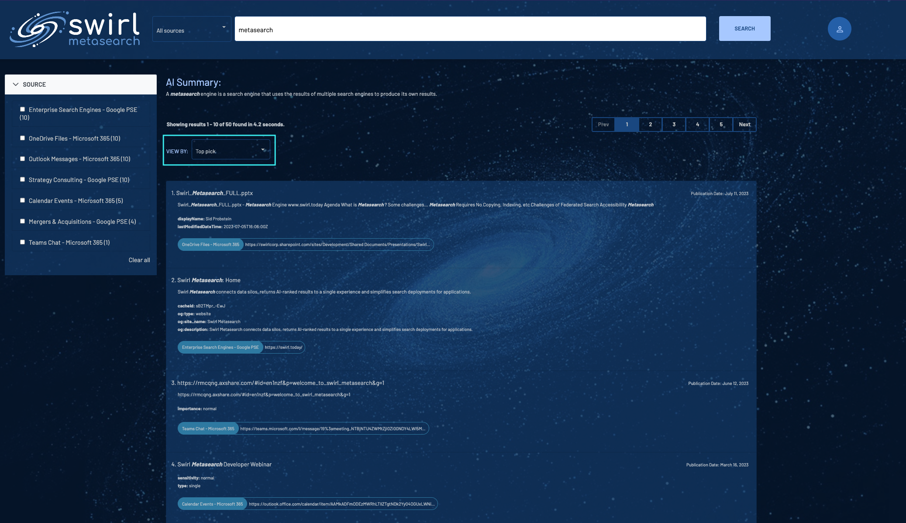
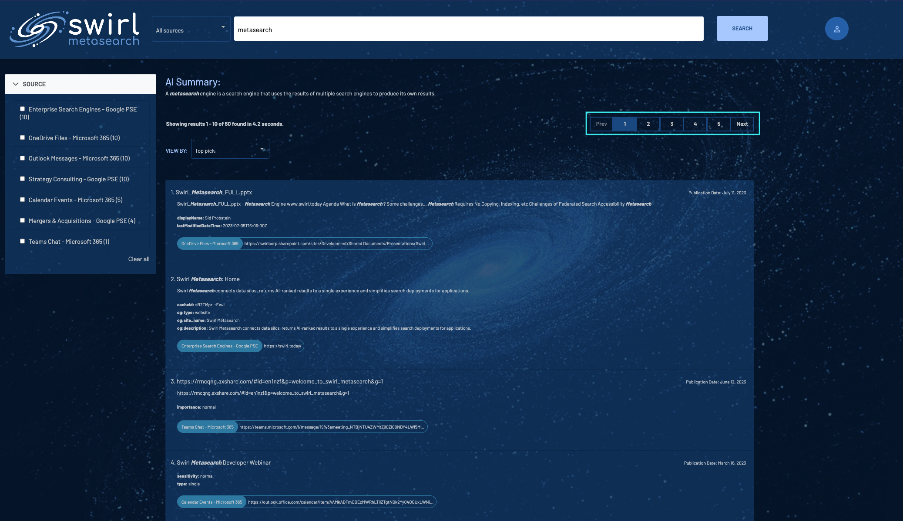

<details markdown="block">
  <summary>
    Table of Contents
  </summary>
  {: .text-delta }
- TOC
{:toc}
</details>

# User Guide

## Intended Audience

This guide is intended for developers, data scientists, program managers, or anyone who wants to use SWIRL, including searching and customizing SearchProviders.

For background information on SWIRL, please review the [SWIRL Overview](index.md).

# Terminology

| Word | Explanation | 
| ---------- | ---------- |
| SearchProvider | An object defining a searchable source. It includes metadata identifying the type of connector used to search the source and more. |
| Search | 	An object defining a query that a user or system desires to run. It includes the `query_string` with the actual text and metadata. Most of the metadata is optional.|
| Query | Search engines distinguish between the act of searching and the terms used for searching, which are usually referred to as a query. SWIRL follows this convention whenever possible but may refer to a search as a query at times. |
| Subscribe | 	An important property of Search objects. When set to `true`, SWIRL periodically reruns the search, specifying a date sort to get newer data, and removing duplicates from results.|
| Connector | A SWIRL module that can connect to, and query, a particular type of data source. Connectors are a wrapper around some existing Python package such as `request.get` or `elasticsearch`.|
| Relevancy Ranking | An estimation of the relative value of a given search engine result to the user's query, as compared to all others - to put it simply. For more information: [https://en.wikipedia.org/wiki/Relevance_(information_retrieval)](https://en.wikipedia.org/wiki/Relevance_(information_retrieval)) | 

# Running a Search

* Open this URL with a browser: <http://localhost:8000/> (or <http://localhost:8000/galaxy>)

If the search page appears, click `Log Out` at the top, right. The SWIRL login page will appear:


* Enter username `admin` and password `password`, then click `Login`.

* Enter a search in the search box and press the `Search` button. Ranked results appear in just a few seconds:


## Filtering Results by Source



SWIRL returns the best results from all available sources by default. To filter results by one or more sources, check one or more of the `Source` boxes as shown above. Results are instantly filtered to just those sources.

Click `Clear All` to return to viewing all results.

## Sorting Results



SWIRL presents results sorted by relevancy by default. To sort by `Date` or to see the `Top Picks` from each silo, click on the `VIEW BY` dropdown and select your preference.

#### Notes
* SWIRL hides results that don't have a `date_published` value when sorting by `Date`.
* As of version 2.5, the `DateFindingResultProcessor` was added to the Google PSE SearchProvider JSON. It finds a date in a large percentage of results that otherwise wouldn't have one, and copies the date to the `date_published` field.
* As of SWIRL 3.2.0, the Galaxy UI highlghts results with a `swirl_score` above a configurable threshold with a star in the results list. The `swirl_score` configuration is available in `theminimumSwirlScore` entry of `static/api/config/default`, and the default value is `100`.


## Paging Through Results



To page through results, use the numbered page selectors, or the `Prev` and `Next` buttons, above the results list, as shown above.

## Starting a New Search

Click the SWIRL logo (top left of the page) at any time to reset the Galaxy search form.

## Search Syntax

The following table summarizes the current SWIRL search syntax options:

| Syntax | Handling | Notes | 
| ---------- | ---------- | ---------- |
| AND, OR       | Passed down to all SearchProviders | SWIRL does not verify compliance |
| NOT, -term    | Passed down to configured SearchProviders and rewritten if necessary; removed from the query for providers that don't support `NOT` or `-term` | SWIRL verifies compliance; and also down-weights and flags responses that included NOT-ed terms |
| tag:term | Passes `term` to the SearchProviders configured with it in their `tags` field. The untagged portion of the query is discarded. If `tag:` begins the query, then only providers with that Tag are searched. | Example: `electric vehicle company:tesla`<br/>Only the term `tesla` will go to SearchProviders with the `company` Tag, so long as they are active.<br/>Example: `company:facebook`<br/>The query `facebook` will only go to SearchProviders with the `company` Tag. |

### AND, OR

AND and OR are passed down to all SearchProviders. SWIRL does not verify that results from any SearchProvider comply.

### NOT

* NOT is left in queries for SearchProviders with `NOT=True` in their `query_mappings`. The `NOT` applies to all terms following it.

* NOT is rewritten to `-term` for SearchProviders with `NOT_CHAR=-` and `NOT=False` (or not specified). The `-term` applies to all terms following it.

* NOT and NOT-ed terms are removed from the query for providers that do not have `NOT=True` in `query_mappings`.

SWIRL scans responses for compliance with NOT statements. Responses that contain NOT-ed content are down-weighted.

### Plus/Minus (+/-) Syntax

* A `+` (PLUS) prefixed to any search term is left in query term and passed down to all SearchProviders.

* A `-` (MINUS) prefixed to any search term is left in queries for SearchProviders with `NOT_CHAR=-` configured in their `query_mappings`. MINUS is rewritten to follow NOT for any source with `NOT=True` and without `NOT_CHAR=-` in `query_mappings`.

* All `-` (MINUS) prefixed terms are removed from the query for providers that do not have `NOT_CHAR=-` in `query_mappings`.

## Using Tags to Target SearchProviders

SearchProviders can be given arbitrary Tags that define some scope - topic, type of entity, or whatever concept(s) the source is expected to know about. For example `company`, or `person`, or `financial`. These Tags may be used in searches to direct specific parts of the query to specific sources.

For example: the funding data set included with SWIRL has SearchProviders for SQLite3, PostgreSQL and Google BigQuery, all of which contains Tags:

``` json
{
    "name": "Company Funding Records (cloud/BigQuery)",
    "connector": "BigQuery",
    ...
    "tags": [
        "Company",
        "BigQuery"
    ]
}
```

The following query targets the `company` Tag in these SearchProviders:

``` shell
electric vehicle company:tesla
```

For SearchProviders with that Tag, SWIRL rewrites the query to just the terms following it. In this case, BigQuery SearchProvider will receive the query:

``` shell
tesla
```

A direct hit on a funding record is likely to rank in the top 10 results, depending on what they are. For example:

``` json
"results": [
        {
            "swirl_rank": 1,
            "swirl_score": 1316.565600582163,
            "searchprovider": "Company Funding Records (cloud/BigQuery)",
            "searchprovider_rank": 1,
            "title": "*Tesla* Motors",
            "url": "tesla-motors",
            "body": "*Tesla* Motors raised $40000000 series c on 2006-05-01. *Tesla* Motors is located in San Carlos CA and has 270 employees.",
            "date_published": "2006-05-01 00:00:00",
            "date_retrieved": "2023-01-11 12:16:43.302730",
            "author": "",
            "payload": {},
            "explain": {
                "stems": "tesla",
                "title": {
                    "tesla_*": 0.8357298742623626,
                    "Tesla_0": 0.8357298742623626,
                    "result_length_adjust": 4.5,
                    "query_length_adjust": 1.0
                },
                "body": {
                    "Tesla_0": 0.7187157993182859,
                    "result_length_adjust": 1.25,
                    "query_length_adjust": 1.0
                }
            }
        }
```

If a query begins with `tag:`, then only SearchProviders with that tag will be selected, regardless of their default status. (Of course, they must still be active.)

For example:

``` shell
company: facebook
```

This will limit the query to SearchProviders with tag `company`.

SearchProviders do not need to have the `default` property set to `true` for Tags to work. So long as they have `active` set to `true`, then using the Tag in a query will cause SWIRL to invoke it.

For more information, see [Organizing SearchProviders with Active, Default and Tags](#organizing-searchproviders-with-active-default-and-tags)

# Relevancy Ranking

SWIRL returns a unified result set consisting of results from all responding SearchProviders, matched by stemmed word form, and re-ranked using a cosine vector similarity relevancy model based on [spaCy](https://spacy.io/) and normalized by query and token length. It also incorporates the original `searchprovider_rank`.

For more details please consult the Developer Guide [Configure Relevancy Field Weights](Developer-Guide.md#configure-relevancy-field-weights) and [Understand the Explain Structure](Developer-Guide.md#understand-the-explain-structure) sections.

## Hit Highlighting

SWIRL highlights occurrences of query terms in the `title`, `body` and `author` fields. For example:

``` json
    "body": "<em>Performance</em> <em>management</em> is the process of setting goals and expectations for employees and then tracking and measuring their progress. This can be done through regular one-on-one meetings, <em>performance</em> reviews, and other feedback mechanisms.",
```
As of version 1.10, SWIRL can also integrate source synonym configurations into relevancy calculations with corresponding hit highlighting.  See the Developer Guide [Integrate Source Synonyms Into SWIRL Relevancy](Developer-Guide.md#integrate-source-synonyms-into-swirl-relevancy)
section for details.

# Using SearchProviders

SearchProviders are the essential element of SWIRL. They make it quick and easy to search many sources - without writing any code.

SearchProviders are JSON objects. SWIRL's distribution comes preloaded with a variety of configurations for sources like Elastic, Solr, PostgreSQL, BigQuery, NLResearch.com, Miro.com, Atlassian, and more.

{: .highlight }
SWIRL includes five (5) Google Programmable Search Engines (PSEs) to get you up and running right away. The credentials for these are shared with the SWIRL Community.  The EuropePMC SearchProvider is also enabled by default, and no credentials are required for its use.

[SearchProvider Example JSON](https://github.com/swirlai/swirl-search/tree/main/SearchProviders)

| SearchProvider | Description | Notes |
| ---------- | ---------- | ---------- | 
| arxiv.json | Searches the [arXiv.org](https://arxiv.org/) repository of scientific papers | No authorization required |
| asana.json | Searches Tasks in [Asana](https://asana.com/) | Requires an Asana personal access token |
| atlassian.json | Searches Atlassian [Confluence Cloud](https://www.atlassian.com/software/confluence), [Jira Cloud](https://www.atlassian.com/software/jira), and [Trello](https://trello.com/) Cards. | Requires a bearer token and/or Trello API key; Confluence searches the [CQL `text~` content](https://developer.atlassian.com/server/confluence/performing-text-searches-using-cql/) and Jira searches the [JQL `text~` content](https://support.atlassian.com/jira-software-cloud/docs/what-is-advanced-searching-in-jira-cloud/#Advancedsearching-textPerformingtextsearches) |
| blockchain-bitcoin.json | Searches [Blockchain.com](https://www.blockchain.com/) for specific Bitcoin Addresses (wallets) and Transactions IDs (hashes) | Requires a Blockchain.com API key |
| chatgpt.json | ChatGPT AI chatbot | Requires an OpenAI API key |
| company_snowflake.json | Searches the [Snowflake](https://www.snowflake.com/en/) `FreeCompanyResearch` dataset | Requires a Snowflake username and password |
| crunchbase.json | Searches organizations via the [Crunchbase](https://www.crunchbase.com/) basic API | Requires a Crunchbase.com API key |
| document_db.json | SQLite3 document database | [documents_db.csv](https://github.com/swirlai/swirl-search/tree/main/Data/documents_db.csv) |
| elastic_cloud.json | elasticsearch, cloud version | [Enron Email Dataset](Developer-Reference.md#enron-email-data-set) Requires cloud_id, credentials |
| elasticsearch.json | elasticsearch, local install | [Enron Email Dataset](Developer-Reference.md#enron-email-data-set) Requires host, port, credentials | 
| europe_pmc.json | Searches the [EuropePMC.org](https://europepmc.org/) repository of life-sciences literature | No authorization required |
| funding_db_bigquery.json | BigQuery funding database  | [Funding Dataset](Developer-Reference.md#funding-data-set) |
| funding_db_postgres.json  | PostgreSQL funding database | [Funding Dataset](Developer-Reference.md#funding-data-set) |
| funding_db_sqlite3.json  | SQLite3 funding database  | [Funding Dataset](Developer-Reference.md#funding-data-set) |
| github.json | Searches public repositories for Code, Commits, Issues, and Pull Requests | Requires a bearer token |
| google_news.json | Searches the [Google News](https://news.google.com/) feed | No authorization required |
| google_pse.json | Five Google Programmable Search Engines (PSE) | Includes shared SWIRL credentials; may return a 429 error if overused |
| hacker_news.json | Queries a [searchable version](https://hn.algolia.com/) of the Hacker News feeds | No authorization required |
| http_get_with_auth.json | Generic HTTP GET query with basic authentication | Requires url, credentials | 
| http_post_with_auth.json | Generic HTTP POST query with basic authentication | Requires url, credentials |
| hubspot.json | Searches the HubSpot CRM for Companies, Contacts, and Deals | Requires a bearer token | 
| internet_archive.json | Searches the [Internet Archive Library](https://archive.org/) of items | No authorization required |
| littlesis.json | Searches the free [LittleSis.org](https://littlesis.org/) database of "who-knows-who at the heights of business and government" | No authorization required | 
| microsoft.json | Searches M365 Outlook Messages, Calendar Events, OneDrive Files, SharePoint Sites, and Teams Chat | See the [M365 Guide](M365-Guide.md) for details |
| miro.json | [Miro.com](https://miro.com) drawing service  | Requires a bearer token |
| movies_mongodb.json | Searches the [Mongodb Atlas](https://www.mongodb.com/) `sample_mflix` collection, `movies` sample table | Requires database username and password, plus Atlas cluster URL |
| newsdata_io.json | Newsdata.io internet news source | Requires username and password<br/>archive provider also included | 
| nlresearch.json | NLResearch.com is a premium and internet content search engine from [Northern Light](https://northernlight.com/) | Requires username and password |
| open_sanctions.json | Searches the [OpenSanctions.org](https://www.opensanctions.org/) database of sanctions targets and persons of interest | Requires and OpenSanctions API key | 
| opensearch.json  | OpenSearch 2.x | [Developer Guide](Developer-Reference.md#elastic--opensearch) |
| oracle.json | Tested against [Oracle](https://www.oracle.com/) 23c Free (and presumably supporting earlier versions) | Requires Oracle username and password |
| preloaded.json | All preloaded SearchProviders | Defaults in the SWIRL distribution |
| servicenow.json | Searches the Knowledge and Service Catalog centers of ServiceNow | Requires username and password |
| solr.json | the original, open source search engine, local install | Requires host, port, collection |
| solr_with_auth.json | The original, open source search engine, local install, secured | Requires host, port, collection, credentials |
| youtrack.json  | Searches JetBrains [YouTrack](https://www.jetbrains.com/youtrack/) Articles and Issues | Requires a bearer token |

* As of Release 1.10, SWIRL includes example SearchProviders for JetBrains YouTrack Issues and Articles.

* As of Release 1.10.1, SWIRL includes example SearchProviders for Atlassian Jira and Confluence Cloud products.

* As of Release 2.0, SWIRL includes integration with Microsoft365 services.

* As of Release 2.0.3, SWIRL includes support for RequestsPost with example SearchProvider JSON.

* As of Release 2.1, SWIRL includes example SearchProviders for GitHub Code, Commits, Issues, and Pull Requests (public repositories only).

* As of Release 2.5, SWIRL includes example SearchProviders for HubSpot Contacts, Companies, and Deals.
    * Requires creation of a "Private Apps" API token by the Super Admin with [these scopes](images/HubSpot-scopes.png)
    * In `result_mappings`, the `url` mapping must contain the HubSpot Org ID

* As of Release 2.5.1:
    * SWIRL includes example SearchProviders for [arXiv](https://arxiv.org/), [EuropePMC](https://europepmc.org/), and [LinkedIn](https://www.linkedin.com/) profiles via a new Google PSE.
    * Both the ChatGPT [`Connector`](https://github.com/swirlai/swirl-search/blob/main/swirl/connectors/chatgpt.py) and [`QueryProcessor`](https://github.com/swirlai/swirl-search/blob/main/swirl/processors/chatgpt_query.py) were updated to use OpenAI's [`ChatCompletion`](https://platform.openai.com/docs/api-reference/chat) method which supports the latest GPT models - including GPT-4 - and a much greater range of interactivity.
        * Three new Tags and one new `query_mapping` option are available for the ChatGPT SearchProvider to help shape the Prompt or Default Role passed to ChatGPT along with the user's query.
        * The ChatGPT SearchProvider now queries the GPT-3.5-Turbo model by default.

* As of Release 2.6, SWIRL includes SearchProviders for [ServiceNow](https://www.servicenow.com/) (Knowledge and Service Catalog), [Google News](https://news.google.com/) and a searchable version of the [Hacker News](https://hn.algolia.com/) feeds.

* As of Release 3.0.0:
    * SWIRL includes SearchProviders for [Blockchain.com](https://www.blockchain.com/) Bitcoin transactions and addresses as well as for [Crunchbase](https://www.crunchbase.com/) organizations.
    * A new Google PSE SearchProvider that targets the [new SWIRL documentation website](https://docs.swirl.today/) is included and enabled by default.
    * The EuropePMC SearchProvider is preloaded, set to active status, and configured to participate in Retrieval Augmented Generation (RAG) by default.

* As of Release 3.1.0, SWIRL includes SearchProviders for [Asana](https://asana.com/) Tasks, [Atlassian Trello](https://trello.com/) Cards, [Internet Archive Library](https://archive.org/) items, [Mongodb Atlas](https://www.mongodb.com/), [Oracle](https://www.oracle.com/) (WIP), and [Snowflake](https://www.snowflake.com/en/).

* As of Release 3.2.0, SWIRL includes SearchProviders for [LittleSis.org](https://littlesis.org/) and [OpenSanctions.org](https://www.opensanctions.org/) entity searching.

## Activating

To activate a preloaded SearchProvider, [edit it](#editing) and change:

``` json
    "active": false
```

to

``` json
    "active": true
```

Click the `PUT` button to save the change.

## Copy/Paste Install

If you have the raw JSON of SearchProvider, install it by copying/pasting into the form at the bottom of the SearchProvider endpoint.


1. Go to [http://localhost:8000/swirl/searchproviders/](http://localhost:8000/swirl/searchproviders/)
2. Click the `Raw data` tab on the form at the bottom of the page
3. Paste one SearchProvider's JSON at a time into the form and press the `POST` button
4. SWIRL will respond with the finished SearchProvider

As of SWIRL 3.2.0, you can copy/paste lists of SearchProviders into the endpoint, and SWIRL will load them all.

## Bulk Loading

Use the included [`swirl_load.py`](https://github.com/swirlai/swirl-search/blob/main/swirl_load.py) script to load any SearchProvider instantly, including lists of providers.

1. Open a terminal, `cd` into your `<swirl-home>` directory, and execute the following command:
``` shell
python swirl_load.py SearchProviders/provider-name.json -u admin -p your-admin-password
```

2. The script will load all SearchProvider configurations in the specified file at once and confirm.
3. Go to [http://localhost:8000/swirl/searchproviders/](http://localhost:8000/swirl/searchproviders/) to see them!


## Editing

Edit any SearchProvider by adding the `id` to the end of the `/swirl/searchproviders` URL. 

For example: `http://localhost:8000/swirl/searchproviders/1/`


From here, you can use the form at the bottom of the page to:

* DELETE this SearchProvider, forever
* Edit the configuration of the SearchProvider and `PUT` the changes 

## Query Templating

Most SearchProviders require a `query_template`. This is usually bound to `query_mappings` during the federation process. For example, here is the original `query_template` for the MongoDB movie SearchProvider:

```
    "query_template": "{'$text': {'$search': '{query_string}'}}",
```

This format is not actually JSON, but rather a string. The single quotes are required, so that the JSON can use double quotes. 

As of SWIRL 3.2.0, MongoDB all use the new `query_template_json` field, which stores the template as JSON. For example, here is the new MongoDB `query_template_json`:

```
"query_template_json": {
        "$text": {
            "$search": "{query_string}"
        }
    },
```

## Organizing SearchProviders with Active, Default and Tags

Three properties of SearchProviders are intended to allow expressive querying by targeting all or part of a query to groups of sources.

| Property | Description |
| ---------- | ---------- |
| Active | True/False setting that specifies if the SearchProvider is to receive Search queries or not. If `false`, the SearchProvider will not be queried, even if specified in a `searchprovider_list` |
| Default | True/False setting that specifies if the SearchProvider is to be queried for searches that don't specify a `searchprovider_list`. If `false`, the SearchProvider must be specified in the `searchprovider_list` |
| Tags | List of strings that organize providers into groups. Tags can be specified in combination with SearchProvider names and/or ids in `Search.searchprovider_list`, in the `providers=` [URL parameter](Developer-Guide.md#create-a-search-object-with-the-q-url-parameter), or in a query in the form `tag:term` |

The suggestion is that SearchProviders who are good for most any search be left with `Default` set to `True`. Providers specific to a topic should have `Default` set to `False` and then `"Tags": [ "topic1", "topic2" ]` etc. When creating a search this ensures that the best providers for general querying are used when no `searchprovider_list` is specified. When the user desires to target a specific SearchProvider set, any combination of Tags or SearchProvider `name` and `id` values may be used freely.

## Query Mappings

SearchProvider `query_mappings` are key/value pairs that define how to query a given SearchProvider. 

They include field mappings and configurations that SWIRL's processors (like the `AdaptiveQueryProcessor`) use to align the query with each SearchProvider's capabilities.

The following table summarizes the current `query_mappings` options:

| Mapping Format | Meaning | Example | 
| ---------- | ---------- | ---------- |
| key = value | Replace `key` with `value` if the `key` is enclosed in braces in the `provider.query_template`. |  ```"query_template": "{url}?cx={cx}&key={key}&q={query_string}","query_mappings": "cx=google-pse-key"``` |
| DATE_SORT=url-snippet | This identifies the string to insert into the URL for this SearchProvider if date sorting is specified in the search object. | `"query_mappings": "DATE_SORT=sort=date"` | 
| RELEVANCY_SORT=url-snippet | This identifies the string to insert into the URL for this SearchProvider if relevancy sorting is specified in the search object. | `"query_mappings": "RELEANCY_SORT=sort=relevancy"` | 
| PAGE=url-snippet | This identifies the string to insert into the URL for this SearchProvider for paging support. The specification should include either SWIRL variable `RESULT_INDEX` or `RESULT_PAGE` which will be the result number (e.g. 11) or page number (e.g. 2) | `"query_mappings": "PAGE=start=RESULT_INDEX"` |
| NOT=True | If present, this SearchProvider supports simple, single NOT operators | elon musk NOT twitter |
| NOT_CHAR=- | If present, this SearchProvider supports `-term` NOT operators | elon musk -twitter |

### Query Field Mappings

For `query_mappings`, keys that appear in the `query_template` wrapped in braces are replaced with the value.

``` json
    "url": "https://www.googleapis.com/customsearch/v1",
    "query_template": "{url}?cx={cx}&key={key}&q={query_string}",
    "query_processors": [
            "AdaptiveQueryProcessor"
        ],
    "query_mappings": "cx=0c38029ddd002c006,DATE_SORT=sort=date,PAGE=start=RESULT_INDEX",
```

At federation time, this becomes the following URL: 

``` shell
    https://www.googleapis.com/customsearch/v1?cx=0c38029ddd002c006&q=some_query_string
```

The `url` field is configured per SearchProvider. Any key/value pairs that never change for that SearchProvider should be put there.

The `query_string` is provided by SWIRL as described in the [Developer Guide](Developer-Guide.md#workflow)

### HTTP Request Headers

The optional `http_request_headers` field is available to all SearchProviders for passing custom HTTP Request Header values to the source alongside the user's query. For example, the GitHub SearchProviders included in SWIRL's distribution use this feature to return a more accurate result snippet from GitHub that is then mapped to SWIRL's `body` field:

``` json
"http_request_headers": {
            "Accept": "application/vnd.github.text-match+json"
        },

"result_mappings": "title=name,body=text_matches[*].fragment, ...
```

## Result Processors

In Release 2.5, important updates were made that affect the SearchProvider `result_processors` configuration.  Relevancy processing was split into two stages to improve performance
* The revised `CosineRelevancyPostResultProcessor` must be added *last* in the `Search.post_result_processors` list.
* Please review the JSON in the `SearchProviders/` directory and update existing configurations to match.

``` json
"result_processors": [
            "MappingResultProcessor",
            "LenLimitingResultProcessor",
            "CosineRelevancyResultProcessor"
        ],
```

* This following of Error message in the SWIRL logs indicates that one or more SearchProviders have not been updated:

``` shell
INFO     search.py: invoking processor: CosineRelevancyPostResultProcessor
2023-07-31 16:31:39,268 ERROR    CosineRelevancyPostResultProcessor_2051: Error: Dictionary of result lengths is empty. Was CosineRelevancyResultProcessor included in Search Providers Processor configuration?
```

Also, the `DateFindingResultProcessor` was added to the default Google PSE SearchProvider JSON. It finds a date in a large percentage of results that otherwise wouldn't have one, and copies the date to the `date_published` field. Existing PSE SearchProvider configurations should be updated to include it:

``` json
"result_processors": [
            "MappingResultProcessor",
            "DateFinderResultProcessor",
            "CosineRelevancyResultProcessor"
        ],
```

SWIRL Release 3.2.0 includes two new Result Processors:
* The `RequireQueryStringInTitleResultProcessor` drops result items that don't include the user's query in the title. It is recommended for use with noisy services like LinkedIn via Google PSE and must be installed after the `MappingResultProcessor`.
* The `AutomaticPayloadMapperResultProcessor` profiles response data to find good strings for SWIRL's `title`, `body`, and `date_published` fields. It is intended for SearchProviders that would otherwise have few (or no) good result_mappings options. It should be place after the `MappingResultProcessor`, and the `result_mappings` field should be blank. Specify `DATASET` in the `result_mappings` to have SWIRL organize a columnar response into a single result, with the columns in the payload.

## Authentication & Credentials

The `credentials` property stores any required authentication information for the SearchProvider.  The supported types are as follows:

### key=value format

This credential is bound to the URL that is used to execute searches. 

For example, from a Google PSE:

``` json
    "credentials": "key=your-google-api-key-here",
    "query_template": "{url}?cx={cx}&key={key}&q={query_string}",
```

### bearer=token format

Bearer tokens are supported by the `RequestsGet` and `RequestsPost` connectors. They are sent with the request header.

For example, from the [Miro SearchProvider](https://github.com/swirlai/swirl-search/blob/main/SearchProviders/miro.json):

``` json
    "credentials": "bearer=your-miro-api-token",
```

### X-Api-Key=key format

X-Api-Keys are supported by the `RequestsGet` and `RequestsPost` connectors. They are sent with the request header.

``` json
    "credentials": "X-Api-Key=<your-api-key>",
```

### HTTPBasicAuth, HTTPDigestAuth, HTTPProxyAuth

These methods are supported by the `RequestsGet`, `ElasticSearch` and `OpenSearch` connectors. 

For example, from the [Solr with Auth SearchProvider](https://github.com/swirlai/swirl-search/blob/main/SearchProviders/solr_with_auth.json):

``` json
    "credentials": "HTTPBasicAuth('solr-username','solr-password')",
```

### Other Credentials

Consult the Developer Guide for details on how to [Develop New Connector](Developer-Guide.md#develop-new-connectors).

## Response Mappings

SearchProvider `response_mappings` determine how each source's response is normalized into JSON. They are used by the Connector `normalize_response` method. Each mapping is a JSONPath.

Here is the `response_mappings` from a Google PSE:

``` json
    "response_mappings": "FOUND=searchInformation.totalResults,RETRIEVED=queries.request[0].count,RESULTS=items",
```

The following table summarizes the `response_mappings` options:

| Mapping | Source_JSONPath | Required? | Example | 
| ---------- | ---------- | ---------- | ---------- |
| FOUND | Number of results for a given query, for this SearchProvider, e.g. 1,413<br/>Same as `RETRIEVED` if not specified | No | `searchInformation.totalResults=FOUND` |
| RETRIEVED | Number of results returned for a given query, for this SearchProvider, e.g. 10<br/>Length of the `RESULTS` list (see below) if not specified | No | `queries.request[0].count=RETRIEVED` |
| RESULTS | Path to the list of Result items | Yes | `items=RESULTS` |
| RESULT | Path to the document, if Result items are a dictionary/wrapper | No | `document=RESULT` |

## Result Mappings

SearchProvider `result_mappings` determine how each source result set, in JSON format, is mapped to the SWIRL result schema. Each mapping is a JSONPath.

Here is a `result_mapping` from a Google PSE:

``` json
    "result_mappings": "url=link,body=snippet,author=displayLink,cacheId,pagemap.metatags[*].['og:type'],pagemap.metatags[*].['og:site_name'],pagemap.metatags[*].['og:description'],NO_PAYLOAD",
```

The mappings `url=link` and `body=snippet` map the SWIRL result fields to the corresponding Google PSE result fields.

{: .highlight }
For Release 2.5.1, [`requests.py`](https://github.com/swirlai/swirl-search/blob/main/swirl/connectors/requests.py) was updated to handle XML responses from source APIs and convert them to JSON for mapping in SearchProvider configurations.

{: .highlight }
For Release 3.2.0, [`requests.py`](https://github.com/swirlai/swirl-search/blob/main/swirl/connectors/requests.py) was updated to handle list-of-list responses from source APIs, where the first list element is the field names. For example:

```
[
    [
        "urlkey",
        "timestamp",
        "original",
        "mimetype",
        "statuscode",
        "digest",
        "length"
    ],
    [
        "today,swirl)/",
        "20221012214440",
        "http://swirl.today/",
        "text/html",
        "301",
        "EU3373LKG36VJYZN2MKR4WENHBGK4DCL",
        "361"
    ],
    ...etc...
```

SWIRL will automatically convert this format to a JSON array of dicts, with the fieldnames specified in the first element.

### Multiple Mappings

As of version 1.6, SWIRL can map multiple SearchProvider fields to a single SWIRL field, aggregating multiple responses in the PAYLOAD field as necessary.

For example:

``` json
"result_mappings": "body=content|description,..."
```

If only one field, `content` or `description`, are populated for a response, then that will be mapped to the SWIRL's `body` field. Should both fields be populated, the second field is moved to the PAYLOAD and named `<swirl-field>_<source_field>`. For example:

``` json
        {
            "swirl_rank": 1,
            "swirl_score": 24391.4814426326,
            "searchprovider": "Latest News (web/newsdata.io)",
            "searchprovider_rank": 2,
            "title": "What The *Mid-Term* *Elections* Mean For U.S. Energy",
            "url": "https://www.forbes.com/sites/davidblackmon/2022/11/13/what-the-mid-term-elections-mean-for-us-energy/",
            "body": "Leaders in U.S. domestic energy sectors should expect President Joe Biden to feel emboldened in the wake of *mid-term* *elections* that saw voters issue a status quo verdict on his policies.",
            "date_published": "2022-11-13 13:38:30",
            "date_retrieved": "2022-11-13 18:03:33.676767",
            "author": "David Blackmon",
            "payload": {
                "body_description": "Leaders in U.S. domestic energy sectors should expect President Joe Biden to feel emboldened in the wake of mid-term elections that saw voters issue a status quo verdict on his policies.",
                "source_id": "forbes",
                "category": [
                    "business"
                ]
```

### Result Mapping Options

The following table explains the `result_mappings` options:

| Mapping Format | Meaning | Example | 
| ---------- | ---------- | ---------- | 
| swirl_key = source_key | This maps a key from the source provider's result list to SWIRL's result list. The `source_key` may be a JSON path. | `body=_source.email` |
| swirl_key = source_key1\|source_key2\|source_keyN | This maps multiple keys from the source provider's result list to SWIRL's result list; as [noted above](#multiple-mappings) the first populated field is mapped and the rest are copied to the PAYLOAD | `body=content\|description,...` |
| swirl_key='template {variable} etc' | This allows any number of source provider result fields to be turned into a string that is then copied to a SWIRL field (like `body`) or the PAYLOAD. Commas (,) are not supported in the string at this time. | `'{x}: {y}'=title` |
| source_key | This maps a key from the source provider's raw format to SWIRL's result PAYLOAD. | `cacheId, _source.products` |
| sw_urlencode | An optional directive which will cause the specified value to be URL encoded; it can be used anyplace in the template such as `url` field mappings. | `url=sw_urlencode(<hitId>)` |
| sw_btcconvert | An optional directive which will convert the provided Satoshi value to Bitcoin; it can be used anyplace in the template such as `result_mappings` | `sw_btcconvert(<fee>)` |
| NO_PAYLOAD | By default, SWIRL copies all result keys from the SearchProvider to the PAYLOAD. If `NO_PAYLOAD` is specified, SWIRL copies only the explicitly mapped fields.| `NO_PAYLOAD` |
| FILE_SYSTEM | If specified, SWIRL will assume that this SearchProvider is a file system and weight matches against the `body` higher. | `FILE_SYSTEM` |
| LC_URL | If specified, SWIRL will convert the `url` field to lower case. | `LC_URL` | 
| BLOCK | As of Release 3.1.0, this feature is used exclusively by SWIRL's RAG processing; that output appears in this `info` block of the Result object. | `BLOCK=ai_summary` |
| DATASET | When specified as the only result_mapping parameter, SWIRL organizes a columnar response into a single result, with the columns in the PAYLOAD field | `DATASET` |

#### Date Published Display

As of version 2.1, a `date_published_display` option is available, allowing the mapping of different values for `date_published` and `date_published_display` in SearchProvider configurations:

``` shell
"result_mappings":  ... date_published=foo.bar.date1,date_published_display=foo.bar.date2 ...
```

Results objects will reflect both date values:

``` json
"date_published": "2010-01-01 00:00:00",
"date_published_display": "c2010",
```

## Result Schema

The `json_result` schema for each result in the Result list is defined by the `create_result_dictionary()` function in [`swirl/processors/utils.py`](https://github.com/swirlai/swirl-search/tree/main/swirl/processors/utils.py).

[Result mixers](Developer-Reference.md#mixers-1) further manipulate and re-organize the data from multiple results.

The Result schema can be seen in [`swirl/models.py`](https://github.com/swirlai/swirl-search/tree/main/swirl/models.py) 

## PAYLOAD Field

The PAYLOAD is a JSON list structure that can hold arbitrary data structures. This is only meaningful if you also specify `NO_PAYLOAD`. If you don't specify this keyword, you will get all of the SearchProvider's raw data mapped into this field.

After mapping the fields you want the way you want them, then add this directive to the `result_mappings` so that you only get back what you want.

{: .highlight }
To use `NO_PAYLOAD` most effectively, send your first query to a SearchProvider *without it* to see what you get back in the PAYLOAD.
