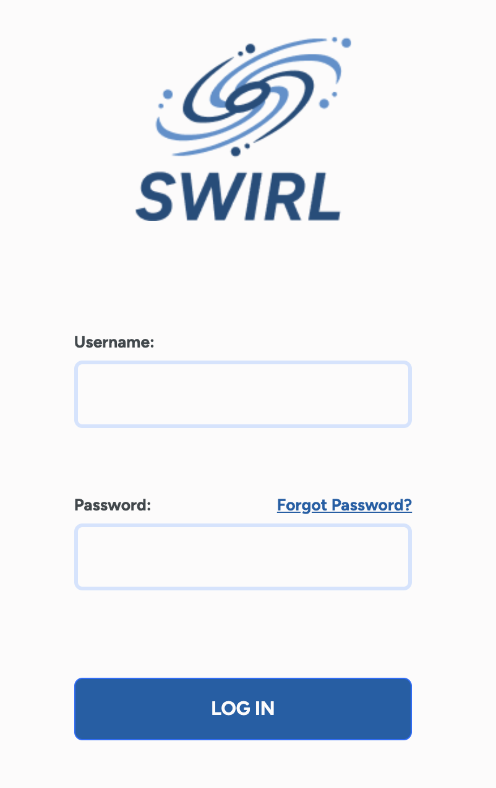
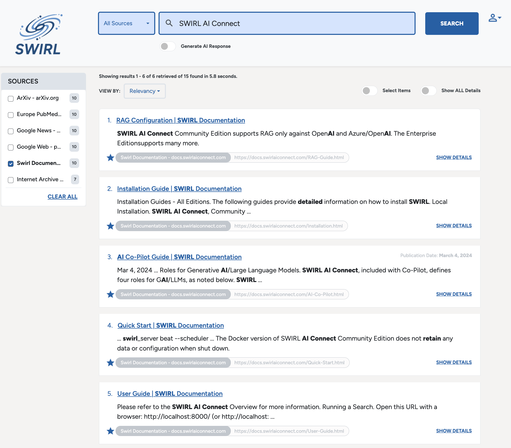
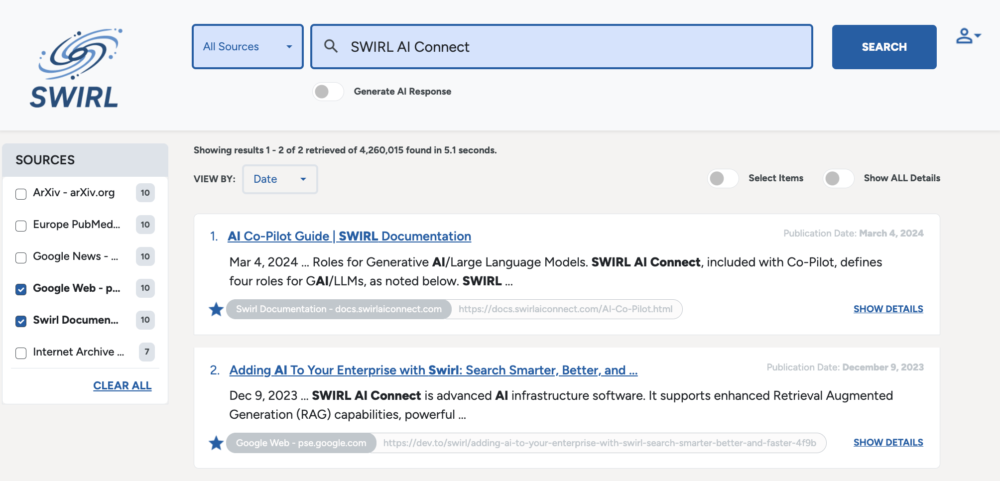

<details markdown="block">
  <summary>
    Table of Contents
  </summary>
  {: .text-delta }
- TOC
{:toc}
</details>

# User Guide - Community Edition

{: .warning }
This version applies to the Community Edition of SWIRL!

# Glossary

| Word | Explanation | 
| ---------- | ---------- |
| Connector | A SWIRL module that can query a particular type of data source. |
| Page Fetcher | A SWIRL module that can obtain a copy of a specific document. The Enterprise edition can authenticate while fetching. |
| Query | Search engines distinguish between the act of searching and the terms used for searching, which are referred to as a `query`. SWIRL follows this convention whenever possible. |
| Search | 	A SWIRL object that defies some search to be run, on behalf of some user. It includes the `query_string` with the actual text of the query, and associated metadata. |
| SearchProvider | A configuration of a Connector, intended to allow SWIRL to query some endpoint via it's API. It includes metadata such as credentials. |
| Subscribe | An important property of Search objects. When set to `true`, SWIRL periodically reruns the search, specifying a date sort to get newer data, and removing duplicates from results. Currently users are expected to poll for updates, but future releases will support a call-back when new results are available, as well as support for automatic regeneration of AI Insights. |
| Relevancy Ranking | A scoring system that ranks the relevancy of a given search engine result to the user's query, as compared to all others. For more information: [https://en.wikipedia.org/wiki/Relevance_(information_retrieval)](https://en.wikipedia.org/wiki/Relevance_(information_retrieval)) | 

Please refer to the [SWIRL AI Connect Overview](index.html) for more information.

# Running a Search

* Open this URL with a browser: <http://localhost:8000/> (or <http://localhost:8000/galaxy/search/>)

The SWIRL login page will appear:



* Enter username `admin` and password `password`, then click `Login`.

{: .warning }
If you receive a warning about the password being compromised or in a recent data breach, you can safely ignore it by clicking `Ok`, and then [changing the super user password](Admin-Guide.html#changing-a-super-user-password).

* Enter some search terms in the search box and press the `Search` button. Re-ranked results will appear in just a few seconds:


Note that SWIRL Community will only retrieve a single set of results as configured in each SearchProvider. Fetching additional pages, on demand, is planned for a future release.

The Galaxy UI stars results with a `swirl_score` above a configurable minimum. 

## Filtering Results by Source



SWIRL returns the best results from all available sources by default. To filter results by one or more sources, check one or more of the `Source` boxes as shown above. Results are instantly filtered to just those sources.

Click `Clear All` to return to viewing all results.

## Sorting Results



By default, SWIRL Community presents results sorted by relevancy score. To sort by `Date` or to see the `Top Picks` from each silo, click on the `VIEW BY` dropdown and select your preference.

SWIRL hides results that don't have a `date_published` value when sorting by `Date`. Switch back to `Relevancy` to see all results.

## Starting a New Search

Click the SWIRL logo to reset the Galaxy search form and start over.

## Search Syntax

The following table summarizes SWIRL's support for common search syntax:

| Syntax | Handling | Notes | 
| ---------- | ---------- | ---------- |
| AND, OR       | Passed down to all SearchProviders | SWIRL does not verify compliance |
| NOT, -term    | Passed down to configured SearchProviders and rewritten if necessary; removed from the query for providers that don't support `NOT` or `-term` | SWIRL verifies compliance; and also down-weights and flags responses that included NOT-ed terms |
| tag:term | Passes `term` to the SearchProviders configured with it in their `tags` field. The untagged portion of the query is discarded. If `tag:` begins the query, then only providers with that Tag are searched. | Example: `electric vehicle company:tesla`<br/>Only the term `tesla` will go to SearchProviders with the `company` Tag, so long as they are active.<br/>Example: `company:facebook`<br/>The query `facebook` will only go to SearchProviders with the `company` Tag. |

### AND, OR

AND and OR are passed down to all SearchProviders. SWIRL does not verify that results from any SearchProvider comply.

### NOT

* NOT is left in queries for SearchProviders with `NOT=True` in their `query_mappings`. The `NOT` applies to all terms following it.

* NOT is rewritten to `-term` for SearchProviders with `NOT_CHAR=-` and `NOT=False` (or not specified). The `-term` applies to all terms following it.

* NOT and NOT-ed terms are removed from the query for providers that do not have `NOT=True` in `query_mappings`.

SWIRL scans responses for compliance with NOT statements. Responses that contain NOT-ed content are down-weighted.

### Plus/Minus (+/-) Syntax

* A `+` (PLUS) prefixed to any search term is left in query term and passed down to all SearchProviders.

* A `-` (MINUS) prefixed to any search term is left in queries for SearchProviders with `NOT_CHAR=-` configured in their `query_mappings`. MINUS is rewritten to follow NOT for any source with `NOT=True` and without `NOT_CHAR=-` in `query_mappings`.

* All `-` (MINUS) prefixed terms are removed from the query for providers that do not have `NOT_CHAR=-` in `query_mappings`.

## Using Tags to Select SearchProviders

SearchProviders can be given arbitrary tags to label them by topic, type of entity, or whatever concept(s) the source is expected to know about - for example, `company`, or `person`, or `financial`. These tags may be used in searches to select specific providers, and/or direct specific parts of the query to specific sources.

For example: the funding data set included with SWIRL has SearchProviders for SQLite3, PostgreSQL and Google BigQuery, all of which contains Tags:

``` json
{
    "name": "Company Funding Records (cloud/BigQuery)",
    "connector": "BigQuery",
    ...
    "tags": [
        "Company",
        "BigQuery"
    ]
}
```

If a query begins with `tag:`, then only SearchProviders with that tag will be selected, regardless of their default status. (Of course, they must still be active.)

For example:

``` shell
company: facebook
```

This will limit the query to SearchProviders with tag `company`. However, the following query combines a default search with the `company` tag for the term `tesla` only:

``` shell
electric vehicle company:tesla
```

For SearchProviders with that tag, SWIRL rewrites the query to just the terms following it. In this case, the BigQuery SearchProvider will receive the query:

``` shell
tesla
```

A direct hit on a funding record is likely to rank in the top 10 results, depending on what they are. For example:

``` json
"results": [
        {
            "swirl_rank": 1,
            "swirl_score": 1316.565600582163,
            "searchprovider": "Company Funding Records (cloud/BigQuery)",
            "searchprovider_rank": 1,
            "title": "*Tesla* Motors",
            "url": "tesla-motors",
            "body": "*Tesla* Motors raised $40000000 series c on 2006-05-01. *Tesla* Motors is located in San Carlos CA and has 270 employees.",
            "date_published": "2006-05-01 00:00:00",
            "date_retrieved": "2023-01-11 12:16:43.302730",
            "author": "",
            "payload": {},
            "explain": {
                "stems": "tesla",
                "title": {
                    "tesla_*": 0.8357298742623626,
                    "Tesla_0": 0.8357298742623626,
                    "result_length_adjust": 4.5,
                    "query_length_adjust": 1.0
                },
                "body": {
                    "Tesla_0": 0.7187157993182859,
                    "result_length_adjust": 1.25,
                    "query_length_adjust": 1.0
                }
            }
        }
```

The other SearchProviders will respond to the full query `electric vehicle tesla`. 

SearchProviders do not need to have the `default` property set to `true` for Tsags to work. So long as they have `active` set to `true`, then using the Tag in a query will cause SWIRL to invoke it.

For more details, refer to the [Organizing SearchProviders with Active, Default and Tags](#organizing-searchproviders-with-active-default-and-tags) section.

# Relevancy Ranking

SWIRL returns a unified result set consisting of results from all responding SearchProviders, matched by stemmed word form, and re-ranked using a cosine vector similarity relevancy model based on [spaCy](https://spacy.io/) and normalized by query and token length. It also incorporates the original `searchprovider_rank`.

The Galaxy UI puts a star next to items that are over a configurable relevancy threshold. 

For more information consult the [Developer Guide Adjusting The SWIRL Score](./Developer-Guide.md#adjusting-the-swirl_score-that-causes-galaxy-ui-to-star-results), [Configure Relevancy Field Weights](Developer-Guide.html#configure-relevancy-field-weights) and [Understand the Explain Structure](Developer-Guide.html#understand-the-explain-structure) sections.

## Hit Highlighting

SWIRL highlights occurrences of query terms in the `title`, `body` and `author` fields. For example:

``` json
    "body": "<em>Performance</em> <em>management</em> is the process of setting goals and expectations for employees and then tracking and measuring their progress. This can be done through regular one-on-one meetings, <em>performance</em> reviews, and other feedback mechanisms.",
```

## Integrating with Source Synonyms

SWIRL can also integrate source synonym configurations into relevancy calculations with corresponding hit highlighting.  See the Developer Guide [Integrate Source Synonyms Into SWIRL Relevancy](Developer-Guide.html#integrate-source-synonyms-into-swirl-relevancy)
section for details.
