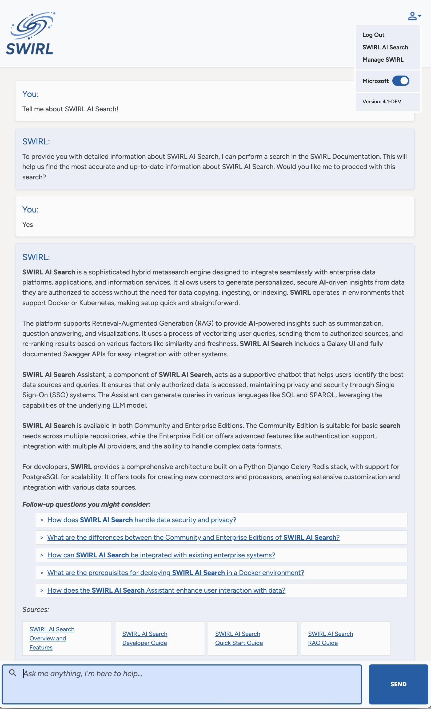

  

    Table of Contents
  

  {: .text-delta }
- TOC
{:toc}

# SWIRL Overview

## What is SWIRL AI Connect?

SWIRL AI Connect is an AI-powered [metasearch engine](https://en.wikipedia.org/wiki/Metasearch_engine) engine that connects most any Generative AI/LLM to enterprise data platforms, applications and information services *without copying*, ingesting data and/or indexing *anything*.

SWIRL is installed in your own environment - anywhere Docker/Kubernetes runs. Configure it in minutes by filling out forms and users can be generating personalized, secure AI insights from the information they're already authorized to see - in minutes, without developers, signing a complicated legal agreement, or executing a complex data transfer / ETL project.

## What is SWIRL AI Co-Pilot? 

SWIRL AI Co-Pilot is an AI-powered Search Assistant that converses with users to determine what they are looking for and where they are most likely to find it. It can run searches on the user's behalf and provide in-line RAG results whenever the conversation demands. 

SWIRL 4.0 can write queries in SQL, Sparql and other dialects. Any knowledge available to the model can be used for this purpose.

## How does SWIRL Provide Insight without Copying and Ingesting and Indexing Data?

SWIRL AI Connect sends user queries to the configured, specific endpoints - APIs and other interfaces they're authorized to see - asynchronously. The response time will be driven by the slowest responding source.

SWIRL then re-ranks the results from responding sources so the user doesn't have to, using embeddings from the configured LLM.

The re-ranking process is as follows: 
* Vectorize the user's query (or parts of it)
* Send the text of the user's query and/or the vector, to each source requested (or default)
* Asynchronously gather the results from each source
* Normalize the results from each source using jsonpath (or xpath)
* Vectorize each result snippet (or parts of it)
* Re-rank the results by aggregating the similarity, frequency and position, and adjusting for other factors like length variation, freshness, etc 

The [Xethub study](https://xethub.com/blog/you-dont-need-a-vector-database) as [explained by Simson Garfinkel](https://www.linkedin.com/pulse/vector-databases-rag-simson-garfinkel-hzule/) showed that re-ranking "naive" keyword search engines outperforms re-indexing the data using a vector database for tasks like question answering.

SWIRL AI Connect also includes state-of-the-art cross-silo [Retrieval Augmented Generation (RAG)](https://en.wikipedia.org/wiki/Retrieval-augmented_generation) for generating AI insights like summarization, question answering and visualization of relevant result sets. 

When a user requests an AI insight, SWIRL:

* Sends the insight out to relevant sources
* Normalizes and unifies the results 
* Re-ranks the united results using non-generative Reader LLM
* Optionally, presents them to the user and allows them to adjust the result set
* Fetches the full-text of the results, in real time
* Identifies the most relevant portions of the documents and binding them to a prompt using real-time vector analysis similar to the re-ranking described above
* Sends the prompt to the approved generative AI for insight generation
* Returns a single set of insights with citations

SWIRL AI Connect includes the Galaxy UI, but includes fully Swagger'd APIs and is easy to integrate with most any front-end or system.

SWIRL AI Connect, Enterprise Edition, includes flexible, generic OAUTH2 and SSO, with auto-provisioning via OpenID Connect.

## How does SWIRL AI Co-Pilot work?

SWIRL AI Co-Pilot educates the configured GAI/LLM about the user and what they have access to via the integration with SWIRL AI Connect. 

SWIRL manages the context and history for each chat, initiating RAG through AI Connect as directed by the user and Co-Pilot. The user can only see insight from data they are already authorized to see, and the Co-Pilot is privy only to each user's conversations and history when conversing with them. All access is controlled and provisioned via the existing sign on (SSO) system. 

For more information please refer to the [AI Co-Pilot Guide](AI-Co-Pilot.html).
## What systems can SWIRL integrate with?

The full list is here: [https://swirlaiconnect.com/connectors](https://swirlaiconnect.com/connectors)

## How do I connect SWIRL to some new source?

To connect SWIRL with an internal data source, you [create a SearchProvider record](./SP-Guide.html#using-searchproviders).

To integrate SWIRL Enterprise with a generative AI, you create an AIProvider record, as described 
[in the AI Connect Guide](AI-Connect.html#connecting-to-generative-ai-gai-and-large-language-models-llms).

## What is included in SWIRL Enterprise Products?

SWIRL Enterprise Edition includes:

* Configurable support for many enterprise AI providers (e.g. Anthropic and Cohere), including support for multiple GAI/LLMs in different roles - chat, query rewriting, direct answer, RAG and embeddings (for re-ranking/passage detection by the Reader LLM)

* Support for Single Sign On (SSO) with various IDPs (e.g. Ping Federate) and autoprovisioning via OpenID Connect. (The Community version only supports M365.)

* Support for generating AI insights from 1,500 different file formats, including tables and txt in images 

* Authentication support for the PageFetcher

* Configurable prompts, including role, user, group and on-the-fly selection

* SWIRL AI Co-Pilot as noted above

## How much do SWIRL Enterprise Products cost?

Pricing for SWIRL Enterprise is here: [https://swirlaiconnect.com/pricing](https://swirlaiconnect.com/pricing)

## When should I use SWIRL AI Connect, Community Edition?

Use SWIRL AI Connect, Community Edition, if you have one or more repositories that you want to search and RAG against the full text *without* authenticating and/or indexing it into yet-another repository and/or writing more code.

Note that you may freely re-distribute solutions that incorporate SWIRL AI Connect, Community Edition, under the [Apache 2.0 License](https://github.com/swirlai/swirl-search/blob/main/LICENSE).

## When should I use SWIRL Enterprise Edition? 

Use SWIRL Enterprise Edition when you have:

* Repositories that require Single Sign On (SSO) and/or OAUTH2
* Content that requires text extraction, and/or authenticated page fetching
* The need to RAG from long documents, complex tables, or text from images
* Need to use GAI/LLMs other than OpenAI/Azure OpenAI
* Want to have a conversation with your data, via the Co-Pilot

## Why don't you use GitHub Issues?

We prefer to use [our free Slack channel](https://join.slack.com/t/swirlmetasearch/shared_invite/zt-2sfwvhwwg-mMn9tcKhAbqXbrV~9~Y1eA) for support. 

Enterprise customers get access to our helpdesk.

## What is the SWIRL Architecture & Technology Stack

SWIRL products use the Python/Django/Celery/Redis stack, with PostgreSQL recommended for production deployments.

Consult the [Developer Guide](./Developer-Guide.md#architecture) for more information!

## How is SWIRL usually deployed?

SWIRL is usually deployed via Docker. SWIRL Enterprise products are also available as Kubernetes images. 

## Does SWIRL offer hosting? How can I learn more? 

Please [contact SWIRL](mailto:hello@swirlaiconnect.com) for information about hosted SWIRL. 
