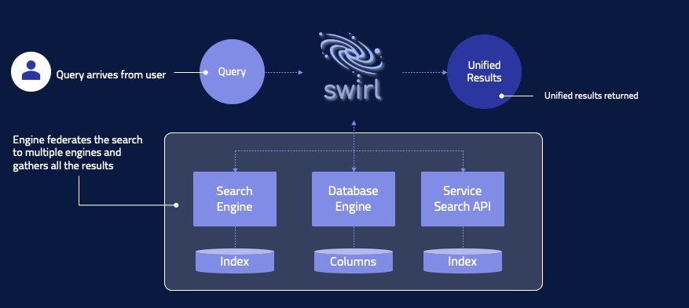
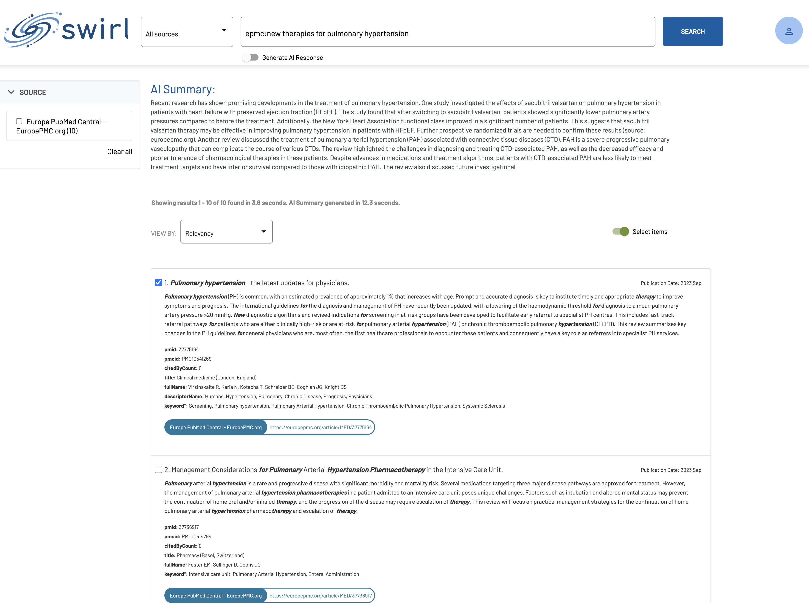

  

    Table of Contents
  

  {: .text-delta }
- TOC
{:toc}

# SWIRL AI Connect

## What is SWIRL AI Connect?

SWIRL AI Connect is infrastructure software that effortlessly integrates enterprise data platforms, applications and information services with any Generative AI - without copying, indexing and/or ingesting data. Our plug-and-play solution requires minimal IT involvement, allowing you to leverage your existing systems, whether in-house or external, with ease. SWIRL acts as a central hub, seamlessly connecting to your data sources to AI, and providing real-time insights without disrupting your current systems or workflows.

## How does it work?

SWIRL AI Connect is enterprise infrastructure software, deployed in your private cloud. It provides a low/no-code, 7-step insight generation workflow for generating AI insights using internal data, without requiring you to extract, copy, index and maintain that data. With SWIRL AI Connect, data stays in place, and trustable, personalized insights are delivered to the user from the approved AI.

When a user requests an AI insight, SWIRL:

* Sends the insight out to relevant sources
* Normalizes and unifies the results 
* Re-ranks the united results using non-generative Reader LLM
* Optionally, presents them to the user and allows them to adjust the result set
* Fetches the full-text of the results, in real time
* Identifies the most relevant portions of the documents and binding them to a prompt
* Sends the prompt to the approved generative AI for insight generation
* Returns a single set of insights with citations

SWIRL AI Connect includes the Galaxy UI, but is API-first, and easy to to integrate.

SWIRL AI Connect ENTERPRISE includes flexible, generic OAUTH2 and SSO, with auto-provisioning via OpenID Connect.

## What is the SWIRL architecture & tech stack?

SWIRL uses the Python/Django/Celery stack, with Redis and PostgreSQL recommended for production deployments.

## What systems can SWIRL AI Connect integrate with?

The following is a partial list of supported platforms, please [contact us](mailto:hello@swirl.today) for details.

* Generative AIs: AWS Bedrock, Azure/OpenAI, Athropic, Cohere, Google, OpenAI...
* Enterprise Apps: Collibra, Microsoft 365, ServiceNow, Salesforce, Snowflake, Thoughtspot...
* Search Engines: Algolia, Elasticsearch, OpenSearch, Solr...
* Databases: Google BigQuery, MongoDB, Oracle, Pinecone, PostgreSQL, Qdrant, Sqlite3...
* Services: Blockchain.com, Generic Web, Google PSE, Miro, NLResearch.com, OpenSanctions...

## What do SWIRL AI Connect insights look like?

Here is an example:

For more information please refer to the [AI Guide](AI-Guide).

## How do I connect SWIRL AI Connect to X?

To connect SWIRL with an internal data source, you [create a SearchProvider record](./User-Guide.md#using-searchproviders).

To integrate SWIRL with a generative AI, you create an AIProvider record, as described 
[in the Enterprise Guide](./Enterprise-Guide.md#managing-ai-providers).

## How can I learn more about SWIRL?

* [Quick Start](./Quick-Start.md) - Covers installation
* [User Guide](./User-Guide.md) - Details how to configure and use SWIRL
* [AI Guide](./AI-Guide.md) - Explains how to obtain basic AI Insights using RAG
* [Enterprise Guide](./Enterprise-Guide.md) - Explains how to configure SWIRL AI Connect Enterprise
* [Admin Guide](./Admin-Guide.md) - Details how to manage SWIRL in production
