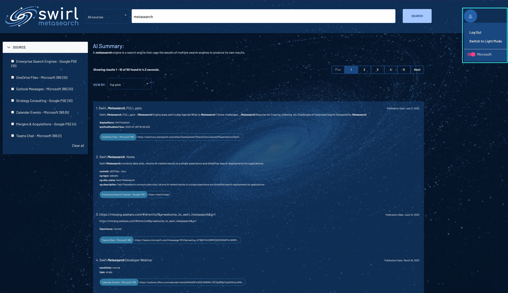

Here is the provided text translated into Portuguese:

# Guia do Microsoft 365
{:.no_toc}

**Conteúdo**
* TOC
{:toc}

## Público-Alvo

Este guia detalha como integrar o Swirl Metasearch (v. 2.0 ou mais recente) com um locatário existente do Microsoft 365 (M365). É destinado ao uso por Administradores do M365 com autoridade para adicionar um novo Registro de Aplicativo em seu Portal Azure e, opcionalmente, conceder permissões para várias APIs, conforme observado abaixo, em nome dos usuários que desejam usar o Swirl Metasearch para consultar o conteúdo pessoal do M365.

<br/>

# Registrar um Novo Aplicativo no Portal Azure

Para conectar uma instalação do Swirl Metasearch a um locatário M365, é necessário registrar e configurar um novo Aplicativo no Portal Azure.

Após configurar o novo Aplicativo, você poderá usá-lo para autenticar os usuários com OIDC e permitir que eles pesquisem o conteúdo pessoal do M365 usando as permissões OAUTH2 consentidas.

## Antes de Começar
Você precisará das seguintes informações da implantação do Swirl:

* `swirl-host`
* `swirl-port` (se for algo diferente do padrão)

Nos exemplos abaixo, o `swirl-host` é o domínio totalmente qualificado de `search.swirl.today`, em que 'search' é o host real.

Para usar OIDC e OAUTH2, sua implantação deve estar usando `https`, com a única exceção sendo quando `localhost` é usado como host (pode-se usar `http://` nesse caso). É importante lembrar que as URLs para Aplicações de Página Única e Protocolos Web não permitem Domínios Totalmente Qualificados sem `https`.

## Primeiros Passos

* Faça login no Portal Azure com uma conta de administrador. <https://portal.azure.com/>

* Na caixa de pesquisa no topo da página inicial do Portal Azure, pesquise por: `registros de aplicativos` e clique no resultado `Registros de aplicativos` em "Serviços":


## Crie o Novo Aplicativo

* Para criar um novo Aplicativo, selecione a opção `Novo registro` na parte superior da página "Registros de aplicativos":


* Na página "Registrar um aplicativo":
  * Na seção `Nome`, insira um nome para o Aplicativo (por exemplo, `Aplicativo de Busca Metasearch`)
  * Em "Tipos de conta aceitos", selecione a seguinte opção: `Contas neste diretório organizacional somente (somente MSFT - um único locatário)`
  * Adicione "URI de Redirecionamento" para uma aplicação Web:
    * Plataforma: `Web`
    * Valor:  `https://<swirl-host>[:<swirl-port>]/swirl/microsoft-callback`
  * Clique em `Registrar` para criar o aplicativo: 
* A página "Visão Geral" para o Aplicativo recém-criado deve se parecer com isso: 
* Adicione "URI de Redirecionamento" para uma aplicação de página única:
  * Primeiro, vá para a página de Autenticação da configuração de registro do aplicativo 
  * Adicione um "Protocolo de Aplicativo de Página Única" 
  * Adicione o URL de Retorno do OIDC 
  * Adicione o URL de Retorno do OAUTH2 do Microsoft 

  * Retorne para a página de Visão Geral 

<br/>

# Adicione Permissões de API para o Aplicativo

## Conceda as Permissões Necessárias

* Na coluna à esquerda, selecione a opção "Permissões de API" e clique em `Adicionar permissão`:


* Na seção "Solicitar permissões de API" que se abre (à direita):
  * Selecione a guia "APIs da Microsoft" (no topo)
  * Clique no botão `Microsoft Graph` (no topo)
  * Clique no botão `Permissões delegadas` (à esquerda)


* Na caixa de pesquisa resultante, insira e selecione cada uma das seguintes permissões, em seguida, clique no botão `Adicionar permissões` na parte inferior da página:
  


* Repita esse processo para cada uma dessas permissões individuais:
  * `Calendars.read`
  * `ChannelMessage.Read.All`
  * `Directory.Read.All`
  * `email`
  * `Chat.Read`
  * `Files.Read.All`
  * `profile`
  * `Mail.Read`
  * `offline_access`
  * `Sites.Read.All`
  * `User.read`

## Consinta a Administração para Permissões

* Após adicionar todas as permissões acima ao Aplicativo, clique no botão `Conceder consentimento do administrador para MSFT` sob "Permissões configuradas":


Selecione `Sim` quando solicitado para aprovar essa ação:


* A seção "Permissões configuradas" para o Aplicativo deve agora se parecer com isso:


<br/>

# Gerar um Segredo do Cliente

* Na coluna à esquerda, selecione a opção "Certificados e segredos" e clique em `Novo segredo do cliente`:


* Na seção "Adicionar um segredo do cliente" que se abre (à direita):
  * Insira uma `Descrição` para o novo segredo
  * Selecione um intervalo de tempo de `Expira` para o segredo
    


* Clique no botão `Adicionar` (na parte inferior) e a página "Certificados e segredos" agora mostrará uma nova entrada de `Segredo do Cliente` para o Aplicativo:


:warning: **Assim que o segredo for criado, copie o valor exibido na tela imediatamente! Ele será ocultado a partir deste ponto ao retornar a este menu.**

<br/>

# Configure o OIDC e o OAUTH2 no Cliente e no Servidor Swirl

Nos exemplos de configuração nas seções seguintes, você pode encontrar o `<application-id>`, `<tenant-id>`, `<secrete-value>`, `<server-authentication-callback-url>`, `<client-authentication-callback-url>`, `<client-authorization-callback-url>` no Registro de Aplicativo criado na seção anterior. Abaixo estão capturas de tela indicando a localização de cada um:

* IDs de Aplicativo e Locatário


* Valor do Segredo do Cliente


* URLs de Retorno


Edite o arquivo `.env` do Swirl (ou `.env.docker` se estiver executando no Docker) conforme mostrado no exemplo abaixo.

:key: O arquivo `.env` é criado após executar `install.sh` para instalações locais e está sempre presente no Docker.

``` shell
MICROSOFT_CLIENT_ID='' # obsoleto
MICROSOFT_CLIENT_SECRET='' # obsoleto
MICROSOFT_REDIRECT_URI='' # obsoleto
OIDC_RP_CLIENT_ID='<application-id>'
OIDC_RP_CLIENT_SECRET='<secrete-value>'
OIDC_OP_AUTHORIZATION_ENDPOINT='https://login.microsoftonline.com/<tenant-id>'
OIDC_OP_TOKEN_ENDPOINT='https://login.microsoftonline.com/<tenant-id>/oauth2/v2.0/token'
OIDC_OP_USER_ENDPOINT='https://graph.microsoft.com/oidc/userinfo'
OIDC_RP_SIGN_ALGO='RS256'
OIDC_OP_JWKS_ENDPOINT='https://login.microsoftonline.com/<tenant-id>/discovery/v2.0/keys'
LOGIN_REDIRECT_URL='/swirl'
LOGOUT_REDIRECT_URL='/swirl'
OIDC_USERNAME_ALGO='swirl.backends.generate_username'
OIDC_STORE_ACCESS_TOKEN='True'
OIDC_STORE_ID_TOKEN='True'
OIDC_AUTHENTICATION_CALLBACK_URL='<server-authentication-callback-url>'
```

Edite o arquivo de configuração do cliente chamado `static/api/config/default`, criado quando você executou o script `install-ui.sh`. Navegue até as seções indicadas abaixo e edite-as conforme indicado:

``` shell
  "msalConfig": {
    "auth": {
      "clientId": "<application-id>",
      "authority": "https://login.microsoftonline.com/<tenant-id>",
      "redirectUri": "<client-authorization-callback-url>"
    }
  },
  "oauthConfig": {
    "issuer": "https://login.microsoftonline.com/<tenant-id>/v2.0",
    "redirectUri": "<client-authentication-callback-url>",
    "clientId": "<application-id>",
    "scope": "openid email",
    "responseType": "code",
    "requireHttps": false,
    "oidc": true,
    "strictDiscoveryDocumentValidation": false,
    "tokenEndpoint": "https://login.microsoftonline.com/<tenant-id>/oauth2/v2.0/token",
    "userinfoEndpoint": "https://graph.microsoft.com/v1.0/me",
    "skipIssuerCheck": true
  }
```

Depois de adicionar essas variáveis ao `.env` ou `.env.docker`, reinicie o Swirl:

``` shell
python swirl.py restart
```

<br/>

# Ative os Provedores de Pesquisa do Microsoft 365

A distribuição do Swirl Metasearch inclui Provedores de Pesquisa pré-configurados para Emails do Outlook, Eventos de Calendário, Arquivos OneDrive, Sites do SharePoint e Conversas do Teams.

:star: Para resultados que contenham eventos de Calendário Microsoft 365 recorrentes ou tópicos de Mensagens do Outlook aninhadas, apenas os eventos e mensagens mais recentes são mostrados.

:warning: O aplicativo local do Teams deve estar aberto quando você clica em um link de resultado de Conversa do Teams para que o Teams o leve à conversa correta.

* Abra o console de administração: <http://localhost:8000/swirl/>

* Clique em `Provedores de Pesquisa` para acessar o endpoint JSON que lista todos os Provedores de Pesquisa.

* Encontre cada Provedor de Pesquisa do Microsoft 365 que deseja ativar. Existem provedores separados para cada um dos aplicativos Office do M365. Edite o Provedor de Pesquisa adicionando o `id` do Provedor que deseja editar à URL. Por exemplo, para editar o Provedor com um id de `16`, vá para: http://localhost:8000/swirl/searchproviders/16/


* Selecione a guia `Dados brutos` no formulário na parte inferior da página. Em seguida, edite o formulário, alterando a propriedade `active` de `false` para `true`:

``` shell
{
  "id": 16,
  "name": "Mensagens do Outlook - Microsoft 365",
  ...
  "active": false,
  ...
}
```

Para:

``` shell
{
  "id": 16,
  "name": "Mensagens do Outlook - Microsoft 365",
  ...
  "active": true,
  ...
}
```

<br/>

# Autenticar no Microsoft

Para verificar se a integração Swirl-M365 está funcionando, abra a interface do Galaxy: <http://localhost:8000> (ou <http://localhost:8000/galaxy/>)

Clique no ícone de perfil no canto superior direito e, em seguida, clique na alternância do Microsoft para ativá-la. Dependendo de como a configuração acima foi feita, o M365 pode exigir autenticação e/ou concessão de acesso. Depois disso, a alternância ao lado do logotipo do Microsoft acenderá, indicando uma conexão bem-sucedida.


Agora, insira uma pesquisa na interface: `metapesquisa`

Assumindo que algum documento no seu M365 contenha a palavra `metapesquisa`, os resultados deverão aparecer em apenas alguns segundos:



:warning: Se a alternância não acender após a autenticação com o Microsoft, entre em [contato com o suporte](#suporte). A [documentação relacionada](#documentação-relacionada) abaixo também pode ser útil.

<br/>

# Documentação Relacionada

* [Tutorial: Registrar um aplicativo com o Azure Active Directory](https://learn.microsoft.com/pt-br/power-apps/developer/data-platform/walkthrough-register-app-azure-active-directory) (*Observação de que algumas etapas não se aplicam ao Aplicativo Swirl Metasearch*)

* [Configurar como os usuários concedem permissões para aplicativos](https://learn.microsoft.com/pt-br/azure/active-directory/manage-apps/configure-user-consent?pivots=portal#risk-based-step-up-consent)

<br/>

# Documentação

| [Início](index.md) | [Início Rápido](1.-Início-Rápido.md) | [Guia do Usuário](2.-Guia-do-Usuário.md) | [Guia do Administrador](3.-Guia-do-Administrador.md) | [Guia M365](4.-Guia-M365.md) | [Guia do Desenvolvedor](5.-Guia-do-Desenvolvedor.md) | [Referência do Desenvolvedor](6.-Referência-do-Desenvolvedor.md) |

<br/>

# Suporte

* [Junte-se à Comunidade Swirl Metasearch no Slack!](https://join.slack.com/t/swirlmetasearch/shared_invite/zt-1qk7q02eo-kpqFAbiZJGOdqgYVvR1sfw)

* Email: [support@swirl.today](mailto:support@swirl.today) com problemas, solicitações, perguntas, etc - adoraríamos ouvir de você!