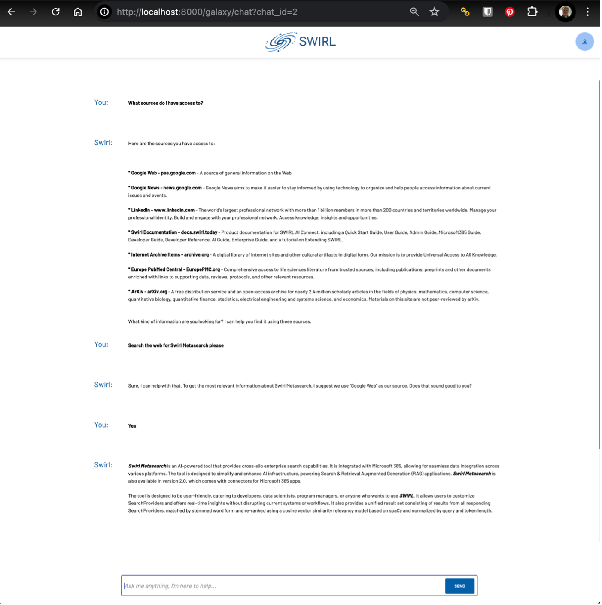

# 🚀 SWIRL Enterprise 3.8 Release Announcement

Team SWIRL is announcing the release of **SWIRL AI Search 3.8, Enterprise Edition.**
  
⭐ PLEASE STAR OUR REPO: [https://github.com/swirlai/swirl-search](https://github.com/swirlai/swirl-search)  
🌐 PLEASE VISIT OUR WEBSITE: [https://www.swirlaiconnect.com/](https://www.swirlaiconnect.com/)  

---

Building on Community 3.8, SWIRL Enterprise 3.8 introduces **SWIRL AI Co-Pilot** for secure, intelligent assistance over your internal data (with no bulk copying or new vector DBs), **streaming** Chat/RAG LLM support, **2,000-token query limits** for richer prompts and “query-by-example,” **Reader LLM 2.0** with major speed and relevancy gains, a new **Box** connector with SSO, a new **HTTP interface for Search & RAG**, and the **Galaxy Prompt Selector** for fine-grained AI workflows.

🔹 **SWIRL AI Co-Pilot**  
Turn any GAI/LLM into a secure assistant that answers with your internal repositories—on the user’s behalf—without moving data or deploying a separate vector database.

🔹 **New Box Connector (SSO)**  
Easily add Box as a source with single sign-on integration.

🔹 **New HTTP Interface for Search & RAG**  
A streamlined API for search, re-ranking, document review, Q&A, and insight generation inside your apps and pipelines.

## New features

- **AI Co-Pilot:** Secure, enterprise-aware assistant; no bulk data movement or new vector DB required  
- **Streaming Chat/RAG:** Low-latency, incremental responses from LLMs  
- **2,000-Token Query Limit:** Bigger prompts and dialog turns; enables **query-by-example**  
- **Reader LLM 2.0:** Faster embedding pipelines; better relevancy ranking  
- **Box Connector (SSO):** Federate Box content with enterprise auth  
- **HTTP Interface for Search & RAG:** Build search/RAG into existing solutions via API  
- **Galaxy Prompt Selector:** Fine-tune AI workflows with selectable prompts  
- **PII Detection & Removal (MS Presidio):** Optional redaction in pipelines  

- **Updated RAG Citation Format:** Clearer citation presentation in generated answers

## Improvements

- **Streaming Support for Chat/RAG LLMs**  
Stream partial responses for faster, smoother interactions.

- **Query Limit Increased to 2,000**  
Support more robust prompts, longer dialogues, and **query-by-example** use cases.

- **Reader LLM 2.0**  
Up to **2× faster** overall (**~10× in Docker** with OpenAI embeddings) plus improved relevance scoring to surface the best results.

- **Galaxy UI**  
  - Prompt selection integrated into workflows  
  - Smoother streamed answer display and interactions

- **RAG / Search**  
  - Higher-quality citations in RAG results  
  - Better result ranking via Reader LLM 2.0 improvements

- **Technical Improvements**  
  - Reader LLM throughput and latency gains (notably in Docker with OpenAI embeddings)  
  - Expanded API surface via the new HTTP endpoints for Search & RAG

## Upgrading

⚠️ Version 3.8 does not require database migration.  

---

## Documentation

📘 SWIRL’s [documentation site](../index) has been updated reflecting the new features above.
