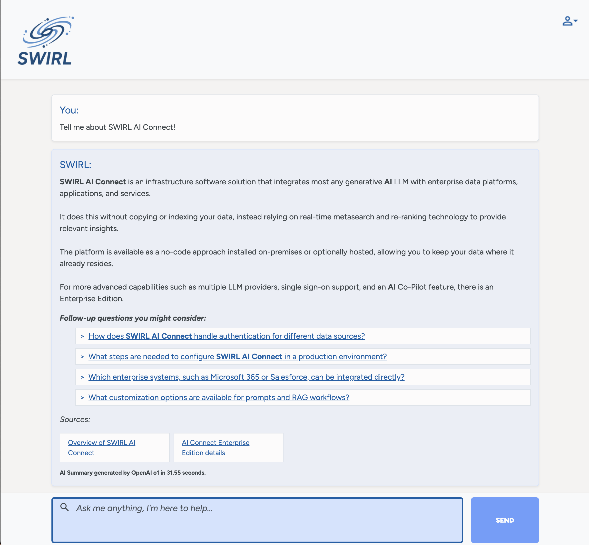
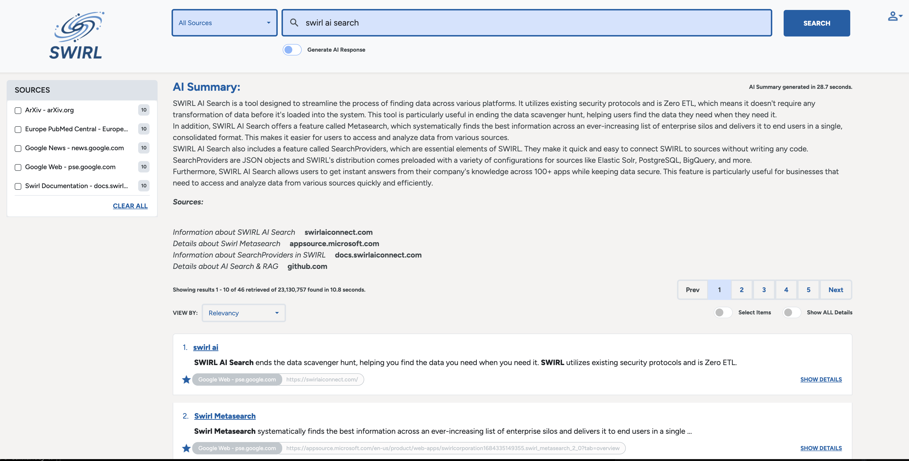

# 🚀 SWIRL Enterprise 4.0 Release Announcement

Team SWIRL is announcing the general availability of **SWIRL AI Search 4.0, Enterprise Edition.**
  
⭐ PLEASE STAR OUR REPO: [https://github.com/swirlai/swirl-search](https://github.com/swirlai/swirl-search)  
🌐 PLEASE VISIT OUR WEBSITE: [https://www.swirlaiconnect.com/](https://www.swirlaiconnect.com/)  

---

SWIRL 4.0 debuts refreshed, two-tone experiences for **AI Search** and **AI Assistant** - new names that reflect their real capabilities.

The updated AI Search Assistant can now query in any dialect supported by the configured LLM, including **SQL, SPARQL, graph languages, MongoDB, Elasticsearch/OpenSearch**, and more. 

The Assistant supports querying and translation across human languages supported by the LLM, enabling global teams to work seamlessly.

The overhauled AI Search page now includes a new confidence score, star highlighting and support for long queries:

AI Search can now generate charts for configured SearchProviders that return data sets. 

## New features

- **Renamed Products & UI Refresh:** **AI Search** and **AI Assistant** with clean two-tone layouts  
- **Assistant Any-Dialect Querying:** Issue repository queries in **SQL, SPARQL, MongoDB, Elasticsearch/OpenSearch**, etc.  
- **Multilingual Support:** Query and respond across languages supported by the LLM  
- **Power-User Querying:** Updated Search UI for hand-authored queries; **Sources facet** dynamically resizes  
- **Confidence Scoring & Stars:** 0–1 relevance score with star highlights above a configurable threshold  
- **Prompt Selector:** Rapid prompt preset selection in AI workflows  
- **Coveo Connector:** New federated source option

## Improvements

- **Galaxy UI**  
  - More ergonomic result selection; larger input fields; improved readability  
  - **Show/Hide All Details** toggle  
  - **Multiple chart displays** for structured data visualization  
  - Reports both **total results found** (all sources) and **results retrieved** by SWIRL

- **RAG / Search**  
  - Streamlined flows to generate AI insights from only the most relevant content  
  - Better multi-source review with dynamic **Sources** facet

- **Technical Improvements**  
  - Validated on **Python 3.12.8**

## Changes

- The **LinkedIn SearchProvider** is **deactivated by default**. If you intend to use LinkedIn with SWIRL, please contact SWIRL.

## Known issues

- Clicking a Microsoft Teams result may show:  
  `We cannot take you to that message because it's in a chat you're not in.`  
  Ensure the Microsoft Teams app is open and you are authenticated before clicking Teams links.  
- Creating searches from a browser with `q=` can sometimes create two Search objects due to browser **prefetch/predictive** behavior. Disable the browser prediction service if this is undesirable.

## Upgrading

⚠️ Version 4.0 does not require database migration.  

---

## Documentation

📘 SWIRL’s [documentation site](../index) has been updated reflecting the new features above.
