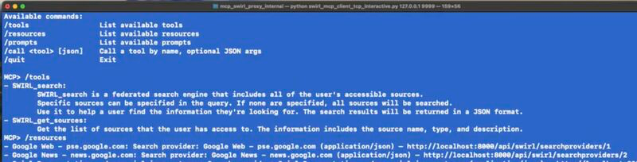

# 🚀 SWIRL Enterprise 4.2 Release Announcement

Team SWIRL is announcing the release of **SWIRL AI Search 4.2, Enterprise Edition.**
  
⭐ PLEASE STAR OUR REPO: [https://github.com/swirlai/swirl-search](https://github.com/swirlai/swirl-search)  
🌐 PLEASE VISIT OUR WEBSITE: [https://www.swirlaiconnect.com/](https://www.swirlaiconnect.com/)  

---

SWIRL 4.2 introduces an **Anthropic MCP Server** (with full authentication) and **Google Workspace** support across Gmail, Drive, Calendar, and Contacts—plus a refreshed Assistant experience with chat history, PDF export, and RAG instruction controls.

🔹 **Google Workspace (Gmail, Drive, Calendar, Contacts)**  
SWIRL now supports Google Workspace with OAuth2 and optional OIDC auto-provisioning for seamless, secure sign-in.  

🔹 **Anthropic MCP Server (with Auth)**  
Deploy SWIRL’s MCP Server as a proxy to any MCP client. It exposes **SearchProviders**, **AIProviders**, and other objects as resources, and makes the **AI Search** and **AI Search Assistant** APIs available as tools. SWIRL MCP supports **CrewAI**, [check out our code samples](../MCP-Guide.md) for more information. 

🔹 **Assistant Chat History & Management**
The Assistant now shows chat history in a left sidebar (like ChatGPT). Users can edit titles, rename, and resume prior chats—without losing context.  

🔹 **One-Click Chat Export to PDF**

Assistant users can now export conversations to PDF for sharing, printing, and archiving, as shown above.

## New features

- **Google Workspace Support:** Search **Gmail**, **Drive**, **Calendar**, and **Contacts** with OAuth2 and optional OIDC auto-provisioning  
- **Anthropic MCP Server:** Deployable proxy with auth; exposes resources (SearchProviders, AIProviders) and tools (AI Search, Assistant) for any MCP client  
- **Assistant Chat History:** Left-rail history with edit/rename/resume controls  
- **Chat PDF Export:** One-click export of Assistant chats to PDF  
- **RAG Instruction Field:** Provide targeted instructions directly to the RAG LLM at query time

## Improvements

- **Galaxy UI**  
  - Quick link to the **SWIRL Enterprise Helpdesk** under the information icon in **AI Search** and **Search Assistant**  
  - Updated branding configuration: use different logos for **Search** and **Assistant**  
  - Restyled **Password Reset** page  

- **RAG / Search**  
  - New instruction field for more precise RAG behavior  
  - Improved handling of citations and follow-up questions in RAG  
  - Better hit-highlighting of stems in the SWIRL-generated **body** field  

- **Technical Improvements**  
  - Revised **OIDC** configuration format  
  - Validated on **Python 3.12**  
  - **SearchProvider API** now returns the **description** field

## Upgrading

⚠️ Version 4.2 does not require database migration.  

---

## Documentation

📘 SWIRL’s [documentation site](../index) has been updated reflecting the new features above.
