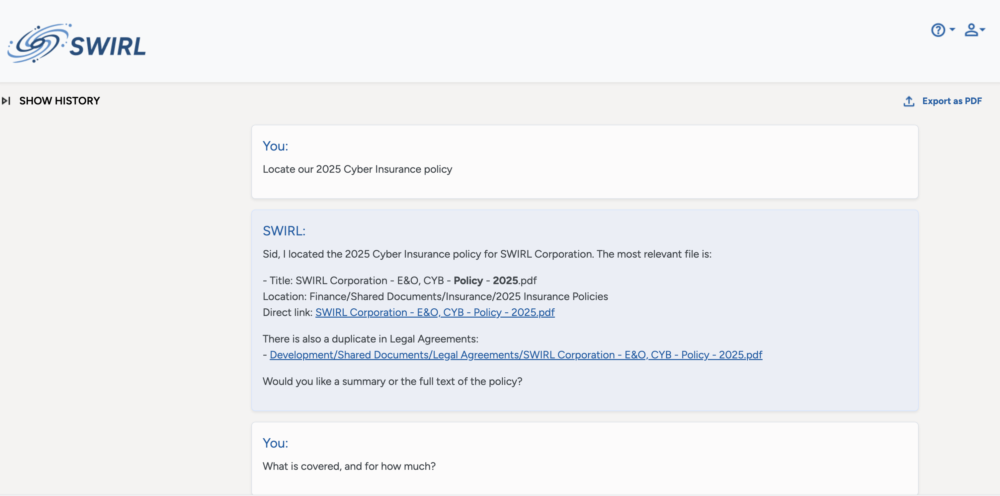
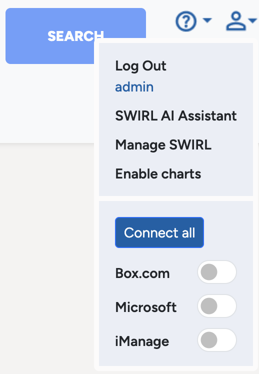
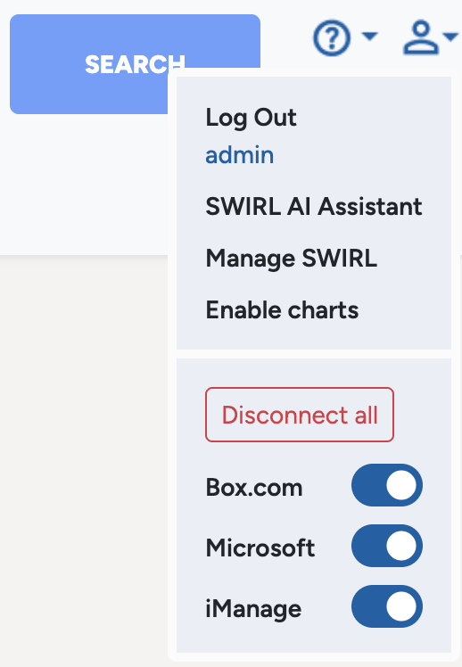
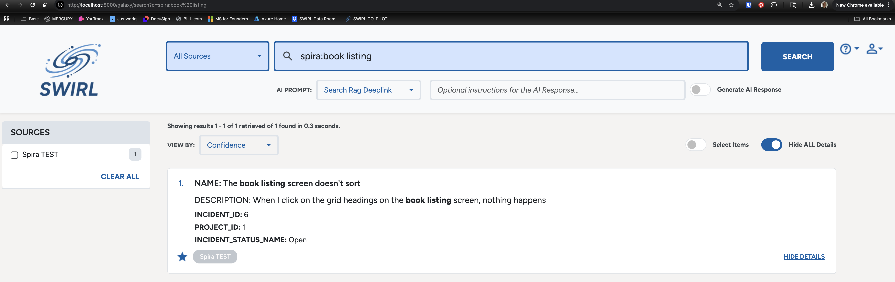
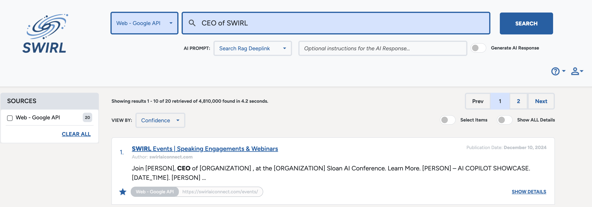

# 🚀 SWIRL Enterprise 4.4 Release Notes

Team SWIRL is announcing the release of **SWIRL Enterprise, Version 4.4**.

⭐ PLEASE STAR OUR REPO: <https://github.com/swirlai/swirl-search> 
🌐 PLEASE VISIT OUR WEBSITE: <https://www.swirlaiconnect.com>

This version of SWIRL Enterprise adds support for locating and interrogating a single document using the AI Search Assistant, a new "Connect all" switch in the Galaxy UI plus updated PII support (via [Microsoft Presidio](https://microsoft.github.io/presidio/)) and more!

# New Features

- The AI Search Assistant can now locate and hold files for an ongoing conversation.

- Galaxy now offers a "Connect all" button which re-connects/refreshes all OAUTH2 sources. 

  

- New [Inflectra SpiraPlan](https://www.inflectra.com/Products/SpiraPlan/) SearchProvider! 

  

- PII detection via Microsoft Presidio is now supported for queries, results, and RAG responses, with a choice of redaction or removal. 

- Advanced German query processing is now supported, including de-compounding of words.

# Improvements

- The list of preloaded SearchProviders has been re-organized to improve clarity.

- The AI Search Assistant has improved tool calling for SQL and other sources that require complex query languages like Open Search, Elastic and MongoDB. 

- Each SearchProvider can now specify a unique timeout. The Galaxy UI will identify sources that don't answer in time.

- The RequestGet and RequestPost connectors have been updated to support 429 back-off
- The Galaxy Source Selector now supports partial source selection as per the CUA protocol.
- Galaxy's handling of LLM-generated markup, late-arriving results and author display have been improved.
- Japanese tokenization & stemming have been improved.
- Celery workers have been re-organized for easier scaling.
- The Manage SWIRL link is now restricted to admins & superusers.
- Updated Docker base to Debian Trixie and validated Python 3.13.9. 
- Upgraded Galaxy UI to Angular 20 and updated Yarn Berry. 

# Upgrading

⚠️ Version 4.4 includes **Django migrations**.  Please see the [Database Migrations](../Admin-Guide#database-migration) documentation for details.

---

## Documentation

📘 SWIRL’s [documentation site](../index) has been updated reflecting the new features above.

