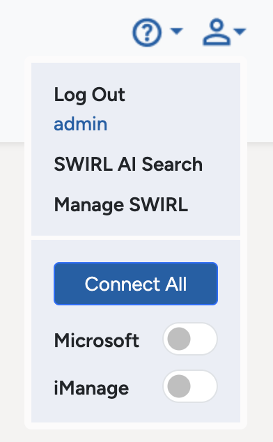
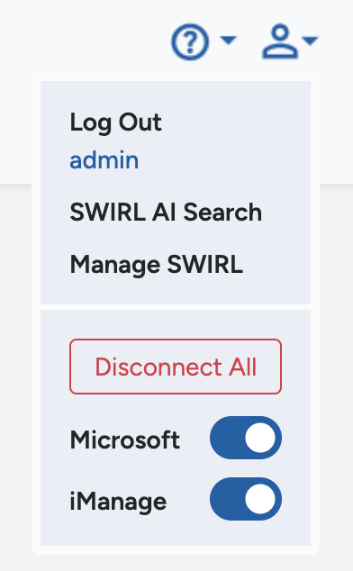
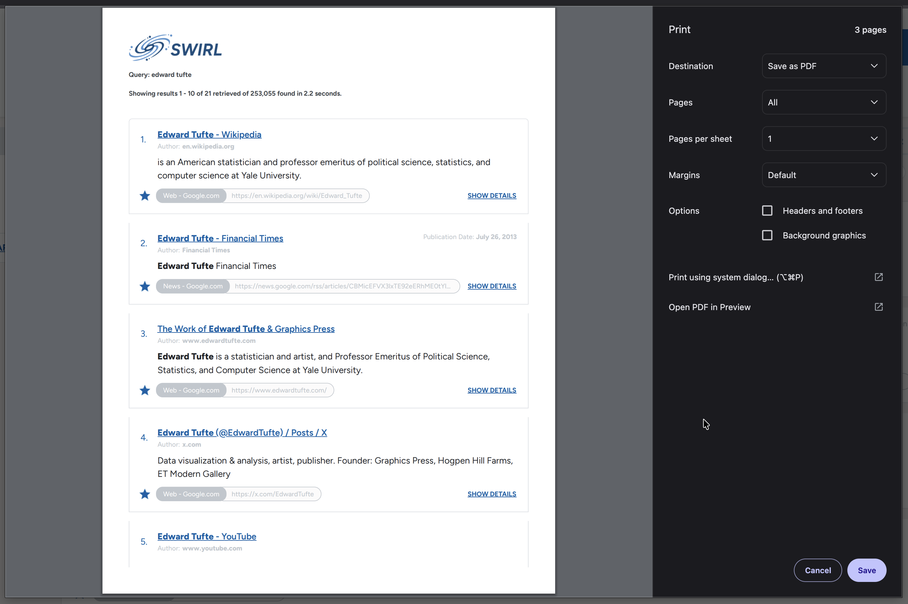

# 🚀 SWIRL Enterprise 4.4.1 Release Notes

Team SWIRL is announcing the release of **SWIRL Enterprise, Version 4.4.1**.

⭐ PLEASE STAR OUR REPO: <https://github.com/swirlai/swirl-search> 
🌐 PLEASE VISIT OUR WEBSITE: <https://www.swirlaiconnect.com>

This version resolves issues found with Version 4.4.0. 

# New Features

- The "Connect All" option for OAuth2 sources is now available in the Search Assistant.

- New "Export as PDF" option for search results.

- New `SORT_PAYLOAD` option for SearchProvider result mappings, with default sorting now following field order.

# Improvements

- The iManage SearchProvider has been updated.

- Certificate renewal in the Azure Marketplace Offer has been improved.

- Added the `django.log` to the logs download for Azure Marketplace Offer deployments.

- Fixed `celry_metrics` issues impacting auto-scaling in Kubernetes.

- Updated the preloaded Periodic Tasks list to use the new split celery worker queues.

- Galaxy UI support for narrower screens.

- Eliminated unnecessary startup warnings.

- Improved service startup ordering and port checking.

- Verified SWIRL on Python 3.13.11.

# Upgrading

⚠️ Version 4.4.1 includes **Django migrations**.  Please see the [Database Migrations](../Admin-Guide#database-migration) documentation for details.

---

## Documentation

📘 SWIRL’s [documentation site](../index) has been updated reflecting the new features above.

